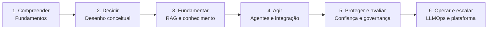

# Mapa de aprendizagem

O percurso acompanha a ampliação gradual da responsabilidade arquitetural: primeiro ler o sistema, depois escolher, conectar conhecimento, permitir ações, criar confiança e, por fim, sustentar a solução em escala.

## 1. Compreender

Você reconhece modelos, componentes determinísticos e probabilísticos, contexto, conhecimento e capacidades transversais. O resultado é uma leitura arquitetural comum para discutir o restante do curso.

## 2. Decidir

Você converte uma oportunidade em cenários, requisitos, atributos de qualidade e alternativas. O foco muda de “qual tecnologia usar?” para “qual decisão atende este contexto e como será validada?”.

## 3. Fundamentar

Você separa conhecimento, recuperação e geração; projeta os fluxos offline e online; e define como evidências, autorização e proveniência chegam à resposta.

## 4. Agir

Você conecta modelos a ferramentas e sistemas corporativos, modela estado e memória e define limites de autonomia, aprovação e recuperação de falhas.

## 5. Proteger e avaliar

Você trata confiança como propriedade do sistema. Ameaças, guardrails, privacidade, governança e avaliação passam a produzir evidências proporcionais ao risco.

## 6. Operar e escalar

Você integra versionamento, observabilidade, SLOs, entrega controlada e recuperação. Por fim, decide o que padronizar em uma plataforma corporativa e o que manter sob autonomia dos times de produto.

As etapas são cumulativas, mas não formam uma linha rígida. Evidências de avaliação podem obrigar a rever requisitos; incidentes podem revelar um limite de autonomia inadequado; mudanças no conhecimento podem alterar custo e latência. Arquitetar é percorrer esse mapa de forma iterativa e explícita.
