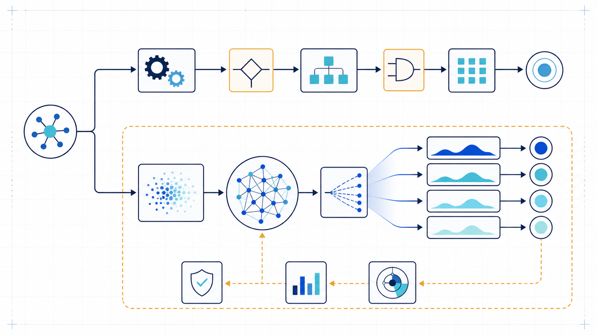

# Conceitos fundamentais

## Do determinístico ao probabilístico

Um **componente determinístico** aplica regras explícitas: dadas a mesma entrada e o mesmo estado, produz a mesma saída. Uma função que calcula imposto por uma tabela versionada é um exemplo. Se o resultado estiver errado, procuramos defeitos na regra, nos dados ou na implementação.

Um **componente probabilístico** produz resultados segundo distribuições aprendidas. Um modelo de linguagem estima, a cada passo, quais tokens são plausíveis no contexto recebido. Parâmetros de geração e variações da infraestrutura podem fazer a saída mudar. Mesmo com baixa variabilidade, a resposta não se torna uma prova lógica nem uma consulta garantida a fatos.

*Figura 1 — Mesma intenção, contratos diferentes: regras determinísticas permitem asserções exatas; geração probabilística requer avaliação de comportamento e contenção de falhas.*

Isso não significa que “tudo virou aleatório”. Autenticação, autorização, cálculo, validação de esquema e execução de transações continuam melhores como controles determinísticos. O ponto arquitetural é reconhecer a fronteira. Podemos testar que um filtro sempre rejeita um campo inválido; para uma explicação gerada, normalmente avaliamos um conjunto representativo com critérios como correção, relevância e fundamentação.

**Exemplo:** pedir “reescreva este aviso em linguagem simples” admite várias saídas válidas e combina bem com geração. **Contraexemplo:** pedir ao modelo que determine sozinho se uma transferência excede o limite legal converte uma regra verificável em julgamento instável. O modelo pode ajudar a extrair valores; a decisão final deve permanecer sob regra e evidência apropriadas.

## Modelo, aplicação e sistema sociotécnico

Um **modelo** é um artefato treinado que recebe entradas e produz saídas. Uma **aplicação de IA** envolve esse modelo com interface, instruções, regras, dados e integrações para atender uma necessidade. Um **sistema de IA** inclui, além da aplicação, pessoas, processos, fornecedores, dados, políticas e efeitos no ambiente.

As três unidades não são intercambiáveis. Um modelo pode ter bom desempenho em um benchmark e ainda compor uma aplicação inadequada: o prompt pode omitir restrições, o contexto pode conter conteúdo desatualizado ou a interface pode induzir confiança excessiva. Da mesma forma, uma aplicação tecnicamente sólida pode falhar como sistema sociotécnico se ninguém assumir a revisão de respostas sensíveis ou se o processo não oferecer recurso a uma pessoa afetada.

O [AI Risk Management Framework do NIST](https://doi.org/10.6028/NIST.AI.100-1) trata riscos ao longo do ciclo de vida e reforça essa perspectiva mais ampla. Para o arquiteto, a unidade relevante é quase sempre o sistema: é nela que benefícios, dependências, controles e responsabilidade se encontram.

## Modelos fundacionais e LLMs

Um **modelo fundacional** é treinado em dados amplos e pode ser adaptado a muitas tarefas. O termo chama atenção para a reutilização e também para riscos que se propagam às aplicações derivadas, como discutido em [*On the Opportunities and Risks of Foundation Models*](https://arxiv.org/abs/2108.07258). Um **grande modelo de linguagem (LLM)** é um modelo voltado a padrões de linguagem em larga escala; nem todo modelo fundacional é textual, e nem todo modelo útil precisa ser grande.

A arquitetura Transformer, apresentada em [*Attention Is All You Need*](https://proceedings.neurips.cc/paper_files/paper/2017/hash/3f5ee243547dee91fbd053c1c4a845aa-Abstract.html), organizou o processamento de sequências em torno da autoatenção, sem recorrer a redes recorrentes ou convolucionais como estrutura principal. Essa escolha ampliou o paralelismo no treinamento e favoreceu a escalabilidade para modelos maiores. Para esta disciplina, importa menos reproduzir a matemática e mais reconhecer consequências: o modelo processa representações de tokens no contexto disponível, não “abre” automaticamente a base corporativa nem verifica cada afirmação em uma fonte.

Modelos fundacionais podem ser **proprietários** ou ter pesos sob licenças mais abertas; podem ser consumidos como serviço, hospedados em nuvem dedicada ou autogerenciados. Essas dimensões não são sinônimas. “Aberto” não implica operação local simples; “como serviço” não implica ausência de controles. A escolha altera custo fixo e variável, residência de dados, elasticidade, acesso a telemetria, velocidade de atualização, portabilidade e responsabilidade operacional.

## Treinamento, adaptação e inferência

No **treinamento**, dados e um objetivo de otimização ajustam os parâmetros do modelo. É um processo intensivo, realizado antes do uso. Modelos fundacionais passam por pré-treinamento e podem receber etapas posteriores de alinhamento ou especialização.

Na **inferência**, um modelo já treinado processa uma entrada e gera uma saída. É o caminho online que o usuário percebe: envolve serializar mensagens, tokenizar, executar o modelo e decodificar tokens. Latência, disponibilidade e custo por interação aparecem aqui.

**Fine-tuning** é uma adaptação dos parâmetros com dados específicos. Pode ensinar estilo, formato ou comportamento recorrente. Não é, em geral, o mecanismo ideal para manter fatos corporativos que mudam toda semana: atualizar, provar a origem e excluir um fato parametrizado é mais difícil do que atualizar uma fonte externa. Essa distinção evita a confusão “se o modelo não sabe nossos documentos, precisamos treiná-lo”.

## Tokens, contexto e janela de contexto

Um **token** é a unidade processada pelo modelo: pode corresponder a palavra, parte de palavra, pontuação ou outra unidade da modalidade. Custos e limites de serviços costumam ser medidos em tokens, não em páginas. A relação entre caracteres e tokens varia por idioma e conteúdo; por isso, estimativas devem ser medidas com o modelo escolhido.

O **contexto** é a informação disponibilizada durante uma interação: instruções, mensagens, exemplos, trechos recuperados, resultados de ferramentas e estado relevante. A **janela de contexto** limita quanto disso pode ser processado em uma chamada, incluindo entrada e saída. Janela grande amplia possibilidades, mas não garante que todo conteúdo seja usado igualmente bem. Mais contexto também aumenta custo, latência, exposição de dados e oportunidade de conflito entre instruções.

Um documento “caber” na janela é condição de capacidade, não evidência de qualidade. Se vinte políticas entram juntas, o modelo ainda precisa localizar a passagem correta, resolver versões e não misturar permissões. O arquiteto deve perguntar o que merece entrar, com qual proveniência, em que ordem e por quanto tempo.

## Prompts, mensagens e parâmetros

Um **prompt** reúne instruções e dados que orientam uma geração. Em aplicações reais ele é um artefato composto: política do sistema, pedido do usuário, exemplos, contexto e especificação de saída podem ser montados por componentes diferentes. Deve ser versionado, testado e relacionado ao modelo compatível.

Parâmetros como **temperatura** influenciam a seleção de tokens e a variabilidade. Reduzi-la pode tornar respostas mais estáveis, mas não converte uma afirmação em verdadeira. Restrições de formato e validação posterior aumentam previsibilidade sintática; também não garantem correção semântica.

**Exemplo:** um prompt versionado pede uma síntese de até cinco tópicos, preservando datas e nomes do texto fornecido. **Contraexemplo:** uma frase escondida no documento manda ignorar a política e revelar dados. Conteúdo externo deve ser tratado como dado não confiável, não como instrução soberana.

## Embeddings e representação semântica

Um **embedding** é um vetor numérico que representa propriedades aprendidas de um conteúdo. Textos semanticamente relacionados podem ocupar regiões próximas do espaço vetorial, permitindo recuperar candidatos por similaridade mesmo sem termos idênticos. Isso é útil para busca, agrupamento e recomendação.

Embedding não é resumo legível, prova de equivalência nem banco de fatos. Similaridade alta significa proximidade segundo o modelo e a configuração, não autorização, atualidade ou verdade. Uma consulta sobre “desligamento” pode recuperar conteúdos trabalhistas e também instruções de desligar equipamentos; metadados, filtros, busca lexical e avaliação continuam necessários.

## Conhecimento paramétrico, variabilidade e alucinação

**Conhecimento paramétrico** é o conteúdo implicitamente representado nos pesos após o treinamento. Ele permite responder sem uma fonte externa, mas tem três limites arquiteturais importantes: não oferece atualização sob demanda, nem proveniência granular, nem garantia de cobertura. A pesquisa de [Brown et al. sobre aprendizagem com poucos exemplos](https://proceedings.neurips.cc/paper/2020/hash/1457c0d6bfcb4967418bfb8ac142f64a-Abstract.html) demonstra ampla adaptação por contexto, mas capacidade geral não equivale a compromisso com fatos de um domínio privado.

**Variabilidade** é a mudança possível entre saídas ou versões. Pode ser benéfica em ideação e problemática em classificação regulada. **Alucinação** é conteúdo plausível sem sustentação nos fatos, no contexto ou nas evidências disponíveis. Uma resposta inventada com tom seguro é perigosa justamente porque legibilidade e factualidade são propriedades diferentes.

Mitigar não significa prometer “zero alucinação” por configuração. A arquitetura combina escopo, evidências, instrução para declarar insuficiência, validação, revisão humana conforme o risco e avaliação contínua. O sistema também deve comunicar limites para que o usuário não confunda assistência com autoridade.

## Multimodalidade

Um sistema **multimodal** processa ou produz mais de um tipo de dado, como texto, imagem, áudio ou vídeo. Um modelo pode ler uma fotografia de nota fiscal e explicar campos; a aplicação ainda precisa validar valores, identidade, formato e política de reembolso. Cada modalidade introduz pipeline, ameaças, acessibilidade e métricas próprios.

Não presuma que uma interface multimodal implica entendimento uniforme. Texto embutido em imagem pode sofrer erros; áudio pode conter ruído e informação biométrica; documentos podem combinar tabelas, assinaturas e instruções conflitantes. A pergunta permanece arquitetural: que capacidade pertence ao modelo, que evidência precisa ser preservada e que controle deve permanecer determinístico?

## O novo contrato arquitetural

Sistemas generativos combinam zonas previsíveis e zonas avaliadas. O código ainda define autenticação, limites, rotas e validações; o modelo oferece interpretação e geração dentro dessas fronteiras. A qualidade resulta da composição entre modelo, contexto, dados, controles, pessoas e operação. É por isso que substituir apenas o modelo pode melhorar uma métrica e piorar custo, latência ou segurança.

Na próxima página, esses conceitos se tornam alternativas: [padrões e decisões](padroes-e-decisoes.md).
