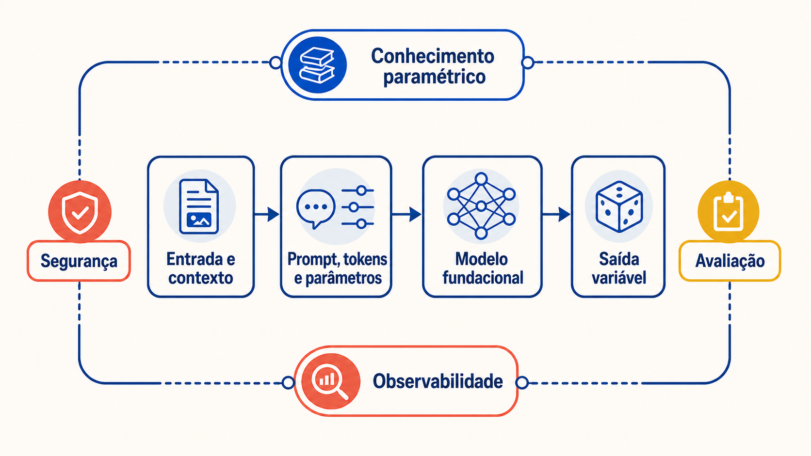
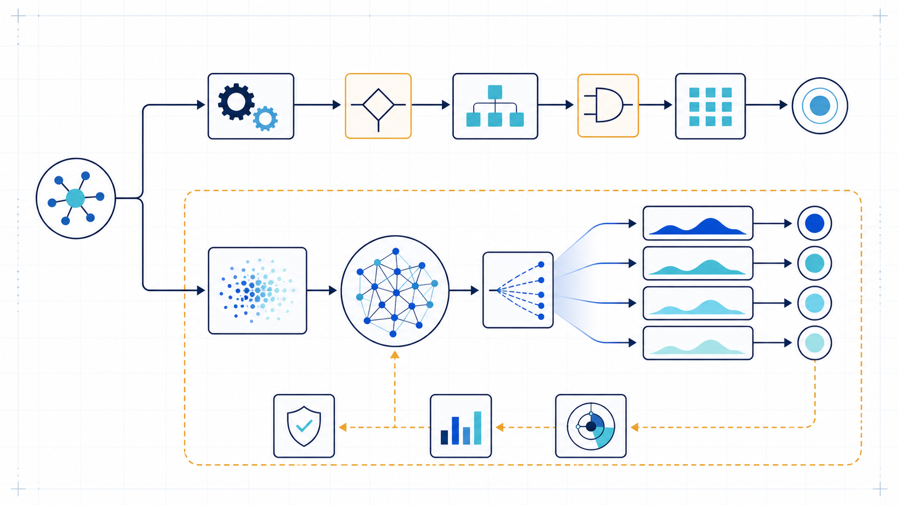

# Conceitos fundamentais

Arquitetar uma solução com IA generativa não começa pela escolha do modelo. Começa pela definição do resultado que o sistema deve produzir, das condições em que esse resultado é aceitável e das responsabilidades que não podem ser delegadas à geração probabilística.

O trabalho do arquiteto é transformar uma capacidade ampla — interpretar, resumir, redigir, classificar ou propor passos — em comportamento útil dentro de limites conhecidos. Para isso, ele precisa:

- delimitar onde a geração participa e onde permanecem regras, decisões humanas e operações determinísticas;
- identificar os elementos que alteram o comportamento, mesmo quando o código da aplicação não muda;
- relacionar riscos e atributos de qualidade a mecanismos de contenção, medição e recuperação;
- distribuir responsabilidades entre software, modelos, dados, pessoas, políticas e fornecedores;
- definir que evidências permitem adotar, promover, restringir ou abandonar uma composição.

Essas tarefas mudam a pergunta inicial. Em vez de “qual modelo usar?”, a análise procura saber **que comportamento o sistema deve sustentar, quem responde por cada parte e como verificar se os limites continuam válidos**.

## Um mapa para orientar a leitura

A figura a seguir apresenta os elementos que participam do comportamento generativo. Ela não representa uma arquitetura pronta nem uma sequência obrigatória. Serve para localizar três questões que atravessam esta página:

1. o que pertence ao modelo e o que pertence ao sistema;
2. quais elementos tornam a saída variável;
3. quais controles e evidências precisam acompanhar essa variabilidade.


*Figura — A saída do modelo é apenas uma parte do comportamento do sistema; avaliação, segurança e observabilidade pertencem à composição desde o início.*

## O que muda no sistema

A introdução de geração probabilística não substitui o software determinístico. Ela cria uma zona em que a saída precisa ser julgada por adequação, enquanto autenticação, cálculo, validação de esquema e execução de transações continuam sujeitos a regras explícitas.

### Do determinístico ao probabilístico

Um **componente determinístico** deve produzir a mesma saída quando recebe a mesma entrada no mesmo estado. Um **componente probabilístico** produz saídas segundo distribuições aprendidas. Um modelo de linguagem estima tokens plausíveis no contexto recebido; duas respostas diferentes podem ser aceitáveis, e uma resposta estável pode continuar errada.


*Figura 1 — Regras determinísticas permitem asserções exatas; geração probabilística exige avaliação sobre casos e contenção de falhas.*

A fronteira entre essas zonas define responsabilidades. O modelo pode extrair valores de um recibo ou redigir uma explicação. Regras verificam limites; uma pessoa autorizada aprova; um serviço transacional produz o efeito. A chamada ao modelo participa de uma composição maior.

### Modelo, aplicação e sistema sociotécnico

Essa composição pode ser observada em três unidades. Um **modelo** é um artefato treinado que recebe entradas e produz saídas. Uma **aplicação de IA** combina modelo, interface, instruções, regras, dados e integrações para atender uma necessidade. Um **sistema de IA** inclui também pessoas, processos, fornecedores, políticas, responsabilidades e efeitos no ambiente.

| Unidade | Pergunta |
|---|---|
| Modelo | Que capacidade e limites aparecem sob determinada configuração? |
| Aplicação | Como software, contexto e controles transformam essa capacidade em função? |
| Sistema sociotécnico | Que resultado, risco e responsabilidade emergem no uso real? |

Um benchmark do modelo não mede autorização, utilidade no processo, carga de revisão ou recuperação. O [AI Risk Management Framework do NIST](https://doi.org/10.6028/NIST.AI.100-1) trata riscos ao longo do ciclo de vida. Para a arquitetura, o sistema sociotécnico é a unidade principal de julgamento; o modelo é uma de suas dependências.

Essa distinção leva à pergunta seguinte: se o comportamento não vem apenas do modelo, que conjunto de elementos o produz?

## De onde emerge o comportamento

### Superfície comportamental

O comportamento observado resulta da configuração inteira usada em uma execução:

```text
modelo e versão
+ parâmetros de geração
+ prompt e exemplos
+ contexto e fontes
+ recuperação
+ ferramentas disponíveis
+ políticas e guardrails
+ estado e memória
+ configuração de implantação
```

Essa combinação é a **superfície comportamental**. Uma alteração em qualquer elemento pode mudar qualidade, custo, latência, segurança ou efeito sem modificar o código da aplicação. Por isso, avaliar apenas o modelo oferece evidência insuficiente para aceitar o sistema.

### Modelos fundacionais e LLMs

Um **modelo fundacional** é treinado em dados amplos e pode ser adaptado a várias tarefas. Um **grande modelo de linguagem (LLM)** trabalha com padrões de linguagem em larga escala; nem todo modelo fundacional é textual e nem todo modelo útil precisa ser grande.

LLMs contemporâneos usam arquiteturas como Transformer, apresentadas em [*Attention Is All You Need*](https://proceedings.neurips.cc/paper_files/paper/2017/hash/3f5ee243547dee91fbd053c1c4a845aa-Abstract.html). Para o desenho da solução, interessa que o modelo processa representações no contexto disponível. Ele não consulta automaticamente fontes corporativas, preserva permissões ou verifica cada afirmação.

Pesos podem ser abertos ou proprietários; a execução pode ocorrer como serviço, em ambiente dedicado ou sob gestão própria. Essas escolhas afetam residência de dados, elasticidade, telemetria, atualização, portabilidade, custo e responsabilidade operacional.

### Treinamento, adaptação e inferência

No **treinamento**, dados e um objetivo de otimização ajustam parâmetros. Na **inferência**, uma versão treinada processa entradas e produz saídas. Latência, disponibilidade e custo por interação aparecem no caminho de inferência.

**Fine-tuning** adapta parâmetros com dados específicos e pode melhorar formato, estilo ou comportamento recorrente. Fatos que exigem atualização, exclusão e proveniência granular precisam de fontes administráveis. A escolha entre fine-tuning, prompt, exemplos, contexto e regras depende do tipo de mudança que o sistema deverá absorver.

### Tokens, contexto e janela de contexto

Um **token** é uma unidade de processamento do modelo. Serviços usam tokens para limites e cobrança, mas sua relação com caracteres, preço e capacidade varia. Essas diferenças tornam custo e latência propriedades a medir, não valores dedutíveis apenas pelo tamanho do texto.

O **contexto** reúne o que a aplicação disponibiliza ao modelo numa execução: instruções, pedido, exemplos, trechos, resultados de ferramentas e estado permitido. A **janela de contexto** limita a entrada e a saída processadas na chamada. Um documento caber nessa janela não demonstra atualização, autorização, localização ou uso correto.

### Prompts, mensagens e parâmetros

Um **prompt** orienta a geração e pode combinar política do sistema, pedido do usuário, exemplos, contexto e especificação de saída. Quando participa de comportamento relevante, precisa de versão e avaliação. Seu contrato inclui entradas, saída esperada, modelo compatível, parâmetros, políticas, validação e tratamento de falha.

Parâmetros como **temperatura** influenciam a distribuição de saída. Temperatura menor pode reduzir diversidade, mas não garante verdade. Da mesma forma, inserir conteúdo no prompt não o converte em instrução confiável; origem, finalidade e autorização continuam pertencendo ao sistema.

### Conhecimento paramétrico, variabilidade e alucinação

**Conhecimento paramétrico** é conteúdo implicitamente representado nos parâmetros de uma versão do modelo. Ele não oferece atualização sob demanda, proveniência granular ou garantia de cobertura. Uma troca de versão também pode alterar o que aparece nas respostas.

**Variabilidade** é a mudança possível entre saídas ou versões. Pode contribuir para ideação e comprometer processos que exigem repetibilidade. **Alucinação** é conteúdo plausível sem sustentação adequada nos fatos, no contexto ou nas evidências disponíveis. Escopo, evidências, abstenção, validação, revisão e avaliação tratam dimensões diferentes desse problema.

Conhecer a superfície explica onde o comportamento pode mudar. Ainda é preciso distinguir a informação que atravessa esses elementos e a finalidade de cada registro.

## Que informação atravessa o sistema

Informação entra no sistema como pedido, instrução, fonte, resultado intermediário ou registro operacional. O mesmo conteúdo não deve conservar automaticamente a mesma finalidade ao mudar de etapa. Um documento autorizado para consulta, por exemplo, pode ser usado como evidência sem se tornar memória de conversa ou conteúdo integral de telemetria.

### Artefatos com ciclos de vida diferentes

| Elemento | Função | Questão de ciclo de vida |
|---|---|---|
| Conhecimento | conteúdo mantido por uma fonte responsável | versão, vigência, autorização e descarte |
| Contexto | informação selecionada para uma execução | finalidade, minimização e expiração |
| Estado | posição e resultados intermediários de um fluxo | consistência, recuperação e concorrência |
| Memória | informação preservada entre interações | escopo, consentimento, retenção e correção |
| Evidência | registro que sustenta ou refuta uma afirmação ou decisão | origem, autoridade, transformação e uso |
| Trace | encadeamento de eventos e versões de uma execução | correlação, minimização, acesso e retenção |

**Proveniência** registra de onde a informação veio, por quais transformações passou e quais versões participaram do resultado. Ela permite reconstruir a cadeia de custódia, mas não prova sozinha que a fonte era correta, atual ou autorizada para aquela finalidade.

Recuperar um documento não o transforma em memória. Histórico de conversa não é fonte de verdade. Trace não autoriza armazenar todo o conteúdo. Essas distinções determinam fronteiras de acesso, retenção e responsabilidade.

### Embeddings e representação semântica

Um **embedding** é uma representação vetorial aprendida de um conteúdo. A proximidade entre vetores pode ajudar a localizar candidatos semanticamente relacionados, agrupar itens ou comparar representações.

O embedding preserva uma representação útil para cálculo, não a autoridade da fonte. Um mecanismo de recuperação ainda precisa de consulta, índices, metadados, filtros, ranking e avaliação. O [Módulo 3](../modulo-3-rag/index.md) mostrará como origem, versão e autorização atravessam ingestão e consulta.

Depois de identificar o que circula, o arquiteto pode decidir quem gera, quem julga e quem produz efeitos.

## Como distribuir responsabilidade

A distribuição começa pelas condições que tornam o sistema aceitável. **Atributos de qualidade** descrevem como ele deve responder em situações relevantes: segurança, disponibilidade, desempenho, modificabilidade, observabilidade e outras características. Cada atributo precisa de cenário, medida e prioridade para orientar o desenho.

### Atributos de qualidade, trade-offs e significância

Mais contexto pode ampliar cobertura e piorar latência, custo e exposição. Trace detalhado pode ajudar diagnóstico e ferir minimização. Fallback pode melhorar disponibilidade e reduzir a qualidade da resposta. A primeira lei de Richards e Ford — “tudo é trade-off” — aplica-se à composição inteira ([*Fundamentals of Software Architecture*](https://www.oreilly.com/library/view/fundamentals-of-software-architecture/9781492043454/)).

Uma escolha é **arquiteturalmente significativa** quando influencia estruturas fundamentais, características prioritárias, dependências, responsabilidades ou custo de mudança. Reformular uma frase descartável pode permanecer uma decisão local. Enviar dados pessoais a um provedor, permitir ferramentas ou criar uma plataforma comum tende a exigir análise arquitetural.

### Geração, decisão, autorização e efeito

Quatro responsabilidades ajudam a traçar essas fronteiras:

| Responsabilidade | Pergunta |
|---|---|
| Geração | Que proposta o modelo produz? |
| Decisão | Que opção será seguida e por qual critério? |
| Autorização | Quem permite a ação sobre este recurso e finalidade? |
| Efeito | Que componente executa, confirma e recupera a mudança? |

O modelo **gera** uma proposta ou sugere um próximo passo. Uma regra, workflow ou pessoa **decide** conforme o caso. Uma política externa **autoriza** identidade, escopo e finalidade. Um componente transacional **executa** e registra o efeito. A separação permite testar contratos, restringir credenciais e atribuir responsabilidade sem exigir que toda solução tenha a mesma estrutura.

### Multimodalidade

Um sistema **multimodal** processa ou produz mais de um tipo de dado. Imagem, áudio e documentos digitalizados acrescentam etapas de extração, ameaças, acessibilidade e métricas próprias. Um modelo pode ler uma nota fiscal; regras ainda validam valores, e uma autoridade ainda aprova o efeito. Mudar a modalidade amplia a superfície, mas não transfere essas responsabilidades ao modelo.

O [Módulo 4](../modulo-4-agentes/index.md) aprofundará autonomia e ferramentas; o [Módulo 5](../modulo-5-confianca/index.md) tratará ameaças, controles e risco residual. Antes dessas decisões, porém, é necessário definir que evidência sustenta a aceitação do sistema.

## Como verificar e governar

As zonas da composição pedem formas de verificação diferentes. Contratos e regras permitem asserções exatas. Saídas generativas exigem observação sobre conjuntos de casos. Propriedades como latência, isolamento e recuperação dependem do sistema em condições representativas.

### Três tipos de verificação

| Tipo | O que verifica | Exemplo |
|---|---|---|
| **Teste de software** | comportamento determinístico de contratos, regras e componentes | campo proibido é rejeitado; transação duplicada não é aplicada |
| **Avaliação comportamental** | distribuição de qualidade sobre uma população de casos | cobertura, fundamentação e recusa em conjunto representativo |
| **Verificação arquitetural** | característica sistêmica ao longo da evolução | p95, isolamento entre perfis, custo por jornada, recuperação de falha |

Uma **fitness function** é uma verificação automatizada e contínua de uma característica arquitetural. Ela pode impedir promoção quando latência, vazamento, fundamentação ou compatibilidade sai do limite. O mecanismo não substitui julgamento humano nem transforma uma métrica intermediária em objetivo de negócio.

### O novo contrato arquitetural

Sistemas generativos combinam zonas testadas por asserção e zonas avaliadas por amostragem. A arquitetura define fronteiras, responsabilidades, medidas e recuperação. O modelo oferece interpretação e geração; o sistema preserva identidade, finalidade, autorização, evidência e efeito.

Esse contrato organiza a continuidade do curso:

- o [Módulo 2](../modulo-2-desenho-conceitual/index.md) transforma oportunidade em descrição e decisão;
- o [Módulo 3](../modulo-3-rag/index.md) governa conhecimento externo;
- o [Módulo 4](../modulo-4-agentes/index.md) governa autonomia e efeitos;
- o [Módulo 5](../modulo-5-confianca/index.md) distribui controles e avaliação;
- o [Módulo 6](../modulo-6-operacao/index.md) governa mudança e operação da superfície comportamental.

Na próxima página, esses conceitos orientam a comparação entre [padrões e decisões](padroes-e-decisoes.md).
