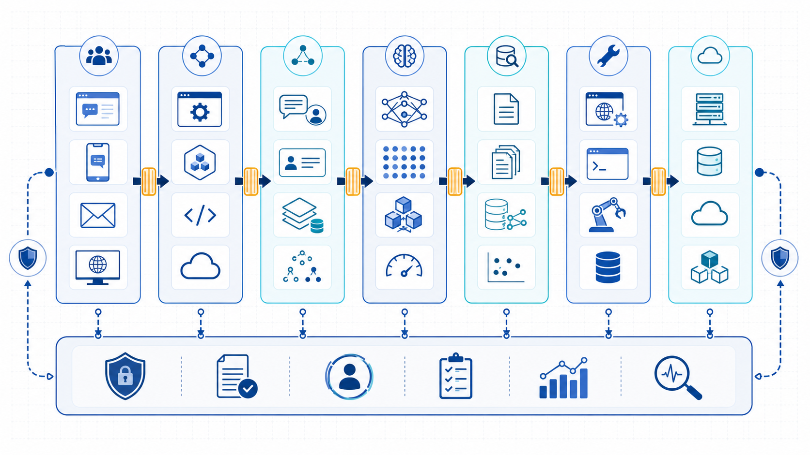
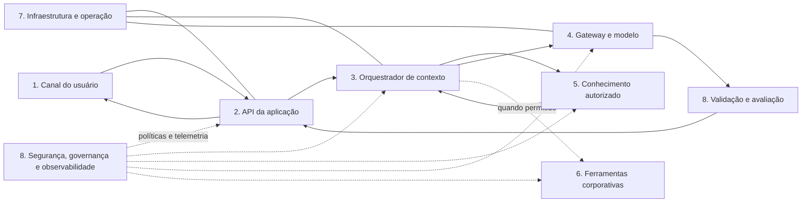

# Exemplo arquitetural: oito camadas de uma solução generativa

Uma arquitetura de referência ajuda a fazer perguntas; não prescreve produtos. A solução abaixo recebe uma pergunta, obtém contexto autorizado e produz uma resposta apoiada em evidências. As oito camadas separam responsabilidades que têm ciclos de mudança, riscos e métricas diferentes.

*Figura 2 — Visão de referência: capacidades transversais atravessam o caminho completo; não são uma etapa final acrescentada depois da geração.*

## As camadas

1. **Canais e experiência.** Chat, portal, aplicativo ou API capturam intenção, anexos, consentimento e feedback. A interface deve comunicar limites, origem da resposta e caminhos de correção.
2. **Aplicação, serviços e APIs.** Autentica, aplica regras de negócio, mantém contratos, controla sessão e transforma a experiência em solicitação estruturada.
3. **Orquestração e contexto.** Escolhe o fluxo aprovado, monta mensagens, aplica orçamento de tokens, coordena recuperação e decide fallback. Não delega política ao modelo.
4. **Modelos e inferência.** Oferece geração ou embeddings por interfaces controladas. Um gateway pode aplicar roteamento, cotas e abstração de fornecedor.
5. **Conhecimento, dados e memória.** Mantém fontes, metadados, índices e estado permitido. Conhecimento corporativo, histórico de conversa e memória duradoura têm finalidades e retenções distintas.
6. **Ferramentas e sistemas corporativos.** Expõe consultas e ações por contratos mínimos, com identidade, autorização, validação e auditoria.
7. **Infraestrutura e operação.** Provê execução, redes, segredos, capacidade, implantação, recuperação e gestão de dependências.
8. **Segurança, governança, avaliação e observabilidade.** Define políticas e evidências de ponta a ponta: versões, traces, conjuntos de teste, aprovações, privacidade e resposta a incidentes.

## Fluxo de componentes

Em texto: o canal envia uma solicitação autenticada à API. A aplicação estabelece identidade e regras; o orquestrador obtém apenas conhecimento autorizado e monta um contexto limitado. O gateway chama o modelo aprovado. A saída passa por validações antes de retornar. Ferramentas só participam quando o fluxo permite. Infraestrutura sustenta os componentes, enquanto políticas e telemetria atravessam todo o percurso.

## Caminho crítico de uma resposta

O caminho crítico online começa na recepção da pergunta e termina quando o usuário recebe conteúdo utilizável. Para o assistente documental, ele inclui: autenticar; classificar a solicitação; recuperar trechos autorizados; montar o contexto; invocar o modelo; validar suporte e formato; entregar texto e fontes. A latência total é a soma e a interação entre essas etapas, não apenas o tempo do modelo.

Algumas atividades ficam fora desse caminho: extrair documentos, segmentar, gerar embeddings, aprovar versões e indexar são do fluxo offline. Separá-los evita reprocessar o corpus em cada pergunta, mas cria uma obrigação de sincronização. Um documento aprovado que ainda não chegou ao índice é uma falha de atualidade mesmo que todos os serviços estejam disponíveis.

## Três modos de falha e suas consequências

### 1. Evidência errada ou ausente

A recuperação pode não encontrar a política correta, selecionar versão vencida ou trazer trecho apenas parecido. O modelo então responde com base fraca ou preenche a lacuna. **Qualidades afetadas:** fundamentação, qualidade, explicabilidade e confiança do usuário. Contenções incluem metadados de vigência, avaliação da recuperação, limiar de suficiência e recusa explícita. Adicionar uma frase “cite fontes” ao prompt não corrige um candidato errado.

### 2. Dependência lenta ou indisponível

Índice, gateway ou modelo pode exceder o timeout. Retry indiscriminado aumenta latência e custo; se houver ferramenta com efeito, pode duplicar ação. **Qualidades afetadas:** latência, confiabilidade, custo e experiência. O desenho precisa de orçamento de tempo por etapa, retry seguro, circuit breaker quando aplicável e fallback honesto, como busca documental sem síntese ou encaminhamento humano.

### 3. Contexto não autorizado ou malicioso

Uma permissão desatualizada pode expor documento restrito; um arquivo recuperado pode conter instrução para ignorar políticas. **Qualidades afetadas:** segurança, privacidade, governança e conformidade. A identidade deve chegar à recuperação, conteúdo deve permanecer separado de instruções e ações devem ser autorizadas fora do modelo. Logs também precisam de minimização: observar não autoriza armazenar todo o conteúdo.

## Por que a oitava camada é transversal

Avaliar somente o texto final não mostra onde a falha nasceu. Um trace correlacionado pode registrar, respeitando privacidade, versão do prompt, modelo, identificadores de fontes, tempo por etapa, validações e fallback. Isso permite distinguir baixa recuperação de má síntese. Da mesma forma, governança não é um comitê distante: aparece na lista de modelos aprovados, na retenção da conversa, na autorização da fonte e no responsável por aceitar risco residual.

Sistemas de aprendizado de máquina acumulam dependências de dados, configurações e processos além do código, uma forma de dívida técnica descrita por [Sculley et al.](https://proceedings.neurips.cc/paper_files/paper/2015/hash/86df7dcfd896fcaf2674f757a2463eba-Abstract.html). A visão em camadas torna essas dependências discutíveis, mas não as elimina. Cada componente só merece existir quando responde a um direcionador e quando a equipe consegue operá-lo.

## Como ler qualquer diagrama generativo

Faça cinco perguntas: onde estão as regras determinísticas? Que informação entra no contexto e com qual autorização? Que componente pode causar efeito externo? Onde são registradas versões e evidências? Qual é a degradação quando modelo, dado ou integração falha? Se o diagrama não permite responder, ele ainda não sustenta uma decisão operacional.

**Próxima página:** [Estudo de caso do assistente interno](estudo-de-caso.md).
