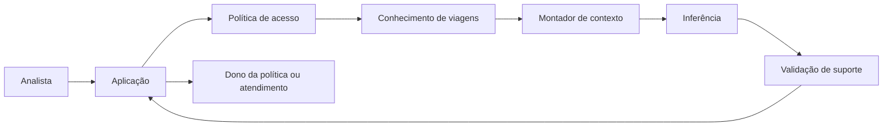
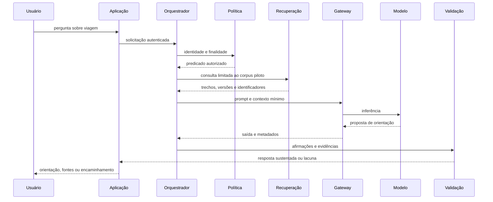

# Exemplo arquitetural: atendimento Horizonte

Este exemplo aplica o [mapa de responsabilidades](padroes-e-decisoes.md#mapa-de-responsabilidades) a um incremento concreto. A Horizonte quer reduzir o tempo gasto por analistas para localizar e explicar políticas. O primeiro incremento responde sobre viagens com fontes autorizadas e pode preparar uma proposta de chamado, mas não executa a abertura.

## Escopo e responsabilidades

| Atividade | Responsável | Limite |
|---|---|---|
| localizar política elegível | serviço de conhecimento | não interpreta direito nem amplia acesso |
| montar contexto | orquestrador | usa somente versão vigente e finalidade atendimento |
| redigir orientação | modelo | não decide conflito nem cria chamado |
| verificar suporte | validador e analista | ausência de evidência interrompe conclusão |
| decidir encaminhamento | analista | chamado permanece apenas como proposta |
| aprovar vigência | dono da política | não delega autoridade ao modelo |

Ficam fora do incremento: documentos sem dono, anexos pessoais, decisões sobre direito, memória persistente, escrita em sistemas e comunicação externa.

## Composição escolhida

O corpus piloto contém vinte políticas de viagem com dono e vigência confirmados. A aplicação compara busca lexical e recuperação híbrida, mas ambas obedecem ao mesmo contrato de evidência. O modelo recebe trechos e identificadores; a interface mostra fonte e permite abrir o documento original.

```mermaid
flowchart LR
    U[Analista] --> A[Aplicação]
    A --> P[Política de acesso]
    P --> R[Conhecimento de viagens]
    R --> O[Montador de contexto]
    O --> M[Inferência]
    M --> V[Validação de suporte]
    V --> A
    A --> H[Dono da política ou atendimento]
```

*Figura 1 — Composição do primeiro incremento do atendimento Horizonte.*

**Equivalente textual.** A aplicação autentica o analista e consulta política antes da fonte. O serviço de conhecimento retorna trechos autorizados com versão; o montador cria contexto; a inferência redige; validação compara afirmações e evidências. Sem suporte ou diante de conflito, a aplicação encaminha à pessoa responsável.

## Superfície comportamental do incremento

| Elemento | Registro necessário |
|---|---|
| modelo e parâmetros | identificador de versão, temperatura e limites |
| prompt | versão e contrato de saída |
| fontes | política, versão, vigência e nível de acesso |
| recuperação | consulta, filtro e identificadores dos candidatos |
| políticas | finalidade, perfil e regra de retenção |
| estado | solicitação e rascunho até a conclusão |
| memória | nenhuma entre sessões |
| implantação | aplicação e fontes internas; endpoint de inferência aprovado |

## Sequência principal

```mermaid
sequenceDiagram
    participant U as Usuário
    participant A as Aplicação
    participant O as Orquestrador
    participant P as Política
    participant R as Recuperação
    participant G as Gateway
    participant M as Modelo
    participant V as Validação
    U->>A: pergunta sobre viagem
    A->>O: solicitação autenticada
    O->>P: identidade e finalidade
    P-->>O: predicado autorizado
    O->>R: consulta limitada ao corpus piloto
    R-->>O: trechos, versões e identificadores
    O->>G: prompt e contexto mínimo
    G->>M: inferência
    M-->>G: proposta de orientação
    G-->>O: saída e metadados
    O->>V: afirmações e evidências
    V-->>A: resposta sustentada ou lacuna
    A-->>U: orientação, fontes ou encaminhamento
```

*Figura 2 — Sequência principal da consulta a uma política de viagem.*

## Falhas e degradação

| Falha | Contenção | Estado oferecido ao analista |
|---|---|---|
| política vencida ou conflitante | não concluir; encaminhar ao dono | fontes encontradas e motivo do bloqueio |
| fonte proibida para o perfil | filtrar antes da recuperação | nenhuma indicação do conteúdo restrito |
| inferência indisponível | oferecer resultados da busca sem síntese | links autorizados e pergunta preservada |
| resposta sem suporte | remover conclusão e destacar lacuna | trechos recuperados para revisão |
| mudança de modelo com regressão | impedir promoção | versão anterior permanece ativa |

## Evidência antes de ampliar

| Tipo | Verificação |
|---|---|
| Teste de software | perfil sem acesso nunca recebe identificador ou trecho restrito |
| Avaliação comportamental | perguntas respondíveis medem recuperação, suporte, utilidade e recusa |
| Verificação arquitetural | p95, custo, isolamento e degradação permanecem nos limites |
| Fitness function | promoção é bloqueada se houver vazamento ou queda de suporte abaixo do limiar |

A proposta de chamado fica para outro incremento. Se for adotada, deverá acrescentar contrato, política, confirmação humana e executor idempotente. Essa decisão pertence à trajetória de ação aprofundada no Módulo 4, não ao fluxo documental atual.

## Leitura do exemplo

O desenho demonstra uma composição, não uma arquitetura universal. O Módulo 2 poderá questionar se os direcionadores justificam a estrutura; o Módulo 3 detalhará conhecimento; o Módulo 5 testará ameaças e controles; o Módulo 6 governará versões e promoção.

**Próxima página:** [Estudo de caso do atendimento interno](estudo-de-caso.md).
