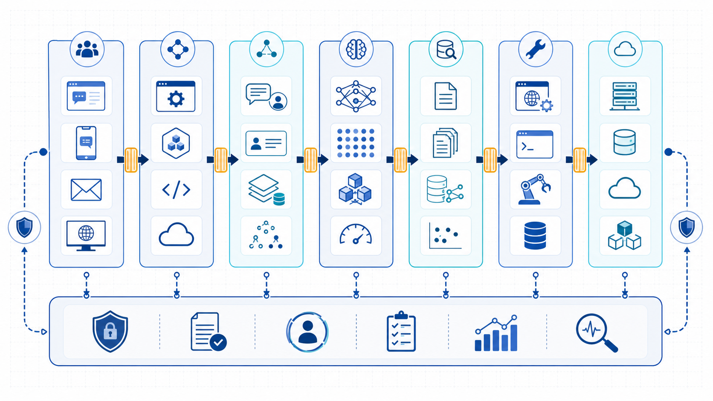
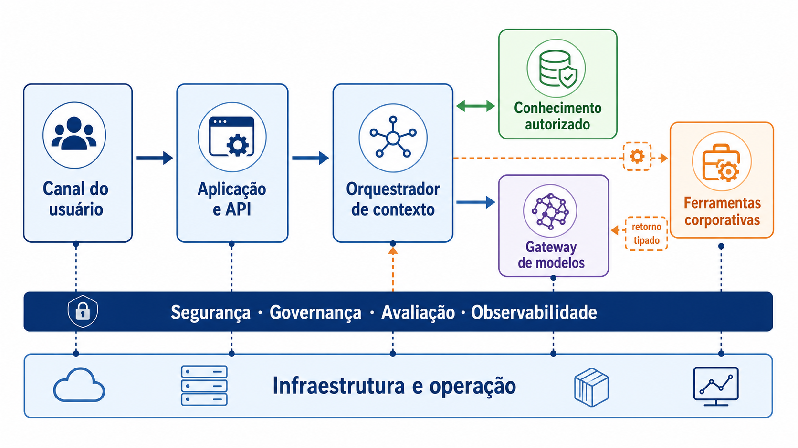

# Padrões e decisões

As abordagens desta página são famílias de composição, não degraus de maturidade. Cada uma acrescenta capacidade e responsabilidade. A comparação começa pelo problema e pelas características prioritárias; o Módulo 2 transformará esse raciocínio em RAS, táticas, visões e ADRs.

## Panorama das abordagens

| Abordagem | Capacidade acrescentada | Quando pode ajudar | Responsabilidade nova |
|---|---|---|---|
| **Geração direta** | interpretação ou produção sem fonte externa específica | redação, reformulação e classificação de baixo risco | avaliar combinação de modelo, prompt, parâmetros e saída |
| **Contexto fornecido** | conteúdo conhecido incluído na execução | poucos materiais selecionáveis e compatíveis com a janela | autorizar, minimizar, versionar e montar contexto |
| **RAG** | localização de evidência externa antes da geração | fontes amplas, mutáveis ou que exigem proveniência | operar ingestão e consulta; avaliar recuperação e geração |
| **Ferramentas** | consulta ou ação por contrato | dado atual ou efeito em sistema externo | validar identidade, autorização, parâmetros e efeito |
| **Workflow com LLM** | etapas e transições conhecidas com geração delimitada | processo enumerável que contém interpretação | manter estado, exceções, recuperação e contratos |
| **Agente** | escolha variável de passos ou ferramentas | adaptação do percurso produz valor demonstrável | limitar autonomia, orçamento, memória, parada e aprovação |
| **Fine-tuning** | adaptação paramétrica de comportamento recorrente | formato, estilo ou tarefa não atendidos por alternativas menores | curar dados, avaliar versões, implantar e reverter |

### Geração direta e contexto fornecido

Geração direta oferece a menor linha de base. “Direta” não dispensa timeout, versão e avaliação. Quando o conteúdo relevante já é conhecido, a aplicação pode fornecê-lo no contexto; caber na janela não elimina autorização, minimização ou conflito de versões.

### Conhecimento externo

RAG acrescenta aquisição, transformação, índice, recuperação e evidências. É candidato quando a aplicação precisa localizar fontes; não é requisito para toda resposta fundamentada. O [Módulo 3](../modulo-3-rag/index.md) separa os fluxos de ingestão e consulta e mostra como autorização, proveniência e avaliação atravessam ambos.

### Ferramentas, workflows e agentes

Uma ferramenta expõe consulta ou ação por contrato. O modelo pode propor argumentos; componentes externos validam identidade, política e esquema antes da execução. Um workflow define transições; um agente delega ao modelo parte da escolha do percurso. O [Módulo 4](../modulo-4-agentes/index.md) compara autonomia pelo valor da adaptação e pelo risco do efeito.

### Fine-tuning

Fine-tuning altera comportamento paramétrico. Antes de adotá-lo, compare uma linha de base com prompt, exemplos, contexto e regras. Conhecimento mutável continua exigindo fonte, vigência e avaliação próprias.

## Quatro decisões independentes

Evite condensar todo o desenho na pergunta “qual modelo usar?”. Separe:

| Decisão | Alternativas iniciais | Evidência mínima |
|---|---|---|
| Produção | regra, template, geração ou combinação | casos representativos e critério de utilidade |
| Conhecimento | entrada do usuário, fonte selecionada, recuperação ou parâmetros | cobertura, atualização, autorização e proveniência |
| Efeito | nenhum efeito, proposta, workflow aprovado ou autonomia limitada | contratos, simulação de falha e responsabilidade |
| Operação | endpoint hospedado, dedicado ou autogerido; integração local ou comum | custo total, residência, disponibilidade, reversão e suporte |

Essas decisões interagem, mas não são equivalentes. Escolher RAG não define autonomia; escolher agente não define implantação; usar um modelo local não prova segurança ou qualidade.

## Anti-padrão: uma caixa probabilística para tudo

O anti-padrão aparece quando a mesma chamada recebe conteúdo, decide acesso, calcula regras, escolhe ações e produz a resposta. Prompt crescente, credenciais amplas, falhas irreproduzíveis e retries com efeito duplicado são sintomas.

A correção consiste em separar contratos conforme risco e mudança: regras permanecem explícitas; conhecimento conserva fonte; ferramentas passam por política; geração recebe escopo; estado e memória têm retenção; observabilidade correlaciona versões. Isso não exige um microsserviço para cada responsabilidade.

## Mapa de responsabilidades

O mapa abaixo organiza perguntas recorrentes; não prescreve um estilo arquitetural nem exige todos os elementos em toda solução.

*Figura — Anatomia de referência: responsabilidades transversais atravessam o fluxo e não constituem uma etapa final.*

| Grupo | Responsabilidade |
|---|---|
| Canais e experiência | capturar intenção, consentimento, anexos e feedback; comunicar limites |
| Aplicação e APIs | autenticar, aplicar regras e transformar interação em solicitação estruturada |
| Orquestração | selecionar fluxo, coordenar componentes, preservar estado e recuperar falhas |
| Contexto e evidência | selecionar informação autorizada, registrar origem e montar contexto |
| Modelos e inferência | produzir geração ou representações por interfaces controladas |
| Ferramentas e efeitos | consultar ou agir por contratos, políticas e identidades delimitadas |
| Infraestrutura e operação | sustentar execução, redes, segredos, implantação e dependências |
| Capacidades transversais | aplicar segurança, governança, avaliação e observabilidade |

Conhecimento, contexto, estado, memória, evidência e trace atravessam esses grupos com finalidades e retenções próprias. Eles não formam uma única camada.

### Componentes e dependências

*Figura — Um arranjo possível para discutir dependências; cada componente precisa de um direcionador.*

**Equivalente textual — componentes.** O canal envia uma solicitação à aplicação, que autentica a sessão e entrega um pedido estruturado ao orquestrador. O orquestrador pode solicitar evidência autorizada, montar contexto e pedir inferência. Se houver proposta de ferramenta, política e aplicação validam identidade, escopo e contrato antes de um executor determinístico produzir efeito. O resultado tipado retorna ao orquestrador — na notação da figura, `T -. "resultado tipado" .-> O`. Segurança, avaliação, observabilidade e operação atravessam o percurso.

### Três trajetórias

| Trajetória | Encadeamento | Responsabilidade dominante |
|---|---|---|
| Resposta | entrada → inferência → validação → rascunho | avaliar geração sob escopo |
| Evidência | identidade → política → recuperação → contexto → geração → validação | preservar fonte, autorização e suficiência |
| Ação | intenção → proposta → política → aprovação → executor → confirmação | separar geração, decisão, autorização e efeito |

Na trajetória de ação, o modelo gera proposta estruturada; política e responsável decidem e autorizam; executor idempotente produz o efeito. Na trajetória de evidência, recuperar um trecho não prova que ele sustenta a afirmação. Cada composição exige teste de software, avaliação comportamental e verificação arquitetural proporcionais.

## Ficha de decisão inicial

Antes de uma ADR, registre o suficiente para decidir que hipótese merece análise no Módulo 2:

| Campo | Pergunta |
|---|---|
| Situação | Que resultado ou problema observável motivou a análise? |
| Responsabilidades | O que gera, decide, autoriza e executa? |
| Características prioritárias | Que qualidades entram em tensão? |
| Alternativas | Qual é a opção convencional e quais composições generativas competem? |
| Consequências | Que dependências, dados, operação e riscos cada opção acrescenta? |
| Evidência existente | O que já foi observado e sob quais condições? |
| Incógnita decisiva | Que desconhecimento poderia inverter a direção? |
| Próximo experimento | Qual teste barato pode confirmar, restringir ou rejeitar a hipótese? |

### Exemplo resumido: atendimento interno

| Campo | Registro |
|---|---|
| Situação | analistas gastam tempo localizando políticas e explicando-as |
| Responsabilidades | sistema localiza e redige; analista interpreta; dono da política decide conflito; aplicação controla acesso |
| Prioridades | fundamentação e privacidade antes de cobertura; p95 inferior a oito segundos |
| Alternativas | busca convencional, contexto selecionado e recuperação; nenhuma ação de escrita |
| Evidência | 24 de 30 perguntas foram aceitáveis com documentos escolhidos manualmente |
| Incógnita | seleção automática preserva acesso e recupera a versão correta? |
| Experimento | corpus piloto, perguntas estratificadas, perfis distintos e falhas de fonte |

A ficha não registra uma decisão arquitetural completa. Ela explicita o problema e a lacuna de conhecimento. O [Módulo 2](../modulo-2-desenho-conceitual/padroes-e-decisoes.md) mostrará como transformar essa análise em descrição arquitetural, táticas, trade-offs e ADR.

## Ponte para confiança e operação

Qualquer alternativa precisa responder a duas perguntas transversais. O [Módulo 5](../modulo-5-confianca/index.md) perguntará quais riscos, controles e avaliações tornam o uso aceitável. O [Módulo 6](../modulo-6-operacao/index.md) perguntará quais versões, fitness functions, rollouts e modos degradados preservam essa aceitação no tempo.

**Próxima página:** [Exemplo arquitetural — atendimento Horizonte](exemplo-arquitetural.md).
