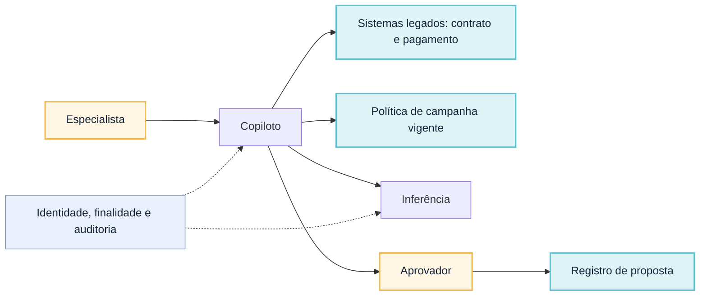
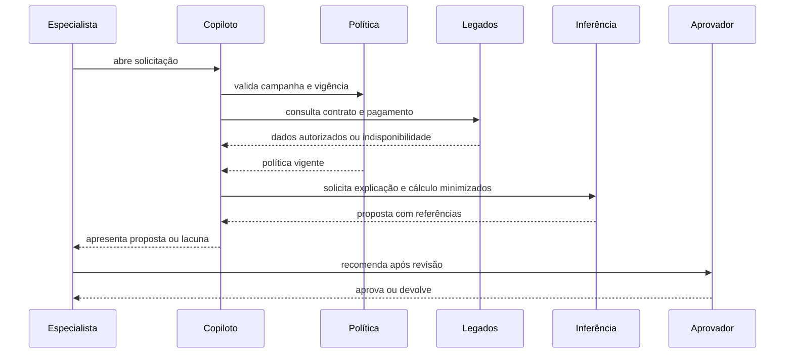
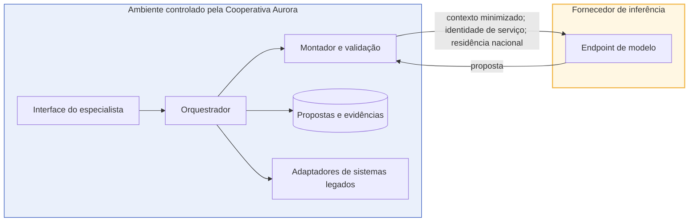

# Caso contínuo: Cooperativa Aurora — desenho conceitual completo

**Caso contínuo — Cooperativa Aurora.** [← Módulo 1: Antes da arquitetura](../modulo-1-fundamentos/caso-aurora.md) · [Módulo 3: RAG →](../modulo-3-rag/caso-aurora.md)

Este módulo é onde a Cooperativa Aurora recebe sua primeira arquitetura. O [Banco Lume](caso-lume.md) já está resolvido como exemplo do professor no [Exemplo arquitetural](exemplo-arquitetural.md) deste módulo — cinco visões, RAS, árvore de utilidade, matriz de alternativas e duas ADRs. Esta página **resolve por completo a Cooperativa Aurora**, seguindo exatamente o entregável pedido em [Estudo de caso: Central Aurora de renegociação](estudo-de-caso.md), com as mesmas evidências e restrições ali descritas.

## 1. Oportunidade, baseline e hipótese de valor

Especialistas da Cooperativa Aurora preparam propostas de renegociação de crédito consultando contratos, pagamentos, políticas de campanha e registros de contato. Numa amostra de 180 solicitações, a mediana de preparação é 31 minutos (p90: 74); 42% do tempo é busca e transcrição; 11% das propostas voltam por documento ausente ou política incorreta; a concordância entre dois especialistas sobre "melhor proposta" foi 76% em 50 casos. Uma demonstração com três documentos escolhidos gerou uma carta convincente e o patrocinador passou a chamar a iniciativa de "agente de renegociação" — sem testar autorização, ausência, indisponibilidade ou conflito.

**Hipótese de valor:** se contrato, pagamentos e política de campanha vigente forem reunidos num dossiê rastreável, o especialista reduz busca e transcrição sem delegar cálculo, julgamento ou aprovação. Redução de tempo é a métrica principal; devolução por documento incorreto, divergência de valor e exposição de dado sensível são contramétricas.

## 2. Critérios de adequação ou rejeição de GenAI por atividade

| Atividade | Geração é adequada? | Por quê |
|---|---|---|
| calcular elegibilidade e faixas | não | regra estável já resolve; geração acrescentaria variabilidade sem ganho |
| localizar contrato, pagamento e política vigente | não diretamente | é problema de integração e autorização, não de síntese |
| redigir explicação ao cliente a partir de dados já selecionados | sim | atividade heterogênea, hoje manual, com repetição de estrutura |
| decidir aprovação da proposta | não | permanece humana, segregada por política interna |
| aplicar automaticamente "a melhor taxa" | não | fora de escopo por restrição confirmada, não por limitação técnica |

## 3. CONOPS

**Modo normal.** O especialista abre a solicitação; o copiloto monta o contexto com contrato, pagamentos, política de campanha vigente e registro de contato autorizados; propõe explicação e cálculo com referências; o especialista corrige e recomenda; um aprovador distinto aprova ou devolve antes de qualquer oferta.

**Modo degradado.** Quando um sistema legado está indisponível, o copiloto preserva a solicitação, apresenta os últimos dados sincronizados com aviso de desatualização e mantém o fluxo manual disponível — nunca estima um valor no lugar do dado ausente.

**Modo bloqueado.** Política de campanha sem versão aprovada, contrato ilegível ou dado sensível sem finalidade de renegociação interrompem a proposta e encaminham ao especialista sem conclusão.

## 4. Fronteiras, fora de escopo e responsabilidade humano–IA

Ficam fora deste incremento: comunicação externa ao cliente (plataforma separada), alteração de contrato, limite, taxa ou status, aplicação automática de "melhor taxa", cobertura simultânea de todas as campanhas e qualquer aprendizado a partir de correções humanas.

| Responsabilidade | Componente conceitual | Não pode decidir |
|---|---|---|
| selecionar contrato, pagamento e política | montador de contexto | validade da renegociação |
| minimizar dado sensível sem finalidade | fronteira de dados | ampliar finalidade de uso |
| redigir explicação e cálculo proposto | serviço de inferência | aprovar ou registrar oferta |
| validar suporte e sinalizar conflito de política | validação | resolver o conflito |
| corrigir e recomendar | especialista | dispensar aprovação distinta |
| aprovar ou devolver | aprovador | delegar julgamento ao modelo |

## 5. Quatro objetivos separados

- **Negócio:** reduzir a mediana de 31 para cerca de 20 minutos sem elevar devolução, divergência de valor ou exposição de dado.
- **Produto:** dossiê de renegociação com explicação e cálculo rastreáveis até contrato, pagamento e política vigente.
- **Dados:** contrato, pagamento, política de campanha e contato — cada um com autoridade e vigência próprias; nenhum dado sem finalidade de renegociação atravessa a inferência.
- **IA:** produz rascunho de explicação e cálculo, nunca decisão; abstém-se diante de evidência insuficiente ou política conflitante.

## 6. Três requisitos arquiteturalmente significativos

| RAS | Cenário | Consequência esperada |
|---|---|---|
| privacidade | ao montar contexto, nenhum campo sem finalidade de renegociação (evento familiar informado em atendimento, avaliação interna) atravessa a inferência | fronteira de minimização testada antes do piloto; ver [atributo Privacidade](../referencia/atributos-de-qualidade.md#privacidade) |
| proveniência e fundamentação | toda explicação e cálculo apresentam contrato, pagamento e política com versão e vigência | vínculo afirmação–fonte obrigatório; ver [atributo Fundamentação](../referencia/atributos-de-qualidade.md#fundamentacao-grounding) |
| confiabilidade | indisponibilidade de sistema legado preserva a solicitação e oferece fluxo manual sem estimar valor ausente | timeout, estado persistido e degradação; ver [atributo Confiabilidade](../referencia/atributos-de-qualidade.md#confiabilidade) |

## 7. Matriz das quatro direções e recomendação

| Direção | Atende a hipótese de valor? | Responsabilidade adicional | Decisão neste incremento |
|---|---|---|---|
| A. Automação convencional | cobre cálculo e coleta, não a síntese de explicação heterogênea | representar toda campanha e exceção em regra | manter para cálculo; insuficiente sozinha |
| B. Copiloto com contexto | sim — reduz a busca e a transcrição sem ampliar autonomia | mapeamento entre campanha, contrato e política correspondente | **adotar** |
| C. RAG | apoiaria corpus de políticas maior que uma campanha | ingestão, índice e avaliação de recuperação próprios | adiar até o corpus de políticas de campanha superar o mapeamento manual |
| D. Agente com ferramentas | adaptaria consultas a sistemas legados variáveis | contratos de ferramenta, autorização por chamada, orçamento de passos | rejeitar por ora: consultas ainda seguem sequência conhecida; sistemas legados em lote não sustentam autonomia de leitura variável |

A direção B usa o padrão [Workflow determinístico com etapas generativas](../referencia/catalogo-de-padroes.md#workflow-deterministico-com-etapas-generativas): a variabilidade fica isolada na redação; coleta, cálculo, aprovação e efeito permanecem determinísticos.

## 8. Cinco visões arquiteturais

Nos diagramas, o preenchimento âmbar marca quem decide (papel humano), o ciano marca dado ou registro persistido, e o cinza marca um controle transversal; componentes automatizados permanecem sem preenchimento adicional.

### Contexto

**Equivalente textual.** O copiloto recebe a solicitação autenticada, consulta somente sistemas legados e políticas autorizados para aquela campanha e envia contexto minimizado à inferência. O aprovador — pessoa distinta do especialista — é a fronteira entre proposta e registro. O fornecedor de inferência não decide finalidade, autorização nem residência dos dados.

### Responsabilidades

Ver tabela da seção 4.

### Interação: sequência e falha

**Equivalente textual.** A inferência só ocorre depois que política e legados respondem ou declaram indisponibilidade; ela produz proposta, nunca decisão. A aprovação por pessoa distinta é atividade fora do modelo.

Os três sinais de falha do caso recebem contenção específica: **dado sensível sem finalidade** (evento familiar, avaliação interna) bloqueia a montagem de contexto; **sistema legado indisponível** preserva a solicitação e ativa o fluxo manual; **evidência insuficiente ou política conflitante** remove a conclusão e expõe a lacuna para decisão do especialista.

### Informação e ciclo de vida

| Informação | Origem e autoridade | Transformação | Persistência e descarte |
|---|---|---|---|
| contrato e pagamento | sistemas legados, finalidade renegociação | seleção de campos por autorização | referência no dossiê; conteúdo bruto não reutilizado |
| política de campanha | repositório de campanhas, dono da política | seleção por campanha e vigência | versão e trecho preservados com a proposta |
| contexto de inferência | montador de contexto | composição minimizada de dados e política | não reutilizado para treinamento; expira após a execução |
| proposta (explicação e cálculo) | serviço de inferência | validação de suporte e marcação de lacuna | editável até aprovação; versão final ligada às evidências |
| decisão de aprovação | aprovador | aprovação ou devolução | registro segundo retenção institucional |
| trace operacional | componentes do copiloto | redação de campos sensíveis | retenção de até 24 horas para conteúdo de inferência |

**Equivalente textual.** Contrato, pagamento e política têm autoridades diferentes dos sistemas legados. O montador cria um contexto derivado e minimizado; a inferência produz proposta, não registro oficial. Origem, versão e prazo formam a proveniência exigida pela restrição de retenção de 24 horas.

### Implantação e fronteiras tecnológicas

**Equivalente textual.** Interface, orquestração, montagem, validação, propostas e adaptadores para os legados permanecem no ambiente controlado pela cooperativa. Só o contexto minimizado atravessa a fronteira do fornecedor, por identidade de serviço dedicada e com residência nacional garantida contratualmente. O contorno âmbar do ambiente do fornecedor marca a fronteira de confiança que o contexto atravessa.

## 9. Correspondências verificadas

| Regra | Evidência no caso |
|---|---|
| participante da interação existe no contexto | especialista, copiloto, política, legados, inferência e aprovador aparecem nas duas visões |
| passo tem responsabilidade | seleção, cálculo, geração, validação, recomendação e aprovação estão atribuídas |
| dado manipulado tem ciclo de vida | contrato, pagamento, política, contexto, proposta, decisão e trace constam da visão de informação |
| componente executável tem alocação | interface, orquestrador, montador, adaptadores, repositório e endpoint constam da implantação |
| travessia de confiança tem controle | apenas contexto minimizado cruza a fronteira, por identidade de serviço e residência nacional |
| RAS chega a tática e evidência | a árvore de utilidade abaixo liga cenário, tática e sensibilidade |

## 10. Árvore de utilidade reduzida

| Objetivo e característica | Cenário priorizado | Tática e mecanismo | Sensibilidade, trade-off e risco |
|---|---|---|---|
| reduzir tempo sem expor dado sensível — privacidade | ao montar contexto, nenhum campo sem finalidade atravessa a inferência | minimização e autorização por finalidade no montador | sensível à lista de campos sensíveis; privacidade compete com riqueza de contexto |
| reduzir devolução — fundamentação | proposta sempre cita contrato, pagamento e política com versão | vínculo afirmação–fonte e abstenção abaixo do limiar | sensível ao limiar de suporte; cobertura compete com concisão |
| preservar trabalho — confiabilidade | indisponibilidade de sistema legado mantém solicitação e oferece fluxo manual | timeout, estado persistido e degradação | sensível ao tempo de resposta médio de 4 s do legado; disponibilidade compete com custo de nova tentativa |

## 11. ADR-Aurora-001 — Copiloto com contexto, sem recuperação nem ferramentas autônomas

**Status.** Proposta.

**Contexto.** O objetivo do primeiro incremento é reduzir busca e transcrição na preparação de propostas de renegociação, preservando revisão por especialista e aprovação por pessoa distinta. Sistemas legados aceitam parte das consultas apenas em lote e não oferecem idempotência para gravação; nenhuma modernização está financiada. O corpus de políticas por campanha ainda é pequeno e mapeável manualmente.

**Direcionadores da decisão.** Revisão humana obrigatória e segregação entre proponente e aprovador (restrições confirmadas); RAS de privacidade, fundamentação e confiabilidade descritos na seção 6; ausência de evidência de que o corpus ou a variabilidade de consulta já exijam recuperação ou autonomia.

**Opções.**

1. **Automação convencional** — previsível para cálculo, mas não resolve a síntese de explicação a partir de documentos heterogêneos.
2. **Copiloto com contexto** — isola a variabilidade na redação, mantendo coleta, cálculo, aprovação e efeito determinísticos.
3. **RAG** — ampliaria cobertura de políticas, mas exige ingestão, índice e avaliação de recuperação sem evidência de que o mapeamento manual já seja insuficiente.
4. **Agente com ferramentas** — adaptaria a ordem de consultas aos legados, mas os sistemas em lote e sem idempotência não sustentam autonomia de gravação nem leitura variável ainda.

**Decisão.** Adotar copiloto com contexto: adaptadores obtêm contrato, pagamento e política vigente por campanha mapeada; o montador registra origem, versão e vigência; a inferência produz apenas explicação e cálculo propostos, sem acesso direto aos legados nem gravação.

**Consequências.** Cobertura fica limitada às campanhas mapeadas e exige manter as regras de seleção. Em troca, o experimento isola a hipótese de síntese do custo e do risco de uma plataforma de recuperação ou de autonomia de agente, mantendo reversibilidade alta.

**Evidências.** Concordância de 76% entre especialistas sobre "melhor proposta" e 42% do tempo classificado como busca e transcrição sustentam que o ganho inicial está em consolidar contexto e redigir explicação, não em ampliar automação de decisão.

**Gatilhos de revisão.** Reavaliar para RAG se o número de campanhas ou políticas ativas superar o mapeamento manual ou a cobertura de evidência cair abaixo de 95%. Reavaliar para agente com ferramentas se os sistemas legados passarem a oferecer consulta em tempo real com idempotência e uma atividade demonstrar sequência de consulta não enumerável.

## 12. Experimento mais barato para refutar a hipótese central

Rodar o copiloto em modo sombra sobre uma única campanha já mapeada, com 50 a 100 casos desidentificados: a proposta é gerada em paralelo, sem substituir o fluxo manual. A hipótese é refutada se o tempo não cair de forma consistente, se a devolução por documento ou política aumentar, ou se algum caso expuser dado sensível sem finalidade.

## Continuidade

A decisão de adiar RAG (seção 11) tem um gatilho explícito de cobertura e crescimento de corpus — é esse gatilho, cumprido, que abre o [Módulo 3](../modulo-3-rag/caso-aurora.md) para a Aurora, por um caminho diferente do [Banco Lume](../modulo-3-rag/caso-lume.md).

---

**Continua:** [Módulo 3 — RAG](../modulo-3-rag/caso-aurora.md)
