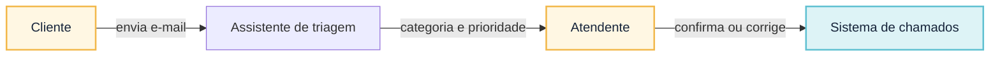
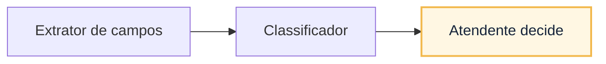
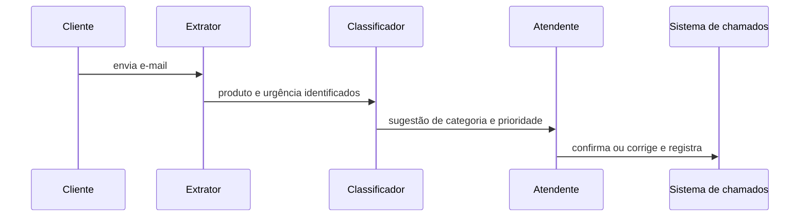
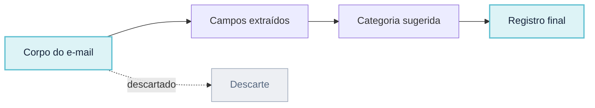
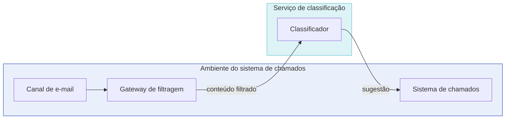

# Conceitos: do problema ao Documento de Arquitetura de Software

Desenho conceitual é a etapa que define **o que vale a pena resolver, sob quais limites e com que evidência** antes de escolher modelos, padrões ou fornecedores. Seu resultado não é um diagrama de tecnologia. É uma descrição arquitetural suficiente para comparar direções e tornar decisões revisáveis.

## O Documento de Arquitetura de Software

Neste curso, chamaremos de **Documento de Arquitetura de Software** o pacote de trabalho produzido nesta etapa. O nome é uma convenção didática, não um tipo documental prescrito pelo mercado. O documento conecta oito campos que devem permanecer coerentes:

1. oportunidade, população, baseline e contramétricas;
2. hipótese de valor e atividades que continuam humanas;
3. CONOPS, exceções e modos operacionais;
4. stakeholders, fronteiras e fora de escopo;
5. objetivos de negócio, produto, dados e IA;
6. requisitos arquiteturalmente significativos e cenários de qualidade;
7. alternativas, responsabilidades adicionais e decisões rejeitadas;
8. evidências, experimento inicial, ADRs e gatilhos de revisão.

O modelo de IA é apenas um candidato dentro desse documento. Uma decisão é boa quando o contexto, as alternativas, as consequências e a evidência necessária podem ser explicados sem recorrer à preferência por uma tecnologia.

## Como uma descrição arquitetural é organizada

Arquitetura é o conjunto de estruturas necessárias para raciocinar sobre o sistema; **descrição arquitetural** é a forma usada para comunicá-las. Confundir o sistema com um desenho específico leva a dois erros: acreditar que um diagrama representa tudo ou tratar qualquer artefato do projeto como modelo arquitetural.

Use o vocabulário abaixo:

- **Stakeholder** é a pessoa, grupo ou organização que tem interesse ou responsabilidade em relação ao sistema.
- **Preocupação** (*concern*) é um interesse relevante para um ou mais stakeholders, como privacidade, recuperação de falha ou contestabilidade.
- **Ponto de vista** (*viewpoint*) define propósito, público, convenções e tipos de modelo usados para tratar determinadas preocupações.
- **Visão** (*view*) representa este sistema segundo um ponto de vista. Uma visão pode combinar texto, tabelas e diagramas.
- **Modelo arquitetural** representa um aspecto específico da arquitetura dentro de uma ou mais visões, como relações entre responsabilidades ou alocação de componentes em ambientes.
- **Cenário de qualidade** especifica como o sistema deve responder a um estímulo sob determinada condição. É entrada para análise e verificação, não uma visão da arquitetura.
- **ADR** registra uma decisão arquitetural e seu racional. É memória de decisão, não modelo do sistema.

O documento organiza esses elementos em cinco grupos:

| Grupo | Conteúdo | Pergunta |
|---|---|---|
| Entradas da análise | stakeholders, preocupações, objetivos, restrições, premissas, CONOPS e cenários de qualidade | O que orienta e limita o desenho? |
| Descrição arquitetural | visões de contexto, responsabilidades, interação, informação e implantação | Que estruturas respondem às preocupações? |
| Análise arquitetural | RAS, táticas, sensibilidades, trade-offs, riscos e alternativas | Por que essa estrutura é adequada? |
| Registros de decisão | ADRs e alternativas rejeitadas | O que foi escolhido e por quê? |
| Evidências | experimentos, medições e critérios de aceitação | O que sustenta ou refuta a escolha? |

### Cinco visões mínimas

Não existe uma quantidade universal de visões. Para o desenho conceitual de uma solução de IA generativa, estas cinco costumam revelar as decisões iniciais:

| Visão | Preocupações atendidas | Modelos ou representações úteis |
|---|---|---|
| Contexto | atores, sistemas externos, responsabilidades organizacionais e fronteiras de confiança | mapa de contexto e tabela de dependências |
| Responsabilidades | decomposição, autoridade, coesão e acoplamento | mapa de responsabilidades e contratos conceituais |
| Interação | ordem, estados, efeitos, exceções e recuperação | sequência normal, degradada e bloqueada |
| Informação | origem, classificação, finalidade, transformação, proveniência, retenção e descarte | fluxo e ciclo de vida dos dados |
| Implantação | alocação em ambientes, regiões e provedores; identidades, redes e dependências operacionais | mapa de implantação e fronteiras tecnológicas |

O ponto de vista deve declarar o que deixa de fora. A visão de contexto não explica a ordem de uma chamada; a visão de interação não mostra onde o dado é armazenado; a visão de implantação não atribui autoridade humana.

### Exemplo concreto das cinco visões

Considere um assistente simples: ele sugere categoria e prioridade de chamados de suporte técnico recebidos por e-mail; um atendente humano confirma ou corrige antes do registro. As cinco visões abaixo descrevem esse mesmo assistente, cada uma sob uma preocupação distinta. Nos diagramas, o preenchimento âmbar marca quem decide (papel humano) e o preenchimento ciano marca dado ou registro persistido; componentes automatizados permanecem sem preenchimento adicional.

#### Contexto



**Equivalente textual.** O cliente envia o e-mail; o assistente sugere categoria e prioridade; o atendente confirma ou corrige antes de o sistema de chamados registrar o caso. A fronteira de confiança fica entre o e-mail recebido, não confiável, e o chamado registrado, confiável porque passou por confirmação humana.

#### Responsabilidades



**Equivalente textual.** O extrator apenas identifica campos no texto; o classificador apenas sugere categoria e prioridade a partir desses campos; a decisão e o registro pertencem ao atendente. Nenhum dos dois componentes automatizados grava o chamado por conta própria.

#### Interação



**Equivalente textual.** O e-mail chega ao extrator, que identifica os campos; o classificador propõe categoria e prioridade; o atendente confirma ou corrige; o sistema de chamados registra o resultado. Se o extrator não encontrar campos suficientes, o classificador não sugere nada e o atendente preenche manualmente.

#### Informação



**Equivalente textual.** O dado de entrada é o corpo do e-mail, que pode conter dado pessoal do cliente; o texto bruto não é retido além da sessão de triagem. A sugestão do classificador e a decisão final do atendente são registradas com data e responsável, para permitir auditoria posterior.

#### Implantação



**Equivalente textual.** O classificador roda como um serviço interno, chamado pelo sistema de chamados através de um gateway. Não existe caminho em que o conteúdo do e-mail chegue ao classificador sem passar por esse gateway, que aplica filtragem antes da chamada.

Nenhuma dessas visões, isolada, descreve o assistente por completo: juntas, elas cobrem contexto, responsabilidade, sequência, dado e ambiente de execução.

### Correspondências entre visões

As visões são complementares, mas precisam descrever o mesmo sistema. **Correspondência** é uma relação que permite verificar essa coerência. Adote pelo menos estas regras:

1. todo ator ou sistema externo usado numa interação aparece na visão de contexto;
2. todo passo da interação tem uma responsabilidade e um responsável;
3. todo dado criado, transformado, persistido ou enviado aparece na visão de informação;
4. todo componente executável e repositório de dados é alocado na visão de implantação;
5. toda travessia de fronteira de confiança tem controle e evidência associados;
6. todo RAS chega a uma ou mais táticas, a elementos afetados nas visões e a um método de verificação;
7. toda ADR referencia as preocupações, RAS e visões que motivou ou alterou.

Uma inconsistência entre visões é um defeito arquitetural do material, mesmo que cada diagrama pareça correto isoladamente.

### Vocabulário para iniciar o documento

- **População** é o conjunto de pessoas, casos ou situações para o qual a decisão vale; não é apenas o número de usuários que acessou uma demonstração.
- **Baseline** é a medida inicial do processo atual, usada como comparação. Exemplo: a mediana atual de preparação de um caso é 22 minutos.
- **Hipótese de valor** relaciona uma mudança a um resultado esperado e verificável: “se reduzirmos a busca manual com fontes rastreáveis, o tempo de preparação cairá sem piorar a qualidade”. Ela ainda não é uma conclusão.
- **Contramétrica** mede um efeito indesejado que pode crescer enquanto a métrica principal melhora. Se o objetivo é reduzir tempo, devoluções, erros materiais, exposição de dados ou abandono podem ser contramétricas. Ela impede declarar sucesso apenas porque uma medida subiu ou caiu na direção desejada.
- **Evidência** é um registro usado para sustentar ou refutar uma hipótese ou decisão: resultado de teste, caso revisado, restrição confirmada, dado de operação ou parecer especializado. Uma demonstração isolada é evidência fraca, não prova geral.
- **Gatilho de revisão** é a condição observável que obriga a reexaminar uma decisão, como a cobertura de fonte cair abaixo do limite, mudar a política aplicável ou surgir uma nova classe de dado.
- **Finalidade** é o uso autorizado para um dado ou capacidade. Ter acesso técnico não autoriza reutilizar informação para outro objetivo.
- **Limiar** é o valor que separa resultado aceitável de resultado que exige ação; **falha intolerável** é um evento que bloqueia a decisão mesmo quando as demais medidas parecem boas.
- **Reversibilidade** é a capacidade de voltar a um estado seguro ou limitar o efeito de uma escolha. Nem toda consequência pode ser desfeita; nesses casos, o documento precisa reduzir escopo ou exigir aprovação antes do efeito.
- **ADR** (*Architecture Decision Record*) registra contexto, alternativas, decisão, consequências, evidências e gatilhos de revisão para uma escolha arquitetural relevante.

## A IA como componente de um sistema maior

Um modelo de linguagem participa de um sistema que também contém dados, integrações, controles e pessoas. O desenho conceitual deve prever como essa capacidade se conecta a:

- **Conhecimento:** como os dados corporativos serão acessados de forma segura.
- **Integrações:** como as APIs existentes servirão de contexto ou ferramentas para a IA.
- **Controles:** quais são os limites de autonomia e segurança impostos ao sistema.

## Atributos de qualidade e RAS no contexto generativo

Diferente de sistemas determinísticos, o desenho conceitual para IA exige que o arquiteto defina **critérios de aceitação para comportamentos probabilísticos**. Isso significa que os atributos de qualidade clássicos (performance, segurança, escalabilidade) devem ser estendidos para incluir a **confiabilidade e a observabilidade das respostas**.

Características arquiteturais não são uma lista de desejos. Segurança, privacidade, proveniência, latência, custo, confiabilidade, observabilidade e modificabilidade competem entre si. A equipe precisa limitar as prioritárias, declarar a tensão aceita e definir medida, responsável e momento de revisão; a arquitetura adequada é a menos ruim para esse contexto, não a que maximiza uma característica isolada.

Um **requisito arquiteturalmente significativo (RAS)** é um requisito cuja satisfação influencia estruturas fundamentais, atravessa responsabilidades, cria dependência relevante, protege uma característica prioritária ou torna mudanças posteriores caras. Um cenário de qualidade bem formado — fonte, estímulo, ambiente, artefato, resposta e medida — ajuda a expressá-lo sem adjetivos vagos.

### Da característica à estrutura

Uma **tática arquitetural** é uma decisão de desenho dirigida à resposta de um atributo de qualidade. Ela é mais específica que uma intenção e menos concreta que sua implementação. Os termos próximos têm funções diferentes:

| Elemento | Função | Exemplo |
|---|---|---|
| Cenário de qualidade ou RAS | declara a resposta exigida | preservar a edição quando a inferência exceder dois segundos |
| Tática | controla a resposta ao atributo | timeout e preservação de estado |
| Mecanismo | realiza a tática neste sistema | limite no adaptador e rascunho persistido |
| Padrão | organiza uma solução recorrente | circuit breaker ou workflow com aprovação |
| Estilo arquitetural | impõe uma organização ampla a componentes e conectores | monólito modular ou serviços distribuídos |
| ADR | registra por que a combinação foi escolhida | adotar timeout de dois segundos e fluxo manual |

Uma tática não é necessariamente um componente. “Abstenção” pode exigir validação, interface e workflow; “proveniência” atravessa coleta, transformação, geração e auditoria. Um padrão pode combinar várias táticas, e o mesmo mecanismo pode participar de mais de uma.

### Composição e tensão entre táticas

Táticas raramente atuam sozinhas. A análise deve registrar efeitos colaterais:

| Tática ou combinação | Benefício pretendido | Tensão criada |
|---|---|---|
| cache seguro | reduz latência e custo | pode servir conteúdo desatualizado e amplia retenção |
| fallback de modelo | melhora disponibilidade | pode alterar qualidade, residência ou política de dados |
| trace detalhado | melhora diagnóstico e auditoria | pode expor conteúdo e elevar armazenamento |
| minimização antes da inferência | reduz exposição | pode remover contexto necessário à qualidade |
| revisão humana obrigatória | contém efeitos inadequados | aumenta tempo e pode virar aprovação ritual |

Não se escolhe uma tática por seu benefício isolado. A equipe avalia a resposta produzida, as características prejudicadas e o risco residual.

## Análise arquitetural leve

Uma árvore de utilidade reduzida prioriza o que realmente deve orientar a estrutura:

```text
objetivo de negócio
└── característica arquitetural
    └── cenário de qualidade priorizado
        ├── tática e mecanismo candidato
        ├── ponto de sensibilidade
        ├── ponto de trade-off
        ├── risco ou incerteza
        └── experimento ou evidência
```

- **Ponto de sensibilidade** é uma propriedade cuja pequena variação altera de modo relevante a resposta de qualidade, como tamanho do contexto sobre latência e cobertura.
- **Ponto de trade-off** afeta mais de uma característica em direções concorrentes, como retenção de traces sobre auditabilidade e privacidade.
- **Risco arquitetural** é uma consequência adversa plausível associada a uma decisão ou lacuna de conhecimento.
- **Premissa** é algo tratado provisoriamente como verdadeiro; precisa de responsável e data de confirmação.
- **Incerteza** é o que ainda não sabemos com confiança suficiente para decidir; deve levar a experimento, pesquisa ou redução de escopo.

O objetivo não é produzir pontuação aparente. É selecionar de três a cinco cenários prioritários, localizar decisões sensíveis e descobrir o que precisa ser provado antes de ampliar o compromisso.

## O processo de decisão e o uso de ADRs

ADRs preservam escolhas arquiteturais relevantes, não substituem visões ou análise. Uma ADR registra:

- status, contexto e preocupações;
- RAS e direcionadores;
- alternativas comparadas e racional da escolha;
- decisão e elementos afetados nas visões;
- consequências, riscos residuais e premissas;
- evidências esperadas e gatilhos de revisão;
- relação com ADRs anteriores, quando substitui uma decisão.

## Preparação para a progressão de decisões

Este módulo estabelece a fundação para RAG, agentes, confiança e operação. Os módulos 3 a 6 detalham mecanismos; o Módulo 2 estabelece por que eles seriam necessários, que RAS realizam, que visões alteram e como sua consequência será verificada.

## Critérios de adequação da IA generativa

IA generativa tende a ser candidata quando a tarefa exige interpretar linguagem ou conteúdo não estruturado, sintetizar múltiplas evidências, produzir uma representação adaptada a um contexto ou lidar com variedade que tornaria regras explícitas frágeis. A candidatura fica mais forte quando uma saída aproximada pode ser avaliada, corrigida ou contida antes de produzir dano.

Use cinco perguntas:

1. **Variabilidade útil:** há muitas formas aceitáveis de saída, ou existe uma única resposta calculável?
2. **Dados e contexto:** existem exemplos, evidências e permissões suficientes para orientar e avaliar o comportamento?
3. **Tolerância ao erro:** uma saída imperfeita pode ser detectada e revisada antes do efeito?
4. **Critério de qualidade:** especialistas conseguem julgar casos representativos com concordância aceitável?
5. **Vantagem comparativa:** a capacidade generativa supera uma alternativa convencional em valor total, não só em demonstração?

A resposta “sim” não autoriza automação. Ela apenas justifica um experimento controlado. Modelos fundacionais apresentam capacidades amplas, mas também riscos dependentes de composição e contexto, como discute o relatório primário [On the Opportunities and Risks of Foundation Models](https://arxiv.org/abs/2108.07258). A unidade de decisão permanece o sistema, não o modelo isolado.

## Quando rejeitar IA generativa

Rejeite GenAI quando:

- a saída correta deriva de regra estável, cálculo ou consulta estruturada;
- qualquer variação é defeito e não existe contenção antes do efeito;
- não há dados legalmente utilizáveis ou exemplos representativos para avaliação;
- o requisito exige explicação causal ou garantia formal que a geração não fornece;
- latência, custo, residência, retenção ou conectividade tornam a solução inviável;
- a tarefa automatizada remove uma responsabilidade humana irrenunciável;
- uma busca, formulário, regra ou melhoria de processo produz valor equivalente com menos risco.

Se política, valor, prazo e categoria determinam exatamente um reembolso, regras devem decidir. Um modelo pode explicar ou extrair campos, mantendo decisão e efeito determinísticos.

## CONOPS: o sistema em operação

O **Concept of Operations (CONOPS)** descreve como o sistema será usado sob condições normais e excepcionais. É mais amplo que uma jornada e menos detalhado que uma arquitetura de componentes. Responde:

- quem inicia, supervisiona, recebe e contesta resultados;
- que informação entra, de onde vem e sob qual autoridade;
- quais atividades continuam humanas;
- quais modos de operação existem;
- quais efeitos são permitidos e proibidos;
- como o sistema degrada, interrompe e recupera;
- que evidências ficam disponíveis para usuário, operação e auditoria.

### Cenário operacional essencial

Um cenário não é apenas “usuário faz pergunta”. Escreva ator, objetivo, precondições, estímulo, colaboração, resultado, exceções e evidência. Exemplo:

> Um analista autenticado abre uma contestação já classificada. O sistema reúne apenas dados autorizados do caso e políticas vigentes, propõe um resumo com referências e destaca lacunas. O analista confere evidências, corrige a proposta e registra recomendação. Um supervisor aprova ou devolve. Se uma fonte essencial estiver indisponível ou o suporte for insuficiente, o sistema não recomenda; preserva o trabalho e orienta a consulta manual.

Essa narrativa revela necessidades que “chat com LLM” oculta: identidade, autorização por dado, vigência, proveniência, estado de trabalho, revisão, segregação de função e degradação segura.

## Fronteiras e fora de escopo

Fronteira define responsabilidade, não apenas rede. Marque:

- **fronteira organizacional:** quem é responsável por processo, dado, modelo e operação;
- **fronteira de confiança:** onde conteúdo, identidade ou instrução muda de nível de confiança;
- **fronteira de dados:** onde informação é coletada, derivada, persistida, registrada ou enviada;
- **fronteira de decisão:** onde uma recomendação passa a produzir consequência;
- **fronteira de fornecedor:** onde políticas de retenção, treinamento, localização e suporte deixam de ser controladas diretamente.

O fora de escopo evita expectativas perigosas. No Banco Lume: não aprovar, alterar cadastro, enviar comunicações, aprender com correções individuais ou tratar categorias não avaliadas. Cada exclusão precisa aparecer em interface, autorização e testes.

### Proveniência

**Proveniência** é a cadeia verificável que permite explicar uma evidência: **de onde veio**, **sob qual autoridade foi acessada**, **qual versão e vigência possuía**, **quais transformações ou seleções sofreu** e **onde foi usada na resposta ou decisão**. Não é apenas uma URL ou citação. Em um sistema generativo, ela liga fonte, identidade, finalidade, transformação, trecho recuperado, versão de política, modelo e saída. Essa cadeia permite contestar uma recomendação, revogar uma fonte e investigar uma resposta sem conservar conteúdo além do necessário.

Um **adaptador** separa contrato e fornecedor: **OpenAI SDK** e **LiteLLM** consomem modelos; **Docker Model Runner** apoia execução local. Nenhum define finalidade, dado ou autorização.

## Stakeholders e preocupações

“Usuário” é uma categoria insuficiente. Analista, cliente afetado, supervisor, dono da política, encarregado de dados, Segurança, Operações, auditoria, fornecedor e equipe de manutenção enxergam riscos diferentes. Uma matriz de preocupações torna tensões visíveis:

| Stakeholder             | Resultado desejado                   | Preocupação arquitetural                        |
| ----------------------- | ------------------------------------ | ----------------------------------------------- |
| Analista                | preparar caso com menos busca manual | utilidade, latência, fontes compreensíveis      |
| Supervisor              | revisar decisões consistentes        | destaque de incerteza, histórico e comparação   |
| Cliente                 | tratamento justo e tempestivo        | contestabilidade, privacidade, ausência de dano |
| Dono da política        | aplicar versão vigente               | atualização, semântica e resolução de conflitos |
| Segurança e Privacidade | limitar exposição e abuso            | minimização, autorização, retenção e auditoria  |
| Operações               | manter serviço recuperável           | dependências, fallback, observabilidade e custo |
| Auditoria               | reconstruir decisão                  | identidade, versões, evidências e ações humanas |

Treinamento, processo, papéis e contestação também respondem a preocupações do sistema sociotécnico.

## Modularidade e fronteiras de componente

Componentes devem ter responsabilidade coesa e dependências deliberadas. O **orquestrador** coordena o caso, mas não deve conhecer peculiaridades de cada legado; **adaptadores** isolam contratos, versões e falhas de fornecedor; o **montador de contexto** seleciona evidências; o **gateway** aplica controles transversais; a **validação** verifica saída e suporte. Essa separação reduz acoplamento: trocar um fornecedor ou uma fonte deve afetar seu adaptador, não reescrever a política de autorização nem o workflow humano. Separar sem motivo também cria chamadas, latência e operação adicionais; a fronteira só se justifica por mudança independente, risco ou atributo de qualidade.

## Modos operacionais

Defina modos e transições além do caminho feliz:

1. **normal:** dependências saudáveis, escopo válido e evidência suficiente;
2. **baixa confiança:** proposta parcial, lacunas e revisão reforçada;
3. **degradado:** dependência indisponível e trabalho manual acessível;
4. **bloqueado:** dado, finalidade ou ação não autorizada;
5. **manutenção ou incidente:** mudança controlada, contenção e recuperação.

Para cada transição, especifique gatilho, estado preservado, pessoa informada e critério de retorno. Retry indiscriminado não é estratégia de recuperação: pode elevar custo, amplificar carga e repetir efeitos.

## Responsabilidade humano–IA

“Human in the loop” não explica quem decide. Separe responsabilidades por verbo:

- o sistema **localiza**, **extrai**, **resume**, **sinaliza** e **propõe**;
- o analista **verifica**, **complementa**, **justifica** e **recomenda**;
- o supervisor **aprova**, **devolve** ou **escala**;
- o dono da política **define** interpretação oficial;
- Operações **monitora**, **contém** e **restaura**.

Revisão só controla quando há competência, tempo, autoridade, evidências e interface para discordar. Um clique após recomendação sem fontes é ritual. Registre correções sem tratá-las automaticamente como rótulos e permita recusa.

## Do conceito ao requisito

Ao final do desenho conceitual inicial, a equipe deve conseguir declarar: oportunidade, hipótese de valor, critérios de adequação, fora de escopo, stakeholders, cenários, modos, fronteiras e divisão de responsabilidade. A próxima etapa não é escolher um modelo; é transformar esses elementos em objetivos, requisitos significativos e critérios de aceitação que permitam comparar alternativas.

## Ferramentas no mercado

São exemplos; consulte o [Guia de ferramentas](../referencia/guia-de-ferramentas.md).

| Ferramenta          | Quando ajuda             | Pré-requisito                               | Limite arquitetural                      |
| ------------------- | ------------------------ | ------------------------------------------- | ---------------------------------------- |
| OpenAI SDK          | Adaptar contrato de API. | Credencial real ou fixture.                 | Não define política.                     |
| LiteLLM             | Normalizar endpoints.    | Modelos, credenciais e falhas configurados. | Não elimina diferenças entre provedores. |
| Docker Model Runner | Prototipar modelo local. | Docker, modelo e recursos.                  | Não substitui critérios ou operação.     |

**Próxima página:** [Requisitos e padrões de decisão](padroes-e-decisoes.md).
