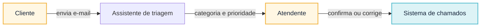
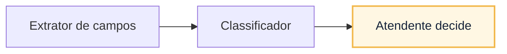
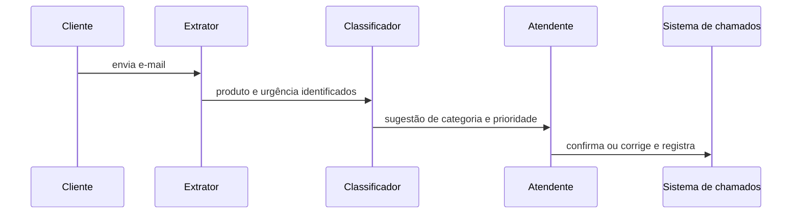
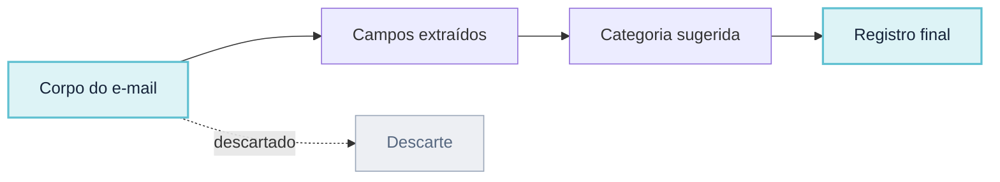
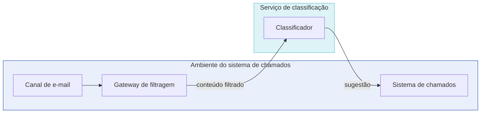

# Descrever o sistema antes da solução

O documento de arquitetura, as cinco visões mínimas e o vocabulário que sustenta qualquer decisão posterior.

Uma oportunidade não escolhe arquitetura. “Reduzir o tempo de preparação de contestações” ainda não informa quais dados podem circular, quem mantém a decisão, como a solução falha ou que resultado justificaria o investimento. O desenho começa ao tornar essas perguntas explícitas.

Neste curso, **Documento de Arquitetura de Software** é o conjunto mínimo de entradas, visões, análises, decisões e evidências que mantém o raciocínio conectado. Não é um documento normativo nem uma nova visão: é a organização didática da memória de por que uma estrutura foi escolhida e de que sinal exigirá revê-la.

## O Documento de Arquitetura de Software

Neste curso, chamaremos de **Documento de Arquitetura de Software** o pacote de trabalho produzido nesta etapa. O nome é uma convenção didática, não um tipo documental prescrito pelo mercado. O documento conecta oito campos que devem permanecer coerentes:

1. oportunidade, população, baseline e contramétricas;
2. hipótese de valor e atividades que continuam humanas;
3. CONOPS, exceções e modos operacionais;
4. stakeholders, fronteiras e fora de escopo;
5. objetivos de negócio, produto, dados e IA;
6. requisitos arquiteturalmente significativos e cenários de qualidade;
7. alternativas, responsabilidades adicionais e decisões rejeitadas;
8. evidências, experimento inicial, ADRs e gatilhos de revisão.

O modelo de IA é apenas um candidato dentro desse documento. Uma decisão é boa quando o contexto, as alternativas, as consequências e a evidência necessária podem ser explicados sem recorrer à preferência por uma tecnologia.

## Como uma descrição arquitetural é organizada

Arquitetura é o conjunto de estruturas necessárias para raciocinar sobre o sistema; **descrição arquitetural** é a forma usada para comunicá-las. Confundir o sistema com um desenho específico leva a dois erros: acreditar que um diagrama representa tudo ou tratar qualquer artefato do projeto como modelo arquitetural.

Use o vocabulário abaixo:

- **Stakeholder** é a pessoa, grupo ou organização que tem interesse ou responsabilidade em relação ao sistema.
- **Preocupação** (*concern*) é um interesse relevante para um ou mais stakeholders, como privacidade, recuperação de falha ou contestabilidade.
- **Ponto de vista** (*viewpoint*) define propósito, público, convenções e tipos de modelo usados para tratar determinadas preocupações.
- **Visão** (*view*) representa este sistema segundo um ponto de vista. Uma visão pode combinar texto, tabelas e diagramas.
- **Modelo arquitetural** representa um aspecto específico da arquitetura dentro de uma ou mais visões, como relações entre responsabilidades ou alocação de componentes em ambientes.
- **Cenário de qualidade** especifica como o sistema deve responder a um estímulo sob determinada condição. É entrada para análise e verificação, não uma visão da arquitetura.
- **ADR** registra uma decisão arquitetural e seu racional. É memória de decisão, não modelo do sistema.

O documento organiza esses elementos em cinco grupos:

| Grupo | Conteúdo | Pergunta |
|---|---|---|
| Entradas da análise | stakeholders, preocupações, objetivos, restrições, premissas, CONOPS e cenários de qualidade | O que orienta e limita o desenho? |
| Descrição arquitetural | visões de contexto, responsabilidades, interação, informação e implantação | Que estruturas respondem às preocupações? |
| Análise arquitetural | RAS, táticas, sensibilidades, trade-offs, riscos e alternativas | Por que essa estrutura é adequada? |
| Registros de decisão | ADRs e alternativas rejeitadas | O que foi escolhido e por quê? |
| Evidências | experimentos, medições e critérios de aceitação | O que sustenta ou refuta a escolha? |

### Cinco visões mínimas

Não existe uma quantidade universal de visões. Para o desenho conceitual de uma solução de IA generativa, estas cinco costumam revelar as decisões iniciais:

| Visão | Preocupações atendidas | Modelos ou representações úteis |
|---|---|---|
| Contexto | atores, sistemas externos, responsabilidades organizacionais e fronteiras de confiança | mapa de contexto e tabela de dependências |
| Responsabilidades | decomposição, autoridade, coesão e acoplamento | mapa de responsabilidades e contratos conceituais |
| Interação | ordem, estados, efeitos, exceções e recuperação | sequência normal, degradada e bloqueada |
| Informação | origem, classificação, finalidade, transformação, proveniência, retenção e descarte | fluxo e ciclo de vida dos dados |
| Implantação | alocação em ambientes, regiões e provedores; identidades, redes e dependências operacionais | mapa de implantação e fronteiras tecnológicas |

O ponto de vista deve declarar o que deixa de fora. A visão de contexto não explica a ordem de uma chamada; a visão de interação não mostra onde o dado é armazenado; a visão de implantação não atribui autoridade humana.

### Exemplo concreto das cinco visões

Considere um assistente simples: ele sugere categoria e prioridade de chamados de suporte técnico recebidos por e-mail; um atendente humano confirma ou corrige antes do registro. As cinco visões abaixo descrevem esse mesmo assistente, cada uma sob uma preocupação distinta. Nos diagramas, o preenchimento âmbar marca quem decide (papel humano) e o preenchimento ciano marca dado ou registro persistido; componentes automatizados permanecem sem preenchimento adicional.

#### Contexto

**Equivalente textual.** O cliente envia o e-mail; o assistente sugere categoria e prioridade; o atendente confirma ou corrige antes de o sistema de chamados registrar o caso. A fronteira de confiança fica entre o e-mail recebido, não confiável, e o chamado registrado, confiável porque passou por confirmação humana.

#### Responsabilidades

**Equivalente textual.** O extrator apenas identifica campos no texto; o classificador apenas sugere categoria e prioridade a partir desses campos; a decisão e o registro pertencem ao atendente. Nenhum dos dois componentes automatizados grava o chamado por conta própria.

#### Interação

**Equivalente textual.** O e-mail chega ao extrator, que identifica os campos; o classificador propõe categoria e prioridade; o atendente confirma ou corrige; o sistema de chamados registra o resultado. Se o extrator não encontrar campos suficientes, o classificador não sugere nada e o atendente preenche manualmente.

#### Informação

**Equivalente textual.** O dado de entrada é o corpo do e-mail, que pode conter dado pessoal do cliente; o texto bruto não é retido além da sessão de triagem. A sugestão do classificador e a decisão final do atendente são registradas com data e responsável, para permitir auditoria posterior.

#### Implantação

**Equivalente textual.** O classificador roda como um serviço interno, chamado pelo sistema de chamados através de um gateway. Não existe caminho em que o conteúdo do e-mail chegue ao classificador sem passar por esse gateway, que aplica filtragem antes da chamada.

Nenhuma dessas visões, isolada, descreve o assistente por completo: juntas, elas cobrem contexto, responsabilidade, sequência, dado e ambiente de execução.

### Correspondências entre visões

As visões são complementares, mas precisam descrever o mesmo sistema. **Correspondência** é uma relação que permite verificar essa coerência. Adote pelo menos estas regras:

1. todo ator ou sistema externo usado numa interação aparece na visão de contexto;
2. todo passo da interação tem uma responsabilidade e um responsável;
3. todo dado criado, transformado, persistido ou enviado aparece na visão de informação;
4. todo componente executável e repositório de dados é alocado na visão de implantação;
5. toda travessia de fronteira de confiança tem controle e evidência associados;
6. todo RAS chega a uma ou mais táticas, a elementos afetados nas visões e a um método de verificação;
7. toda ADR referencia as preocupações, RAS e visões que motivou ou alterou.

Uma inconsistência entre visões é um defeito arquitetural do material, mesmo que cada diagrama pareça correto isoladamente.

### Vocabulário para iniciar o documento

- **População** é o conjunto de pessoas, casos ou situações para o qual a decisão vale; não é apenas o número de usuários que acessou uma demonstração.
- **Baseline** é a medida inicial do processo atual, usada como comparação. Exemplo: a mediana atual de preparação de um caso é 22 minutos.
- **Hipótese de valor** relaciona uma mudança a um resultado esperado e verificável: “se reduzirmos a busca manual com fontes rastreáveis, o tempo de preparação cairá sem piorar a qualidade”. Ela ainda não é uma conclusão.
- **Contramétrica** mede um efeito indesejado que pode crescer enquanto a métrica principal melhora. Se o objetivo é reduzir tempo, devoluções, erros materiais, exposição de dados ou abandono podem ser contramétricas. Ela impede declarar sucesso apenas porque uma medida subiu ou caiu na direção desejada.
- **Evidência** é um registro usado para sustentar ou refutar uma hipótese ou decisão: resultado de teste, caso revisado, restrição confirmada, dado de operação ou parecer especializado. Uma demonstração isolada é evidência fraca, não prova geral.
- **Gatilho de revisão** é a condição observável que obriga a reexaminar uma decisão, como a cobertura de fonte cair abaixo do limite, mudar a política aplicável ou surgir uma nova classe de dado.
- **Finalidade** é o uso autorizado para um dado ou capacidade. Ter acesso técnico não autoriza reutilizar informação para outro objetivo.
- **Limiar** é o valor que separa resultado aceitável de resultado que exige ação; **falha intolerável** é um evento que bloqueia a decisão mesmo quando as demais medidas parecem boas.
- **Reversibilidade** é a capacidade de voltar a um estado seguro ou limitar o efeito de uma escolha. Nem toda consequência pode ser desfeita; nesses casos, o documento precisa reduzir escopo ou exigir aprovação antes do efeito.
- **ADR** (*Architecture Decision Record*) registra contexto, alternativas, decisão, consequências, evidências e gatilhos de revisão para uma escolha arquitetural relevante.

## 1. Descrever o sistema antes da solução

Uma equipe pode querer reduzir busca e consolidação sem delegar decisão ou registro ao modelo. Ela começa por população, baseline, contramétricas, atividades humanas, CONOPS, fronteiras e fora de escopo. Esses elementos delimitam o problema; nenhuma escolha de modelo é necessária nesse momento.

Para enxergar o caso por ângulos distintos, a equipe produz visões complementares e conserva os artefatos que as orientam:

| Categoria | Artefato | Pergunta respondida |
|---|---|---|
| Entrada | Cenário operacional | Como o trabalho ocorre em situação normal, degradada e bloqueada? |
| Visão | Contexto | Quem interage com o sistema e quais fronteiras ele atravessa? |
| Visão | Responsabilidades | Quem coleta, seleciona, gera, valida, decide e registra? |
| Visão | Interação | Em que ordem informação, decisão e efeito atravessam fronteiras? |
| Visão | Informação | De onde vem o dado, como muda, onde persiste e quando é descartado? |
| Visão | Implantação | Onde componentes e dados executam e que fronteiras tecnológicas atravessam? |
| Entrada da análise | Cenário de qualidade | Como o sistema deve responder a um estímulo sob uma condição? |
| Registro | ADR | Por que uma direção foi escolhida e quando será revista? |

*Figura — Entradas orientam cinco visões complementares; análise liga RAS a táticas e riscos; ADRs e evidências preservam a decisão e alimentam sua revisão.*

A visão de contexto não explica o comportamento degradado; uma sequência não mostra onde o dado persiste; uma ADR não substitui nenhuma das visões. O conjunto evita que um único diagrama receba perguntas que não consegue responder.

Antes de desenhar, declare o ponto de vista: preocupações atendidas, público, convenções e informação excluída. Depois verifique correspondências. Se a interação consulta uma política, a política precisa existir no contexto, ter ciclo de vida na visão de informação, responsável na visão de responsabilidades e alocação na visão de implantação.
