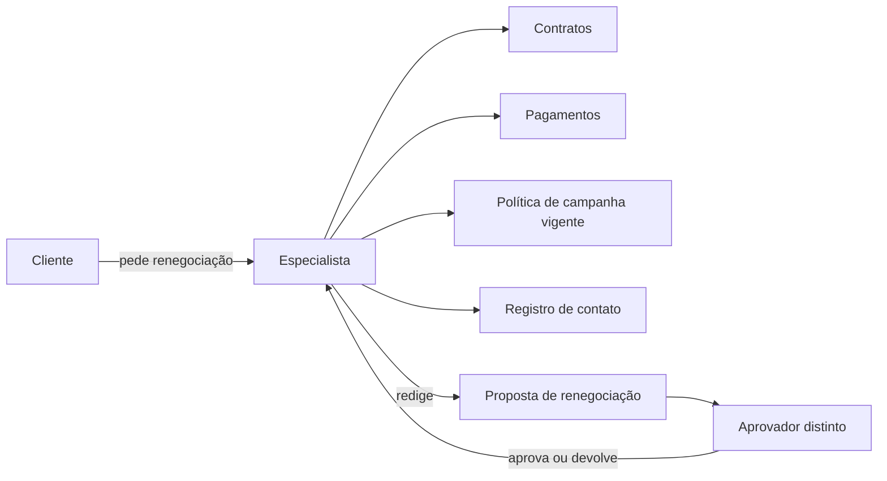

# Caso de transferência: Central Aurora de renegociação

Este caso transfere o método usado no Banco Lume para outro domínio. Sua tarefa não é reproduzir a arquitetura anterior, mas construir a mesma classe de descrição e análise a partir de evidências incompletas. Leia tudo antes de escolher uma direção.

## Contexto

A Cooperativa Aurora atende pessoas que pedem renegociação de crédito pelos canais digitais e por agências. Um especialista consulta contratos, pagamentos, políticas de campanha e registros de contato; depois redige uma proposta para aprovação. A diretoria quer reduzir o tempo de preparação e tornar a explicação mais consistente. Uma demonstração recente de modelo gerou uma carta convincente a partir de três documentos, e o patrocinador passou a chamar a iniciativa de “agente de renegociação”.

O processo envolve dados sensíveis: renda, saldo, atraso, eventos familiares informados em atendimento e avaliações internas. Parte das regras vem de sistemas legados sem API moderna; algumas consultas só aceitam arquivos em lote, outra interface responde em média em quatro segundos e não oferece idempotência para gravação. Uma modernização está planejada, mas não financiada.

Política interna estabelece **revisão humana obrigatória** por especialista e aprovação por pessoa distinta antes de qualquer oferta. O sistema não pode alterar contrato, limite, taxa ou status do cliente. Comunicações externas usam uma plataforma separada e ficam fora do primeiro incremento.

### O processo hoje

**Equivalente textual.** O especialista recebe o pedido do cliente e consulta, manualmente, contratos, pagamentos, política de campanha vigente e registro de contato antes de redigir a proposta; um aprovador distinto decide antes de qualquer oferta. Nenhuma composição de IA generativa está representada aqui — este é o processo hoje, o material a partir do qual as quatro direções candidatas devem ser comparadas.

## Situação observada

Em uma amostra de 180 solicitações:

- mediana de preparação: 31 minutos; p90: 74 minutos;
- 42% do tempo foi classificado pelos especialistas como busca e transcrição;
- 11% das propostas voltaram por documento ausente ou política incorreta;
- 3% continham divergência de valor copiado, corrigida antes do envio;
- casos de três campanhas diferentes foram misturados na amostra;
- não há medição confiável da satisfação do cliente com a explicação;
- a concordância entre dois especialistas sobre “melhor proposta” foi 76% em 50 casos.

Os dados não isolam causa: tempo foi autorrelatado e complexidade pode estar desigual. A demonstração usou documentos escolhidos e não testou autorização, ausência, indisponibilidade ou conflito.

## Stakeholders e restrições confirmadas

| Stakeholder | Preocupação declarada |
|---|---|
| Especialista | reduzir transcrição sem perder controle e contexto do relacionamento |
| Aprovador | comparar proposta, regra aplicável, cálculos e exceções |
| Cliente | receber condição correta, explicação compreensível e canal de contestação |
| Crédito e Jurídico | preservar política vigente, alçadas e tratamento equitativo |
| Privacidade | finalidade, minimização, retenção e separação entre cooperados |
| Segurança | nenhuma instrução em documento pode autorizar consulta ou gravação |
| Operações | sobreviver às janelas e erros dos sistemas legados |
| Auditoria | reconstruir dados, regras, versões, proposta e intervenções humanas |

**Restrições confirmadas:**

- revisão humana obrigatória;
- segregação entre quem propõe e quem aprova;
- nenhuma gravação por modelo;
- residência nacional dos dados classificados;
- retenção de conteúdo de inferência por no máximo 24 horas;
- rastreabilidade da versão de política;
- suporte ao fluxo manual durante indisponibilidade.

**Preferências ainda não confirmadas:**

- usar um único produto;
- entregar em oito semanas;
- evitar qualquer componente autogerido;
- incluir todas as campanhas na primeira versão.

## Cenários que a arquitetura deve enfrentar

| # | Cenário | O que acontece |
|---|---|---|
| 1 | Caso normal | especialista autorizado abre solicitação, consulta informações, prepara proposta, corrige e envia para aprovação |
| 2 | Políticas conflitantes | duas fontes vigentes parecem indicar condições diferentes; o sistema deve expor conflito, não escolher silenciosamente |
| 3 | Dado sensível excessivo | anotação livre contém informação sem finalidade para renegociação |
| 4 | Sistema legado indisponível | saldo atualizado não pode ser obtido; valores armazenados podem estar desatualizados |
| 5 | Pedido fora do escopo | usuário solicita que o sistema "aplique a melhor taxa" ou envie a oferta |
| 6 | Evidência insuficiente | contrato está ilegível ou campanha não possui política aprovada |
| 7 | Correção humana | especialista altera justificativa ou valor; a arquitetura deve registrar motivo sem presumir que a correção é dado de treinamento |

## Quatro direções candidatas

Você deve comparar pelo menos estas direções. É permitido recomendar uma composição ou uma etapa convencional antes de qualquer capacidade generativa. A tabela organiza o que já se sabe sobre cada uma — ela não aponta qual escolher.

| Direção | Mecanismo | Quando poderia ajudar | Responsabilidade adicional |
|---|---|---|---|
| **A. Automação convencional** | adaptadores coletam campos, regras calculam alternativas elegíveis, template monta a proposta; texto livre permanece humano | quando previsibilidade e validação numérica pesam mais que a síntese de texto heterogêneo | representar todas as campanhas e exceções em regra |
| **B. Copiloto com contexto** | sistema seleciona por regras a ficha do caso e a política correspondente; modelo propõe resumo e explicação; especialista revisa | quando o espaço de busca é redutível a um escopo controlado e mapeável | manter mapeamento explícito entre categoria e fonte |
| **C. RAG** | pipeline mantém políticas e manuais pesquisáveis; consulta recupera trechos autorizados; modelo produz rascunho com fontes | quando o corpus é amplo, mutável, ou exige proveniência granular | ingestão, segmentação, recuperação, atualização e avaliação próprias |
| **D. Agente com ferramentas** | modelo escolhe quais sistemas consultar e em que ordem, usando ferramentas somente de leitura; propõe um dossiê | quando o caminho de consulta varia por caso de forma não enumerável | autonomia, trajetórias, contratos, orçamento de etapas, superfície de falha adicional |

Gravação continua proibida em qualquer direção — inclusive na D, onde as ferramentas são somente de leitura.

## Critérios mínimos de comparação

Construa uma matriz que trate, no mínimo:

- aderência à hipótese de valor e às restrições;
- previsibilidade da coleta e do cálculo;
- qualidade e atualização do conhecimento;
- proveniência e explicação ao especialista;
- prioridade de características, tensão aceita, medida e responsável;
- autorização, minimização e residência;
- comportamento com conflito, ausência e indisponibilidade;
- esforço de integração com sistemas legados;
- latência, custo e complexidade operacional;
- avaliação necessária antes e depois da liberação;
- reversibilidade e dependência de fornecedor.

Não use rótulos como “baixo”, “médio” e “alto” sem explicar o mecanismo causal. Por exemplo, “agente tem risco alto” é fraco; “o planejador escolhe sequências não enumeradas, por isso exige autorização por ferramenta, limite de passos e avaliação de trajetórias” é analisável.

## Incógnitas que exigem descoberta

Antes de decidir, formule perguntas e experimentos. Considere:

- quantos tipos de caso possuem sequência estável e quantos exigem investigação aberta?
- os 42% de busca e transcrição caem com melhor integração sem geração?
- políticas possuem metadados confiáveis de vigência, campanha e público?
- especialistas concordam em critérios de qualidade para resumo e explicação?
- que campos podem atravessar a fronteira de inferência depois de minimização?
- o sistema legado suporta consultas adicionais no volume previsto?
- qual falha individual seria intolerável mesmo com boa média?

## Entregável

Prepare uma proposta de desenho conceitual com:

1. oportunidade reformulada, baseline e hipótese de valor;
2. critérios de adequação ou rejeição de GenAI por atividade;
3. CONOPS com modo normal, degradado e bloqueado;
4. fronteiras, fora de escopo e matriz de responsabilidade humano–IA;
5. quatro objetivos separados: negócio, produto, dados e IA;
6. três requisitos arquiteturalmente significativos no formato de cenário, incluindo um de proveniência;
7. matriz das quatro direções e recomendação por incremento;
8. visões de contexto, responsabilidades, interação, informação e implantação, com equivalentes textuais;
9. verificação de correspondência entre participantes, passos, dados, alocação, RAS e controles;
10. árvore de utilidade reduzida com três cenários prioritários, táticas, sensibilidades, trade-offs e riscos;
11. uma ADR proposta, com visões afetadas, evidências faltantes e gatilhos de revisão;
12. experimento mais barato capaz de refutar a hipótese central.

Sua proposta pode concluir que o primeiro incremento não deve usar IA generativa. Separe fatos, premissas, incertezas, riscos e dependências. O julgamento será avaliado pela coerência entre problema, visões, análise, alternativas, evidências e decisão — não pela quantidade de componentes de IA.

Depois de elaborar o caso, prossiga para a [síntese e referências](sintese-e-referencias.md).
