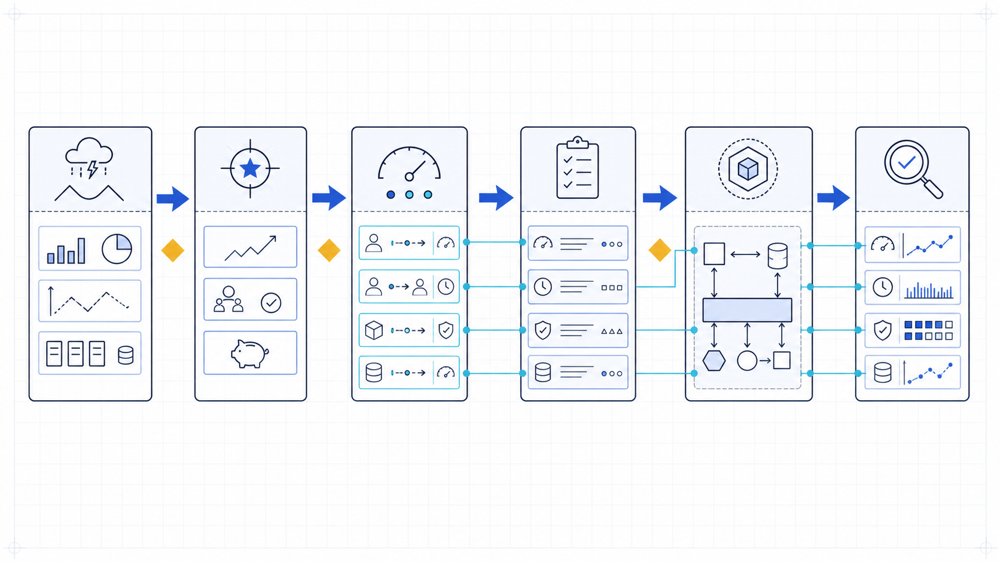
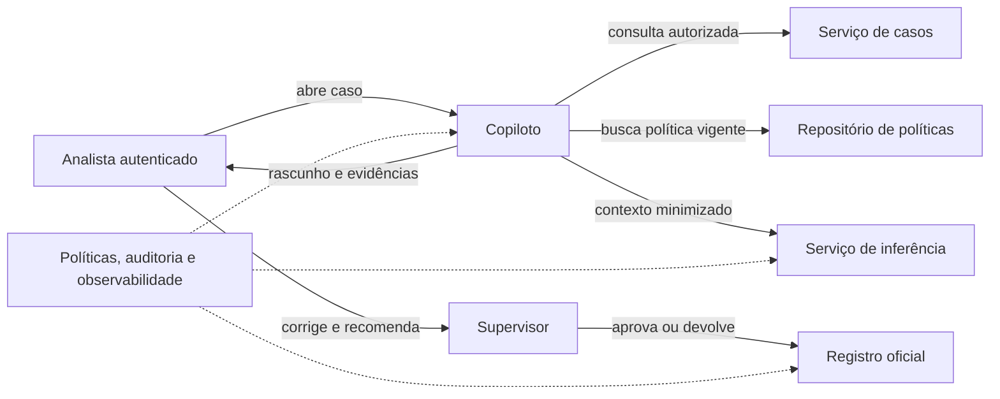
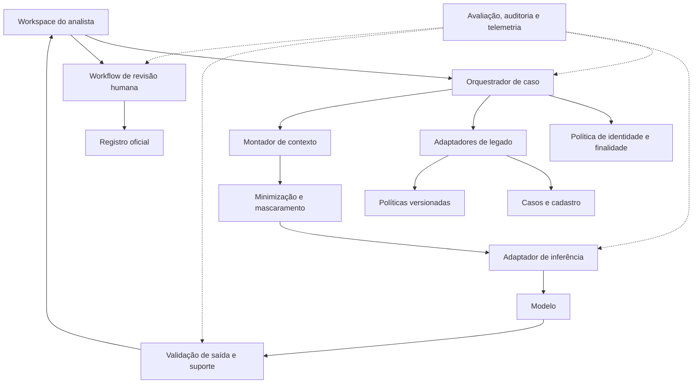
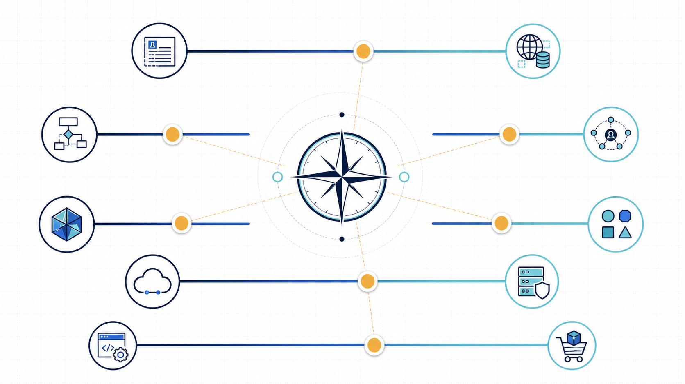

# Exemplo arquitetural: copiloto de contestações do Banco Lume

Este exemplo percorre a rastreabilidade de uma decisão sem apresentar uma arquitetura universal. Os números são metas de desenho a validar, não resultados de produção. O primeiro incremento cobre apenas contestações de compra não reconhecida em contas individuais; qualquer decisão e comunicação externa continuam humanas.

*Figura 1 — A oportunidade só chega à arquitetura depois de atravessar hipóteses e critérios verificáveis; cada mecanismo deve conservar a ligação com seu direcionador.*

## 1. Objetivo e hipótese de valor

**Baseline:** analistas gastam mediana de 22 minutos preparando um caso; supervisores devolvem 8% por evidência incompleta; 4% ultrapassam o prazo interno.

**Objetivo de negócio:** reduzir a mediana para 15 minutos e a cauda p90 para 28 minutos, sem elevar devolução, erro material, exposição de dados ou casos fora do prazo.

**Hipótese de valor:** se o sistema reunir dados autorizados, localizar política vigente e apresentar um rascunho rastreável, o analista reduzirá busca e consolidação manuais sem delegar julgamento.

**Experimento inicial:** 120 casos históricos desidentificados, estratificados por complexidade, executados em modo sombra. Analistas comparam fluxo atual e proposta sem alterar decisões. A hipótese avança apenas se tempo cair ao menos 20%, cobertura de evidência não piorar e nenhum critério intolerável ocorrer.

## 2. Contexto, fronteiras e fluxo

**Equivalente textual 1:** o analista autenticado abre um caso no copiloto. O copiloto consulta o serviço de casos e o repositório de políticas sob a identidade e a finalidade autorizadas, minimiza o contexto e solicita um rascunho ao serviço de inferência. O analista inspeciona fontes, corrige e recomenda; o supervisor aprova ou devolve antes de qualquer gravação oficial. Políticas, auditoria e observabilidade atravessam copiloto, inferência e registro. O modelo não acessa sistemas legados nem grava decisões diretamente.

As fronteiras críticas são: organização–fornecedor de inferência; identidade do analista–dados de outros clientes; conteúdo de política–instruções da aplicação; proposta–decisão oficial. O fora de escopo inclui alteração cadastral, bloqueio de cartão, comunicação ao cliente, casos empresariais e aprendizado automático com correções.

## 3. Cenários arquiteturalmente significativos

### Fundamentação

- **Fonte:** analista autorizado.
- **Estímulo:** solicita rascunho para caso elegível.
- **Ambiente:** políticas e sistemas legados disponíveis.
- **Artefato:** coleta de dados, seleção de política e geração.
- **Resposta:** apresenta apenas afirmações materiais ligadas a evidências identificadas; declara lacunas.
- **Medida:** em 300 casos de aceitação, pelo menos 95% das afirmações materiais têm suporte correto e nenhum caso crítico sem suporte recebe recomendação conclusiva.

### Privacidade

- **Fonte:** caso contendo dados pessoais e financeiros.
- **Estímulo:** o fluxo prepara contexto para inferência.
- **Ambiente:** operação normal e diagnóstico.
- **Artefato:** conectores, orquestrador, contexto, logs e fornecedor.
- **Resposta:** aplica seleção por finalidade, minimização e mascaramento; impede dado de outra identidade e não registra conteúdo cru em telemetria.
- **Medida:** 100% dos campos classificados recebem tratamento; zero exposição cruzada no conjunto adversarial; rastros preservam identificadores técnicos sem conteúdo proibido.

### Confiabilidade e revisão

- **Fonte:** dependência externa.
- **Estímulo:** retorna timeout por 10 segundos.
- **Ambiente:** carga normal com caso em edição.
- **Artefato:** orquestração e interface.
- **Resposta:** interrompe geração, preserva o trabalho, oferece fontes e fluxo manual e não multiplica gravações.
- **Medida:** modo degradado disponível em até 3 segundos após timeout; zero perda de edição e zero decisão oficial sem revisão do supervisor.

## 4. Vista de componentes

**Equivalente textual 2:** o workspace chama o orquestrador. Antes de cada consulta, a política de identidade e finalidade restringe o acesso. Adaptadores encapsulam diferenças dos sistemas de caso, cadastro e política. O montador de contexto seleciona dados; minimização e mascaramento antecedem o adaptador de inferência. A saída do modelo passa por validação de estrutura e suporte antes de voltar ao workspace. Um workflow separado exige revisão humana antes do registro oficial. Avaliação, auditoria e telemetria observam orquestração, inferência, validação e aprovação.

*Figura 2 — As decisões são eixos relacionados, mas independentes: escolher RAG não exige agente, e usar serviço hospedado não determina comprar toda a aplicação.*

### Responsabilidades por componente

| Componente | Responsabilidade | O que deliberadamente não faz |
|---|---|---|
| Política de identidade e finalidade | autoriza sujeito, caso, campo e operação | não delega autorização ao prompt |
| Adaptadores de legado | normalizam contratos, erros e versões | não expõem interfaces internas ao modelo |
| Montador de contexto | seleciona evidência e preserva origem | não decide o mérito da contestação |
| Modelo | propõe síntese conforme contexto | não consulta nem grava sistemas |
| Validação | verifica esquema, referências e regras de escopo | não transforma fluência em evidência |
| Workflow humano | registra correção, recomendação e aprovação | não reduz revisão a clique automático |

## 5. Cenários de falha e contenção

### Dados sensíveis atravessam a fronteira errada

**Detecção:** teste de contrato e política identifica campo proibido antes da chamada; telemetria registra classe e regra, não o valor. **Contenção:** bloqueio fechado, descarte do contexto e encaminhamento manual. **Recuperação:** investigar origem, corrigir mapeamento, reexecutar suíte de privacidade e revisar casos potencialmente afetados. Mascarar depois do envio seria tarde demais.

### Indisponibilidade do modelo

**Detecção:** timeout e circuito aberto no adaptador de inferência. **Contenção:** não repetir indefinidamente; preservar caso e disponibilizar política e dados já autorizados sem resumo. **Recuperação:** sondagem fora do caminho crítico, retorno gradual e comunicação clara. Um modelo alternativo só pode ser fallback se passou pelos mesmos critérios daquela categoria.

### Resposta sem suporte suficiente

**Detecção:** referência ausente, evidência contraditória ou cobertura abaixo do limiar. **Contenção:** substituir recomendação conclusiva por declaração de insuficiência, destacar lacunas e exigir investigação do analista. **Recuperação:** classificar se a causa foi fonte, seleção, contexto, instrução ou modelo; corrigir o componente responsável e adicionar o caso ao conjunto de regressão.

## 6. Registros de decisão

### ADR-001 — Adotar workflow assistivo sem autonomia de ferramentas

#### Status

Aceita para o primeiro incremento; revisão após experimento em modo sombra.

#### Contexto

As etapas são conhecidas, os sistemas são legados e qualquer decisão exige analista e supervisor. A proposta inicial do patrocinador era um agente que consultasse e atualizasse tudo.

#### Direcionadores da decisão

- revisão humana obrigatória e segregação de funções;
- rastreabilidade de cada transição;
- nenhuma gravação iniciada pelo modelo;
- degradação para trabalho manual durante falhas.

#### Opções

1. Automação convencional de coleta e regras, sem geração.
2. Workflow definido com geração apenas para rascunho.
3. Agente que escolhe consultas e atualiza sistemas sob aprovação.

#### Decisão

Adotar opção 2. O orquestrador define consultas e transições; o modelo apenas sintetiza contexto preparado. Gravação oficial pertence ao workflow humano.

#### Consequências

Ganhamos caminhos enumeráveis, testes por etapa e menor superfície de ação. Mantemos código de orquestração e não exploramos estratégias autônomas em casos fora do fluxo. Casos não enumerados são encaminhados, não improvisados.

#### Evidências

O processo atual possui sequência estável e a revisão é restrição confirmada. O ganho da síntese ainda é hipótese a medir em 120 casos sombra.

#### Gatilhos de revisão

- mais de 20% dos casos elegíveis exigirem sequências não modeladas;
- novo efeito autônomo ser legal e operacionalmente autorizado;
- experimento demonstrar valor adicional de planejamento com zero violação crítica e custo justificável.

### ADR-002 — Usar contexto selecionado antes de implantar RAG completo

#### Status

Proposta experimental.

#### Contexto

O primeiro escopo usa uma ficha estruturada e doze políticas curtas versionadas. RAG ampliaria a cobertura futura, mas acrescentaria ingestão, índice e avaliação de recuperação antes de haver evidência de necessidade.

#### Direcionadores da decisão

- política vigente e citável;
- autorização e minimização antes da inferência;
- prazo curto para validar hipótese de valor;
- preparação para corpus maior sem antecipar operação desnecessária.

#### Opções

1. Prompt com toda informação disponível sem seleção.
2. Contexto selecionado deterministicamente por categoria e vigência.
3. RAG com recuperação e avaliação separada.
4. Fine-tuning com políticas.

#### Decisão

Experimentar opção 2. Adaptadores obtêm campos permitidos e a política correspondente; o montador conserva identificadores de origem. Definir interface de evidência que possa receber recuperação no futuro, sem criar índice agora.

#### Consequências

Reduzimos componentes e isolamos a hipótese de síntese. A cobertura permanece limitada às categorias mapeadas e a seleção exige manutenção de regras. Fine-tuning não é usado como armazenamento factual.

#### Evidências

Inventário confirma doze políticas e mapeamento unívoco nas categorias iniciais. Ainda faltam resultados de qualidade, latência e custo; por isso o status não é aceito para produção.

#### Gatilhos de revisão

- corpus superar o limite operacional de seleção explícita;
- categorias dependerem de pesquisa em múltiplos documentos;
- cobertura de evidência ficar abaixo de 95% apesar de fontes disponíveis;
- necessidade de autorização ou proveniência granular justificar recuperação.

## 7. Leitura da rastreabilidade

O objetivo de tempo justifica pré-coleta e síntese; a contramétrica de devolução justifica cobertura de evidência; privacidade justifica política antes dos conectores e minimização antes da inferência; revisão obrigatória justifica separar proposta de registro; indisponibilidade do legado justifica modo degradado. Nenhum componente existe “porque soluções de IA têm essa caixa”.

O próximo caso remove parte da evidência confortável e exige que você compare quatro direções antes de recomendar uma.

**Próxima página:** [Estudo de caso](estudo-de-caso.md).
