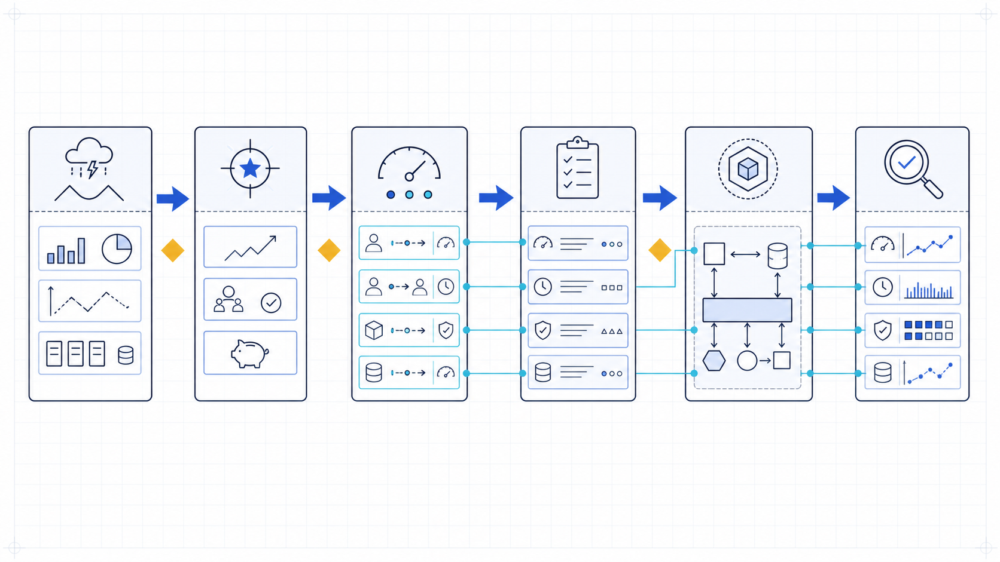
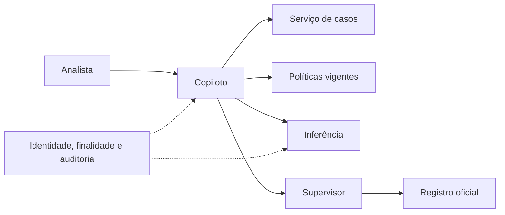
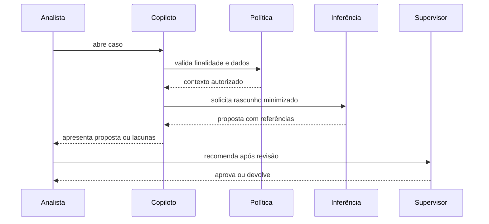
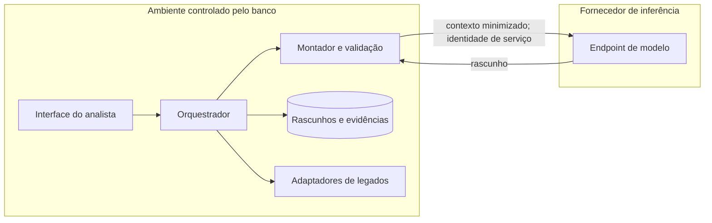

# Exemplo de Documento de Arquitetura de Software: Banco Lume

Este exemplo mostra como uma oportunidade vira desenho arquitetural. Ele não é uma implementação pronta: cada escolha permanece condicional às evidências descritas ao final.

*Figura — O documento mantém rastreável o caminho do problema até a decisão estrutural e sua evidência.*

## 1. Oportunidade, baseline e hipótese

Analistas preparam contestações de compra não reconhecida consultando casos, cadastro e políticas. A mediana é de 22 minutos; 8% dos casos voltam por evidência incompleta e 4% ultrapassam o prazo interno. A redução de tempo é a métrica principal; devolução, erro material, exposição de dados e atraso são **contramétricas**.

A hipótese é: se dados autorizados e política vigente forem reunidos em um rascunho rastreável, o analista reduzirá busca e transcrição sem delegar julgamento, aprovação ou comunicação externa.

O primeiro experimento usa 120 casos desidentificados em **modo sombra**. A proposta roda em paralelo, mas não altera registro ou decisão. Ela só avança se reduzir o tempo em 20%, não piorar cobertura de evidência e não produzir falha intolerável.

## 2. CONOPS e limites

No modo normal, o analista abre um caso, recebe um rascunho com evidências, corrige e recomenda; o supervisor aprova ou devolve antes do registro oficial. No modo degradado, o sistema preserva o trabalho e apresenta fontes já autorizadas sem síntese. No modo bloqueado, ausência de finalidade, autorização ou evidência suficiente interrompe a proposta e orienta o fluxo manual.

Ficam fora de escopo: alteração cadastral, bloqueio de cartão, comunicação ao cliente, casos empresariais e aprendizagem automática a partir de correções. O modelo não acessa legados nem grava decisões.

## 3. Cinco visões arquiteturais

Cada visão declara uma pergunta e deixa as demais para outras representações. O conjunto descreve o mesmo sistema sob preocupações diferentes.

### Contexto

Este modelo representa quem interage com o copiloto e onde ficam as fronteiras de autoridade e confiança — não a ordem das chamadas nem onde o dado é armazenado.

```mermaid
flowchart LR
    A[Analista] --> C[Copiloto]
    C --> S[Serviço de casos]
    C --> P[Políticas vigentes]
    C --> I[Inferência]
    C --> U[Supervisor]
    U --> R[Registro oficial]
    G[Identidade, finalidade e auditoria] -.-> C
    G -.-> I
```

**Equivalente textual.** O copiloto recebe a solicitação autenticada, consulta somente dados e políticas autorizados e envia contexto minimizado à inferência. O supervisor é a fronteira entre proposta e registro oficial. A organização controla política, identidade e auditoria; o fornecedor de inferência não decide finalidade nem autorização.

### Responsabilidades

Este modelo representa como o trabalho é decomposto entre componentes conceituais e, para cada um, o limite explícito do que ele não tem autoridade para decidir.

| Responsabilidade | Componente conceitual | Não pode decidir |
|---|---|---|
| selecionar dados e política | montador de contexto | mérito da contestação |
| minimizar e mascarar | fronteira de dados | ampliar finalidade |
| gerar rascunho | serviço de inferência | acessar legado ou registrar decisão |
| validar suporte e escopo | validação | aprovar caso |
| recomendar e aprovar | analista e supervisor | delegar responsabilidade ao modelo |

### Interação: sequência e falha

Este modelo representa a ordem normal de execução entre os participantes e os pontos em que uma falha interrompe o fluxo automático, não a estrutura dos componentes.

O analista abre o caso; identidade e finalidade filtram consultas; o montador seleciona dados e política; a inferência devolve rascunho; validação exige referências e comunica lacunas; o analista revisa; o supervisor aprova ou devolve. Se política ou inferência falhar, o sistema não inventa uma resposta: preserva o trabalho e oferece a consulta manual.

```mermaid
sequenceDiagram
    participant A as Analista
    participant C as Copiloto
    participant P as Política
    participant I as Inferência
    participant S as Supervisor
    A->>C: abre caso
    C->>P: valida finalidade e dados
    P-->>C: contexto autorizado
    C->>I: solicita rascunho minimizado
    I-->>C: proposta com referências
    C-->>A: apresenta proposta ou lacunas
    A->>S: recomenda após revisão
    S-->>A: aprova ou devolve
```

**Equivalente textual.** A inferência ocorre somente depois da seleção autorizada; ela produz proposta, não decisão. A aprovação é uma atividade do supervisor fora do modelo.

Os três sinais de falha recebem contenção específica: **dados sensíveis** fora da finalidade bloqueiam a montagem de contexto; **indisponibilidade do modelo** preserva o caso e ativa a consulta manual; **resposta sem suporte** remove a recomendação conclusiva e destaca lacunas para investigação.

### Informação e ciclo de vida

Este modelo representa a origem, a transformação e o descarte de cada dado que atravessa o sistema, independentemente da ordem em que os componentes atuam sobre ele.

| Informação | Origem e autoridade | Transformação | Persistência e descarte |
|---|---|---|---|
| dados do caso | serviço de casos, finalidade contestação | seleção de campos e mascaramento | referência no rascunho; conteúdo temporário descartado ao encerrar |
| política | repositório oficial, dono da política | seleção por categoria e vigência | versão e trecho preservados com a recomendação |
| contexto de inferência | montador de contexto | composição de dados minimizados e evidências | não reutilizado para treinamento; expira após a execução |
| rascunho | serviço de inferência | validação de suporte e marcação de lacunas | editável até aprovação; versão final ligada às evidências |
| decisão oficial | supervisor | aprovação ou devolução | sistema de registro segundo retenção institucional |
| trace operacional | componentes do copiloto | redação de campos sensíveis e correlação | retenção mínima para diagnóstico e auditoria |

**Equivalente textual.** Dados do caso e políticas possuem autoridades diferentes. O montador cria um contexto derivado e minimizado; a inferência produz um rascunho, não um registro oficial. Origem, versão, transformação e uso formam a proveniência. Conteúdo temporário e trace seguem finalidades e prazos distintos.

### Implantação e fronteiras tecnológicas

Este modelo representa onde cada componente executa e qual fronteira tecnológica o contexto minimizado atravessa até o fornecedor de inferência — não quem decide nem em que ordem os dados são produzidos.

```mermaid
flowchart LR
    subgraph B["Ambiente controlado pelo banco"]
        UI[Interface do analista]
        O[Orquestrador]
        M[Montador e validação]
        D[(Rascunhos e evidências)]
        L[Adaptadores de legados]
        UI --> O
        O --> M
        O --> D
        O --> L
    end
    subgraph F["Fornecedor de inferência"]
        I[Endpoint de modelo]
    end
    M -->|contexto minimizado; identidade de serviço| I
    I -->|rascunho| M
```

**Equivalente textual.** Interface, orquestração, seleção, validação, rascunhos e adaptadores permanecem no ambiente controlado pelo banco. Somente contexto minimizado atravessa a fronteira do fornecedor por uma identidade de serviço dedicada. O endpoint não recebe credenciais de usuário nem acessa legados ou repositórios diretamente.

## 4. RAS que moldam a estrutura

| RAS | Escolha estrutural | Consequência e evidência |
|---|---|---|
| nenhum dado pessoal cru atravessa a inferência | fronteira de minimização antes do adaptador | campos proibidos bloqueados em teste; alguma latência adicional |
| afirmações materiais precisam de suporte | contexto preserva origem, versão e trecho | amostra revisada mede cobertura e declara lacunas |
| decisão oficial continua humana | workflow separa proposta, recomendação e aprovação | zero registro sem supervisor no modo sombra |
| dependência pode falhar | modo degradado preserva estado e fontes disponíveis | simulação de timeout sem perda de edição |

### Árvore de utilidade reduzida

| Objetivo e característica | Cenário priorizado | Tática e mecanismo | Sensibilidade, trade-off e risco |
|---|---|---|---|
| reduzir tempo sem expor dados — privacidade | ao montar contexto, nenhum campo proibido atravessa a inferência | minimização, mascaramento e autorização no montador | sensível à lista de campos; privacidade compete com cobertura; risco de remoção insuficiente ou excessiva |
| reduzir devoluções — fundamentação | toda afirmação material apresenta política vigente e trecho de suporte | vínculo afirmação–fonte, validação e abstenção | sensível ao limiar de suporte; cobertura compete com concisão; risco de referência apenas decorativa |
| preservar trabalho — confiabilidade | timeout de inferência mantém edição e oferece fluxo manual | timeout, estado persistido e degradação | sensível ao limite de tempo; disponibilidade compete com custo e espera; risco de duplicar tentativas |
| permitir troca — modificabilidade | substituir endpoint não altera workflow ou autorização | contrato estável e adaptador | sensível às diferenças semânticas entre modelos; portabilidade compete com acesso a recursos específicos |

### Correspondências verificadas

| Regra | Evidência no exemplo |
|---|---|
| participante da interação existe no contexto | analista, copiloto, política, inferência e supervisor aparecem nas duas visões |
| passo tem responsabilidade | seleção, geração, validação, recomendação e aprovação estão atribuídas |
| dado manipulado tem ciclo de vida | caso, política, contexto, rascunho, decisão e trace constam da visão de informação |
| componente executável tem alocação | interface, orquestrador, montador, adaptadores, repositório e endpoint constam da implantação |
| travessia de confiança tem controle | apenas contexto minimizado cruza a fronteira por identidade de serviço |
| RAS chega a tática e evidência | a tabela acima liga cenário, estrutura, consequência e teste |

## 5. Alternativas, riscos e decisão inicial

| Alternativa | Direcionador atendido | Responsabilidade adicional | Decisão neste incremento |
|---|---|---|---|
| Automação convencional | cálculo e coleta previsíveis | representar todas as exceções em regras | manter para cálculo; insuficiente para síntese de evidências |
| Contexto selecionado | ficha estruturada e doze políticas curtas | manter mapeamento de categoria, fonte e vigência | adotar |
| RAG | corpus amplo ou recuperação granular | ingestão, índice, autorização e avaliação de recuperação | adiar até a evidência justificar |
| Agente de leitura | sequência aberta com feedback confiável | contratos de ferramenta, orçamento e avaliação de trajetória | rejeitar: o fluxo é enumerável |
| Fine-tuning | comportamento repetido com exemplos curados | curadoria, reavaliação e ciclo de atualização | rejeitar: não resolve vigência de políticas |

A matriz torna a escolha verificável: contexto selecionado por regras atende o primeiro incremento; RAG permanece alternativa futura se a cobertura exceder seleção explícita ou exigir recuperação granular; agente é rejeitado porque não há efeito autônomo autorizado.

### Registro de risco e incerteza

| Tipo | Registro | Tratamento |
|---|---|---|
| Risco | mascaramento pode preservar identificador indireto | teste adversarial de campos e revisão de Privacidade antes do modo sombra |
| Risco | referência pode existir sem sustentar a afirmação | avaliação afirmação–fonte e abstenção abaixo do limiar |
| Premissa | doze políticas cobrem a categoria inicial | dono da política confirma corpus e vigência antes do experimento |
| Incerteza | revisão pode consumir o tempo economizado na busca | medir tempo por atividade e taxa de correção no modo sombra |
| Dependência | fornecedor deve cumprir residência e não treinamento | validar contrato e configuração antes de enviar qualquer dado |

### ADR-001 — Workflow assistivo, sem ferramentas autônomas

**Contexto.** O objetivo é reduzir busca e consolidação, não automatizar a decisão sobre a contestação. Revisão por analista e aprovação por supervisor são restrições confirmadas; gravação e comunicação externa pelo modelo estão fora de escopo. A sequência atual — consultar, sintetizar, revisar e aprovar — é conhecida e repetível.

**Opções avaliadas.** A automação convencional preservaria todo o fluxo, mas não atenderia bem à síntese de justificativas e documentos heterogêneos. Um workflow assistivo manteria transições e efeitos determinísticos, usando geração apenas no rascunho. Um agente de leitura poderia decidir a ordem de consultas, mas acrescentaria estado, contratos, orçamento de passos e avaliação de trajetórias sem evidência de que a sequência variável gera valor.

**Racional da escolha.** Escolhemos workflow assistivo porque ele isola a variabilidade onde ela é útil — a síntese — e mantém responsabilidade, autorização e efeito em fronteiras determinísticas. A escolha atende revisão obrigatória, segregação de funções, rastreabilidade e recuperação simples. Ela não pressupõe que mais autonomia reduz tempo ou melhora a recomendação.

**Decisão.** O orquestrador segue consultas e transições definidas; o modelo produz apenas o rascunho contextualizado. Analista recomenda e supervisor aprova ou devolve antes do registro oficial.

**Visões afetadas.** Responsabilidades e interação separam geração, recomendação e aprovação; informação distingue rascunho de decisão oficial; implantação impede acesso direto do endpoint aos legados.

**Consequências e risco residual.** O fluxo é menos flexível para casos atípicos e exige manter regras de seleção, mas reduz superfície de falha e permite comparar a hipótese em modo sombra sem efeitos irreversíveis. Permanece o risco de revisão ritual, tratado pela medição de correções, discordâncias e tempo de análise.

**Evidência e gatilho.** Reavaliar somente se uma atividade adicional demonstrar, em casos representativos, sequência não enumerável, benefício mensurável acima do workflow, autoridade clara por ferramenta e recuperação proporcional diante de falha.

### ADR-002 — Contexto selecionado antes de RAG

**Contexto.** O primeiro incremento cobre apenas uma categoria de contestação, com ficha estruturada e doze políticas curtas, versionadas e mapeáveis por categoria. O prazo serve para testar a hipótese de valor; ainda não há evidência de que recuperação sobre corpus amplo seja necessária.

**Opções avaliadas.** Enviar todo o repositório ao prompt não preservaria seleção, autorização ou vigência. RAG ampliaria cobertura e localização de fontes, mas introduziria ingestão, segmentação, índice, autorização de recuperação e avaliação própria antes de comprovar a necessidade. Fine-tuning não resolveria vigência ou proveniência de políticas. Contexto selecionado por regras usa a ficha e a política correspondente já conhecidas.

**Racional da escolha.** Escolhemos contexto selecionado porque entrega a menor capacidade capaz de testar a hipótese: o analista recebe síntese de dados e política vigentes, com origem identificável, sem criar uma nova cadeia operacional de conhecimento. A decisão preserva a opção de adotar recuperação posteriormente ao definir uma interface de evidência desde o início.

**Decisão.** Adaptadores obtêm campos permitidos e a política correspondente; o montador registra origem, versão, vigência e transformação do contexto. Não há índice ou recuperação semântica no primeiro incremento.

**Visões afetadas.** Responsabilidades atribuem seleção ao montador; informação registra fonte, versão, transformação e descarte; interação posiciona seleção antes da inferência; implantação mantém o repositório de políticas no ambiente do banco.

**Consequências e risco residual.** A cobertura fica limitada às categorias mapeadas e regras de seleção exigem manutenção. Em troca, o experimento separa a hipótese de síntese do risco e do custo de uma plataforma de recuperação. Permanece a incerteza sobre crescimento do corpus, acompanhada pela cobertura por categoria.

**Evidência e gatilho.** Reavaliar se a cobertura de evidência ficar abaixo de 95% apesar de fontes disponíveis, o corpus superar a seleção explícita, ou uma necessidade de autorização e proveniência granular justificar recuperação.

## 6. Evidência e próximo passo

O documento permite decidir o que construir agora e o que ainda é hipótese. Antes do módulo 3, a equipe precisa medir tempo, cobertura de evidência, devoluções, falhas de autorização e comportamento degradado. Se os limites forem atendidos, o próximo desenho detalha ingestão e consulta; se não forem, a equipe reduz escopo, melhora integração convencional ou abandona a capacidade generativa.
