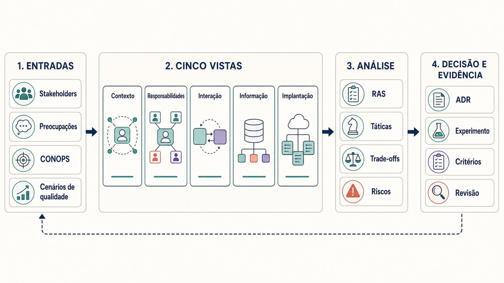
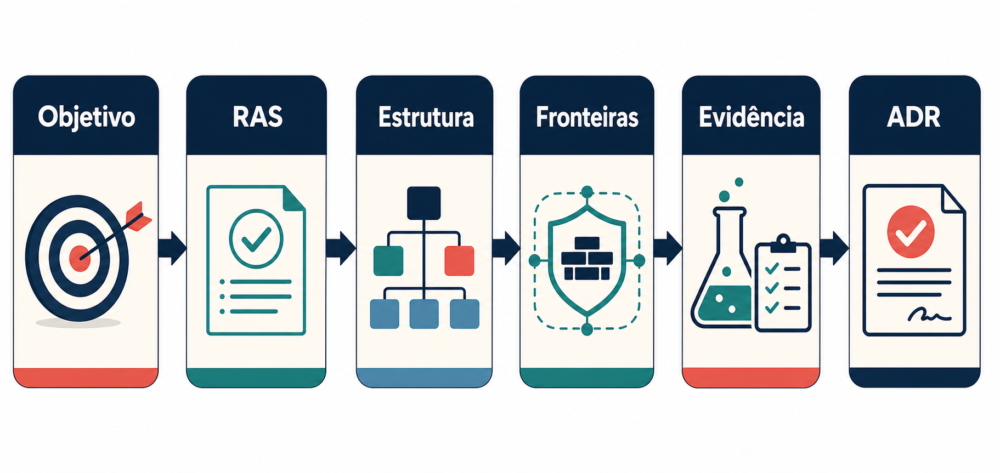
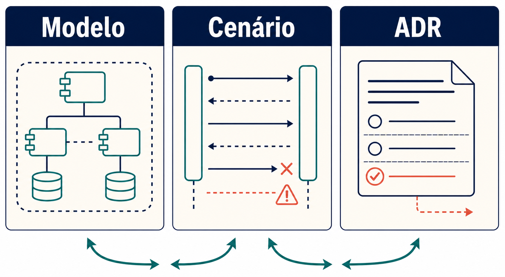

# Do problema às decisões arquiteturais

Uma oportunidade não escolhe arquitetura. “Reduzir o tempo de preparação de contestações” ainda não informa quais dados podem circular, quem mantém a decisão, como a solução falha ou que resultado justificaria o investimento. O desenho começa ao tornar essas perguntas explícitas.

Neste curso, **Documento de Arquitetura de Software** é o conjunto mínimo de entradas, visões, análises, decisões e evidências que mantém o raciocínio conectado. Não é um documento normativo nem uma nova visão: é a organização didática da memória de por que uma estrutura foi escolhida e de que sinal exigirá revê-la.

## 1. Descrever o sistema antes da solução

<a id="uma-sequencia-de-decisao"></a><a id="sequencia-de-decisao"></a>

Uma equipe pode querer reduzir busca e consolidação sem delegar decisão ou registro ao modelo. Ela começa por população, baseline, contramétricas, atividades humanas, CONOPS, fronteiras e fora de escopo. Esses elementos delimitam o problema; nenhuma escolha de modelo é necessária nesse momento.

Para enxergar o caso por ângulos distintos, a equipe produz visões complementares e conserva os artefatos que as orientam:

| Categoria | Artefato | Pergunta respondida |
|---|---|---|
| Entrada | Cenário operacional | Como o trabalho ocorre em situação normal, degradada e bloqueada? |
| Visão | Contexto | Quem interage com o sistema e quais fronteiras ele atravessa? |
| Visão | Responsabilidades | Quem coleta, seleciona, gera, valida, decide e registra? |
| Visão | Interação | Em que ordem informação, decisão e efeito atravessam fronteiras? |
| Visão | Informação | De onde vem o dado, como muda, onde persiste e quando é descartado? |
| Visão | Implantação | Onde componentes e dados executam e que fronteiras tecnológicas atravessam? |
| Entrada da análise | Cenário de qualidade | Como o sistema deve responder a um estímulo sob uma condição? |
| Registro | ADR | Por que uma direção foi escolhida e quando será revista? |



*Figura — Entradas orientam cinco visões complementares; análise liga RAS a táticas e riscos; ADRs e evidências preservam a decisão e alimentam sua revisão.*

A visão de contexto não explica o comportamento degradado; uma sequência não mostra onde o dado persiste; uma ADR não substitui nenhuma das visões. O conjunto evita que um único diagrama receba perguntas que não consegue responder.

Antes de desenhar, declare o ponto de vista: preocupações atendidas, público, convenções e informação excluída. Depois verifique correspondências. Se a interação consulta uma política, a política precisa existir no contexto, ter ciclo de vida na visão de informação, responsável na visão de responsabilidades e alocação na visão de implantação.

## 2. Identificar o que exige arquitetura

Objetivos de negócio, produto, dados e IA mostram resultados desejados. Alguns deles exigem somente trabalho local; outros mudam fronteiras, responsabilidades, interfaces ou opções futuras. Estes são os **requisitos arquiteturalmente significativos (RAS)**.

Um RAS costuma atravessar componentes, proteger uma característica sob condição relevante, impor obrigação ou dependência externa, ou tornar uma mudança posterior cara. Para cada um, descreva fonte, estímulo, ambiente, artefato, resposta e medida; acrescente prioridade, responsável e verificação.



*Figura — Uma preocupação se torna arquitetura quando exige uma escolha estrutural e uma forma de verificar sua consequência.*

Exemplo: “nenhum dado pessoal cru atravessa a inferência” exige táticas de minimização, mascaramento e autorização por finalidade; essas táticas levam a uma fronteira de dados, uma responsabilidade de seleção de contexto, um fluxo de informação e testes de campos proibidos. A consequência é latência e manutenção adicionais; a decisão só faz sentido porque privacidade é prioritária.

## 3. Realizar RAS com táticas arquiteturais

Uma **tática arquitetural** é uma resposta recorrente que realiza um atributo de qualidade ou atende um RAS. Ela não é o cenário, o stakeholder, o componente ou a ADR. Esses elementos ajudam a descobrir, aplicar ou justificar a tática.

| Intenção | RAS típico | Táticas | Estrutura que pode aplicá-las |
|---|---|---|---|
| Segurança e privacidade | dado sensível não atravessa inferência sem necessidade | minimização, mascaramento, autorização por finalidade, segregação | política de acesso, montador de contexto, adaptador de inferência |
| Fundamentação | afirmação material precisa de suporte | seleção de evidência, vínculo afirmação–fonte, abstenção, vigência | contexto, validação e interface de revisão |
| Confiabilidade | falha não perde trabalho nem confirma efeito | timeout, preservação de estado, idempotência, fallback, degradação, compensação e reconciliação | orquestrador, adaptadores e workflow |
| Modificabilidade | troca de fornecedor não reescreve o fluxo | encapsulamento, contrato estável, adaptador, configuração versionada | interface de capacidade e adaptadores |
| Observabilidade | decisão crítica precisa ser reconstruível | proveniência, correlação, trace, registro de versão, métricas e auditoria | telemetria, log de decisão e repositório de evidência |
| Custo e latência | uso precisa caber no orçamento e no tempo do caso | orçamento, limite de contexto, quota, cache seguro, rate limiting e rota proporcional | gateway, roteador e política de execução |

O Módulo 2 usa essas táticas para comparar direções. Os módulos 3 a 6 aprofundam suas realizações em conhecimento, autonomia, confiança e operação.

Tática, mecanismo, padrão e estilo não são sinônimos. A tática descreve a resposta pretendida; o mecanismo a concretiza neste sistema; um padrão organiza uma composição recorrente de elementos; um estilo restringe a organização geral de componentes e conectores. A ADR registra por que uma dessas combinações foi escolhida.

> **Decisão arquitetural:** selecione táticas a partir dos RAS prioritários, concretize-as em mecanismos identificáveis nas visões e registre em ADR somente as escolhas que alteram estrutura, fronteira, dependência ou responsabilidade.

### Analisar composições, não itens isolados

Uma combinação pode ajudar uma característica e prejudicar outra. Antes de decidir, complete esta leitura:

| Escolha candidata | Resposta desejada | Sensibilidade | Trade-off | Evidência necessária |
|---|---|---|---|---|
| cache de evidências | reduzir latência | validade do conteúdo e chave de autorização | desempenho × atualização e privacidade | teste de expiração, isolamento e revogação |
| fallback de modelo | manter disponibilidade | compatibilidade de contrato e categoria | disponibilidade × qualidade, residência e custo | regressão por categoria e simulação de falha |
| trace de geração | reconstruir falhas | conteúdo e nível de detalhe capturado | auditabilidade × minimização e retenção | inspeção de campos e teste de expurgo |
| revisão obrigatória | conter efeito inadequado | tempo e informação disponíveis ao revisor | segurança × latência e carga humana | estudo de concordância, correção e tempo |

O **ponto de sensibilidade** indica o parâmetro que mais altera a resposta. O **ponto de trade-off** indica uma decisão que afeta características concorrentes. Ambos devem aparecer no risco e na evidência, não apenas na conversa da equipe.

### Priorizar com uma árvore de utilidade reduzida

Para cada um dos três a cinco cenários de qualidade prioritários, registre:

```text
objetivo → característica → cenário → prioridade
        → tática e mecanismo → sensibilidade → trade-off
        → risco ou premissa → experimento
```

Prioridade combina importância para o negócio e dificuldade ou risco arquitetural. A árvore não calcula a decisão; ela impede que uma preferência técnica receba o mesmo peso de uma obrigação ou que dez características sejam declaradas igualmente críticas.

## 4. Comparar a menor capacidade suficiente e preparar os próximos módulos

<a id="alternativas-de-conhecimento"></a><a id="alternativas-de-acao"></a><a id="alternativas-de-integracao-e-plataforma"></a>

Com RAS e cenários visíveis, a equipe compara alternativas pelo que elas acrescentam ao sistema.

| Decisão | Alternativas | Responsabilidade adicional |
|---|---|---|
| Conhecimento | consulta estruturada, contexto selecionado, RAG, fine-tuning | seleção, ingestão ou curadoria; vigência e proveniência continuam explícitas |
| Ação | regra, workflow, agente | autorização, contratos, recuperação e avaliação proporcionais ao efeito |
| Plataforma | integração local, capacidade comum, serviço hospedado ou autogerido | operação, dependências, portabilidade e custo total |

Contexto selecionado serve quando a fonte já é conhecida e pequena. RAG é candidato quando localização, atualização e autorização de fontes exigem recuperação própria; o Módulo 3 detalha essa decisão. Fine-tuning muda comportamento em tarefa repetida, mas não governa vigência ou proveniência. Workflow mantém transições conhecidas; agente só se justifica quando a sequência variável cria valor mensurável, tema do Módulo 4. Gateway e serviços compartilhados atendem controles realmente comuns; o Módulo 6 trata sua operação.

Antes de ampliar capacidade, defina a menor evidência que permite decidir: teste de contrato, casos representativos, modo sombra ou experimento limitado. Uma alternativa pode ser rejeitada quando uma regra, consulta ou melhoria de processo atende o mesmo objetivo com menos risco.

Esta comparação não encerra o desenho; ela escolhe qual família de táticas precisa de detalhamento posterior. Uma escolha estrutural pode combinar várias famílias e precisa aparecer nas visões afetadas.

| Se o RAS exige… | O módulo seguinte aprofunda… | Táticas que serão detalhadas |
|---|---|---|
| conhecimento atualizado, autorizado e explicável | [Módulo 3 — RAG](../modulo-3-rag/index.md) | ingestão, segmentação, proveniência, vigência, filtro de autorização, recuperação e abstenção |
| efeito controlado ou sequência variável | [Módulo 4 — Agentes](../modulo-4-agentes/index.md) | contratos de ferramenta, política externa, aprovação, orçamento, idempotência, compensação e reconciliação |
| proteção contra abuso, exposição ou decisão inadequada | [Módulo 5 — Confiança](../modulo-5-confianca/index.md) | modelagem de ameaça, guardrails em profundidade, minimização, segregação, retenção, avaliação e bloqueio |
| mudança contínua, falha de dependência ou escala compartilhada | [Módulo 6 — Operação](../modulo-6-operacao/index.md) | manifesto, regressão, canary, rollback, circuit breaker, fallback, trace, SLO e resposta a incidente |

O Módulo 2 já introduz essas táticas como repertório de desenho. Os módulos seguintes mostram como combiná-las, testá-las e operá-las em cada contexto.

## 5. Registrar a escolha e sua revisão

Uma **ADR** registra decisão relevante para que ela sobreviva ao contexto da conversa. Use-a quando a escolha altera estrutura, fronteira, dependência, responsabilidade ou característica prioritária.



*Figura — O modelo mostra a estrutura; o cenário mostra o comportamento; a ADR explica a escolha.*

Uma ADR contém status, contexto, preocupações, RAS, opções, racional, decisão, visões afetadas, consequências, riscos residuais, premissas, evidência esperada e gatilho de revisão. O registro antigo permanece como histórico quando uma decisão é substituída.

## 6. Verificar correspondência e risco residual

Antes de aprovar uma direção, percorra o desenho nos dois sentidos:

| Verificação | Pergunta |
|---|---|
| contexto ↔ interação | todo participante e dependência da sequência existe no contexto? |
| interação ↔ responsabilidades | cada passo tem responsável, autoridade e contrato? |
| interação ↔ informação | cada leitura, transformação, persistência e envio está representado? |
| informação ↔ implantação | região, provedor, armazenamento, identidade e rede preservam finalidade e classificação? |
| RAS ↔ tática ↔ visões | a resposta de qualidade altera elementos identificáveis e possui critério de verificação? |
| ADR ↔ análise | o racional cita sensibilidades, trade-offs, riscos, premissas e alternativas? |
| evidência ↔ decisão | o experimento pode confirmar, restringir ou refutar a escolha? |

Registre separadamente **risco**, **premissa**, **incerteza** e **dependência**. Dar o mesmo nome a todos esconde a ação necessária: risco pede contenção; premissa pede confirmação; incerteza pede aprendizagem; dependência pede acordo e acompanhamento.

## Critérios de aceitação para comportamento probabilístico

<a id="como-medir-a-aderencia-criterios-probabilisticos-de-aceitacao"></a>

Uma capacidade probabilística precisa de população, amostra, critério, limiar, incerteza, falha intolerável e ação. Exemplo: em 400 contestações estratificadas, ao menos 90% dos resumos atingem cobertura 4/5; nenhum caso crítico expõe outro cliente; abaixo do limite, a categoria fica fora do escopo.

Avaliação automatizada pode ampliar cobertura, mas exige calibração humana, versão e registro de limitações. A evidência não encerra a decisão: ela define se o próximo passo é ampliar, restringir, corrigir ou abandonar.

Continue no [Exemplo arquitetural — Banco Lume](exemplo-arquitetural.md), onde o mesmo raciocínio aparece em modelos, RAS, alternativas e ADRs.
