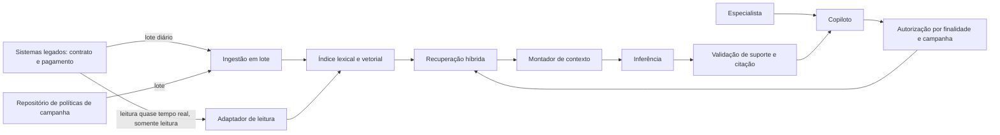

# Caso contínuo: Cooperativa Aurora — RAG

**Caso contínuo — Cooperativa Aurora.** [← Módulo 2: Desenho conceitual](../modulo-2-desenho-conceitual/caso-aurora.md) · [Módulo 4: Autonomia →](../modulo-4-agentes/caso-aurora.md)

> **Nota de desambiguação.** A "Aurora Serviços" do [Estudo de caso deste módulo](estudo-de-caso.md) é uma empresa fictícia sem qualquer relação com a **Cooperativa Aurora** deste caso contínuo — mesmo nome, entidades diferentes.

No [Módulo 2](../modulo-2-desenho-conceitual/caso-aurora.md), o ADR-Aurora-001 adiou RAG até que a evidência justificasse. O gatilho se cumpriu — por um caminho diferente do [Banco Lume](caso-lume.md), tratado em sua própria página.

## RAG por ingestão majoritariamente em lote

O número de campanhas e políticas ativas superou o mapeamento manual previsto no ADR-Aurora-001 (Módulo 2). A Aurora também adota [RAG básico com dois fluxos](../referencia/catalogo-de-padroes.md#rag-basico-com-dois-fluxos), mas por um caminho diferente do Lume: os sistemas legados de contrato e pagamento **não têm API moderna** e aceitam parte das consultas **só em lote** (restrição já registrada no Módulo 2). Isso molda o fluxo de ingestão.

**Decisão estabelecida sobre o adaptador de leitura.** Para sustentar a atualização do índice sem esperar a janela de lote completa, a Aurora conta com um **adaptador de leitura quase em tempo real**, construído especificamente para este fim, sobre contrato e pagamento. Esse adaptador é **somente leitura, sem idempotência de gravação** — ele nunca grava nos sistemas legados, apenas lê registros já confirmados para alimentar o índice com menor atraso do que o lote permitiria sozinho. Políticas de campanha, por não terem a mesma urgência de atualização, continuam sendo ingeridas em lote. Este é um fato já decidido: o Módulo 4 depende dele para justificar autorização de leitura por ferramenta.



**Equivalente textual.** Contrato, pagamento e política de campanha chegam ao índice por dois caminhos: lote diário para o volume principal, e um adaptador de leitura quase em tempo real — só leitura, sem gravação — para os campos de contrato e pagamento mais sensíveis a desatualização. A consulta aplica autorização por finalidade e por campanha antes da recuperação, exatamente como no Módulo 2, e a validação continua exigindo suporte e citação por afirmação antes de qualquer proposta chegar ao especialista.

### ADR-Aurora-002 — RAG híbrido em lote com adaptador de leitura complementar

**Status.** Proposta.

**Contexto.** O ADR-Aurora-001 (Módulo 2) previa reavaliar RAG se "o número de campanhas ou políticas ativas superar o mapeamento manual". Isso ocorreu. Sistemas legados sem API moderna e sem idempotência de gravação restringem o desenho: consultas em tempo real de escrita continuam fora de escopo, mas leitura quase em tempo real é tecnicamente viável.

**Direcionadores da decisão.** Revisão humana obrigatória e segregação proponente/aprovador continuam válidas (Módulo 2); RAS de proveniência e confiabilidade exigem que o atraso de atualização seja visível, não apenas tolerado.

**Opções.**

1. **RAG só em lote** — simples, mas o atraso de atualização de contrato e pagamento compromete a proveniência de casos recentes.
2. **RAG só em tempo real** — inviável: os sistemas legados não sustentam o volume de consulta em tempo real para todo o corpus.
3. **RAG híbrido: lote para o corpus completo, adaptador de leitura complementar só leitura para contrato e pagamento** — equilibra viabilidade técnica e atualidade do dado mais sensível a desatualização.

**Decisão.** Adotar a opção 3. O adaptador de leitura complementar nunca grava; qualquer efeito de gravação permanece fora deste incremento e fora deste adaptador.

**Consequências.** Reduz o atraso de proveniência de contrato e pagamento sem exigir modernização financiada dos legados. Em troca, introduz dois caminhos de ingestão a manter e reconciliar, e o adaptador de leitura vira uma dependência técnica nova, ainda que de escopo estritamente restrito (só leitura).

**Evidências.** Simulação de reconciliação origem–índice mostrou defasagem média de contrato/pagamento caindo de um ciclo de lote completo para minutos, sem nenhuma tentativa de escrita registrada pelo adaptador.

**Gatilhos de revisão.** Reavaliar se o adaptador de leitura apresentar indisponibilidade acima do SLO combinado, ou se uma auditoria encontrar qualquer tentativa de gravação por esse caminho — que deve ser tecnicamente impossível, não apenas proibida por política.

## Implementação

O laboratório `rag_lume_aurora.py` implementa três modos de recuperação sobre o mesmo corpus sintético de políticas de campanha (cinco documentos): **lexical** (BM25 sobre o texto bruto), **vetorial** (embeddings via Chroma e Ollama) e **híbrido** (fusão por posição — Reciprocal Rank Fusion — das duas ordens anteriores). `avaliar_recuperacao_lume_aurora.py` mede os três modos com MRR e nDCG@k sobre um conjunto de perguntas com resposta certa conhecida.

**Pré-requisitos.** Python 3.11+, [Ollama](https://ollama.com/download) instalado localmente, modelos `nomic-embed-text` e `llama3.2:3b` baixados (`ollama pull nomic-embed-text` e `ollama pull llama3.2:3b`).

**Instalação.**

```bash
python3 -m venv .venv
source .venv/bin/activate
pip install langchain langchain-chroma chromadb langchain-ollama rank_bm25
```

**Execução — comparar os três modos de recuperação.**

```bash
python docs/assets/labs/modulo-3/rag_lume_aurora.py --caso aurora --modo lexical --pergunta "Meu contrato está atrasado há mais de três meses, posso renegociar?"
python docs/assets/labs/modulo-3/rag_lume_aurora.py --caso aurora --modo vetorial --pergunta "Meu contrato está atrasado há mais de três meses, posso renegociar?"
python docs/assets/labs/modulo-3/rag_lume_aurora.py --caso aurora --modo hibrido --pergunta "Meu contrato está atrasado há mais de três meses, posso renegociar?"
```

**Resultado esperado.** O modo lexical, sozinho, não coloca `AURORA-CAMP-18` (atraso superior a 90 dias) entre os dois primeiros trechos — a pergunta parafraseia "atrasado há mais de três meses" enquanto a política diz "atraso superior a 90 dias", sem sobreposição de palavras suficiente. Os modos vetorial e híbrido recuperam o documento correto por reconhecer o significado, não a forma. Cada execução imprime a lista ordenada com `→` marcando os dois trechos usados na resposta, seguida de `RESPOSTA:` citada por ID e versão, ou `REVISÃO_HUMANA` quando a evidência for insuficiente.

**Execução — avaliar recuperação com MRR e nDCG.**

```bash
python docs/assets/labs/modulo-3/avaliar_recuperacao_lume_aurora.py --caso aurora
```

**Resultado esperado.** Uma linha por modo com `MRR` e `nDCG@3` sobre cinco perguntas rotuladas. Espere o modo lexical cair sensivelmente na pergunta de paráfrase acima, e o modo híbrido recuperar a maior parte dessa perda ao combinar as duas ordens por posição.

**Limpeza.** `deactivate` para sair do ambiente virtual e apague a pasta `chroma-lume-aurora/` gerada pelos scripts. Não substitua os dados sintéticos por dados reais de clientes ou contratos.

## Continuidade

**Continuação:** o adaptador de leitura só-leitura da Aurora é o ponto de partida do [Módulo 4](../modulo-4-agentes/caso-aurora.md), onde essa mesma restrição de "só leitura, sem idempotência de gravação" justifica os limites de autonomia de um agente.

---

**Continua:** [Módulo 4 — autonomia](../modulo-4-agentes/caso-aurora.md)
