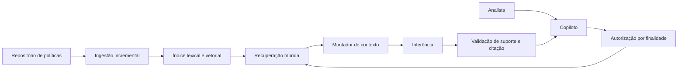
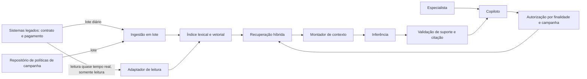

# Caso contínuo: Banco Lume e Cooperativa Aurora — RAG

> **Nota de desambiguação.** A "Aurora Serviços" do [Estudo de caso deste módulo](estudo-de-caso.md) é uma empresa fictícia sem qualquer relação com a **Cooperativa Aurora** do caso contínuo — mesmo nome, entidades diferentes.

No [Módulo 2](../modulo-2-desenho-conceitual/caso-lume-aurora.md), o ADR-002 do Banco Lume e o ADR-Aurora-001 da Cooperativa Aurora adiaram RAG até que a evidência justificasse. Os dois gatilhos se cumpriram — mas por caminhos diferentes, e os dois casos adotam RAG de formas distintas.

## Banco Lume: o gatilho do ADR-002 se cumpriu

O corpus de políticas de contestação cresceu além das doze políticas curtas mapeadas manualmente; a cobertura de evidência por seleção explícita caiu abaixo de 95% em categorias novas. O Lume adota o padrão [RAG básico com dois fluxos](../referencia/catalogo-de-padroes.md#rag-basico-com-dois-fluxos): ingestão incremental do repositório de políticas (mesma fonte e mesmo dono já descritos no Módulo 2), consulta com [recuperação consciente de autorização](../referencia/catalogo-de-padroes.md#recuperacao-consciente-de-autorizacao) e [resposta apoiada em evidências](../referencia/catalogo-de-padroes.md#resposta-apoiada-em-evidencias). O montador de contexto do Módulo 2 não desaparece: ele passa a receber trechos recuperados em vez de política pré-selecionada por categoria.



**Equivalente textual.** A ingestão continua restrita ao repositório oficial de políticas com dono e vigência, sem mudar de fonte. A consulta aplica a mesma autorização por finalidade do Módulo 2 antes da recuperação; só depois disso o montador de contexto recebe trechos recuperados, no lugar da seleção manual por categoria. A validação continua exigindo suporte e citação antes de liberar o rascunho ao analista.

### ADR-Lume-003 — Adoção de RAG com autorização antes da recuperação

**Status.** Proposta.

**Contexto.** O ADR-002 (Módulo 2) previa reavaliar contexto selecionado se "a cobertura de evidência ficar abaixo de 95% apesar de fontes disponíveis" ou "o corpus superar a seleção explícita". Ambos ocorreram: novas categorias de contestação passaram a ter política própria, e o mapeamento manual por categoria não acompanha o ritmo de atualização.

**Direcionadores da decisão.** Preservar a fronteira de minimização e a exigência de suporte já estabelecidas (RAS do Módulo 2); autorização deve continuar precedendo qualquer acesso a conteúdo, não apenas filtrar depois.

**Opções.**
1. **Ampliar o mapeamento manual** — não escala com o ritmo de novas categorias e políticas.
2. **Enviar o repositório inteiro ao prompt** — perde controle de autorização, versão e proveniência.
3. **RAG com autorização antes da recuperação** — separa ingestão e consulta, aplica predicado de autorização antes da busca, preserva citação por afirmação.

**Decisão.** Adotar RAG híbrido (lexical e vetorial) com autorização por finalidade aplicada antes da recuperação. O contrato de citação por afirmação, já usado no rascunho do Módulo 2, passa a referenciar trechos recuperados em vez de política pré-mapeada.

**Consequências.** Ganha cobertura sobre categorias novas sem esperar mapeamento manual. Passa a depender de ingestão, indexação e avaliação de recuperação como responsabilidades próprias, com risco de regressão de cobertura se a indexação falhar silenciosamente.

**Evidências.** Cobertura de evidência por seleção manual caiu de 95%+ para cerca de 80% nas categorias adicionadas nos últimos dois trimestres — o gatilho exato do ADR-002.

**Gatilhos de revisão.** Reavaliar se Recall@k de uma categoria crítica cair abaixo do limite aprovado por dois ciclos, ou se uma auditoria encontrar candidato fora da finalidade de contestação.

## Cooperativa Aurora: RAG por ingestão majoritariamente em lote

O número de campanhas e políticas ativas superou o mapeamento manual previsto no ADR-Aurora-001 (Módulo 2). A Aurora também adota [RAG básico com dois fluxos](../referencia/catalogo-de-padroes.md#rag-basico-com-dois-fluxos), mas por um caminho diferente do Lume: os sistemas legados de contrato e pagamento **não têm API moderna** e aceitam parte das consultas **só em lote** (restrição já registrada no Módulo 2). Isso molda o fluxo de ingestão.

**Decisão estabelecida sobre o adaptador de leitura.** Para sustentar a atualização do índice sem esperar a janela de lote completa, a Aurora conta com um **adaptador de leitura quase em tempo real**, construído especificamente para este fim, sobre contrato e pagamento. Esse adaptador é **somente leitura, sem idempotência de gravação** — ele nunca grava nos sistemas legados, apenas lê registros já confirmados para alimentar o índice com menor atraso do que o lote permitiria sozinho. Políticas de campanha, por não terem a mesma urgência de atualização, continuam sendo ingeridas em lote. Este é um fato já decidido: o Módulo 4 depende dele para justificar autorização de leitura por ferramenta.



**Equivalente textual.** Contrato, pagamento e política de campanha chegam ao índice por dois caminhos: lote diário para o volume principal, e um adaptador de leitura quase em tempo real — só leitura, sem gravação — para os campos de contrato e pagamento mais sensíveis a desatualização. A consulta aplica autorização por finalidade e por campanha antes da recuperação, exatamente como no Módulo 2, e a validação continua exigindo suporte e citação por afirmação antes de qualquer proposta chegar ao especialista.

### ADR-Aurora-002 — RAG híbrido em lote com adaptador de leitura complementar

**Status.** Proposta.

**Contexto.** O ADR-Aurora-001 (Módulo 2) previa reavaliar RAG se "o número de campanhas ou políticas ativas superar o mapeamento manual". Isso ocorreu. Sistemas legados sem API moderna e sem idempotência de gravação restringem o desenho: consultas em tempo real de escrita continuam fora de escopo, mas leitura quase em tempo real é tecnicamente viável.

**Direcionadores da decisão.** Revisão humana obrigatória e segregação proponente/aprovador continuam válidas (Módulo 2); RAS de proveniência e confiabilidade exigem que o atraso de atualização seja visível, não apenas tolerado.

**Opções.**
1. **RAG só em lote** — simples, mas o atraso de atualização de contrato e pagamento compromete a proveniência de casos recentes.
2. **RAG só em tempo real** — inviável: os sistemas legados não sustentam o volume de consulta em tempo real para todo o corpus.
3. **RAG híbrido: lote para o corpus completo, adaptador de leitura complementar só leitura para contrato e pagamento** — equilibra viabilidade técnica e atualidade do dado mais sensível a desatualização.

**Decisão.** Adotar a opção 3. O adaptador de leitura complementar nunca grava; qualquer efeito de gravação permanece fora deste incremento e fora deste adaptador.

**Consequências.** Reduz o atraso de proveniência de contrato e pagamento sem exigir modernização financiada dos legados. Em troca, introduz dois caminhos de ingestão a manter e reconciliar, e o adaptador de leitura vira uma dependência técnica nova, ainda que de escopo estritamente restrito (só leitura).

**Evidências.** Simulação de reconciliação origem–índice mostrou defasagem média de contrato/pagamento caindo de um ciclo de lote completo para minutos, sem nenhuma tentativa de escrita registrada pelo adaptador.

**Gatilhos de revisão.** Reavaliar se o adaptador de leitura apresentar indisponibilidade acima do SLO combinado, ou se uma auditoria encontrar qualquer tentativa de gravação por esse caminho — que deve ser tecnicamente impossível, não apenas proibida por política.

## Implementação

O laboratório `rag_lume_aurora.py` demonstra os dois fluxos de consulta com Chroma e Ollama locais, com um corpus sintético próprio por caso.

**Pré-requisitos.** Python 3.11+, [Ollama](https://ollama.com/download) instalado localmente, modelos `nomic-embed-text` e `llama3.2:3b` baixados (`ollama pull nomic-embed-text` e `ollama pull llama3.2:3b`).

**Instalação.**

```bash
python3 -m venv .venv
source .venv/bin/activate
pip install langchain langchain-chroma chromadb langchain-ollama
```

**Execução.**

```bash
python docs/assets/labs/modulo-3/rag_lume_aurora.py --caso lume --pergunta "Posso contestar uma compra feita há 10 dias?"
python docs/assets/labs/modulo-3/rag_lume_aurora.py --caso aurora --pergunta "Qual desconto a campanha de julho autoriza?"
```

**Resultado esperado.** Para cada caso, o script imprime os trechos recuperados com `ID:VERSAO` e a resposta citada ou `REVISÃO_HUMANA` quando a evidência for insuficiente.

**Limpeza.** `deactivate` para sair do ambiente virtual e apague a pasta `chroma-lume-aurora/` gerada pelo script. Não substitua os dados sintéticos por dados reais de clientes ou contratos.

**Continuidade:** o adaptador de leitura só-leitura da Aurora é o ponto de partida do [Módulo 4](../modulo-4-agentes/caso-lume-aurora.md), onde essa mesma restrição de "só leitura, sem idempotência de gravação" justifica os limites de autonomia de um agente.
