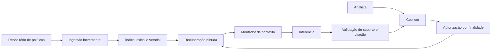

# Caso contínuo: Banco Lume — RAG

**Caso contínuo — Banco Lume.** [← Módulo 2: Desenho conceitual](../modulo-2-desenho-conceitual/caso-lume.md) · [Módulo 4: Autonomia →](../modulo-4-agentes/caso-lume.md)

No [Módulo 2](../modulo-2-desenho-conceitual/caso-lume.md), o ADR-002 do Banco Lume adiou RAG até que a evidência justificasse. O gatilho se cumpriu. A [Cooperativa Aurora](caso-aurora.md) chega a RAG por um caminho diferente, tratado em sua própria página.

## O gatilho do ADR-002 se cumpriu

O corpus de políticas de contestação cresceu além das doze políticas curtas mapeadas manualmente; a cobertura de evidência por seleção explícita caiu abaixo de 95% em categorias novas. O Lume adota o padrão [RAG básico com dois fluxos](../referencia/catalogo-de-padroes.md#rag-basico-com-dois-fluxos): ingestão incremental do repositório de políticas (mesma fonte e mesmo dono já descritos no Módulo 2), consulta com [recuperação consciente de autorização](../referencia/catalogo-de-padroes.md#recuperacao-consciente-de-autorizacao) e [resposta apoiada em evidências](../referencia/catalogo-de-padroes.md#resposta-apoiada-em-evidencias). O montador de contexto do Módulo 2 não desaparece: ele passa a receber trechos recuperados em vez de política pré-selecionada por categoria.



**Equivalente textual.** A ingestão continua restrita ao repositório oficial de políticas com dono e vigência, sem mudar de fonte. A consulta aplica a mesma autorização por finalidade do Módulo 2 antes da recuperação; só depois disso o montador de contexto recebe trechos recuperados, no lugar da seleção manual por categoria. A validação continua exigindo suporte e citação antes de liberar o rascunho ao analista.

### ADR-Lume-003 — Adoção de RAG com autorização antes da recuperação

**Status.** Proposta.

**Contexto.** O ADR-002 (Módulo 2) previa reavaliar contexto selecionado se "a cobertura de evidência ficar abaixo de 95% apesar de fontes disponíveis" ou "o corpus superar a seleção explícita". Ambos ocorreram: novas categorias de contestação passaram a ter política própria, e o mapeamento manual por categoria não acompanha o ritmo de atualização.

**Direcionadores da decisão.** Preservar a fronteira de minimização e a exigência de suporte já estabelecidas (RAS do Módulo 2); autorização deve continuar precedendo qualquer acesso a conteúdo, não apenas filtrar depois.

**Opções.**

1. **Ampliar o mapeamento manual** — não escala com o ritmo de novas categorias e políticas.
2. **Enviar o repositório inteiro ao prompt** — perde controle de autorização, versão e proveniência.
3. **RAG com autorização antes da recuperação** — separa ingestão e consulta, aplica predicado de autorização antes da busca, preserva citação por afirmação.

**Decisão.** Adotar RAG híbrido (lexical e vetorial) com autorização por finalidade aplicada antes da recuperação. O contrato de citação por afirmação, já usado no rascunho do Módulo 2, passa a referenciar trechos recuperados em vez de política pré-mapeada.

**Consequências.** Ganha cobertura sobre categorias novas sem esperar mapeamento manual. Passa a depender de ingestão, indexação e avaliação de recuperação como responsabilidades próprias, com risco de regressão de cobertura se a indexação falhar silenciosamente.

**Evidências.** Cobertura de evidência por seleção manual caiu de 95%+ para cerca de 80% nas categorias adicionadas nos últimos dois trimestres — o gatilho exato do ADR-002.

**Gatilhos de revisão.** Reavaliar se Recall@k de uma categoria crítica cair abaixo do limite aprovado por dois ciclos, ou se uma auditoria encontrar candidato fora da finalidade de contestação.

## Implementação

**Objetivo Bloom.** Aplicar as três estratégias de recuperação — lexical, vetorial e híbrida — sobre o corpus de políticas de contestação do Lume e analisar, com métricas de MRR e nDCG@3, se a fusão híbrida sustenta a decisão do ADR-Lume-003.

**Decisão arquitetural em foco.** O ADR-Lume-003 adotou RAG híbrido (lexical e vetorial) com autorização antes da recuperação. Este laboratório isola a parte de **recuperação** dessa decisão — sem o predicado de autorização, que já foi tratado no Módulo 2 — para que o aluno observe, em código, por que busca lexical isolada perde a política correta e por que a fusão por posição (RRF) tende a recuperar essa perda. Revise as [estratégias de recuperação](padroes-e-decisoes.md#estrategias-de-recuperacao) e a seção sobre [embeddings, recuperação e autorização](conceitos.md#embeddings-recuperacao-e-autorizacao) antes de rodar os comandos abaixo.

O laboratório `rag_lume_aurora.py` implementa três modos de recuperação sobre o mesmo corpus sintético de políticas de contestação (cinco documentos): **lexical** (BM25 sobre o texto bruto), **vetorial** (embeddings via Chroma e Ollama) e **híbrido** (fusão por posição — Reciprocal Rank Fusion — das duas ordens anteriores). `avaliar_recuperacao_lume_aurora.py` mede os três modos com MRR e nDCG@k sobre um conjunto de perguntas com resposta certa conhecida.

**Pré-requisitos.** Python 3.11+, [Ollama](https://ollama.com/download) instalado localmente, modelos `nomic-embed-text` e `llama3.2:3b` baixados (`ollama pull nomic-embed-text` e `ollama pull llama3.2:3b`).

**Instalação.**

```bash
python3 -m venv .venv
source .venv/bin/activate
pip install langchain langchain-chroma chromadb langchain-ollama rank_bm25
```

**Execução — comparar os três modos de recuperação.**

```bash
python docs/assets/labs/modulo-3/rag_lume_aurora.py --caso lume --modo lexical --pergunta "Posso contestar uma compra feita há 8 dias?"
python docs/assets/labs/modulo-3/rag_lume_aurora.py --caso lume --modo vetorial --pergunta "Posso contestar uma compra feita há 8 dias?"
python docs/assets/labs/modulo-3/rag_lume_aurora.py --caso lume --modo hibrido --pergunta "Posso contestar uma compra feita há 8 dias?"
```

**Resultado esperado.** O modo lexical, sozinho, coloca `LUME-CTX-04` (a política de prazo de 10 dias) na segunda posição — a política de estorno parcial compete por compartilhar o termo "compra" com mais frequência. Os modos vetorial e híbrido corrigem essa ordem ao considerar significado, não só sobreposição de palavras. Cada execução imprime a lista ordenada com `→` marcando os dois trechos usados na resposta, seguida de `RESPOSTA:` citada por ID e versão, ou `REVISÃO_HUMANA` quando a evidência for insuficiente.

**Perguntas exploratórias.**

- A fusão híbrida em `rank_hibrido` soma `1/(k_rrf + posição + 1)` de cada lista, com `k_rrf = 60` por padrão. Por que somar posições — em vez de somar os escores brutos de BM25 e de similaridade de embeddings — evita comparar diretamente duas escalas incompatíveis?
- O script corta o contexto em `top = ranked[:2]` para todos os modos. O que acontece com a resposta se `LUME-CTX-04` estiver na 3ª posição em algum modo, mesmo tendo subido no ranking?
- Se `k_rrf` fosse muito menor (por exemplo, 1), a diferença de escore entre a 1ª e a 2ª posição de cada lista aumentaria bastante. Isso tornaria a fusão mais sensível ao desacordo entre lexical e vetorial, ou mais tolerante a ele? O que isso significa para um documento bem ranqueado por um modo e mal ranqueado pelo outro?

**Execução — avaliar recuperação com MRR e nDCG.**

```bash
python docs/assets/labs/modulo-3/avaliar_recuperacao_lume_aurora.py --caso lume
```

**Resultado esperado.** Uma linha por modo com `MRR` e `nDCG@3` sobre cinco perguntas rotuladas. Espere o modo híbrido igualar ou superar lexical e vetorial isolados — a fusão de posições absorve os casos em que um modo falha e o outro acerta.

**Perguntas exploratórias.**

- MRR usa `1 / posição` da primeira evidência relevante, sem limite de corte; nDCG@3 zera qualquer acerto fora das três primeiras posições. O que cada métrica revela sobre o comportamento do sistema que a inspeção visual de uma única lista ordenada (como a do comando anterior) não revela?
- Se o modo lexical tiver MRR alto mas nDCG@3 baixo em alguma pergunta, o que isso indica sobre a posição em que a política relevante costuma aparecer?
- Compare o ganho do híbrido sobre o vetorial isolado. Esse ganho justifica manter dois índices (lexical e vetorial) e a etapa de fusão, ou o vetorial isolado já seria suficiente para este corpus de cinco documentos?

**Evidência a entregar.** Registre, para a pergunta usada, uma tabela como esta:

| Modo | IDs recuperados (top-2) | MRR | nDCG@3 |
|---|---|---:|---:|
| Lexical | | | |
| Vetorial | | | |
| Híbrido | | | |

Conclua, à luz da matriz de decisão em [Como escolher sem acumular padrões](padroes-e-decisoes.md#como-escolher-sem-acumular-padroes): dado o perfil de perguntas do Lume (termos exatos convivendo com paráfrases sobre prazos e categorias), a busca lexical isolada, a vetorial isolada ou a híbrida teria sido a escolha inicial defensável — e se a evidência de MRR/nDCG confirma ou contradiz essa escolha.

**Limpeza.** `deactivate` para sair do ambiente virtual e apague a pasta `chroma-lume-aurora/` gerada pelos scripts. Não substitua os dados sintéticos por dados reais de clientes ou contratos.

---

**Continua:** [Módulo 4 — autonomia](../modulo-4-agentes/caso-lume.md)
