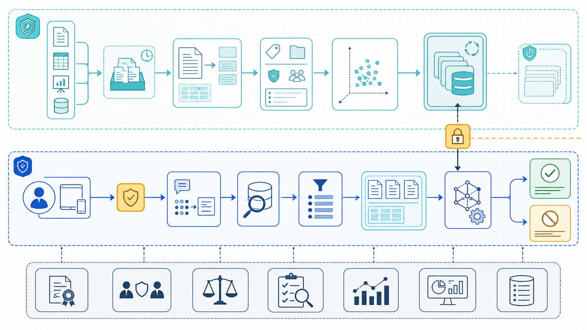
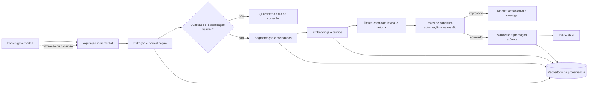
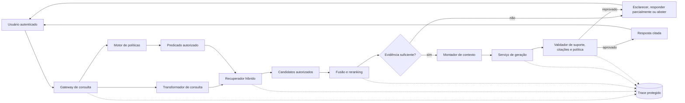
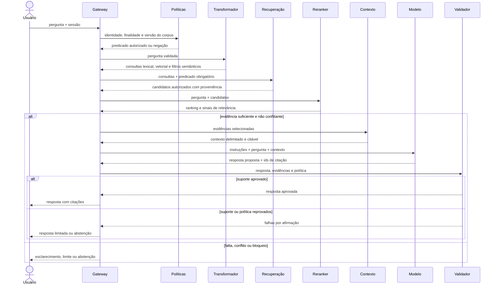
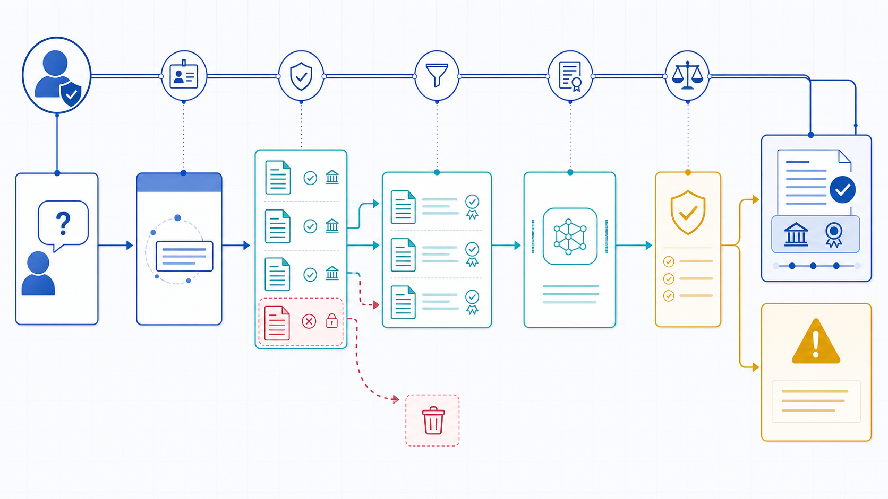

# Exemplo arquitetural: dois fluxos, uma cadeia de evidências

O exemplo é um serviço corporativo genérico de consulta a normas internas. Ele ilustra responsabilidades, não produtos. Fontes documentais têm dono, vigência e grupos de acesso; usuários autenticados perguntam; o sistema responde com citações ou declara suporte insuficiente.



*Figura planejada — os fluxos offline e online compartilham proveniência, políticas, avaliação e observabilidade, mas escalam e falham de maneiras diferentes.*

## Fluxo de ingestão



**Equivalente textual 1:** conectores adquirem apenas fontes governadas e registram inclusões, mudanças e exclusões. Extração e normalização preservam a origem. Uma decisão de qualidade manda itens inválidos para quarentena. Itens válidos são segmentados, recebem metadados de fonte, versão, vigência e permissão, e geram termos lexicais e embeddings. Os dois índices formam uma versão candidata. Testes de cobertura, autorização e regressão precisam aprová-la; em caso de falha, a versão ativa permanece. A promoção é atômica e registrada num manifesto de proveniência.

### Responsabilidades de ingestão

| Componente | Responsabilidade | Falha que deve tornar visível |
|---|---|---|
| Catálogo de fontes | dono, autoridade, esquema, classificação, vigência e SLO | fonte sem dono ou fora do prazo |
| Conector | aquisição incremental, reconciliação e exclusão | credencial expirada, lacuna ou duplicidade |
| Extrator | texto, estrutura, tabelas e indicador de qualidade | página ilegível ou estrutura perdida |
| Normalizador | formato consistente sem destruir semântica | data ambígua ou cláusula alterada |
| Segmentador | chunks recuperáveis com relação pai–filho | chunk órfão ou grande demais |
| Enriquecedor | metadados confiáveis de busca e política | grupo ausente ou vigência inválida |
| Representador | termos e embeddings versionados | incompatibilidade de dimensão ou idioma |
| Publicador | índice candidato, teste e promoção/rollback | mistura de versões ou promoção parcial |
| Registro de proveniência | manifestos, hashes, transformações e versões | execução impossível de reconstruir |

### Consistência e atualização

O publicador não altera o índice ativo item a item quando uma mudança grande pode produzir estado misto. Ele constrói versão candidata, testa e troca um alias ou roteamento de forma atômica. Atualizações pequenas podem ser incrementais, mas uma reconciliação periódica compara origem e índice para detectar eventos perdidos.

Exclusão tem caminho prioritário: revogar acesso na camada de política, invalidar caches e remover conteúdo pesquisável dentro do SLO. A remoção física posterior respeita retenção. Se o modelo de embedding mudar, embeddings antigos e novos não devem ser comparados como se pertencessem ao mesmo espaço.

## Fluxo de consulta



**Equivalente textual 2:** o gateway valida sessão e finalidade. Em paralelo controlado, o transformador deriva consultas de busca e o motor de políticas produz um predicado a partir da identidade. O recuperador lexical e vetorial só materializa candidatos que satisfazem esse predicado. Fusão e reranking recebem candidatos autorizados. Um controle decide se vigência, cobertura, relevância e conflitos permitem responder. Se não, o sistema esclarece, limita ou se abstém. Se sim, o montador cria contexto com identificadores e o gerador propõe resposta. O validador verifica suporte, citações e política de saída antes de entregar. Todas as decisões relevantes produzem trace protegido.

## A fronteira de autorização

A **fronteira de autorização** fica antes do acesso ao conteúdo e continua válida em todas as etapas. O gateway não aceita grupos declarados pelo cliente; consulta identidade e atributos assinados. O motor de políticas combina usuário, tenant, finalidade, classificação, grupo e vigência. O predicado chega à busca lexical e vetorial. O resultado inclui somente metadados e conteúdo elegíveis.

Reranker, montador, modelo e validador não funcionam como segunda chance de esconder vazamento. Eles recebem apenas material autorizado. Logs armazenam identificadores e decisão de política por padrão, não trechos completos. Caches são segmentados por política efetiva e versão do corpus. A abertura de uma citação repete autorização, porque direitos podem mudar entre geração e clique.

Uma falha do motor de políticas leva a negação segura. Uma consulta sem resultado após filtros não informa “há um contrato confidencial”; informa apenas que as fontes disponíveis ao usuário não sustentam a resposta.

## Sequência de uma pergunta



**Equivalente textual 3:** o usuário envia pergunta e sessão. O gateway obtém do motor de políticas um predicado ou negação, transforma a pergunta e chama a recuperação com o predicado obrigatório. Candidatos autorizados carregam proveniência e são reordenados. Se faltarem cobertura, vigência ou coerência, a execução termina com esclarecimento, resposta parcial ou abstenção. Caso contrário, o contexto citável chega ao modelo. A proposta volta ao validador; somente afirmações apoiadas e permitidas são entregues. Reprovação não dispara geração ilimitada: o sistema limita, encaminha ou se abstém conforme orçamento e risco.



*Figura planejada — cada transição preserva identidade, versão e identificadores suficientes para explicar por que uma evidência entrou ou não na resposta.*

## Contratos entre componentes

O recuperador devolve uma estrutura equivalente a:

```text
query_id, corpus_version, policy_decision_id
candidates[]:
  chunk_id, source_id, source_version, location
  valid_from, valid_to, authority, retrieval_scores
```

O montador acrescenta ordem, orçamento e relação entre vizinhos. O gerador recebe identificadores opacos junto aos trechos e devolve afirmações associadas a esses identificadores. O validador produz decisão por afirmação e motivo de reprovação. Esses contratos permitem substituir implementações sem perder rastreabilidade.

## Caminhos de falha, contenção e recuperação

| Falha | Detecção | Contenção | Recuperação |
|---|---|---|---|
| evento de atualização perdido | reconciliação origem–índice | marcar fonte como possivelmente desatualizada | reingerir e promover versão testada |
| extração ilegível | limiar de qualidade e amostra visual | quarentena; não indexar | corrigir parser/OCR e reprocessar |
| índice candidato pior | suíte de recuperação e autorização | manter índice ativo | ajustar chunking/representação e repetir |
| motor de políticas indisponível | timeout e health check | negar acesso; não buscar | restaurar política e invalidar decisões temporárias |
| busca vetorial indisponível | erro por etapa | usar lexical se cenário permitir | restaurar componente e comparar lacunas |
| reranker excede orçamento | timeout | ranking fundido inicial | reduzir candidatos ou reverter versão |
| fonte obrigatória ausente | regra de suficiência | resposta parcial ou abstenção | atualizar fonte ou encaminhar ao dono |
| fontes conflitantes | metadados de autoridade/vigência | expor conflito; não escolher silenciosamente | dono do conhecimento resolve precedência |
| citação não sustenta frase | validador por afirmação | remover afirmação ou abster | nova geração única ou revisão humana |
| injeção em documento | testes e sinais de conteúdo | tratar como dado; nenhuma ação/ferramenta | revisar fonte, isolamento e controles |

Retry só ocorre em operações idempotentes e dentro de orçamento. Nova geração não corrige fonte ausente. Fallback lexical é permitido somente se o critério de suficiência e o cenário de risco continuarem satisfeitos.

## Métricas e objetivos operacionais

Separe métricas por componente para não culpar o modelo por atraso de ingestão:

- **conhecimento:** cobertura de fontes, atraso p50/p95, exclusão dentro do SLO, falha de extração, chunks sem proveniência;
- **recuperação:** Recall@k, Precision@k, MRR/nDCG, zero candidato proibido materializado, distribuição por fonte;
- **contexto:** evidência relevante incluída, duplicação, tokens, conflitos identificados e truncamentos;
- **geração:** fidelidade por afirmação, relevância, correção e completude de citações, abstenção correta/indevida;
- **sistema:** latência p50/p95/p99 por etapa, disponibilidade, custo, timeout, taxa de fallback e trace reconstruível;
- **produto:** tarefa concluída, tempo economizado, correções, escalamentos e confiança calibrada do usuário.

Um painel deve permitir filtrar por versão do corpus, estratégia de chunking, embedding, rota, política, reranker, prompt e modelo. Compare sempre segmentos críticos; médias podem ocultar vazamento raro ou baixa cobertura num tipo de contrato.

## Decisões de referência

Para este exemplo, duas ADRs seriam prioritárias:

1. **ADR-001 — autorização antes da materialização:** combinar isolamento por tenant e filtros por atributo, negar em falha e repetir autorização ao abrir citação. Revisar se o mecanismo não sustentar SLO de revogação ou teste adversarial encontrar candidato proibido.
2. **ADR-002 — publicação versionada azul–verde:** promover pacote de corpus e representações somente após regressão; preservar rollback. Revisar se volume tornar reconstrução integral inviável e atualização incremental puder oferecer a mesma consistência.

O exemplo mostrou a mecânica antes do caso. Agora aplicaremos as decisões a políticas e contratos, onde temporalidade, permissão individual e conflito de autoridade deixam de ser abstrações.

**Próxima página:** [Estudo de caso — assistente corporativo](estudo-de-caso.md).
