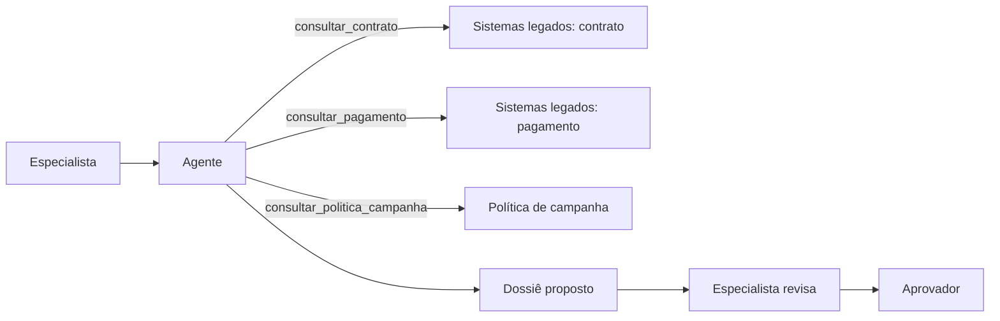

# Caso contínuo: Banco Lume e Cooperativa Aurora — autonomia

O [Módulo 2](../modulo-2-desenho-conceitual/caso-lume-aurora.md) decidiu manter os dois casos sem agente. O [Módulo 3](../modulo-3-rag/caso-lume-aurora.md) deu a cada um seu próprio caminho de conhecimento. Este módulo reavalia autonomia com a evidência acumulada até aqui — e os dois casos **não** chegam à mesma conclusão.

## Banco Lume — os critérios do ADR-001 continuam não atendidos

O ADR-001 do Módulo 2 previa reavaliar autonomia de agente somente "se uma atividade adicional demonstrar, em casos representativos, sequência não enumerável, benefício mensurável acima do workflow, autoridade clara por ferramenta e recuperação proporcional diante de falha". Depois da adoção de RAG no Módulo 3, a sequência do Lume continua a mesma: montar contexto, recuperar política vigente, gerar rascunho, validar suporte, recomendar, aprovar. Nenhum caso do modo sombra exigiu consultar fontes em ordem diferente da já prevista, e nenhuma evidência mostrou benefício mensurável de escolher a sequência dinamicamente.

**Decisão:** o Banco Lume permanece em **A1 — informar** na [matriz de autonomia](padroes-e-decisoes.md#matriz-de-autonomia): o modelo gera o rascunho, sem ferramenta de efeito e sem escolher a ordem de consulta; o orquestrador decide a sequência, não o modelo. Isto não é uma lacuna do desenho — é a leitura correta da evidência: **nem todo sistema evolui para agente**. Reavaliar exigiria uma nova atividade com sequência genuinamente não enumerável, ainda inexistente no escopo do Lume.

## Cooperativa Aurora — os dois gatilhos do ADR-Aurora-001 se cumprem

No Módulo 3, a Aurora ganhou um adaptador de leitura quase em tempo real sobre contrato e pagamento dos sistemas legados (só leitura, sem idempotência de gravação) para sustentar a atualização do índice de RAG. Essa mesma capacidade de leitura, somada à evidência de que a ordem de consulta entre contrato, pagamento e política varia por campanha de forma não enumerável, cumpre os dois gatilhos de reavaliação registrados no ADR-Aurora-001 do Módulo 2.

### Contratos de ferramenta (somente leitura)

| Ferramenta | Efeito | Autorização | Idempotência |
|---|---|---|---|
| `consultar_contrato` | leitura | identidade do especialista + finalidade renegociação | não aplicável (sem efeito) |
| `consultar_pagamento` | leitura | idem | não aplicável |
| `consultar_politica_campanha` | leitura | idem + vigência da campanha | não aplicável |

Nenhuma ferramenta grava, altera contrato, limite, taxa ou status, nem envia comunicação — restrições confirmadas desde o Módulo 2. O agente **propõe** um dossiê de renegociação; não existe ferramenta de efeito neste incremento.

### Autonomia orçada

Nível [A2 — recomendar](padroes-e-decisoes.md#matriz-de-autonomia): o agente escolhe quais ferramentas de leitura consultar e em que ordem; a pessoa especialista revisa e recomenda; o aprovador distinto aprova ou devolve, como já valia no Módulo 2. Orçamento de passos: no máximo 6 chamadas de ferramenta por solicitação; ao aproximar do teto, o agente conclui com o que tem e sinaliza lacuna, em vez de repetir chamadas.



**Equivalente textual.** O agente decide a ordem das três consultas de leitura conforme o caso, mas nunca grava nem comunica. O dossiê proposto sempre passa por revisão do especialista e aprovação de pessoa distinta antes de qualquer oferta.

### ADR-Aurora-003 — Agente com ferramentas somente leitura, orçamento de passos

**Status.** Proposta.

**Contexto.** Os dois gatilhos do ADR-Aurora-001 (Módulo 2) se cumpriram: leitura quase em tempo real sobre legados (Módulo 3) e sequência de consulta não enumerável por campanha. Revisão humana obrigatória e segregação entre proponente e aprovador continuam restrições confirmadas.

**Direcionadores da decisão.** Reduzir o tempo de consolidação de contrato, pagamento e política sem ampliar autoridade além de leitura; manter aprovação humana antes de qualquer oferta; tornar o caminho de decisão do agente reconstruível — ver atributos [Autonomia](../referencia/atributos-de-qualidade.md#autonomia) e [Observabilidade](../referencia/atributos-de-qualidade.md#observabilidade).

**Opções.**
1. **Manter copiloto com contexto fixo (status quo do Módulo 2/3):** simples e previsível, mas não se adapta quando a ordem de consulta varia por campanha, deixando lacunas manuais.
2. **Agente com ferramentas somente leitura e orçamento de passos:** adapta a sequência a cada caso, mantendo aprovação humana e nenhuma ferramenta de efeito.
3. **Agente com ferramentas de leitura e escrita:** resolveria também a criação da oferta, mas contraria a restrição confirmada de revisão humana obrigatória e ausência de gravação por modelo.

**Decisão.** Adotar a opção 2, usando os padrões [Uso controlado de ferramentas](../referencia/catalogo-de-padroes.md#uso-controlado-de-ferramentas), [Agente com orçamento limitado](../referencia/catalogo-de-padroes.md#agente-com-orcamento-limitado) e [Aprovação humana por risco](../referencia/catalogo-de-padroes.md#aprovacao-humana-por-risco).

**Consequências.** Ganha-se adaptação à variação real de campanhas sem ampliar autoridade de efeito. Em troca, o time assume contratos de ferramenta, autorização por chamada, orçamento de passos e avaliação de trajetória como responsabilidades novas e permanentes.

**Evidências.** Nos casos do Módulo 3, a ordem de consulta variou em mais de um terço das campanhas testadas, sem padrão fixo previsível por regra simples — o que justifica autonomia de leitura em vez de sequência fixa.

**Gatilhos de revisão.** Reavaliar se alguma trajetória ultrapassar o orçamento de passos com frequência relevante, se o agente repetir a mesma ferramenta com argumentos canônicos sem nova informação, ou se surgir demanda para qualquer ferramenta de efeito.

## Execução local

**Pré-requisitos.** Python 3.11+, o mesmo padrão de venv das oficinas anteriores.

**Instalação.**

```bash
python3 -m venv .venv && source .venv/bin/activate
pip install langgraph
```

**Execução.**

```bash
python docs/assets/labs/modulo-4/agente_lume_aurora.py --caso lume
python docs/assets/labs/modulo-4/agente_lume_aurora.py --caso aurora
```

**Resultado esperado.** Com `--caso lume`, o script imprime a sequência fixa (contexto → rascunho → validação), sem decisão de ferramenta. Com `--caso aurora`, imprime a trajetória escolhida entre as três ferramentas de leitura, o número de chamadas usado e o dossiê proposto para revisão.

**Limpeza.** `deactivate` e remover o diretório `.venv`. Nenhum dado real deve substituir os identificadores sintéticos do script.

## Continuidade

O Módulo 5 avalia confiança e risco dos dois casos — a superfície da Aurora é maior por ser agêntica, o que dá contraste direto com o Lume no [próximo módulo](../modulo-5-confianca/caso-lume-aurora.md).
