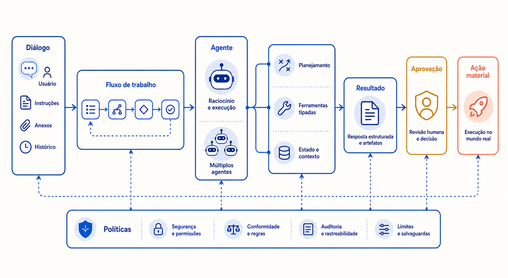

# Conceitos: do diálogo à ação controlada

*Figura — Autonomia não é uma propriedade binária: ela cresce com a capacidade de decidir e agir, e deve encontrar políticas e aprovação antes de cruzar fronteiras materiais.*

## Quatro formas que não devem ser confundidas

Um **chatbot** oferece interação conversacional. Pode responder por conhecimento paramétrico, contexto fornecido ou RAG. Conversar em várias rodadas não implica escolher ferramentas nem produzir efeitos externos. A conversa é uma forma de interface.

Um **copiloto** apoia uma pessoa em uma tarefa: resume, sugere, preenche rascunhos ou propõe uma ação. A pessoa mantém o controle decisório e normalmente aciona o efeito em uma interface convencional. Um botão “aplicar sugestão” pode executar código determinístico; isso não transforma automaticamente o copiloto em agente.

Um **workflow determinístico** tem etapas, transições, condições e tratamento de erros definidos pela aplicação. Uma etapa pode usar um modelo para classificar texto ou gerar conteúdo, mas o modelo não decide livremente a próxima etapa. “Consultar pedido → validar regra → pedir aprovação → atualizar CRM” continua sendo workflow mesmo quando duas etapas são generativas.

Um **agente** é um sistema em que o modelo escolhe pelo menos parte do próximo passo — ferramenta, ordem, decomposição ou interrupção — para perseguir um objetivo, dentro de limites. O artigo [ReAct](https://openreview.net/forum?id=WE_vluYUL-X) investiga a combinação de raciocínio e ações intercaladas; arquiteturalmente, o valor está no ciclo observar–escolher–agir, não em expor raciocínio interno como prova. O trace deve registrar decisões observáveis e resultados, não alegar acesso fiel ao processo mental do modelo.

As categorias descrevem **controle**, não qualidade ou maturidade. Um workflow pode ser superior a um agente; um agente pode conversar; um copiloto pode chamar ferramentas somente de leitura para preparar uma sugestão. Pergunte sempre: quem escolhe a transição, quem executa o efeito e quem responde por ele?

## Geração, decisão e ação

Separe três atos numa trajetória:

- **geração:** produzir texto ou dados candidatos;
- **decisão:** selecionar uma opção segundo objetivo, evidência e política;
- **ação:** causar efeito observável fora da geração, como consultar, reservar, cancelar ou enviar.

O modelo pode participar dos três, mas controles determinísticos devem envolver decisões e ações. Uma proposta de reembolso é geração; verificar limite é regra; registrar reembolso é ação. Misturar os atos em “o agente resolveu” oculta fronteiras de autorização, teste e auditoria.

## Uso de ferramentas e saídas estruturadas

Uma **ferramenta** é uma capacidade exposta ao modelo por uma interface controlada. Pode consultar CRM, calcular frete ou solicitar alteração de pedido. O modelo não deveria montar SQL livre, escolher credenciais nem chamar diretamente qualquer endpoint. Ele produz uma **solicitação de ferramenta**; o orquestrador valida esquema, política, identidade, orçamento e estado antes de executar.

Uma **saída estruturada** restringe a forma, por exemplo a um objeto com `tool_name`, `arguments` e `justification_code`. Esquema válido reduz ambiguidade sintática, mas não garante semântica, autorização ou segurança. `quantidade: 1000` pode ser inteiro válido e ainda violar política. O estudo [Toolformer](https://proceedings.neurips.cc/paper/2023/hash/d842425e4bf79ba039352da0f658a906-Abstract-Conference.html) é uma fonte primária sobre modelos aprendendo a usar ferramentas; em produção corporativa, capacidade de seleção precisa ser cercada por contratos e execução mediada.

## Planejamento e decomposição

**Planejamento** transforma objetivo em passos. Ele pode ser:

- pré-definido pelo workflow;
- proposto de uma vez pelo modelo e validado antes da execução;
- incremental, escolhendo o próximo passo após cada observação;
- híbrido, com macroetapas determinísticas e autonomia local.

Planos não são compromissos confiáveis por si. O ambiente muda: estoque pode acabar entre consulta e reserva; uma aprovação pode expirar. Por isso cada passo revalida precondições e autorização. O agente deve reconhecer conclusão, falta de progresso, limite alcançado e necessidade de escalonamento. Uma regra de “não repetir a mesma ferramenta com os mesmos argumentos e a mesma versão de estado” ajuda a impedir loops, mas não substitui orçamento total.

## Estado, memória e contexto

**Estado da execução** é o registro autoritativo da trajetória: identificador, objetivo, etapa, versão, ações propostas, aprovações, chamadas concluídas, chaves de idempotência, resultados, orçamento consumido e status de compensação. Deve ser durável quando há efeitos, concorrência ou retomada. Atualizações usam controle de versão para impedir duas continuações sobre o mesmo estado.

**Memória de trabalho** é temporária e específica da execução: fatos normalizados, resultados recentes, plano corrente e resumo para caber no contexto. Pode ser reconstruída do estado e expira ao concluir. Não deve virar depósito silencioso de dados pessoais.

**Memória persistente** atravessa execuções: preferências consentidas, fatos duráveis ou lições operacionais aprovadas. Exige finalidade, origem, autorização, prazo, correção e exclusão. A frase do usuário “sempre aprove trocas” não pode se tornar política; conteúdo conversacional não altera autorização.

**Contexto** é a visão enviada ao modelo numa chamada: instruções, objetivo, ferramentas permitidas, recorte do estado, memória autorizada e observações. É transitório e limitado. Estado não cabe inteiro no prompt; memória não é sinônimo de histórico; contexto não é fonte de verdade.

## Políticas como fronteira executável

Políticas determinam quais ferramentas e parâmetros estão disponíveis para aquela identidade, ação, recurso, risco e estado. Devem operar fora do modelo. A descrição “use apenas quando permitido” orienta, mas a autorização real ocorre no executor. O catálogo apresentado ao modelo já deve ser mínimo, e a política é repetida imediatamente antes da ação para lidar com revogação e mudanças.

Uma decisão de política pode retornar `allow`, `deny` ou `require_approval`, acompanhada de versão, motivo e obrigações: mascarar campo, limitar valor, exigir confirmação do cliente ou escolher aprovador. Negação vira resultado explícito; o agente não deve contorná-la por outra ferramenta equivalente.

## Agente único e múltiplos agentes

No **agente único**, um planejador recebe objetivo e catálogo limitado. Há menos mensagens, estados e pontos de coordenação. É a opção inicial quando uma trajetória cabe num contexto controlável e uma equipe pode manter os contratos.

Em **múltiplos agentes**, papéis especializados — atendimento, política, pedido — trocam mensagens ou são coordenados por um supervisor. A divisão pode reduzir contexto por papel e permitir políticas distintas, mas não cria conhecimento nem confiabilidade automaticamente. Multiplica prompts, modelos possíveis, handoffs, latência, custo, estados, permissões e falhas de consenso. “Debate” entre modelos não é aprovação independente se todos compartilham a mesma evidência defeituosa.

Use múltiplos agentes quando houver fronteiras reais: domínios mantidos por equipes diferentes, contextos incompatíveis, competências ou credenciais separadas, ou paralelismo medido. Defina protocolo, proprietário do estado, limite de delegação, formato de entrega e regra de encerramento. Se a motivação for apenas organizar um prompt grande, módulos determinísticos ou ferramentas especializadas costumam ser mais simples.

## O critério de entrada

Um agente é candidato quando: a sequência útil varia de modo difícil de enumerar; ferramentas devolvem feedback verificável; erros podem ser contidos; a tarefa tem conclusão observável; e orçamento/autoridade podem ser delimitados. Rejeite ou limite autonomia quando o caminho é estável, o efeito é irreversível, a autorização é ambígua, o feedback chega tarde ou não existe recuperação proporcional.

Com essa base, passamos de “o que é um agente” para “como integrá-lo sem entregar o controle”: [Padrões e decisões](padroes-e-decisoes.md).
