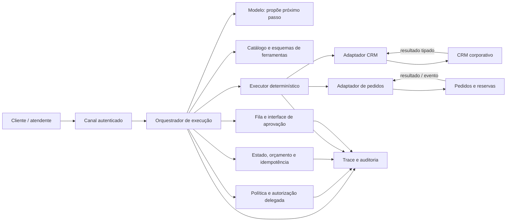
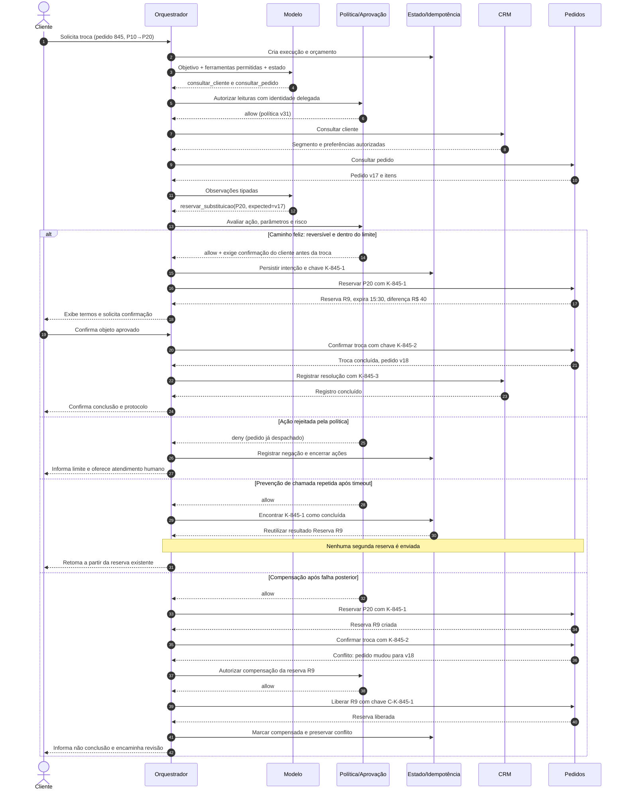

# Exemplo arquitetural: agente de atendimento com CRM e pedidos

## Cenário e limites

Um cliente autenticado pede: “troque o item P10 pelo P20 no pedido 845 e mantenha a data”. O sistema pode consultar cadastro e pedido, verificar elegibilidade, criar reserva temporária e propor a alteração. O cancelamento do item original exige confirmação do cliente; diferença acima de R$ 200 exige supervisor. O agente não muda endereço, concede crédito, escolhe credenciais nem ignora política.

O objetivo não é mostrar uma biblioteca específica. É localizar decisões probabilísticas dentro de uma malha determinística de identidade, contratos, política, estado, aprovação e recuperação.


*Figura 1 — O modelo propõe; o plano de controle valida e executa com autoridade limitada. Sistemas corporativos nunca recebem diretamente texto livre do modelo.*

## Vista de componentes



**Equivalente textual 1.** O canal autentica cliente ou atendente e envia objetivo ao orquestrador. O modelo só propõe próximo passo usando um catálogo mínimo. Antes da execução, o orquestrador consulta política e autorização delegada, reserva orçamento e verifica estado/idempotência. Ações condicionadas seguem para uma interface de aprovação. O executor chama adaptadores de CRM e pedidos com credenciais fora do modelo. Resultados tipados retornam ao orquestrador. Proposta, política, estado, aprovação, chamada e resultado compõem um trace auditável.

## Dois contratos conceituais

```yaml
tool: consultar_pedido
version: 1
effect: read
input:
  order_id: string
  customer_id: string
output:
  order_version: string
  status: [open, shipped, cancelled]
  items: array
  promised_date: date
authorization: order belongs to delegated customer or attendant scope
timeout_ms: 1200
retry: up to 2 for transient errors
audit: actor, subject, order_id, policy_decision_id, result_code
```

```yaml
tool: reservar_substituicao
version: 2
effect: reversible_write
input:
  order_id: string
  expected_order_version: string
  old_sku: string
  new_sku: string
  quantity: integer, 1..5
  idempotency_key: string
output:
  reservation_id: string
  expires_at: timestamp
  price_delta: decimal
errors: [invalid, denied, conflict, unavailable, transient, unknown_outcome]
authorization: delegated order scope plus commercial policy
timeout_ms: 1800
retry: reconcile by idempotency key, then at most 1 transient retry
compensation: liberar_reserva(reservation_id, idempotency_key)
audit: actor, subject, approval_id, policy_version, before/after references
```

Os esquemas não recebem `approved=true` produzido pelo modelo. A política calcula necessidade de aprovação. `expected_order_version` impede alteração sobre pedido que mudou; `idempotency_key` impede duas reservas lógicas; `unknown_outcome` força reconciliação. A compensação é uma ferramenta independente e autorizada.


*Figura 2 — A autonomia varia por ação: conversar, consultar, reservar e confirmar uma troca pertencem a níveis e controles diferentes.*

## Sequência com quatro caminhos obrigatórios



**Equivalente textual 2.** A execução começa com identidade e orçamento. O modelo escolhe leituras; a política autoriza; CRM e pedidos devolvem resultados tipados. No **caminho feliz**, uma reserva reversível é criada com chave idempotente, o cliente confirma exatamente a proposta e a troca é concluída antes de registrar o CRM. Na **ação rejeitada**, a política nega porque o pedido foi despachado; o orquestrador encerra efeitos e oferece atendimento. Na **prevenção de chamada repetida**, o estado encontra a mesma chave já concluída após timeout e reutiliza o resultado, sem enviar segunda reserva. No caminho de **compensação**, uma mudança concorrente impede confirmar a troca; o sistema autoriza e executa a liberação idempotente da reserva, preserva o conflito e informa que a solicitação não foi concluída.

## Estado e invariantes

O registro da execução pode ser resumido assim:

```text
execution_id, objective, actor_id, subject_id, delegated_scopes
status, state_version, current_step, tool_catalog_version
policy_version, proposed_actions[], approval_objects[]
tool_calls[idempotency_key, signature, attempt, outcome, resource_version]
budget[steps, elapsed_ms, tokens, cost, effectful_actions]
compensations[required, status, residual_effect]
trace_id, retention_class
```

Invariantes testáveis:

1. nenhuma chamada ocorre sem decisão de política vigente;
2. nenhuma credencial aparece no contexto do modelo;
3. uma intenção de escrita possui uma chave persistida antes da chamada;
4. timeout de escrita produz reconciliação antes de retry;
5. aprovação vincula ferramenta, parâmetros, evidência e validade;
6. orçamento inclui tentativas, handoffs e compensações;
7. execução só termina `completed` quando efeitos e registros obrigatórios concluem;
8. compensação pendente mantém alerta e dono explícito.

## Falhas e modos degradados

| Falha | Contenção | Recuperação |
|---|---|---|
| política indisponível | negar escrita; permitir apenas informação pública aprovada | restaurar serviço e reavaliar, sem reutilizar autorização antiga |
| CRM indisponível | não inferir segmento nem preferência | workflow abre tarefa com dados mínimos |
| pedidos com circuito aberto | interromper chamadas e não procurar rota paralela | retomar após half-open ou atendimento humano |
| resposta do modelo inválida | rejeitar esquema e permitir uma correção dentro do orçamento | fallback determinístico coleta campos |
| aprovação expirada | não executar | gerar novo objeto após revalidar estado e preço |
| resultado desconhecido | bloquear nova intenção equivalente | reconciliar por chave e recurso |
| compensação falha | marcar `compensation_pending`, alertar e limitar novas ações | operação repete com chave ou corrige manualmente |
| orçamento esgotado | persistir estado e impedir novo efeito | resposta parcial, retomada autorizada ou encaminhamento |

Esse desenho é deliberadamente assimétrico: o modelo tem flexibilidade para propor; controles mantêm autoridade para negar, pausar, deduplicar e compensar. A seguir, aplicamos o desenho a uma operação mais ampla em [Estudo de caso](estudo-de-caso.md).
