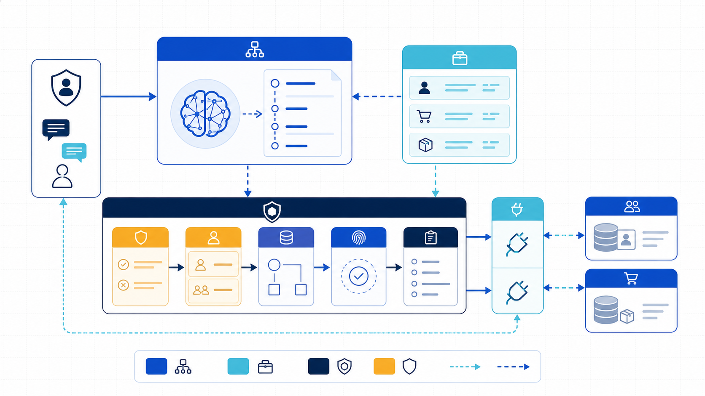
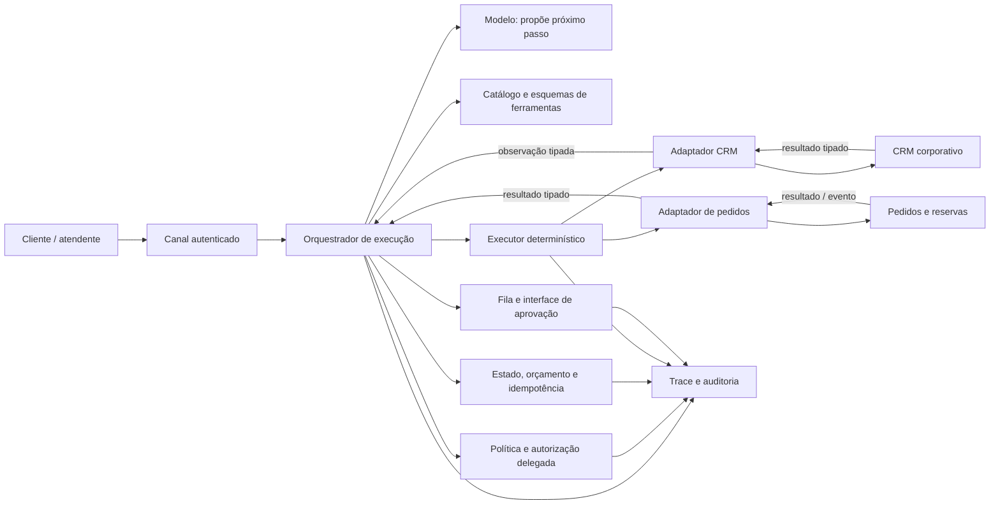
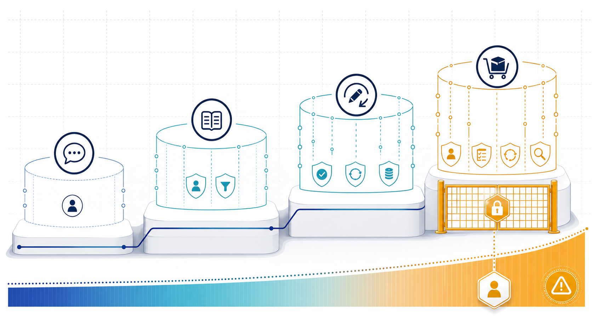
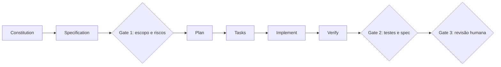
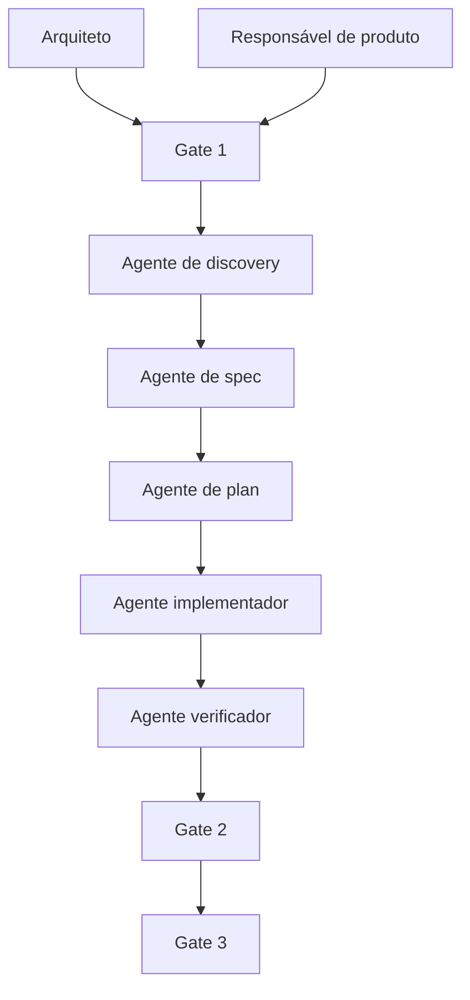
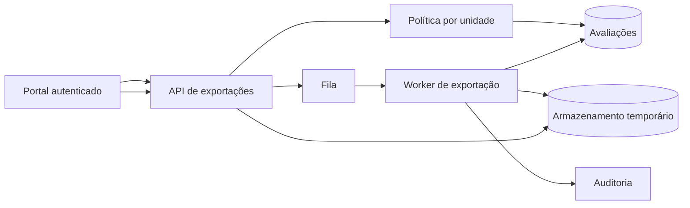

# Exemplo arquitetural: agente de atendimento com CRM e pedidos

## Cenário e limites

Um cliente autenticado pede: “troque o item P10 pelo P20 no pedido 845 e mantenha a data”. O sistema pode consultar cadastro e pedido, verificar elegibilidade, criar reserva temporária e propor a alteração. O cancelamento do item original exige confirmação do cliente; diferença acima de R$ 200 exige supervisor. O agente não muda endereço, concede crédito, escolhe credenciais nem ignora política.

O objetivo não é mostrar uma biblioteca específica. É localizar decisões probabilísticas dentro de uma malha determinística de identidade, contratos, política, estado, aprovação e recuperação.


*Figura 1 — O modelo propõe; o plano de controle valida e executa com autoridade limitada. Sistemas corporativos nunca recebem diretamente texto livre do modelo.*

## Vista de componentes



**Equivalente textual 1.** O canal autentica cliente ou atendente e envia objetivo ao orquestrador. O modelo só propõe próximo passo usando um catálogo mínimo. Antes da execução, o orquestrador consulta política e autorização delegada, reserva orçamento e verifica estado/idempotência. Ações condicionadas seguem para uma interface de aprovação. O executor chama adaptadores de CRM e pedidos com credenciais fora do modelo. Resultados tipados retornam ao orquestrador. Proposta, política, estado, aprovação, chamada e resultado compõem um trace auditável.

## Dois contratos conceituais

```yaml
tool: consultar_pedido
version: 1
effect: read
input:
  order_id: string
  customer_id: string
output:
  order_version: string
  status: [open, shipped, cancelled]
  items: array
  promised_date: date
authorization: order belongs to delegated customer or attendant scope
timeout_ms: 1200
retry: up to 2 for transient errors
audit: actor, subject, order_id, policy_decision_id, result_code
```

```yaml
tool: reservar_substituicao
version: 2
effect: reversible_write
input:
  order_id: string
  expected_order_version: string
  old_sku: string
  new_sku: string
  quantity: integer, 1..5
  idempotency_key: string
output:
  reservation_id: string
  expires_at: timestamp
  price_delta: decimal
errors: [invalid, denied, conflict, unavailable, transient, unknown_outcome]
authorization: delegated order scope plus commercial policy
execution_boundary: deterministic executor and orders adapter only
timeout_ms: 1800
on_timeout:
  local_state: outcome_unknown
  reconciliation: query destination by idempotency key or consume correlated event
retry: only after destination proves no effect; reuse the stable key
after_human_wait: revalidate identity, policy, approval and resource version
compensation: liberar_reserva(reservation_id, idempotency_key)
audit: actor, subject, approval_id, policy_version, before/after references
```

Os esquemas não recebem `approved=true` produzido pelo modelo. A política calcula necessidade de aprovação. `expected_order_version` impede alteração sobre pedido que mudou; `idempotency_key` impede duas reservas lógicas. Timeout deixa o estado local em `outcome_unknown`: somente uma consulta ao destino pela mesma chave, ou um evento correlacionado emitido por ele, pode confirmar o resultado. A compensação é uma ferramenta independente e autorizada, e também atravessa política, estado, executor e adaptador.


*Figura 2 — A autonomia varia por ação: conversar, consultar, reservar e confirmar uma troca pertencem a níveis e controles diferentes.*

## Sequência com quatro caminhos obrigatórios

```mermaid
sequenceDiagram
    autonumber
    actor C as Cliente
    participant O as Orquestrador
    participant M as Modelo
    participant P as Política/Aprovação
    participant S as Estado/Idempotência
    participant X as Executor/Adaptadores
    participant R as CRM
    participant D as Pedidos

    C->>O: Solicita troca (pedido 845, P10→P20)
    O->>S: Cria execução e orçamento
    O->>M: Objetivo + ferramentas permitidas + estado
    M-->>O: consultar_cliente e consultar_pedido
    O->>P: Autorizar leituras com identidade delegada
    P-->>O: allow (política v31)
    O->>X: Executar consultas autorizadas
    X->>R: Consultar cliente
    R-->>X: Segmento e preferências autorizadas
    X->>D: Consultar pedido
    D-->>X: Pedido v17 e itens
    X-->>O: Observações tipadas e versões
    O->>M: Observações tipadas
    M-->>O: reservar_substituicao(P20, expected=v17)
    O->>P: Avaliar identidade, política, parâmetros, pedido v17 e risco

    alt Caminho feliz: reversível e dentro do limite
        P-->>O: allow + exige confirmação do cliente antes da troca
        O->>P: Revalidar identidade, política e pedido v17 para reserva
        P-->>O: allow (política v31, pedido v17)
        O->>S: Persistir intenção reservar + K-845-1
        O->>X: Executor: reservar P20, expected=v17, K-845-1
        X->>D: Adaptador invoca reserva
        D-->>X: Reserva R9, reserva-v1, expira 15:30
        X-->>O: R9, diferença R$ 40
        O->>S: Persistir completed, versões e auditoria before/after
        O-->>C: Exibe termos e solicita confirmação
        C->>O: Confirma objeto aprovado
        O->>P: Revalidar identidade, política, aprovação e pedido v17
        P-->>O: allow (aprovação íntegra e vigente)
        O->>S: Persistir intenção confirmar + K-845-2
        O->>X: Executor: confirmar troca, expected=v17, K-845-2
        X->>D: Adaptador invoca confirmação
        D-->>X: Troca concluída, pedido v18
        X-->>O: Pedido v18 e auditoria before/after
        O->>S: Persistir confirmação completed e pedido v18
        O->>P: Revalidar identidade, política e CRM v12
        P-->>O: allow para registro do resultado
        O->>S: Persistir intenção registrar + K-845-3
        O->>X: Executor: registrar resolução, pedido v18, K-845-3
        X->>R: Adaptador grava com expected=CRM-v12
        R-->>X: Registro concluído, CRM-v13
        X-->>O: CRM-v13 e auditoria before/after
        O->>S: Persistir registro completed
        O-->>C: Confirma conclusão e protocolo
    else Ação rejeitada pela política
        P-->>O: deny (pedido já despachado)
        O->>S: Registrar negação e encerrar ações
        O-->>C: Informa limite e oferece atendimento humano
    else Prevenção de chamada repetida após timeout
        P-->>O: allow
        O->>S: Persistir intenção reservar + K-845-1
        O->>X: Executor: reservar P20, expected=v17, K-845-1
        X->>D: Adaptador invoca reserva com K-845-1
        D-->>X: Reserva R9 criada no destino
        X--xO: Timeout; confirmação não chega
        O->>S: Marcar K-845-1 como outcome_unknown
        O->>X: Reconciliar K-845-1 no destino
        X->>D: Consultar operação por K-845-1
        D-->>X: R9, completed, reserva-v1
        X-->>O: Confirmar R9 como resultado autoritativo
        O->>S: Persistir completed e resultado R9
        Note over O,D: Só após reconciliação; nenhuma segunda reserva é enviada
        O-->>C: Retoma a partir da reserva existente
    else Compensação após falha posterior
        P-->>O: allow
        O->>P: Revalidar identidade, política e pedido v17 para reserva
        P-->>O: allow (pedido v17)
        O->>S: Persistir intenção reservar + K-845-1
        O->>X: Executor: reservar P20, expected=v17, K-845-1
        X->>D: Adaptador invoca reserva
        D-->>X: Reserva R9 criada, reserva-v1
        X-->>O: R9, reserva-v1
        O->>S: Persistir reserva completed e auditoria before/after
        O-->>C: Informa reserva ativa e solicita confirmação
        C->>O: Confirma objeto aprovado
        O->>P: Revalidar identidade, política, aprovação e pedido v17
        P-->>O: allow
        O->>S: Persistir intenção confirmar + K-845-2
        O->>X: Executor: confirmar troca, expected=v17, K-845-2
        X->>D: Adaptador invoca confirmação
        D-->>X: Conflito: pedido atual v18
        X-->>O: conflict, expected=v17, actual=v18
        O->>S: Persistir conflito e compensation_required
        O->>P: Revalidar identidade, política e reserva-v1; autorizar compensação
        P-->>O: allow para liberar R9
        O->>S: Persistir compensação C-K-845-1 e estado compensation_pending
        O->>X: Executor: liberar R9, expected=reserva-v1, C-K-845-1
        X->>D: Adaptador invoca liberação idempotente
        D-->>X: Reserva liberada, reserva-v2
        X-->>O: Compensação concluída e auditoria before/after
        O->>S: Marcar compensada, guardar reserva-v2 e preservar conflito
        O-->>C: Informa não conclusão e encaminha revisão
    end
```

**Equivalente textual 2.** A execução começa com identidade e orçamento. O modelo escolhe leituras; política, executor e adaptadores mediam CRM e pedidos. No **caminho feliz**, antes de cada escrita o sistema revalida identidade, política e versão do recurso, persiste intenção e chave estável e só então o executor chama o adaptador. Depois da espera humana, a confirmação não reutiliza autorização antiga: revalida a aprovação e o pedido v17. Confirmar a troca e registrar o CRM repetem a fronteira determinística e preservam precondições e auditoria. Na **ação rejeitada**, a política nega porque o pedido foi despachado; nenhuma ferramenta de efeito é executada. Na **prevenção de chamada repetida**, o timeout deixa K-845-1 em `outcome_unknown`; o executor consulta o sistema de pedidos pela chave, recebe R9 como resultado autoritativo e só então o estado reutiliza o resultado, sem segunda reserva. No caminho de **compensação**, reserva e confirmação atravessam a mesma fronteira. O conflito de versão exige nova autorização para compensar, intenção `compensation_pending` e chave estável; executor e adaptador liberam R9 com precondição `reserva-v1`, e estado/auditoria preservam versões e efeito residual.

## Pipeline SDD com gates humanos



*Figura — Pipeline SDD: a specification governa implementação e verificação.*

**Equivalente textual 3.** Constitution e specification antecedem plan e tasks. O Gate 1 valida escopo e riscos; Verify produz evidências; o Gate 2 compara testes e spec; o Gate 3 aprova a revisão humana antes da liberação.



*Figura — Squad híbrida: 2 papéis humanos, 5 agentes de IA e 3 gates.*

**Equivalente textual 4.** O arquiteto e o responsável de produto definem o primeiro gate. Cinco agentes atuam em discovery, spec, plan, implementação e verificação. Os gates 2 e 3 retêm validação de evidência e revisão humana.

## Exemplo completo — exportação auditável de avaliações

Considere uma plataforma educacional que precisa permitir a coordenadores exportar avaliações de sua própria unidade. O pedido inicial chega assim:

> “Adicione um botão para exportar as avaliações em CSV.”

Um agente poderia localizar a tela, criar um endpoint e gerar o arquivo. O resultado demonstraria atividade, não correção. O pedido não informa quais avaliações, quem pode exportar, quais colunas são sensíveis, qual volume existe, quanto tempo o arquivo permanece disponível nem como auditar. A seguir, percorremos a feature `027-exportacao-avaliacoes` como transformação de intenção em evidência.

### Constitution aplicável

O projeto possui cinco princípios:

1. autorização é verificada no servidor para cada recurso;
2. dados pessoais não entram em logs ou arquivos além do necessário;
3. comportamento novo começa por teste observável;
4. processamento superior a dois segundos é assíncrono;
5. toda dependência nova exige ADR e alternativa considerada.

Esses princípios já restringem soluções. Gerar o CSV inteiro no navegador violaria autorização e exposição de dados. Manter a requisição aberta por dezenas de segundos violaria o princípio assíncrono. Adicionar uma biblioteca sem necessidade exigiria justificativa.

### Specify: o contrato de produto

Depois de entrevista com PO e coordenação, a spec registra:

```markdown
# Feature 027 — Exportação auditável de avaliações

## Problema
Coordenadores precisam analisar avaliações fora da plataforma, mas hoje
solicitam extrações manuais à equipe de dados.

## História P1
Como coordenadora de uma unidade,
quero exportar avaliações filtradas por período,
para analisar resultados sem receber dados de outras unidades.

## Requisitos funcionais
FR-01 — O sistema deve aceitar período inicial e final.
FR-02 — O sistema deve limitar registros à unidade autorizada.
FR-03 — O sistema deve produzir CSV UTF-8 com cabeçalho estável.
FR-04 — O sistema deve informar estado pendente, concluído, falho ou expirado.
FR-05 — O sistema deve permitir download por 24 horas.
FR-06 — O sistema deve registrar solicitante, filtros, contagem e política.

## Atributos de qualidade
NFR-01 — 95% das exportações de até 50 mil linhas concluem em 30 segundos.
NFR-02 — Nenhum arquivo contém nome, e-mail ou documento do estudante.
NFR-03 — Falha do worker não duplica arquivos ou eventos de auditoria.

## Fora de escopo
Agendamento recorrente, envio por e-mail e formatos XLSX/PDF.
```

O fora de escopo evita que o agente “melhore” a feature com envio automático. A lista de colunas permitidas é uma regra positiva; “não incluir dados sensíveis” seria insuficiente porque exige que cada implementador adivinhe o que é sensível.

### Clarify: incertezas que alteram arquitetura

O agente identifica perguntas:

1. Coordenador pode gerenciar mais de uma unidade?
2. O período máximo é ilimitado?
3. O arquivo precisa refletir correções ocorridas após a solicitação?
4. O download pode ser compartilhado?
5. Auditoria precisa guardar conteúdo ou somente metadados?

As respostas aprovadas são:

- a autorização fornece conjunto de unidades e a solicitação escolhe uma;
- período máximo de 12 meses;
- exportação usa snapshot lógico do momento da solicitação;
- link não é compartilhável e exige nova autenticação;
- auditoria guarda metadados, hash e contagem, nunca conteúdo.

Uma hipótese permanece: 50 mil linhas cabem no limite de 30 segundos com a infraestrutura atual. Ela vira experimento do plano, não fato inventado.

### Gate 1 — intenção

O PO revisa versão `spec-v3` e confirma:

- regras representam o processo;
- critérios cobrem caminho feliz, negação, expiração e falha;
- colunas e fora de escopo estão corretos;
- hipótese de desempenho está visível;
- prioridade P1 justifica a entrega.

O gate registra aprovador, commit e data. Alterar colunas ou autorização depois invalida o aceite; correção apenas gramatical não.

### Plan: arquitetura e decisões

O arquiteto e o agente de planejamento produzem:



*Figura — Arquitetura da feature 027, com autorização antes de criar ou baixar exportações.*

**Equivalente textual 5.** O portal envia solicitação autenticada à API. A política limita a unidade. A API persiste o pedido e publica trabalho na fila. O worker lê avaliações autorizadas, gera arquivo temporário e registra metadados. Download volta pela API, que revalida identidade e expiração antes de emitir acesso curto ao objeto.

Decisões:

- processamento assíncrono por fila existente;
- tabela `export_request` guarda filtros, política, status e objeto;
- worker recebe `request_id`, não filtros livres;
- CSV é escrito em fluxo para limitar memória;
- armazenamento aplica expiração de 24 horas;
- download exige autenticação e unidade ainda autorizada;
- chave de idempotência combina solicitante e token de requisição;
- falha pode retomar somente a partir de estado conhecido.

O experimento executa consulta e serialização com 50 mil linhas sintéticas. Critério: p95 local inferior a 20 segundos para preservar margem operacional. Resultado de 12 segundos sustenta o plano; não prova SLO de produção, que permanece monitorado.

### Contratos e seams

A seam principal é a API pública:

```text
POST /exports
input: unit_id, start_date, end_date, idempotency_key
output: request_id, status=pending
errors: forbidden, invalid_period, rate_limited

GET /exports/{request_id}
output: pending | completed(download_expires_at) | failed | expired

POST /exports/{request_id}/download
output: redirect temporário ou stream autorizado
errors: forbidden, not_ready, expired
```

Eventos internos:

```text
ExportRequested(request_id)
ExportCompleted(request_id, row_count, content_hash, object_version)
ExportFailed(request_id, reason_code)
```

Os testes observam API, evento e arquivo resultante; não afirmam que o worker chama funções privadas numa ordem específica.

### Gate 2 — arquitetura

O arquiteto aprova:

- diagrama e fronteiras de confiança;
- contratos e erros;
- modelo de estado;
- ADR de processamento assíncrono;
- política de dados e expiração;
- seams de teste;
- experimento de desempenho;
- estratégia de migração sem indisponibilidade.

A tabela nova pode ser adicionada antes de o código usá-la. Isso permite implantação *expand–contract*: expandir schema, publicar aplicação, depois remover qualquer flag temporária.

### Tasks: fatias verticais

O plano vira seis tarefas:

| ID | Fatia | Evidência independente | Bloqueio |
|---|---|---|---|
| T1 | criar solicitação autorizada | POST retorna pending; unidade indevida retorna forbidden | nenhum |
| T2 | gerar CSV de uma unidade | worker produz cabeçalho/linhas permitidas | T1 |
| T3 | consultar e baixar | estado concluído e download reautorizado | T2 |
| T4 | expirar | após 24 h, arquivo indisponível e estado expired | T3 |
| T5 | idempotência e falha | repetição retorna mesmo request; retry não duplica evento | T1/T2 |
| T6 | telemetria e SLO | métricas de fila, duração, linhas e falhas | T2 |

T4 e T5 podem avançar em paralelo depois de contratos estabilizados, desde que não editem a mesma máquina de estados sem coordenação. O grafo deixa essa dependência explícita.

### Implement: uma fatia em red–green–refactor

Para T1, o teste nasce antes:

```python
def test_coordinator_cannot_export_another_unit(client, coordinator):
    response = client.post(
        "/exports",
        user=coordinator.with_units("sul"),
        json={"unit_id": "norte", "start_date": "2026-01-01",
              "end_date": "2026-01-31", "idempotency_key": "exp-17"},
    )
    assert response.status_code == 403
    assert export_repository.count() == 0
```

O teste falha porque o endpoint não existe. O implementador adiciona a menor trajetória que autentica, valida período, avalia unidade e persiste somente se permitido. Depois roda teste e regressão. A refatoração extrai política apenas se melhora a seam; não cria framework genérico de autorização “para o futuro”.

Durante T2, o agente descobre que a consulta atual retorna nome do estudante, embora a spec permita apenas identificador pseudonimizado e notas agregadas. Ele não simplesmente remove a coluna no serializador: atualiza a consulta para não carregar o dado desnecessário e registra a decisão de minimização. Se o requisito fosse ambíguo, pausaria para clarificação.

### Verify: quatro perspectivas

**Spec.** Cada FR e NFR possui tarefa e evidência. Agendamento e e-mail não aparecem no diff. O relatório aponta que NFR-01 ainda depende de observação em produção.

**Standards.** A revisão encontra um serviço chamado `ExportManager`; o domínio usa “solicitação de exportação”. O nome é corrigido. Nenhuma dependência nova foi introduzida.

**Segurança.** Casos negativos confirmam outra unidade, link expirado, revogação posterior e tentativa de adivinhar `request_id`. Logs contêm identificadores controlados, não conteúdo.

**Operação.** Dashboards recebem fila, duração, volume, falhas e expiração. O runbook descreve worker parado, armazenamento indisponível e backlog.

### Gate 3 — entrega

O pull request apresenta:

- link para `spec-v3`, plano e ADR;
- tarefas concluídas;
- matriz requisito → teste;
- resultados da suíte;
- relatório de segurança;
- resultado do experimento;
- risco residual do SLO;
- plano de rollback.

O PO confirma comportamento e fora de escopo. O arquiteto confirma decisões, segurança e operação. Só então o merge é autorizado.

### Feedback de produção

Na primeira semana, p95 é 42 segundos para 50 mil linhas. Isso não é tratado apenas como “otimização”. A produção contradiz NFR-01. O time atualiza evidência, investiga consulta e fila, cria tarefa de melhoria e mantém o requisito. Se o negócio aceitar 45 segundos, a spec muda por decisão explícita; o código não redefine silenciosamente a expectativa.

Esse fechamento demonstra a principal diferença: SDD não termina quando gera código. Ele mantém um circuito entre intenção, arquitetura, implementação e realidade operacional.

## Estado e invariantes

O registro da execução pode ser resumido assim:

```text
execution_id, objective, actor_id, subject_id, delegated_scopes
status, state_version, current_step, tool_catalog_version
policy_version, proposed_actions[], approval_objects[]
tool_calls[idempotency_key, signature, attempt, outcome, resource_version]
budget[steps, elapsed_ms, tokens, cost, effectful_actions]
compensations[required, status, residual_effect]
trace_id, retention_class
```

Invariantes testáveis:

1. nenhuma chamada ocorre sem decisão de política vigente;
2. nenhuma credencial aparece no contexto do modelo;
3. uma intenção de escrita possui uma chave persistida antes da chamada;
4. timeout de escrita persiste `outcome_unknown`; antes de reutilizar resultado ou fazer retry, o executor reconcilia no destino por chave de idempotência ou evento correlacionado autoritativo;
5. aprovação vincula ferramenta, parâmetros, evidência e validade;
6. orçamento inclui tentativas, handoffs e compensações;
7. execução só termina `completed` quando efeitos e registros obrigatórios concluem;
8. compensação pendente mantém alerta e dono explícito.

## Falhas e modos degradados

| Falha | Contenção | Recuperação |
|---|---|---|
| política indisponível | negar escrita; permitir apenas informação pública aprovada | restaurar serviço e reavaliar, sem reutilizar autorização antiga |
| CRM indisponível | não inferir segmento nem preferência | workflow abre tarefa com dados mínimos |
| pedidos com circuito aberto | interromper chamadas e não procurar rota paralela | retomar após half-open ou atendimento humano |
| resposta do modelo inválida | rejeitar esquema e permitir uma correção dentro do orçamento | fallback determinístico coleta campos |
| aprovação expirada | não executar | gerar novo objeto após revalidar estado e preço |
| resultado desconhecido | persistir `outcome_unknown` e bloquear nova intenção equivalente | reconciliar no destino por chave ou evento correlacionado; reutilizar só após confirmação autoritativa e repetir apenas se o destino provar ausência de efeito |
| compensação falha | marcar `compensation_pending`, alertar e limitar novas ações | operação repete com chave ou corrige manualmente |
| orçamento esgotado | persistir estado e impedir novo efeito | resposta parcial, retomada autorizada ou encaminhamento |

Esse desenho é deliberadamente assimétrico: o modelo tem flexibilidade para propor; controles mantêm autoridade para negar, pausar, deduplicar e compensar. A seguir, aplicamos o desenho a uma operação mais ampla em [Estudo de caso](estudo-de-caso.md).
