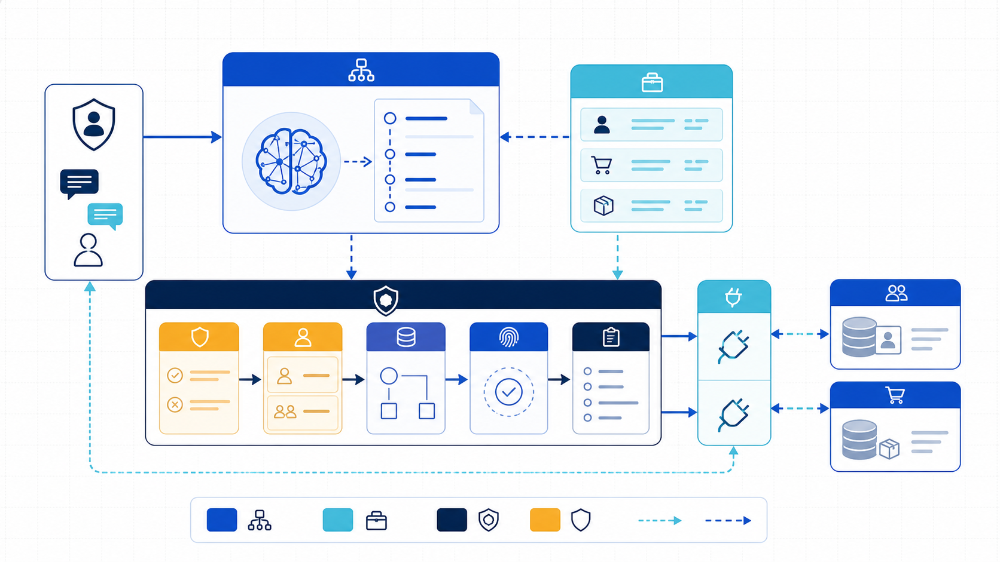
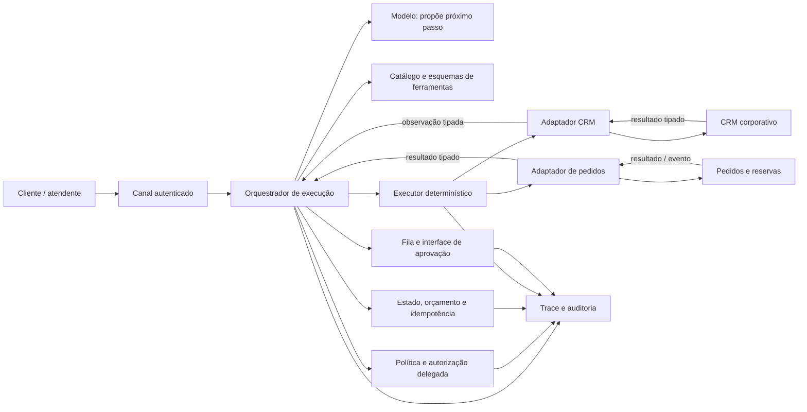
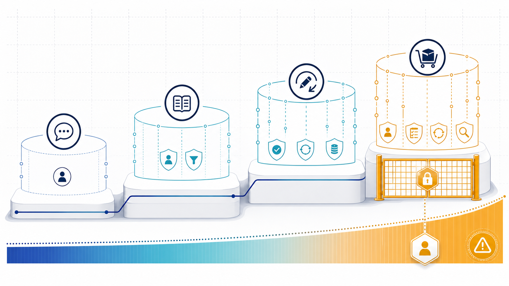
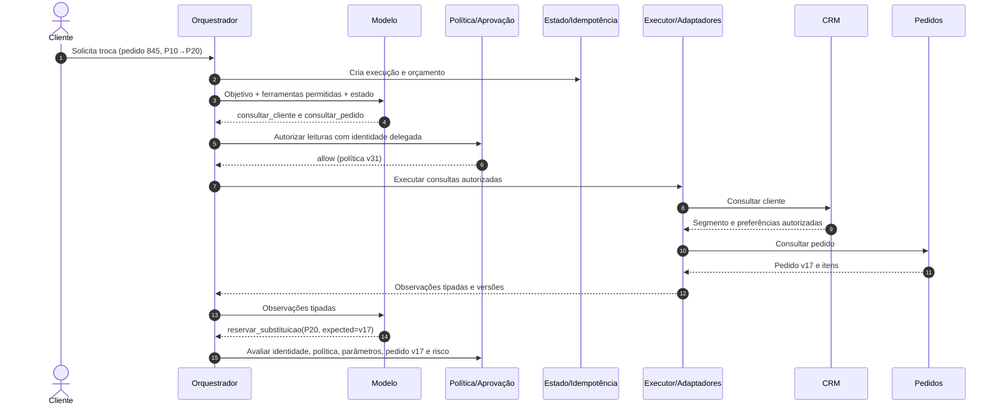
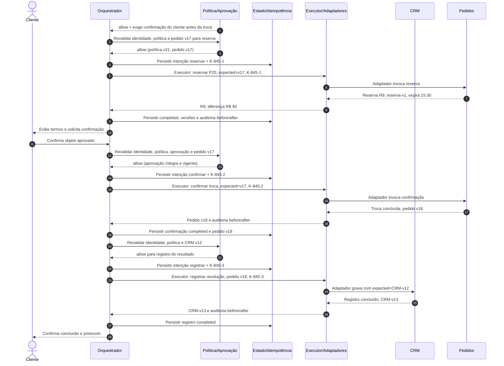
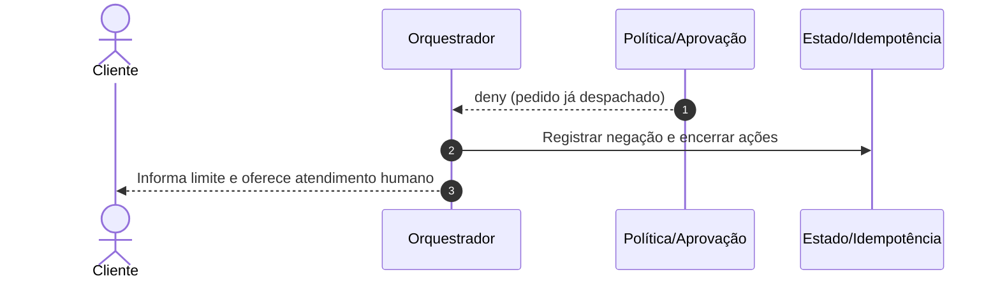
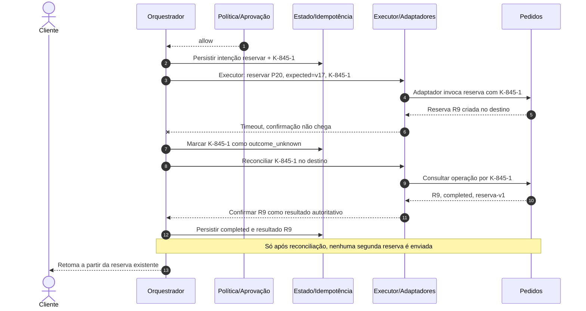
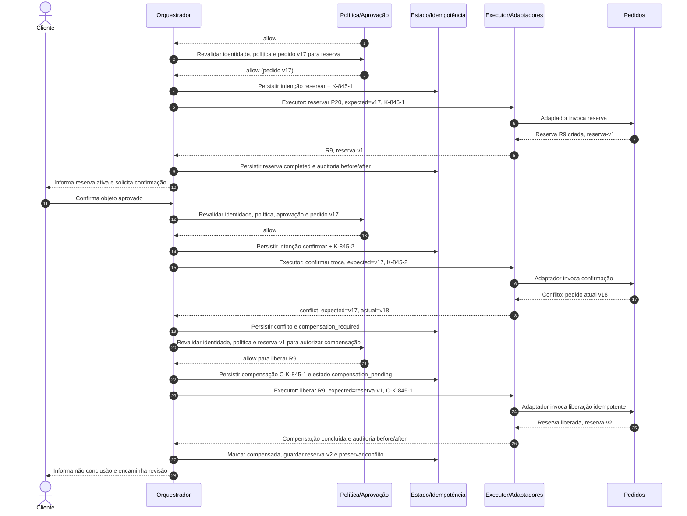

# Exemplo arquitetural: agente de atendimento com CRM e pedidos

## Cenário e limites

**Boreal** é a empresa fictícia deste módulo: um varejo com CRM e sistema de pedidos próprios, que quer usar IA generativa no atendimento de pós-venda sem entregar ao modelo autoridade sobre os dois sistemas. Este exemplo mostra onde essa autoridade é concedida e onde ela continua negada. Você vai reencontrar este mesmo cenário, simplificado, na Oficina de ferramentas — os traces `ESTADO`, `CHAVE` e `RESULTADO` que você vai rodar ali vêm exatamente da fronteira de decisão descrita aqui.

O caso: um cliente autenticado pede "troque o item P10 pelo P20 no pedido 845 e mantenha a data". O sistema pode consultar cadastro e pedido, verificar elegibilidade, criar reserva temporária e propor a alteração. O cancelamento do item original exige confirmação do cliente; diferença acima de R$ 200 exige supervisor. O agente não muda endereço, concede crédito, escolhe credenciais nem ignora política.

Reencontre aqui o vocabulário de [geração, decisão e ação](controle-e-autonomia.md#geracao-decisao-e-acao): o pedido do cliente em linguagem natural é **geração**; verificar elegibilidade, limite de valor e versão do pedido é **decisão**; criar a reserva e efetivar a troca é **ação**. O objetivo deste exemplo não é mostrar uma biblioteca específica — é localizar essas três etapas dentro da malha determinística de identidade, contratos, política, estado, aprovação e recuperação que os temas de [ferramentas e contratos](ferramentas-e-contratos.md) a [autonomia orçada](autonomia-orcada.md) descrevem.


*Figura 1 — O modelo propõe; o plano de controle valida e executa com autoridade limitada. Sistemas corporativos nunca recebem diretamente texto livre do modelo.*

## Visão de componentes


```mermaid
flowchart LR
    U["Cliente / atendente"] --> UI["Canal autenticado"]
    UI --> ORQ["Orquestrador de execução"]
    ORQ --> LLM["Modelo: propõe próximo passo"]
    ORQ --> CAT["Catálogo e esquemas de ferramentas"]
    ORQ --> POL["Política e autorização delegada"]
    ORQ --> ST["Estado, orçamento e idempotência"]
    ORQ --> APR["Fila e interface de aprovação"]
    ORQ --> EXE["Executor determinístico"]
    EXE --> ACRM["Adaptador CRM"]
    EXE --> APED["Adaptador de pedidos"]
    ACRM --> CRM["CRM corporativo"]
    APED --> PED["Pedidos e reservas"]
    CRM -- "resultado tipado" --> ACRM
    PED -- "resultado / evento" --> APED
    ACRM -- "observação tipada" --> ORQ
    APED -- "resultado tipado" --> ORQ
    ORQ --> AUD["Trace e auditoria"]
    POL --> AUD
    ST --> AUD
    EXE --> AUD
    APR --> AUD
```

**Equivalente textual 1.** O canal autentica cliente ou atendente e envia objetivo ao orquestrador. O modelo só propõe próximo passo usando um catálogo mínimo. Antes da execução, o orquestrador consulta política e autorização delegada, reserva orçamento e verifica estado/idempotência. Ações condicionadas seguem para uma interface de aprovação. O executor chama adaptadores de CRM e pedidos com credenciais fora do modelo. Resultados tipados retornam ao orquestrador. Proposta, política, estado, aprovação, chamada e resultado compõem um trace auditável.

## Dois contratos conceituais

Volte ao [contrato mínimo de ferramenta](ferramentas-e-contratos.md#comece-pelo-contrato-de-ferramenta): nome e versão, classe de efeito, esquemas de entrada e saída, erros tipados, identidade e autorização, idempotência, timeout e retry, auditoria e compensação. Os dois contratos abaixo preenchem exatamente esses campos para o pedido 845, um de leitura e outro de escrita, e por isso têm formas bem diferentes.

**`consultar_pedido`** é o contrato mais simples possível: `effect: read` significa que não há nada a desfazer, e por isso não aparecem campos de idempotência nem de compensação. Ele só devolve o que já existe.

```yaml
tool: consultar_pedido
version: 1
effect: read
input:
  order_id: string
  customer_id: string
output:
  order_version: string
  status: [open, shipped, cancelled]
  items: array
  promised_date: date
authorization: order belongs to delegated customer or attendant scope
timeout_ms: 1200
retry: up to 2 for transient errors
audit: actor, subject, order_id, policy_decision_id, result_code
```

**`reservar_substituicao`** é o contrato de escrita, e é aqui que o restante dos campos do contrato mínimo entra em jogo: idempotência, timeout com reconciliação e compensação, nenhum dos quais fazia sentido para uma simples leitura.

```yaml
tool: reservar_substituicao
version: 2
effect: reversible_write
input:
  order_id: string
  expected_order_version: string
  old_sku: string
  new_sku: string
  quantity: integer, 1..5
  idempotency_key: string
output:
  reservation_id: string
  expires_at: timestamp
  price_delta: decimal
errors: [invalid, denied, conflict, unavailable, transient, unknown_outcome]
authorization: delegated order scope plus commercial policy
execution_boundary: deterministic executor and orders adapter only
timeout_ms: 1800
on_timeout:
  local_state: outcome_unknown
  reconciliation: query destination by idempotency key or consume correlated event
retry: only after destination proves no effect; reuse the stable key
after_human_wait: revalidate identity, policy, approval and resource version
compensation: liberar_reserva(reservation_id, idempotency_key)
audit: actor, subject, approval_id, policy_version, before/after references
```

Percorrendo os campos que fazem esse contrato diferente do anterior: os esquemas não recebem `approved=true` produzido pelo modelo. Quem calcula a necessidade de aprovação é a política, fora do contrato. `expected_order_version` impede alteração sobre um pedido que já mudou de versão desde a leitura. `idempotency_key` impede que a mesma intenção produza duas reservas lógicas. O bloco `on_timeout` deixa o estado local em `outcome_unknown`: só uma consulta ao destino pela mesma chave, ou um evento correlacionado emitido por ele, pode confirmar o resultado, nunca uma nova tentativa às cegas. Por fim, `compensation` aponta para uma ferramenta independente e autorizada, que atravessa a mesma política, estado, executor e adaptador que a reserva original: desfazer também é uma ação controlada, não um atalho.


*Figura 2 — A autonomia varia por ação: conversar, consultar, reservar e confirmar uma troca pertencem a níveis e controles diferentes.*

## Sequência com quatro caminhos obrigatórios

A mesma proposta de escrita pode seguir por quatro caminhos diferentes, dependendo de como política, estado e sistema de destino respondem. Um único diagrama com os quatro caminhos embutidos fica difícil de acompanhar: por isso, a sequência abaixo está separada em cinco partes — a consulta e a proposta, que são comuns aos quatro casos, e cada um dos quatro desfechos possíveis.

### Diagrama 0 — Consulta e proposta da escrita (comum aos quatro caminhos)

Antes de qualquer decisão sobre a escrita, o orquestrador autentica o cliente, consulta CRM e pedidos com leituras já autorizadas, e só então apresenta ao modelo as observações tipadas. O modelo propõe `reservar_substituicao`; a política recebe essa proposta para avaliar identidade, parâmetros, versão do pedido e risco — e é exatamente aí que os quatro caminhos a seguir se separam.


```mermaid
sequenceDiagram
    autonumber
    actor C as Cliente
    participant O as Orquestrador
    participant M as Modelo
    participant P as Política/Aprovação
    participant S as Estado/Idempotência
    participant X as Executor/Adaptadores
    participant R as CRM
    participant D as Pedidos

    C->>O: Solicita troca (pedido 845, P10→P20)
    O->>S: Cria execução e orçamento
    O->>M: Objetivo + ferramentas permitidas + estado
    M-->>O: consultar_cliente e consultar_pedido
    O->>P: Autorizar leituras com identidade delegada
    P-->>O: allow (política v31)
    O->>X: Executar consultas autorizadas
    X->>R: Consultar cliente
    R-->>X: Segmento e preferências autorizadas
    X->>D: Consultar pedido
    D-->>X: Pedido v17 e itens
    X-->>O: Observações tipadas e versões
    O->>M: Observações tipadas
    M-->>O: reservar_substituicao(P20, expected=v17)
    O->>P: Avaliar identidade, política, parâmetros, pedido v17 e risco
```

**Equivalente textual.** O cliente solicita a troca; o orquestrador cria a execução e reserva orçamento antes de qualquer chamada ao modelo. O modelo só propõe leituras — consultar cliente e consultar pedido —, nunca a escrita diretamente. A política autoriza essas leituras pela identidade delegada, e só depois delas o executor consulta CRM e pedidos pelos adaptadores. As observações tipadas (segmento, pedido v17) voltam ao modelo, que então propõe a escrita: `reservar_substituicao` para o item P20, com a versão de pedido esperada. É essa proposta que a política avalia a seguir — o resultado dessa avaliação é o que diferencia os quatro caminhos abaixo.

### Diagrama 1 — Caminho feliz: reversível e dentro do limite

Este é o desfecho mais comum: a política autoriza a reserva, mas ainda exige confirmação do cliente antes de efetivar a troca.


```mermaid
sequenceDiagram
    autonumber
    actor C as Cliente
    participant O as Orquestrador
    participant P as Política/Aprovação
    participant S as Estado/Idempotência
    participant X as Executor/Adaptadores
    participant R as CRM
    participant D as Pedidos

    P-->>O: allow + exige confirmação do cliente antes da troca
    O->>P: Revalidar identidade, política e pedido v17 para reserva
    P-->>O: allow (política v31, pedido v17)
    O->>S: Persistir intenção reservar + K-845-1
    O->>X: Executor: reservar P20, expected=v17, K-845-1
    X->>D: Adaptador invoca reserva
    D-->>X: Reserva R9, reserva-v1, expira 15:30
    X-->>O: R9, diferença R$ 40
    O->>S: Persistir completed, versões e auditoria before/after
    O-->>C: Exibe termos e solicita confirmação
    C->>O: Confirma objeto aprovado
    O->>P: Revalidar identidade, política, aprovação e pedido v17
    P-->>O: allow (aprovação íntegra e vigente)
    O->>S: Persistir intenção confirmar + K-845-2
    O->>X: Executor: confirmar troca, expected=v17, K-845-2
    X->>D: Adaptador invoca confirmação
    D-->>X: Troca concluída, pedido v18
    X-->>O: Pedido v18 e auditoria before/after
    O->>S: Persistir confirmação completed e pedido v18
    O->>P: Revalidar identidade, política e CRM v12
    P-->>O: allow para registro do resultado
    O->>S: Persistir intenção registrar + K-845-3
    O->>X: Executor: registrar resolução, pedido v18, K-845-3
    X->>R: Adaptador grava com expected=CRM-v12
    R-->>X: Registro concluído, CRM-v13
    X-->>O: CRM-v13 e auditoria before/after
    O->>S: Persistir registro completed
    O-->>C: Confirma conclusão e protocolo
```

**Equivalente textual.** A política autoriza a reserva, mas condiciona a troca à confirmação do cliente — a aprovação da reserva ainda não libera o efeito final. Antes de cada escrita, o orquestrador revalida identidade, política e a versão do pedido; isso acontece três vezes neste caminho — para reservar, para confirmar depois que o cliente aceita, e para registrar o resultado no CRM — porque cada revalidação cobre um efeito novo, não repete a checagem anterior. Cada escrita persiste uma intenção com chave própria (`K-845-1`, `K-845-2`, `K-845-3`) antes de o executor chamar o adaptador, e cada resultado é gravado com auditoria antes/depois. A confirmação do cliente não reaproveita a aprovação da reserva: ela dispara uma nova revalidação, porque uma aprovação já concedida não deveria autorizar um efeito posterior sem reconferir o estado atual.

### Diagrama 2 — Ação rejeitada pela política

O caminho mais curto dos quatro: a política nega a reserva porque o pedido já foi despachado, e nenhuma ferramenta de efeito chega a ser chamada.


```mermaid
sequenceDiagram
    autonumber
    actor C as Cliente
    participant O as Orquestrador
    participant P as Política/Aprovação
    participant S as Estado/Idempotência

    P-->>O: deny (pedido já despachado)
    O->>S: Registrar negação e encerrar ações
    O-->>C: Informa limite e oferece atendimento humano
```

**Equivalente textual.** A política nega a reserva porque o pedido 845 já foi despachado — uma regra de negócio que nenhuma revalidação futura reverteria. O orquestrador registra a negação no estado e informa o cliente, oferecendo atendimento humano. Nenhum executor ou adaptador chega a ser acionado: a negação interrompe a trajetória antes de qualquer efeito, não depois dele.

### Diagrama 3 — Prevenção de chamada repetida após timeout

Aqui a chamada de reserva é enviada, mas a confirmação não retorna a tempo. O ponto central é que o sistema não assume sucesso nem tenta de novo às cegas: ele reconcilia pela chave antes de decidir o que fazer.


```mermaid
sequenceDiagram
    autonumber
    actor C as Cliente
    participant O as Orquestrador
    participant P as Política/Aprovação
    participant S as Estado/Idempotência
    participant X as Executor/Adaptadores
    participant D as Pedidos

    P-->>O: allow
    O->>S: Persistir intenção reservar + K-845-1
    O->>X: Executor: reservar P20, expected=v17, K-845-1
    X->>D: Adaptador invoca reserva com K-845-1
    D-->>X: Reserva R9 criada no destino
    X--xO: Timeout, confirmação não chega
    O->>S: Marcar K-845-1 como outcome_unknown
    O->>X: Reconciliar K-845-1 no destino
    X->>D: Consultar operação por K-845-1
    D-->>X: R9, completed, reserva-v1
    X-->>O: Confirmar R9 como resultado autoritativo
    O->>S: Persistir completed e resultado R9
    Note over O,D: Só após reconciliação, nenhuma segunda reserva é enviada
    O-->>C: Retoma a partir da reserva existente
```

**Equivalente textual.** A reserva é criada no destino, mas a confirmação se perde a caminho do orquestrador — um timeout, não um erro. Em vez de repetir a chamada ou assumir que ela falhou, o orquestrador marca `K-845-1` como `outcome_unknown` e manda o executor reconciliar: consultar o destino pela mesma chave, não criar uma nova. A resposta dessa consulta — `R9`, `completed` — é o resultado autoritativo; só depois dela o estado é fechado como `completed`. O cliente retoma a partir da reserva que já existe, sem nunca saber que houve um timeout no meio do caminho.

### Diagrama 4 — Compensação após falha posterior

O caminho mais longo dos quatro: a reserva é criada normalmente, mas ao confirmar a troca o pedido já mudou de versão — um conflito que exige desfazer o que já tinha sido feito.


```mermaid
sequenceDiagram
    autonumber
    actor C as Cliente
    participant O as Orquestrador
    participant P as Política/Aprovação
    participant S as Estado/Idempotência
    participant X as Executor/Adaptadores
    participant D as Pedidos

    P-->>O: allow
    O->>P: Revalidar identidade, política e pedido v17 para reserva
    P-->>O: allow (pedido v17)
    O->>S: Persistir intenção reservar + K-845-1
    O->>X: Executor: reservar P20, expected=v17, K-845-1
    X->>D: Adaptador invoca reserva
    D-->>X: Reserva R9 criada, reserva-v1
    X-->>O: R9, reserva-v1
    O->>S: Persistir reserva completed e auditoria before/after
    O-->>C: Informa reserva ativa e solicita confirmação
    C->>O: Confirma objeto aprovado
    O->>P: Revalidar identidade, política, aprovação e pedido v17
    P-->>O: allow
    O->>S: Persistir intenção confirmar + K-845-2
    O->>X: Executor: confirmar troca, expected=v17, K-845-2
    X->>D: Adaptador invoca confirmação
    D-->>X: Conflito: pedido atual v18
    X-->>O: conflict, expected=v17, actual=v18
    O->>S: Persistir conflito e compensation_required
    O->>P: Revalidar identidade, política e reserva-v1 para autorizar compensação
    P-->>O: allow para liberar R9
    O->>S: Persistir compensação C-K-845-1 e estado compensation_pending
    O->>X: Executor: liberar R9, expected=reserva-v1, C-K-845-1
    X->>D: Adaptador invoca liberação idempotente
    D-->>X: Reserva liberada, reserva-v2
    X-->>O: Compensação concluída e auditoria before/after
    O->>S: Marcar compensada, guardar reserva-v2 e preservar conflito
    O-->>C: Informa não conclusão e encaminha revisão
```

**Equivalente textual.** A reserva é criada sem problema — o mesmo caminho do Diagrama 1 até este ponto. O conflito aparece só na confirmação: o adaptador tenta confirmar contra `expected=v17`, mas o pedido já está em `v18` — algo mudou o pedido entre a reserva e a confirmação. Esse conflito não é revertido silenciosamente: o estado registra `compensation_required`, a política é consultada de novo, agora para autorizar a compensação — liberar a reserva `R9` —, e só então o executor chama o adaptador de liberação, com sua própria chave (`C-K-845-1`). O resultado fica marcado como compensado, não como concluído: a auditoria preserva o conflito, e o cliente é informado de que a troca não se completou.

**Lendo os quatro caminhos juntos.** O caminho feliz e a compensação começam de forma idêntica — reserva bem-sucedida — e só divergem na confirmação. A rejeição pela política nunca chega a criar estado de escrita. E o caminho de timeout mostra que "a chamada não voltou" não é o mesmo que "a chamada falhou": só a reconciliação pela chave decide qual das duas é verdade.

## Prioridades e fitness functions

Segurança, autorização e auditabilidade prevalecem sobre a menor latência. Confiabilidade exige idempotência, reconciliação e compensação; modificabilidade justifica adaptadores e contratos explícitos. Produto e plataforma acompanham tempo e custo, enquanto Segurança responde pela política e Operações pelas execuções pendentes.

As fitness functions bloqueiam promoção quando uma ação material não possui decisão de política, identidade delegada e chave de idempotência válidas; quando uma aprovação não referencia objeto e parâmetros imutáveis; quando uma compensação permanece pendente sem alerta; ou quando o trace não permite reconstruir versões de estado, política, ferramenta e resultado. Elas transformam os limites arquiteturais em verificações contínuas, não em intenções de projeto.

## Estado e invariantes

O registro da execução pode ser resumido assim:

```text
execution_id, objective, actor_id, subject_id, delegated_scopes
status, state_version, current_step, tool_catalog_version
policy_version, proposed_actions[], approval_objects[]
tool_calls[idempotency_key, signature, attempt, outcome, resource_version]
budget[steps, elapsed_ms, tokens, cost, effectful_actions]
compensations[required, status, residual_effect]
trace_id, retention_class
```

Invariantes testáveis:

1. nenhuma chamada ocorre sem decisão de política vigente;
2. nenhuma credencial aparece no contexto do modelo;
3. uma intenção de escrita possui uma chave persistida antes da chamada;
4. timeout de escrita persiste `outcome_unknown`; antes de reutilizar resultado ou fazer retry, o executor reconcilia no destino por chave de idempotência ou evento correlacionado autoritativo;
5. aprovação vincula ferramenta, parâmetros, evidência e validade;
6. orçamento inclui tentativas, handoffs e compensações;
7. execução só termina `completed` quando efeitos e registros obrigatórios concluem;
8. compensação pendente mantém alerta e dono explícito.

## Falhas e modos degradados

| Falha | Contenção | Recuperação |
|---|---|---|
| política indisponível | negar escrita; permitir apenas informação pública aprovada | restaurar serviço e reavaliar, sem reutilizar autorização antiga |
| CRM indisponível | não inferir segmento nem preferência | workflow abre tarefa com dados mínimos |
| pedidos com circuito aberto | interromper chamadas e não procurar rota paralela | retomar após half-open ou atendimento humano |
| resposta do modelo inválida | rejeitar esquema e permitir uma correção dentro do orçamento | fallback determinístico coleta campos |
| aprovação expirada | não executar | gerar novo objeto após revalidar estado e preço |
| resultado desconhecido | persistir `outcome_unknown` e bloquear nova intenção equivalente | reconciliar no destino por chave ou evento correlacionado; reutilizar só após confirmação autoritativa e repetir apenas se o destino provar ausência de efeito |
| compensação falha | marcar `compensation_pending`, alertar e limitar novas ações | operação repete com chave ou corrige manualmente |
| orçamento esgotado | persistir estado e impedir novo efeito | resposta parcial, retomada autorizada ou encaminhamento |

Esse desenho é deliberadamente assimétrico: o modelo tem flexibilidade para propor; controles mantêm autoridade para negar, pausar, deduplicar e compensar. A seguir, aplicamos o desenho a uma operação mais ampla em [Estudo de caso](estudo-de-caso.md).
