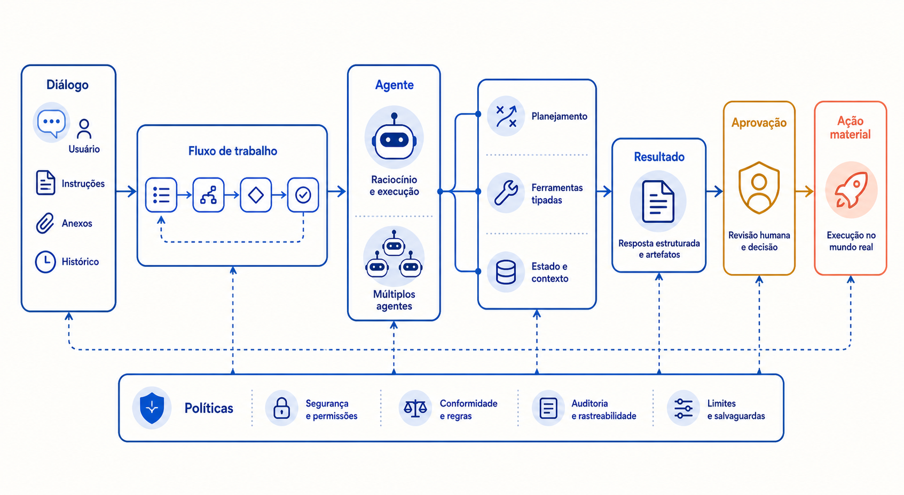

# Agentes e integração com sistemas corporativos

*Figura — Autonomia não é uma propriedade binária: ela cresce com a capacidade de decidir e agir, e deve encontrar políticas e aprovação antes de cruzar fronteiras materiais.*

## Pergunta orientadora

> **Quando permitir que o modelo escolha e execute ações?**

Responder bem não autoriza agir. Um modelo pode redigir uma mensagem convincente e, ainda assim, escolher a ferramenta errada, repetir um pedido, usar parâmetros fora da política ou prosseguir quando deveria interromper. Ao conectar geração a CRM, estoque, pagamentos ou pedidos, a arquitetura passa a governar efeitos sobre pessoas e sistemas. A questão deixa de ser apenas “a resposta parece correta?” e passa a incluir “quem autorizou a ação, com qual identidade, dentro de quais limites e como recuperamos uma falha?”.

Este módulo estuda essa passagem sem tratar “agente” como sinônimo de chatbot sofisticado. Um **chatbot** sustenta uma conversa; um **copiloto** ajuda uma pessoa a decidir ou produzir; um **workflow determinístico** tem sequência e transições definidas pela aplicação; um **agente** delega ao modelo a escolha de próximos passos ou ferramentas dentro de fronteiras explícitas. Uma solução pode combinar os quatro, e o rótulo da interface não determina onde está o controle.

**Tempo estimado de leitura:** 60–90 minutos, sem contar o estudo de caso e os exercícios de projeto.

## O que você aprenderá

Ao final, você deverá conseguir:

1. distinguir geração, decisão e ação em uma trajetória;
2. justificar quando a variabilidade do plano cria valor suficiente para aceitar autonomia;
3. especificar ferramentas por contratos validáveis, não por descrições vagas;
4. separar contexto, estado de execução, memória de trabalho e memória persistente;
5. escolher APIs, mensagens, eventos e adaptadores conforme consistência e acoplamento;
6. preservar identidade, autorização delegada, idempotência e auditoria em cada ação;
7. aplicar timeout, retry, circuit breaker e compensação sem duplicar efeitos;
8. classificar autonomia por ação e risco, com aprovação humana e fallback;
9. comparar agente único e múltiplos agentes por evidência operacional.
10. priorizar segurança, confiabilidade, auditabilidade, latência, custo e modificabilidade, declarando tensões, responsáveis e fitness functions.
11. reconhecer o arnês como objeto de projeto, nomear seus componentes e prever o efeito do erro composto numa trajetória;
12. escolher o nível de loop adequado a uma tarefa e declarar condição de parada, orçamento e comportamento no esgotamento.

## Pré-requisitos e princípio de continuidade

Retomaremos a [sequência de decisão](../modulo-2-desenho-conceitual/descricao-arquitetural.md#uma-sequencia-de-decisao): gerar, acessar conhecimento, agir e só então conceder autonomia. Também reutilizaremos autorização, proveniência e suficiência do [Módulo 3](../modulo-3-rag/index.md). Uma evidência recuperada não concede permissão de escrita; uma ferramenta disponível não precisa ser oferecida ao modelo; uma saída estruturada válida não prova que a ação é apropriada.

Os atributos de [Autonomia](../referencia/atributos-de-qualidade.md#autonomia), [Confiabilidade](../referencia/atributos-de-qualidade.md#confiabilidade), [Segurança](../referencia/atributos-de-qualidade.md#seguranca) e [Observabilidade](../referencia/atributos-de-qualidade.md#observabilidade) serão tratados como cenários mensuráveis. A tese do módulo é simples: **autonomia deve ser orçada e observável**. “Orçada” significa limitada por escopo, ações, etapas, tempo, custo e risco. “Observável” significa reconstruir propostas, decisões de política, aprovações, chamadas, resultados e compensações sem registrar segredos desnecessários.

## Mapa do módulo

| Etapa | Página | Foco |
|---|---|---|
| 1 | [Abertura](index.md) | contrato de aprendizagem e limites de autonomia |
| 2 | [Chatbots, copilotos e agentes](controle-e-autonomia.md) | chatbot, copiloto, workflow e agente; critério de entrada |
| 3 | [Ferramentas e tool calling](ferramentas-e-contratos.md) | contrato de ferramenta, catálogo mínimo e adaptadores |
| 4 | [Estado, memória e contexto](estado-memoria-e-politica.md) | planejamento, estado, memória, contexto e política executável |
| 5 | [Integração e resiliência](efeito-e-recuperacao.md) | identidade delegada, idempotência, timeout, compensação e auditoria |
| 6 | [Níveis de autonomia](autonomia-orcada.md) | matriz de autonomia, orçamento, interrupção e fallback |
| 7 | [Engenharia de arnês](arnes.md) | o que cerca o modelo, erro composto e diagnóstico por tipo de falha |
| 8 | [Loops agênticos](loops.md) | quatro níveis de loop, condição de parada e o verificador |
| 9 | [Vibe coding, assistência e SDD](../modulo-5-especificacao/modos-de-trabalho.md) | vibe coding, assistência e SDD; spec viva e constitution |
| 10 | [O fluxo SDD](../modulo-5-especificacao/fluxo.md) | oito etapas, três gates humanos e oito artefatos |
| 11 | [Decisões e limites do SDD](../modulo-5-especificacao/decisoes.md) | as oito decisões do fluxo, dois ADRs e os limites do método |
| 12 | [Exemplo arquitetural](exemplo-arquitetural.md) | sucesso, repetição, compensação, pipeline SDD e squad híbrida |
| 13 | [Estudo de caso](estudo-de-caso.md) | solicitações com CRM, estoque, pedidos e política |
| 14 | [Oficina de ferramentas](oficina-de-ferramentas.md) | uma evidência breve, comparável e segura, com ablação de arnês |
| 15 | [Exercícios](exercicios.md) | autonomia, trace, crítica e projeto |
| 16 | [Síntese e referências](sintese-e-referencias.md) | checklist, autoavaliação e fontes |

## Um teste inicial

Considere: “se o cliente pedir troca, consulte pedido e estoque; reserve o item; solicite confirmação; cancele a reserva anterior; atualize o CRM”. A sequência parece conhecida, mas exceções variam: item substituto, política por canal, estoque concorrente e aprovação para diferença de valor. Isso não prova que um agente seja necessário. Primeiro enumere decisões, efeitos e falhas. Depois compare um workflow com ramificações a um agente limitado. A escolha depende do valor da adaptação e da capacidade de controlar trajetórias, não da novidade da tecnologia.

Comece pela linguagem precisa em [Chatbots, copilotos e agentes](controle-e-autonomia.md).
