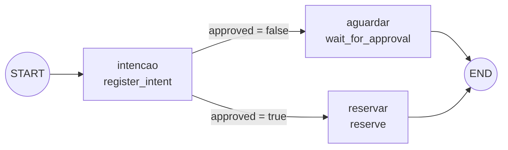

# Oficina de ferramentas — workflow, aprovação e efeito simulado

**Objetivo Bloom:** Aplicar e Analisar.

Esta oficina não pede que você se lembre de uma passagem anterior para executar um comando: cada experimento reconstrói o cenário e repete o comando necessário. Ela executa um workflow local que separa intenção, aprovação e efeito. Nenhuma chamada alcança CRM, estoque, pedidos ou qualquer sistema externo.

## Bússola da prática

Uma intenção proposta pelo modelo tem dois destinos possíveis:

- sem aprovação, ela **para**: nenhum efeito ocorre e o estado registra o motivo;
- aprovada, ela **produz um efeito** protegido por uma chave que impede duplicação, mesmo que a mesma intenção seja repetida.

| Experimento | Pergunta arquitetural | Evidência que você coletará |
| --- | --- | --- |
| A | Uma intenção sem aprovação pode produzir efeito? | `ESTADO aguardando_aprovacao`, `RESULTADO nenhum efeito` |
| B | A mesma intenção repetida cria um segundo efeito? | `RESULTADO RES-501` e trace de repetição sem nova reserva |
| C | O que a arquitetura faz quando a confirmação de uma escrita nunca chega? | `outcome_unknown` e o plano de reconciliação |

Ao final, você conseguirá localizar, num trace, o ponto exato em que uma intenção deixa de ser texto proposto e passa a produzir efeito.

## Ferramenta

**LangGraph** é uma biblioteca open source, da mesma equipe do LangChain, para orquestrar uma aplicação como um **grafo de estado explícito**. Em vez de deixar o modelo decidir livremente "o que fazer a seguir", você declara os passos possíveis como nós, as transições entre eles como arestas, e uma função de decisão escolhe qual aresta seguir a cada passo. Nada disso é geração de texto: é uma máquina de estados comum, escrita em Python puro. O que torna o LangGraph relevante para este módulo é justamente essa separação — um nó *pode* chamar um modelo, mas orquestração, decisão de política e persistência de estado continuam fora dele, na mesma fronteira que a [matriz de autonomia](padroes-e-decisoes.md#matriz-de-autonomia) descreve.

### Um Alô, mundo em LangGraph

Antes do grafo Boreal, veja o menor programa possível na biblioteca funcionando de ponta a ponta: um único nó, sem decisão nenhuma, numa pasta descartável e independente de `oficina-m4`.

**macOS**

```bash
mkdir alo-langgraph
cd alo-langgraph
python3 -m venv .venv
source .venv/bin/activate
python3 -m pip install langgraph
```

**Linux**

```bash
mkdir alo-langgraph
cd alo-langgraph
python3 -m venv .venv
source .venv/bin/activate
python3 -m pip install langgraph
```

**Windows (PowerShell)**

```powershell
mkdir alo-langgraph
cd alo-langgraph
python -m venv .venv
.venv\Scripts\Activate.ps1
python -m pip install langgraph
```

Com o ambiente ativo, salve o código abaixo em um arquivo chamado `alo_mundo.py`:

```python
from typing import TypedDict
from langgraph.graph import END, START, StateGraph


class Estado(TypedDict):
    mensagem: str


def saudar(estado: Estado) -> Estado:
    return {"mensagem": "Alô, mundo"}


grafo = StateGraph(Estado)
grafo.add_node("saudar", saudar)
grafo.add_edge(START, "saudar")
grafo.add_edge("saudar", END)

app = grafo.compile()
resultado = app.invoke({"mensagem": ""})
print(resultado["mensagem"])
```

Execute:

```bash
python3 alo_mundo.py
```

A saída é uma única linha, sem nada a mais:

```text
Alô, mundo
```

Quatro peças de setup bastam para ter um grafo completo, compilado e executável: a classe `Estado`, o nó `saudar` e duas arestas fixas, uma ligando `START` a `saudar` e outra ligando `saudar` a `END`. Cada um desses elementos (estado, nó, aresta, `START`/`END`, `compile`, `invoke`) reaparece no grafo Boreal a seguir; a única peça nova lá é a aresta condicional, porque o Alô, mundo não tem decisão para tomar. Terminada a leitura desta seção, apague `alo-langgraph` — ela não tem relação com a pasta `oficina-m4` que você vai criar na Instalação, mais abaixo.

### Estado, nós e arestas: o vocabulário do grafo

Todo grafo LangGraph gira em torno de quatro elementos. Os quatro apareceram no Alô, mundo acima em sua forma mais simples; agora vale ver como eles crescem em `troca_boreal.py`, antes de rodar o script.

**Estado.** É um esquema único, compartilhado por todos os nós do grafo — o "quadro" que a execução inteira lê e escreve. Em `troca_boreal.py`, esse esquema é declarado como um `TypedDict`:

```python
class ExchangeState(TypedDict, total=False):
    approved: bool
    repeated: bool
    idempotency_key: str
    status: str
    result: str
    trace: list[str]
```

`total=False` significa que nem todo campo precisa existir em todo momento da execução — o estado começa incompleto e vai sendo preenchido conforme os nós rodam. Repare que `trace` é uma lista: ela funciona como um rastro mínimo de auditoria, cada nó anexando uma entrada, exatamente o tipo de evidência que [Padrões e decisões](padroes-e-decisoes.md#auditoria-e-observabilidade) exige de um sistema com efeito.

**Nós.** Um nó é uma função Python comum, que recebe o estado atual e devolve **só os campos que quer atualizar**, não o estado inteiro:

```python
def register_intent(state: ExchangeState) -> ExchangeState:
    return {"status": "reserva_pendente", "trace": ["intenção registrada"]}
```

O LangGraph funde essa atualização parcial no estado global antes de passar o controle adiante. Isso importa porque, se dois nós fossem escritos por pessoas diferentes, nenhum dos dois precisaria conhecer todos os campos do estado — só os que lê e os que escreve. Cada nó é registrado no grafo com um nome próprio: `workflow.add_node("intencao", register_intent)`.

**Arestas.** Uma aresta comum (`add_edge`) liga um nó a outro sem nenhuma decisão: sempre que a execução chega ao primeiro, ela segue para o segundo. Uma **aresta condicional** (`add_conditional_edges`) é diferente: ela chama uma função de decisão com o estado atual, recebe uma string de volta, e usa essa string para escolher, dentro de um mapa fixo, qual nó vem a seguir:

```python
def decide_approval(state: ExchangeState) -> str:
    return "reserve" if state["approved"] else "wait"

workflow.add_conditional_edges("intencao", decide_approval, {"wait": "aguardar", "reserve": "reservar"})
```

É exatamente aqui que a política do grafo Boreal decide o caminho — não o modelo, não o usuário: uma função determinística que olha para `state["approved"]` e devolve uma de duas strings previstas.

**START, END e compilação.** `START` e `END` são marcadores reservados do LangGraph: toda execução entra pelo nó ligado a `START` e termina quando alcança um nó ligado a `END`. Depois de declarar nós e arestas, `workflow.compile()` transforma essa descrição num objeto executável; `invoke(estado_inicial)` roda o grafo do início ao fim, de forma síncrona, e devolve o estado final acumulado.

### O grafo Boreal, nó a nó



O grafo tem três nós e uma única decisão. `intencao` (função `register_intent`) sempre roda primeiro: registra a intenção no `trace` e marca `status: "reserva_pendente"`, sem produzir nenhum efeito ainda. Dali, a aresta condicional `decide_approval` lê `state["approved"]`, o valor que veio de `--aprovado true`/`--aprovado false` na linha de comando, e escolhe entre dois nós terminais: `aguardar` (função `wait_for_approval`), que só registra a parada em `aguardando_aprovacao`, ou `reservar` (função `reserve`), que produz o efeito simulado `RES-501` e verifica `state["repeated"]` para decidir se anexa "reserva simulada criada" ou "repetição reconhecida: nenhuma nova reserva" ao trace. Os dois nós terminais levam a `END`; não existe caminho de volta.

Note o que o grafo *não* faz: em nenhum ponto ele chama um modelo de linguagem. A "intenção" chega pronta, via `--aprovado`, porque o objetivo desta oficina é isolar a mecânica de aprovação e idempotência da variabilidade de um modelo real — o script deixa claro, por construção, que decidir e agir são passos determinísticos, mesmo quando a proposta que os disparou tivesse vindo de um modelo.

**Decisão arquitetural em foco:** em que fronteira uma intenção deixa de ser texto proposto e passa a produzir um [efeito](conceitos.md#geracao-decisao-e-acao) que exige [autorização](padroes-e-decisoes.md#matriz-de-autonomia)?

## Pré-requisitos

- Python 3.10 ou superior e terminal.
- Uma pasta descartável e somente os dados sintéticos do laboratório.
- O arquivo `troca_boreal.py` baixado na etapa seguinte.

## Instalação

### macOS

```bash
python3 --version
mkdir oficina-m4
cd oficina-m4
python3 -m venv .venv
source .venv/bin/activate
python3 -m pip install langgraph langchain-ollama
```

### Linux

No terminal Linux, execute:

```bash
python3 --version
mkdir oficina-m4
cd oficina-m4
python3 -m venv .venv
source .venv/bin/activate
python3 -m pip install langgraph langchain-ollama
```

### Windows

No PowerShell, execute:

```powershell
python --version
mkdir oficina-m4
cd oficina-m4
python -m venv .venv
.venv\Scripts\Activate.ps1
python -m pip install langgraph langchain-ollama
```

> **Ao retomar a prática:** se você fechar o terminal, volte para `oficina-m4` e reative o ambiente: no macOS/Linux, `source .venv/bin/activate`; no Windows/PowerShell, `.venv\Scripts\Activate.ps1`. Com o ambiente ativo, `python` funciona nos três sistemas.

## Preparação do laboratório

Baixe [troca_boreal.py](../assets/labs/modulo-4/troca_boreal.py) para a pasta `oficina-m4`. O arquivo contém um pedido fictício `PED-104`, uma [chave de idempotência](padroes-e-decisoes.md#idempotencia-concorrencia-e-prevencao-de-repeticao) `TROCA-PED-104-1` e uma reserva simulada `RES-501`.

```bash
ls troca_boreal.py
```

O script é o workflow inteiro: cada nó devolve um estado tipado e o grafo escolhe entre aguardar aprovação ou reservar. Não há ferramenta externa escondida.

## Execução

Você executará cada comando dentro de `oficina-m4/`, com o ambiente virtual ativo. O script não guarda estado entre chamadas: cada execução parte do mesmo pedido `PED-104`, e é o argumento `--aprovado` que muda o caminho percorrido pelo grafo.

## Receita principal

Siga os experimentos em ordem: A mostra a parada segura, B mostra o efeito aprovado e a repetição contida, C, de extensão, trata o caso em que a confirmação nunca chega. Em uma aula curta, execute A em grupo e B em duplas; C fica para quem terminar antes ou para o desafio assíncrono. Cada bloco de experimento repete cenário, pergunta e comando para poder ser realizado de forma independente.

## Resultado esperado

Você produzirá três rastros comparáveis: parada segura, efeito simulado aprovado e repetição idempotente. Eles demonstram o fluxo de controle destes parâmetros; não provam que a autorização de uma organização real está correta.

## Interpretação

Leia a saída em duas camadas. Primeiro, verifique o estado determinístico — as linhas `ESTADO`, `CHAVE` e `RESULTADO`. Depois, avalie se essa evidência sustenta a leitura que você faria em linguagem natural. Uma resposta do modelo não substitui o [resultado autoritativo](conceitos.md#estado-memoria-e-contexto) do sistema.

## Roteiro sugerido para aula

### Experimento A — intenção sem efeito

**Situação**

Um cliente pede a troca de um item do pedido `PED-104`. Nenhuma aprovação foi concedida ainda.

**Pergunta de investigação**

Uma intenção do modelo, sozinha, pode produzir um efeito sobre o pedido?

**Objetivo**

Distinguir proposta e autorização.

**Pré-requisito**

Script instalado.

**Execute**

```bash
python troca_boreal.py --aprovado false
```

**Observe**

`ESTADO aguardando_aprovacao` e `RESULTADO nenhum efeito`.

**Interprete**

O grafo propôs a troca, mas nenhum nó de efeito foi alcançado: a [decisão de escrita](conceitos.md#geracao-decisao-e-acao) exige aprovação antes de qualquer chamada a um sistema de destino. O modelo participa da geração; não decide sozinho a autorização.

**Compare**

Pedido em linguagem natural e o [estado autoritativo](conceitos.md#estado-memoria-e-contexto) impresso pelo script — a frase do cliente não é evidência de efeito.

**Questões exploratórias:**

- Que dado do estado mostra que nenhuma reserva ocorreu — e o que essa ausência evidencia sobre a fronteira entre [decisão e ação](conceitos.md#geracao-decisao-e-acao)?
- Por que um modelo não deve decidir a [aprovação](padroes-e-decisoes.md#matriz-de-autonomia) por conta própria?
- Onde a [identidade](padroes-e-decisoes.md#identidade-do-usuario-e-autorizacao-delegada) e a [política](conceitos.md#politicas-como-fronteira-executavel) entrariam em um sistema real?

### Experimento B — aprovação e idempotência

**Situação**

A mesma troca do Experimento A, agora aprovada — e, em seguida, solicitada de novo com a mesma chave.

**Pergunta de investigação**

Repetir a mesma intenção, já aprovada, produz um segundo efeito?

**Objetivo**

Observar uma [escrita simulada](conceitos.md#geracao-decisao-e-acao) e sua repetição.

**Pré-requisito**

Experimento A executado.

**Execute**

```bash
python troca_boreal.py --aprovado true
python troca_boreal.py --aprovado true --repetir
```

**Observe**

Na primeira chamada, `RESULTADO RES-501`. Na segunda, o mesmo `RES-501` e um trace declarando que nenhuma nova reserva foi criada.

**Interprete**

A [chave de idempotência](padroes-e-decisoes.md#idempotencia-concorrencia-e-prevencao-de-repeticao) `TROCA-PED-104-1` é persistida antes da chamada e reutilizada na repetição — por isso o resultado se repete sem duplicar o efeito. O resultado autoritativo vem do sistema simulado, não de uma nova resposta do modelo.

**Compare**

Primeira execução e segunda execução: o estado muda de `aguardando_aprovacao` (Experimento A) para `reservado`, e a chave permanece a mesma nas duas chamadas aprovadas.

**Questões exploratórias:**

- Quem deve criar e guardar a chave de idempotência?
- Que falha uma [chave duplicada](padroes-e-decisoes.md#idempotencia-concorrencia-e-prevencao-de-repeticao) evita?
- Por que a resposta do modelo não substitui o resultado autoritativo?

### Experimento C — resultado desconhecido

**Situação**

Imagine que a chamada de reserva do Experimento B fosse enviada e a confirmação se perdesse antes de chegar — o script não reproduz esse cenário sozinho; você vai raciocinar sobre ele a partir dos traces que já coletou.

**Pergunta de investigação**

Se a confirmação de uma escrita nunca chega, o que a arquitetura deve fazer antes de tentar de novo?

**Objetivo**

Planejar recuperação após confirmação ausente.

**Pré-requisito**

Experimentos A e B executados.

**Execute**

Sem novo comando: descreva por escrito o ponto exato em que a chamada do Experimento B seria interrompida, antes de `RESULTADO` aparecer.

**Observe**

O limite entre repetir cegamente e [reconciliar](padroes-e-decisoes.md#idempotencia-concorrencia-e-prevencao-de-repeticao) pela chave existente.

**Interprete**

Se a confirmação de `TROCA-PED-104-1` fosse interrompida, o estado correto seria `outcome_unknown`: a arquitetura deveria [consultar o registro pela chave antes de tentar novamente](padroes-e-decisoes.md#idempotencia-concorrencia-e-prevencao-de-repeticao), não repetir a chamada às cegas nem assumir sucesso pela ausência de erro.

**Compare**

[Retry cego](padroes-e-decisoes.md#timeout-retry-e-circuit-breaker), consulta por chave e [escalonamento](padroes-e-decisoes.md#orcamentos-interrupcao-e-fallback).

**Questões exploratórias:**

- Que [componente](conceitos.md#responsabilidades-e-fronteiras-de-componente) deve persistir `outcome_unknown`?
- Qual dado é necessário para a reconciliação?
- Quando a [revisão humana](padroes-e-decisoes.md#matriz-de-autonomia) é um controle obrigatório?

## Evidência a entregar

Entregue as três saídas ou uma tabela equivalente e uma conclusão de até cinco linhas.

| Execução | Estado | Chave | Resultado | O que a arquitetura comprovou? |
|---|---|---|---|---|
| Sem aprovação |  |  |  |  |
| Com aprovação |  |  |  |  |
| Repetição |  |  |  |  |

Explique qual condição impede a reserva, como a repetição é contida e como você trataria `outcome_unknown`. Registre também uma fitness function verificável — por exemplo, a mesma intenção com a mesma chave não pode produzir dois efeitos — e quem responde por seu alerta.

## Limpeza e contingência

Saia do ambiente com `deactivate` e apague a pasta `oficina-m4` quando terminar. Se houver erro, confira `python --version`, a ativação do ambiente e `python -m pip show langgraph`. Registre a mensagem e corrija a instalação local antes de continuar; não conecte o exercício a sistemas reais.

## Extensão — mini-fluxo Spec Kit

Esta segunda parte transforma uma solicitação curta em artefatos verificáveis. O objetivo não é aprender comandos por memorização, mas observar como cada etapa reduz uma incerteza diferente.

### Cenário sintético

A empresa fictícia Boreal possui um serviço pequeno que classifica o estado de pedidos. A nova demanda chega assim:

> “Permita marcar um pedido como aguardando confirmação do cliente.”

O repositório de laboratório não contém dados reais, credenciais ou integração externa. A feature altera apenas uma máquina de estados sintética.

Regras que o PO confirma:

- somente pedidos `em_separacao` podem mudar para `aguardando_confirmacao`;
- pedidos `despachados` ou `cancelados` são rejeitados;
- a transição registra ator, instante e motivo;
- repetir a mesma solicitação não cria segundo evento;
- a confirmação expira em 48 horas;
- envio de mensagem ao cliente está fora do escopo.

### Resultado de aprendizagem

Ao final, você deverá distinguir:

- requisito de decisão técnica;
- [fato de hipótese](conceitos.md#3-clarify-que-ambiguidades-mudariam-a-solucao);
- história de usuário de tarefa;
- critério de aceite de teste interno;
- [gate humano](conceitos.md#tres-gates-dois-papeis-humanos) de aprovação automática;
- evidência de atividade de evidência de conformidade.

### Preparar o ambiente do Spec Kit

A documentação oficial evolui. Consulte a versão fixada pela turma e não instale diretamente a versão mais recente num repositório corporativo sem revisão.

Com `uv` disponível:

```bash
uv tool install specify-cli
specify --help
mkdir boreal-sdd
cd boreal-sdd
git init
specify init . --integration copilot
```

Se a integração usada no seu ambiente for outra, escolha-a durante `specify init` ou siga a opção indicada pelo docente. O próprio `specify init` imprime, em "Next Steps", o nome exato de cada comando ou skill instalado para a integração escolhida — use essa lista como referência, pois o formato muda entre versões e integrações (por exemplo, `/speckit-constitution` com hífen na integração `copilot` desta prática, em vez do `/speckit.constitution` com ponto usado abaixo como notação genérica). Os artefatos são o objeto da aula, não a sintaxe exata da interface.

### Passo 0 — escrever uma constitution pequena

Execute no agente compatível:

```text
/speckit.constitution
O projeto Boreal deve:
1. manter transições de estado explícitas;
2. escrever teste antes de comportamento novo;
3. preservar idempotência de comandos;
4. registrar auditoria sem dados pessoais;
5. rejeitar mudanças fora do escopo da feature.
```

Abra a [constitution](conceitos.md#constitution-principios-antes-da-feature) gerada. Verifique se as frases produzem consequência. “Código deve ter qualidade” é vago; “comportamento novo começa por teste que falha” pode bloquear uma implementação.

**Gate 0 — princípios**

Responda:

- Que plano seria rejeitado por cada princípio?
- Algum princípio prescreve tecnologia sem necessidade?
- Há conflito entre simplicidade e auditoria?

Edite o documento até conseguir responder. Registre o commit:

```bash
git add .
git commit -m "docs: establish Boreal development principles"
```

### Passo 1 — gerar a specification

Execute:

```text
/speckit.specify
Adicionar o estado aguardando confirmação do cliente ao serviço Boreal.
Somente pedidos em separação podem entrar nesse estado. A transição
registra ator, instante e motivo, é idempotente e expira em 48 horas.
Não enviar mensagens e não conectar sistemas externos.
```

Leia [`spec.md`](conceitos.md#a-spec-como-artefato-central-e-vivo) antes de aceitar. Procure:

- problema e ator;
- história prioritária;
- requisitos funcionais;
- critérios de aceite;
- casos extremos;
- fora de escopo;
- marcadores de incerteza.

O agente pode ter inventado detalhes: formato do identificador, fuso horário, política de reativação ou papel autorizado. Marque-os como desconhecidos. Não deixe plausibilidade virar requisito.

### Passo 2 — clarificar uma pergunta por vez

Use `/speckit.clarify` ou conduza manualmente:

1. Quem pode solicitar a transição?
2. O que acontece quando 48 horas terminam?
3. Repetição usa qual identidade lógica?
4. Motivo é texto livre ou código?
5. Como o consumidor observa rejeição?

Para o laboratório, adote:

- papel `atendimento`;
- expiração retorna pedido a `em_separacao`;
- chave de idempotência é obrigatória;
- motivo é enumeração `cliente_ausente | divergencia_endereco | confirmacao_item`;
- rejeições são erros tipados.

Atualize a spec com as respostas. Crie um pequeno [ledger](conceitos.md#3-clarify-que-ambiguidades-mudariam-a-solucao):

| Item | Estado | Evidência |
|---|---|---|
| expiração em 48 h | fato decidido | aprovação do PO no laboratório |
| volume de pedidos | desconhecido | não altera a feature local |
| envio de mensagem | fora de escopo | solicitação original |
| armazenamento definitivo | decisão de plano | ainda aberta |

### Gate 1 — intenção

Troque a spec com outra pessoa. Ela deve conseguir responder:

- qual comportamento será construído;
- quais transições são válidas e inválidas;
- como reconhecer idempotência;
- o que ocorre após 48 horas;
- o que não será implementado.

Se duas interpretações forem possíveis, volte à clarificação. Só então marque a versão aprovada:

```bash
git add specs .specify
git commit -m "docs: specify pending customer confirmation"
```

### Passo 3 — planejar a arquitetura

Execute:

```text
/speckit.plan
Usar Python 3.12, biblioteca padrão e unittest. Representar a máquina
de estados como módulo de domínio com interface pública pequena.
Persistência do laboratório é em memória. Expor uma CLI JSON para
demonstrar transições, sem API ou banco de dados.
```

O [plano](conceitos.md#4-plan-como-a-arquitetura-realizara-a-intencao) deve mostrar:

- arquivos criados e responsabilidades;
- [seam](conceitos.md#deep-modules-e-testes-pelas-seams) pública da máquina de estados;
- representação de pedido, comando e evento;
- erros tipados;
- estratégia de idempotência;
- relógio controlável para testar 48 horas;
- ordem teste → implementação;
- ausência de integração externa.

Uma interface possível:

```python
def request_customer_confirmation(
    order: Order,
    command: ConfirmationCommand,
    now: datetime,
) -> TransitionResult:
    ...
```

O plano não deve criar framework, banco, fila ou servidor “para futuro”. A persistência em memória é uma restrição deliberada do laboratório.

### Passo 4 — verificar a constitution

Antes de tarefas, confronte plano e princípios:

| Princípio | Evidência no plano |
|---|---|
| transições explícitas | tabela de estados e erros |
| teste primeiro | ordem das tarefas |
| idempotência | command key e evento único |
| auditoria mínima | ator, instante, código de motivo |
| fora de escopo | nenhuma mensagem ou integração |

Se alguma célula estiver vazia, o plano não está pronto.

### Gate 2 — arquitetura

Peça que outra pessoa faça duas perguntas:

1. A interface permite testar comportamento sem conhecer implementação?
2. Há componente ou dependência que não deriva da spec?

Registre ajustes e aprovação do plano.

### Passo 5 — derivar tarefas verticais

Execute:

```text
/speckit.tasks
```

Avalie o resultado. Uma decomposição adequada pode ser:

1. rejeitar estado de origem inválido pela interface pública;
2. aceitar transição válida e emitir evento auditável;
3. deduplicar repetição pela chave;
4. expirar após 48 horas com relógio controlado;
5. expor a trajetória pela CLI JSON.

Cada tarefa contém teste, implementação mínima, comando de verificação e arquivos. Evite:

```text
T1 criar todos os modelos
T2 criar todas as regras
T3 criar todos os testes
T4 criar a CLI
```

Essa divisão é horizontal e posterga evidência. Reescreva tarefas como [fatias demonstráveis](padroes-e-decisoes.md#decisao-4-fatiar-verticalmente).

### Passo 6 — analisar consistência

Use [`/speckit.analyze`](conceitos.md#6-analyze-os-artefatos-contam-a-mesma-historia) quando disponível ou preencha:

| Requisito | Plano | Tarefa | Teste previsto |
|---|---|---|---|
| origem em separação | regra de domínio | T1/T2 | válido e inválido |
| auditoria | evento | T2 | campos mínimos |
| idempotência | command key | T3 | repetição |
| expiração | relógio injetado | T4 | antes/depois de 48 h |
| sem mensagem | fora de escopo | nenhuma | busca por integração ausente |

Um requisito sem tarefa é lacuna. Uma tarefa sem requisito pode ser infraestrutura necessária ou scope creep; peça justificativa.

### Passo 7 — implementar uma fatia

Execute somente a primeira tarefa com [`/speckit.implement`](conceitos.md#7-implement-executar-decisoes-nao-reinventa-las) ou equivalente. Antes de aceitar código, observe:

1. teste criado;
2. teste falha porque o comportamento não existe;
3. implementação mínima;
4. teste passa;
5. regressão permanece verde;
6. diff não introduz trabalho de tarefas futuras.

Registre a saída red e green. Se o agente criar teste e código juntos, reverta a implementação da fatia, execute o teste para confirmar a falha e reintroduza o código. O laboratório avalia evidência, não velocidade.

### Passo 8 — revisão em dois eixos

Faça duas leituras independentes, seguindo a [revisão em dois eixos](padroes-e-decisoes.md#decisao-6-usar-revisao-em-dois-eixos).

**Revisão de Spec**

- origem inválida é rejeitada?
- erro é observável?
- nenhuma mensagem é enviada?
- a fatia atende somente o critério escolhido?

**Revisão de Standards**

- nomes usam linguagem do domínio?
- seam pública é pequena?
- teste depende apenas do contrato?
- código possui duplicação ou abstração prematura?

Não una os resultados numa nota única. Liste achados por eixo.

### Gate 3 — entrega

Para a feature completa, o gate recebe:

- constitution usada;
- spec aprovada;
- plano e matriz de cobertura;
- tarefas concluídas;
- saídas red/green;
- suíte completa;
- dois relatórios de revisão;
- diff;
- limitações do laboratório.

Nenhum desses itens isolado prova conclusão. Juntos, permitem reconstruir a transformação.

### Evidência a entregar

Entregue uma pasta ou arquivo compactado com:

```text
constitution.md
spec.md
plan.md
tasks.md
coverage-matrix.md
test-evidence.txt
review-spec.md
review-standards.md
```

Inclua uma reflexão de até 300 palavras:

1. Qual ambiguidade teria virado código sem clarificação?
2. Qual decisão permaneceu humana?
3. Onde a tarefa vertical reduziu risco?
4. Que parte do processo seria excessiva numa correção trivial?

### Alternativa demonstrativa sem CLI

Se o CLI não estiver disponível, crie manualmente os oito arquivos acima. Use os mesmos templates e gates. O método não depende da instalação. O docente pode fornecer artefatos incompletos para a turma identificar lacunas e produzir a matriz de cobertura.

### Limpeza do laboratório

Verifique que nenhum dado real ou token entrou no diretório:

```bash
git status --short
git grep -n -i "token\\|password\\|secret" || true
```

Saia do diretório e mova `boreal-sdd` para a lixeira. Se quiser preservar evidência, mantenha apenas o arquivo compactado entregue, sem ambiente virtual, caches ou credenciais.

## Ferramentas adicionais

O laboratório usou LangGraph para expor estado, aprovação e idempotência num agente mínimo. O mercado tem frameworks e um protocolo de interoperabilidade que ampliam a mesma decisão: quem autoriza, quem executa e como uma ferramenta é descoberta. Investigação livre, fora do escopo avaliado desta oficina.

| Ferramenta | Site | Propósito |
|---|---|---|
| CrewAI | [crewai.com](https://www.crewai.com) | Framework de orquestração multiagente baseado em papéis, alternativa mais opinativa ao LangGraph |
| Google Agent Development Kit (ADK) | [google.github.io/adk-docs](https://google.github.io/adk-docs/) | Kit de desenvolvimento de agentes do Google, integrado ao ecossistema Gemini e Vertex AI |
| OpenAI Agents SDK | [openai.github.io/openai-agents-python](https://openai.github.io/openai-agents-python/) | SDK oficial da OpenAI para orquestrar agentes, ferramentas e transferências (handoffs) entre eles |
| Claude Agent SDK | [platform.claude.com/docs/en/agent-sdk/overview](https://platform.claude.com/docs/en/agent-sdk/overview) | SDK da Anthropic para construir agentes com uso de ferramentas, memória e permissões granulares |
| Model Context Protocol (MCP) | [modelcontextprotocol.io](https://modelcontextprotocol.io/specification/2025-11-25) | Protocolo aberto que padroniza como um agente descobre e chama ferramentas e fontes externas |
| AG2 | [github.com/ag2ai/ag2](https://github.com/ag2ai/ag2) | Fork mantido pela comunidade do AutoGen original, conversação estruturada entre múltiplos agentes |
