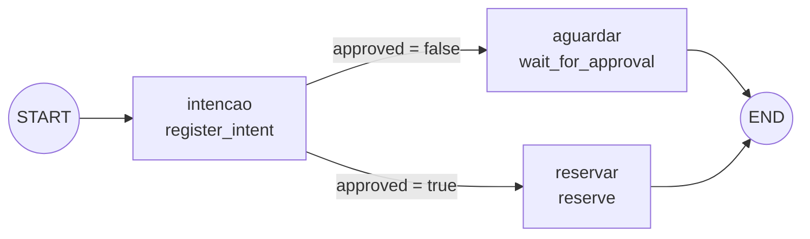

# Oficina de ferramentas — workflow, aprovação e efeito simulado

**Objetivo Bloom:** Aplicar e Analisar.

Esta oficina não pede que você se lembre de uma passagem anterior para executar um comando: cada experimento reconstrói o cenário e repete o comando necessário. Ela executa um workflow local que separa intenção, aprovação e efeito. Nenhuma chamada alcança CRM, estoque, pedidos ou qualquer sistema externo.

## Bússola da prática

Uma intenção proposta pelo modelo tem dois destinos possíveis:

- sem aprovação, ela **para**: nenhum efeito ocorre e o estado registra o motivo;
- aprovada, ela **produz um efeito** protegido por uma chave que impede duplicação, mesmo que a mesma intenção seja repetida.

| Experimento | Pergunta arquitetural | Evidência que você coletará |
| --- | --- | --- |
| A | Uma intenção sem aprovação pode produzir efeito? | `ESTADO aguardando_aprovacao`, `RESULTADO nenhum efeito` |
| B | A mesma intenção repetida cria um segundo efeito? | `RESULTADO RES-501` e trace de repetição sem nova reserva |
| C | O que a arquitetura faz quando a confirmação de uma escrita nunca chega? | `outcome_unknown` e o plano de reconciliação |
| D | De onde vem a intenção que os Experimentos A–C recebiam pronta, e quem valida o que o modelo propõe? | Proposta bruta do modelo, campos extraídos e o veredito de uma validação determinística |

Ao final, você conseguirá localizar, num trace, o ponto exato em que uma intenção deixa de ser texto proposto e passa a produzir efeito.

## Ferramenta

**LangGraph** é uma biblioteca open source, da mesma equipe do LangChain, para orquestrar uma aplicação como um **grafo de estado explícito**. Em vez de deixar o modelo decidir livremente "o que fazer a seguir", você declara os passos possíveis como nós, as transições entre eles como arestas, e uma função de decisão escolhe qual aresta seguir a cada passo. Nada disso é geração de texto: é uma máquina de estados comum, escrita em Python puro. O que torna o LangGraph relevante para este módulo é justamente essa separação — um nó *pode* chamar um modelo, mas orquestração, decisão de política e persistência de estado continuam fora dele, na mesma fronteira que a [matriz de autonomia](autonomia-orcada.md#matriz-de-autonomia) descreve.

### Um Alô, mundo em LangGraph

Antes do grafo Boreal, veja o menor programa possível na biblioteca funcionando de ponta a ponta: um único nó, sem decisão nenhuma, numa pasta descartável e independente de `oficina-m4`.

**macOS**

```bash
mkdir alo-langgraph
cd alo-langgraph
python3 -m venv .venv
source .venv/bin/activate
python3 -m pip install langgraph
```

**Linux**

```bash
mkdir alo-langgraph
cd alo-langgraph
python3 -m venv .venv
source .venv/bin/activate
python3 -m pip install langgraph
```

**Windows (PowerShell)**

```powershell
mkdir alo-langgraph
cd alo-langgraph
python -m venv .venv
.venv\Scripts\Activate.ps1
python -m pip install langgraph
```

Com o ambiente ativo, salve o código abaixo em um arquivo chamado `alo_mundo.py`:

```python
from typing import TypedDict
from langgraph.graph import END, START, StateGraph


class Estado(TypedDict):
    mensagem: str


def saudar(estado: Estado) -> Estado:
    return {"mensagem": "Alô, mundo"}


grafo = StateGraph(Estado)
grafo.add_node("saudar", saudar)
grafo.add_edge(START, "saudar")
grafo.add_edge("saudar", END)

app = grafo.compile()
resultado = app.invoke({"mensagem": ""})
print(resultado["mensagem"])
```

Execute:

```bash
python3 alo_mundo.py
```

A saída é uma única linha, sem nada a mais:

```text
Alô, mundo
```

Quatro peças de setup bastam para ter um grafo completo, compilado e executável: a classe `Estado`, o nó `saudar` e duas arestas fixas, uma ligando `START` a `saudar` e outra ligando `saudar` a `END`. Cada um desses elementos (estado, nó, aresta, `START`/`END`, `compile`, `invoke`) reaparece no grafo Boreal a seguir; a única peça nova lá é a aresta condicional, porque o Alô, mundo não tem decisão para tomar. Terminada a leitura desta seção, apague `alo-langgraph` — ela não tem relação com a pasta `oficina-m4` que você vai criar na Instalação, mais abaixo.

### Estado, nós e arestas: o vocabulário do grafo

Todo grafo LangGraph gira em torno de quatro elementos. Os quatro apareceram no Alô, mundo acima em sua forma mais simples; agora vale ver como eles crescem em `troca_boreal.py`, antes de rodar o script.

**Estado.** É um esquema único, compartilhado por todos os nós do grafo — o "quadro" que a execução inteira lê e escreve. Em `troca_boreal.py`, esse esquema é declarado como um `TypedDict`:

```python
class ExchangeState(TypedDict, total=False):
    approved: bool
    repeated: bool
    idempotency_key: str
    status: str
    result: str
    trace: list[str]
```

`total=False` significa que nem todo campo precisa existir em todo momento da execução — o estado começa incompleto e vai sendo preenchido conforme os nós rodam. Repare que `trace` é uma lista: ela funciona como um rastro mínimo de auditoria, cada nó anexando uma entrada, exatamente o tipo de evidência que [Padrões e decisões](efeito-e-recuperacao.md#auditoria-e-observabilidade) exige de um sistema com efeito.

**Nós.** Um nó é uma função Python comum, que recebe o estado atual e devolve **só os campos que quer atualizar**, não o estado inteiro:

```python
def register_intent(state: ExchangeState) -> ExchangeState:
    return {"status": "reserva_pendente", "trace": ["intenção registrada"]}
```

O LangGraph funde essa atualização parcial no estado global antes de passar o controle adiante. Isso importa porque, se dois nós fossem escritos por pessoas diferentes, nenhum dos dois precisaria conhecer todos os campos do estado — só os que lê e os que escreve. Cada nó é registrado no grafo com um nome próprio: `workflow.add_node("intencao", register_intent)`.

**Arestas.** Uma aresta comum (`add_edge`) liga um nó a outro sem nenhuma decisão: sempre que a execução chega ao primeiro, ela segue para o segundo. Uma **aresta condicional** (`add_conditional_edges`) é diferente: ela chama uma função de decisão com o estado atual, recebe uma string de volta, e usa essa string para escolher, dentro de um mapa fixo, qual nó vem a seguir:

```python
def decide_approval(state: ExchangeState) -> str:
    return "reserve" if state["approved"] else "wait"

workflow.add_conditional_edges("intencao", decide_approval, {"wait": "aguardar", "reserve": "reservar"})
```

É exatamente aqui que a política do grafo Boreal decide o caminho — não o modelo, não o usuário: uma função determinística que olha para `state["approved"]` e devolve uma de duas strings previstas.

**START, END e compilação.** `START` e `END` são marcadores reservados do LangGraph: toda execução entra pelo nó ligado a `START` e termina quando alcança um nó ligado a `END`. Depois de declarar nós e arestas, `workflow.compile()` transforma essa descrição num objeto executável; `invoke(estado_inicial)` roda o grafo do início ao fim, de forma síncrona, e devolve o estado final acumulado.

### O grafo Boreal, nó a nó



O grafo tem três nós e uma única decisão. `intencao` (função `register_intent`) sempre roda primeiro: registra a intenção no `trace` e marca `status: "reserva_pendente"`, sem produzir nenhum efeito ainda. Dali, a aresta condicional `decide_approval` lê `state["approved"]`, o valor que veio de `--aprovado true`/`--aprovado false` na linha de comando, e escolhe entre dois nós terminais: `aguardar` (função `wait_for_approval`), que só registra a parada em `aguardando_aprovacao`, ou `reservar` (função `reserve`), que produz o efeito simulado `RES-501` e verifica `state["repeated"]` para decidir se anexa "reserva simulada criada" ou "repetição reconhecida: nenhuma nova reserva" ao trace. Os dois nós terminais levam a `END`; não existe caminho de volta.

Note o que o grafo *não* faz: em nenhum ponto ele chama um modelo de linguagem. A "intenção" chega pronta, via `--aprovado`, porque o objetivo desta oficina é isolar a mecânica de aprovação e idempotência da variabilidade de um modelo real — o script deixa claro, por construção, que decidir e agir são passos determinísticos, mesmo quando a proposta que os disparou tivesse vindo de um modelo.

**Decisão arquitetural em foco:** em que fronteira uma intenção deixa de ser texto proposto e passa a produzir um [efeito](controle-e-autonomia.md#geracao-decisao-e-acao) que exige [autorização](autonomia-orcada.md#matriz-de-autonomia)?

## Pré-requisitos

- Python 3.10 ou superior e terminal.
- Uma pasta descartável e somente os dados sintéticos do laboratório.
- O arquivo `troca_boreal.py` baixado na etapa seguinte.
- Para o Experimento D (extensão): Ollama instalado e em execução, com `llama3.2:3b` baixado (`ollama pull llama3.2:3b`) — o mesmo modelo usado nas oficinas dos Módulos 1 e 3.

## Instalação

### macOS

```bash
python3 --version
mkdir oficina-m4
cd oficina-m4
python3 -m venv .venv
source .venv/bin/activate
python3 -m pip install langgraph langchain-ollama
```

### Linux

No terminal Linux, execute:

```bash
python3 --version
mkdir oficina-m4
cd oficina-m4
python3 -m venv .venv
source .venv/bin/activate
python3 -m pip install langgraph langchain-ollama
```

### Windows

No PowerShell, execute:

```powershell
python --version
mkdir oficina-m4
cd oficina-m4
python -m venv .venv
.venv\Scripts\Activate.ps1
python -m pip install langgraph langchain-ollama
```

> **Ao retomar a prática:** se você fechar o terminal, volte para `oficina-m4` e reative o ambiente: no macOS/Linux, `source .venv/bin/activate`; no Windows/PowerShell, `.venv\Scripts\Activate.ps1`. Com o ambiente ativo, `python` funciona nos três sistemas.

## Preparação do laboratório

Baixe [troca_boreal.py](../assets/labs/modulo-4/troca_boreal.py) para a pasta `oficina-m4`. O arquivo contém um pedido fictício `PED-104`, uma [chave de idempotência](efeito-e-recuperacao.md#idempotencia-concorrencia-e-prevencao-de-repeticao) `TROCA-PED-104-1` e uma reserva simulada `RES-501`.

```bash
ls troca_boreal.py
```

O script é o workflow inteiro: cada nó devolve um estado tipado e o grafo escolhe entre aguardar aprovação ou reservar. Não há ferramenta externa escondida.

Para o Experimento D, baixe também [propor_troca_llm.py](../assets/labs/modulo-4/propor_troca_llm.py) para a mesma pasta:

```bash
ls propor_troca_llm.py
```

Diferente de `troca_boreal.py`, este segundo script chama de verdade um modelo local via `langchain-ollama` — é o único ponto da oficina em que a "intenção" não chega pronta por uma flag de linha de comando.

## Execução

Você executará cada comando dentro de `oficina-m4/`, com o ambiente virtual ativo. O script não guarda estado entre chamadas: cada execução parte do mesmo pedido `PED-104`, e é o argumento `--aprovado` que muda o caminho percorrido pelo grafo.

## Receita principal

Siga os experimentos em ordem: A mostra a parada segura, B mostra o efeito aprovado e a repetição contida, C, de extensão, trata o caso em que a confirmação nunca chega, e D, também de extensão, mostra de onde a intenção dos três primeiros vinha pronta. Em uma aula curta, execute A em grupo e B em duplas; C e D ficam para quem terminar antes, para o desafio assíncrono, ou para quem tiver Ollama disponível. Cada bloco de experimento repete cenário, pergunta e comando para poder ser realizado de forma independente.

## Resultado esperado

Você produzirá três rastros comparáveis: parada segura, efeito simulado aprovado e repetição idempotente. Eles demonstram o fluxo de controle destes parâmetros; não provam que a autorização de uma organização real está correta.

## Interpretação

Leia a saída em duas camadas. Primeiro, verifique o estado determinístico — as linhas `ESTADO`, `CHAVE` e `RESULTADO`. Depois, avalie se essa evidência sustenta a leitura que você faria em linguagem natural. Uma resposta do modelo não substitui o [resultado autoritativo](estado-memoria-e-politica.md#estado-memoria-e-contexto) do sistema.

## Roteiro sugerido para aula

### Experimento A — intenção sem efeito

**Situação**

Um cliente pede a troca de um item do pedido `PED-104`. Nenhuma aprovação foi concedida ainda.

**Pergunta de investigação**

Uma intenção do modelo, sozinha, pode produzir um efeito sobre o pedido?

**Objetivo**

Distinguir proposta e autorização.

**Pré-requisito**

Script instalado.

**Execute**

```bash
python troca_boreal.py --aprovado false
```

**Observe**

`ESTADO aguardando_aprovacao` e `RESULTADO nenhum efeito`.

**Interprete**

O grafo propôs a troca, mas nenhum nó de efeito foi alcançado: a [decisão de escrita](controle-e-autonomia.md#geracao-decisao-e-acao) exige aprovação antes de qualquer chamada a um sistema de destino. O modelo participa da geração; não decide sozinho a autorização.

**Compare**

Pedido em linguagem natural e o [estado autoritativo](estado-memoria-e-politica.md#estado-memoria-e-contexto) impresso pelo script — a frase do cliente não é evidência de efeito.

**Questões exploratórias:**

- Que dado do estado mostra que nenhuma reserva ocorreu — e o que essa ausência evidencia sobre a fronteira entre [decisão e ação](controle-e-autonomia.md#geracao-decisao-e-acao)?
- Por que um modelo não deve decidir a [aprovação](autonomia-orcada.md#matriz-de-autonomia) por conta própria?
- Onde a [identidade](efeito-e-recuperacao.md#identidade-do-usuario-e-autorizacao-delegada) e a [política](estado-memoria-e-politica.md#politicas-como-fronteira-executavel) entrariam em um sistema real?

### Experimento B — aprovação e idempotência

**Situação**

A mesma troca do Experimento A, agora aprovada — e, em seguida, solicitada de novo com a mesma chave.

**Pergunta de investigação**

Repetir a mesma intenção, já aprovada, produz um segundo efeito?

**Objetivo**

Observar uma [escrita simulada](controle-e-autonomia.md#geracao-decisao-e-acao) e sua repetição.

**Pré-requisito**

Experimento A executado.

**Execute**

```bash
python troca_boreal.py --aprovado true
python troca_boreal.py --aprovado true --repetir
```

**Observe**

Na primeira chamada, `RESULTADO RES-501`. Na segunda, o mesmo `RES-501` e um trace declarando que nenhuma nova reserva foi criada.

**Interprete**

A [chave de idempotência](efeito-e-recuperacao.md#idempotencia-concorrencia-e-prevencao-de-repeticao) `TROCA-PED-104-1` é persistida antes da chamada e reutilizada na repetição — por isso o resultado se repete sem duplicar o efeito. O resultado autoritativo vem do sistema simulado, não de uma nova resposta do modelo.

**Compare**

Primeira execução e segunda execução: o estado muda de `aguardando_aprovacao` (Experimento A) para `reservado`, e a chave permanece a mesma nas duas chamadas aprovadas.

**Questões exploratórias:**

- Quem deve criar e guardar a chave de idempotência?
- Que falha uma [chave duplicada](efeito-e-recuperacao.md#idempotencia-concorrencia-e-prevencao-de-repeticao) evita?
- Por que a resposta do modelo não substitui o resultado autoritativo?

### Experimento C — resultado desconhecido

**Situação**

Imagine que a chamada de reserva do Experimento B fosse enviada e a confirmação se perdesse antes de chegar — o script não reproduz esse cenário sozinho; você vai raciocinar sobre ele a partir dos traces que já coletou.

**Pergunta de investigação**

Se a confirmação de uma escrita nunca chega, o que a arquitetura deve fazer antes de tentar de novo?

**Objetivo**

Planejar recuperação após confirmação ausente.

**Pré-requisito**

Experimentos A e B executados.

**Execute**

Sem novo comando: descreva por escrito o ponto exato em que a chamada do Experimento B seria interrompida, antes de `RESULTADO` aparecer.

**Observe**

O limite entre repetir cegamente e [reconciliar](efeito-e-recuperacao.md#idempotencia-concorrencia-e-prevencao-de-repeticao) pela chave existente.

**Interprete**

Se a confirmação de `TROCA-PED-104-1` fosse interrompida, o estado correto seria `outcome_unknown`: a arquitetura deveria [consultar o registro pela chave antes de tentar novamente](efeito-e-recuperacao.md#idempotencia-concorrencia-e-prevencao-de-repeticao), não repetir a chamada às cegas nem assumir sucesso pela ausência de erro.

**Compare**

[Retry cego](efeito-e-recuperacao.md#timeout-retry-e-circuit-breaker), consulta por chave e [escalonamento](autonomia-orcada.md#orcamentos-interrupcao-e-fallback).

**Questões exploratórias:**

- Que [componente](estado-memoria-e-politica.md#responsabilidades-e-fronteiras-de-componente) deve persistir `outcome_unknown`?
- Qual dado é necessário para a reconciliação?
- Quando a [revisão humana](autonomia-orcada.md#matriz-de-autonomia) é um controle obrigatório?

### Experimento D — proposta gerada por um modelo real

**Situação**

Nos Experimentos A a C, a intenção do cliente chegava pronta pela flag `--aprovado`. Numa aplicação real, ela viria de alguém escrevendo em linguagem natural, e um modelo teria que transformar isso numa proposta estruturada, antes de qualquer aprovação.

**Pergunta de investigação**

Quando um modelo de verdade lê o pedido do cliente e propõe a troca, a saída dele já é uma decisão autorizada, ou ainda precisa passar por uma validação determinística separada?

**Objetivo**

Observar geração e decisão como dois passos distintos e sequenciais, com uma chamada real a um LLM local.

**Pré-requisito**

Ollama em execução, `llama3.2:3b` baixado, `propor_troca_llm.py` na pasta `oficina-m4`.

**Execute**

```bash
python propor_troca_llm.py --cenario valido
```

```bash
python propor_troca_llm.py --cenario invalido
```

**Observe**

Na execução `valido`, o pedido do cliente é "Troque o item P10 pelo P20 no pedido 845 e mantenha a data", e a saída é:

```text
PEDIDO_CLIENTE: Troque o item P10 pelo P20 no pedido 845 e mantenha a data.
PROPOSTA_BRUTA_DO_MODELO: {"old_sku": "P10", "new_sku": "P20", "order_id": "845"}
OLD_SKU: P10
NEW_SKU: P20
ORDER_ID: 845
PROPOSTA_VALIDA: True
MOTIVO: proposta dentro da politica
```

Na execução `invalido`, o pedido pede o SKU `P99`, que não existe no catálogo sintético do script:

```text
PEDIDO_CLIENTE: Troque o item P10 pelo P99 no pedido 845 e mantenha a data.
PROPOSTA_BRUTA_DO_MODELO: {"old_sku": "P10", "new_sku": "P99", "order_id": "845"}
OLD_SKU: P10
NEW_SKU: P99
ORDER_ID: 845
PROPOSTA_VALIDA: False
MOTIVO: SKU P99 fora do catalogo
```

**Interprete**

`PROPOSTA_BRUTA_DO_MODELO` é geração: o modelo leu a frase do cliente e devolveu um JSON com sua interpretação, sem consultar nenhum catálogo. `PROPOSTA_VALIDA` e `MOTIVO` vêm de um nó totalmente determinístico, escrito em Python puro, que confere `new_sku` contra um conjunto fixo de SKUs válidos e `order_id` contra um conjunto fixo de pedidos conhecidos. É o mesmo papel que a política exerce no grafo Boreal, só que aqui a proposta que ela avalia veio de um modelo, não de uma flag de linha de comando. Repare que, nos dois casos, o modelo devolveu um JSON com esquema igualmente correto; a diferença entre aceitar e recusar não está na forma da saída, está na validação posterior, exatamente o ponto do [Exercício 7](exercicios.md).

**Compare**

Compare as duas execuções: `PROPOSTA_BRUTA_DO_MODELO` tem o mesmo formato nas duas, mas só uma passa em `validar`. Se você rodar `--cenario valido` várias vezes, o JSON deve se repetir (o script usa `temperature=0`); isso reduz variação, mas não elimina a necessidade de validar — um modelo determinístico ainda pode errar de forma consistente.

**Questões exploratórias:**

- Se o modelo devolvesse texto explicativo antes do JSON, em vez de só o objeto, o que aconteceria no nó `interpretar`? Que [padrão de saída estruturada](ferramentas-e-contratos.md#uso-de-ferramentas-e-saidas-estruturadas) evitaria isso?
- Por que a validação de catálogo e de pedido não poderia estar dentro do prompt do modelo, como uma instrução a mais?
- Se este script se conectasse ao grafo Boreal, em que ponto a proposta validada aqui entraria — antes ou depois de `decide_approval`?

## Evidência a entregar

Entregue as três saídas ou uma tabela equivalente e uma conclusão de até cinco linhas.

| Execução | Estado | Chave | Resultado | O que a arquitetura comprovou? |
|---|---|---|---|---|
| Sem aprovação |  |  |  |  |
| Com aprovação |  |  |  |  |
| Repetição |  |  |  |  |

Explique qual condição impede a reserva, como a repetição é contida e como você trataria `outcome_unknown`. Registre também uma fitness function verificável — por exemplo, a mesma intenção com a mesma chave não pode produzir dois efeitos — e quem responde por seu alerta.

Se fez o Experimento D, entregue também as duas saídas completas (`valido` e `invalido`) e uma frase distinguindo o que o modelo comprovou do que a validação determinística comprovou.

## Limpeza e contingência

Saia do ambiente com `deactivate` e apague a pasta `oficina-m4` quando terminar. Se houver erro, confira `python --version`, a ativação do ambiente e `python -m pip show langgraph`. Registre a mensagem e corrija a instalação local antes de continuar; não conecte o exercício a sistemas reais.

Se o Experimento D falhar, confirme que o Ollama está em execução (`ollama list` deve mostrar `llama3.2:3b`) e que `python -m pip show langchain-ollama` retorna o pacote instalado. Não é preciso remover o modelo depois: ele é o mesmo usado nas oficinas dos Módulos 1 e 3.

## Extensão — melhoria de robustez no uso de LLMs

Esta extensão responde, com medição local, a uma pergunta que o módulo respondeu em prosa: quanto do resultado de um agente vem do modelo e quanto vem do que foi construído em volta dele. O método é uma comparação controlada: mantêm-se fixos o modelo, os pesos, a temperatura e os casos, e muda-se um componente do [arnês (*harness*)](arnes.md#o-arnes-tudo-o-que-cerca-o-modelo) por vez. É o desenho que a literatura de aprendizado de máquina chama de estudo de ablação.

### Cenário sintético

A Boreal recebe mensagens de clientes em texto livre e precisa converter cada uma em **uma** chamada de ferramenta. Os pedidos `845` e `846` existem na base sintética; o `845` já foi despachado, e a política da empresa proíbe cancelá-lo pela ferramenta, encaminhando o caso para tratamento humano. São oito mensagens, e a resposta certa de cada uma é conhecida de antemão.

### Pergunta de investigação

Com o mesmo modelo e os mesmos oito casos, quanto muda o resultado quando se troca apenas o arnês? E qual componente do arnês produz o maior salto?

### Pré-requisitos

- Python 3.10 ou superior e terminal.
- Ollama em execução, com `llama3.2:3b` baixado (`ollama pull llama3.2:3b`), o mesmo modelo das oficinas dos Módulos 1 e 3.
- Nenhum dado real: os oito casos e os dois pedidos são sintéticos.

Esta extensão não depende dos experimentos anteriores. Quem já tem a pasta `oficina-m4` reaproveita o ambiente virtual; quem chega direto aqui monta um em três comandos.

### Preparação

Se a pasta `oficina-m4` já existe, reative o ambiente e siga para o download. Caso contrário, monte um ambiente novo:

```bash
python3 --version
mkdir oficina-m4
cd oficina-m4
python3 -m venv .venv
source .venv/bin/activate
python3 -m pip install langgraph langchain-ollama
```

No Windows, troque as duas últimas linhas por `.venv\Scripts\Activate.ps1` e `python -m pip install langgraph langchain-ollama`.

Baixe [comparar_arneses.py](../assets/labs/modulo-4/comparar_arneses.py) para a pasta `oficina-m4`.

```bash
ls comparar_arneses.py
```

O arquivo contém tudo: os oito casos com a resposta esperada, os dois catálogos de ferramenta, os dois *prompts* de sistema, a validação determinística e o grafo LangGraph que liga proposta, interpretação, validação e retentativa. Não há chamada externa além do Ollama local.

### Os quatro arneses

Cada arnês acrescenta exatamente um componente ao anterior. Essa é a condição que torna a comparação interpretável.

| Arnês | *System prompt* | Catálogo | Validação | Verificação com retentativa |
|---|---|---|---|---|
| A | genérico ("assistente útil") | 12 nomes, sem descrição | nenhuma | não |
| B | contratual, exige JSON com `ferramenta` e `pedido` | 12 nomes, sem descrição | esquema e existência | não |
| C | contratual | 4 ferramentas, cada uma com uma linha de descrição | esquema e existência | não |
| D | contratual | 4 ferramentas descritas | esquema, existência e pré-condição de política | sim, com o motivo da recusa devolvido ao modelo |

### Execute

```bash
python comparar_arneses.py
```

A execução completa faz 33 chamadas ao modelo local e leva de um a quatro minutos, conforme a máquina e se o modelo já está carregado. Para ver caso a caso, acrescente `--detalhar`; para rodar um arnês isolado, use `--arnes C`.

### Observe

A saída traz, para cada arnês, quatro números. Estes são os valores obtidos em duas execuções idênticas nesta oficina, com `llama3.2:3b` e `temperature=0`:

| Arnês | Ações corretas | Bloqueadas pela validação | Ações indevidas entregues | Chamadas ao modelo |
|---|---:|---:|---:|---:|
| A — arnês nu | 0/8 | 0 | 0 | 8 |
| B — contrato de saída | 2/8 | 0 | 1 | 8 |
| C — catálogo mínimo descrito | 6/8 | 0 | 1 | 8 |
| D — verificação com retentativa | 6/8 | 1 | 0 | 9 |

Os quatro arneses usaram o mesmo modelo, os mesmos pesos e a mesma temperatura. Seus números podem diferir dos acima, e a comparação entre linhas importa mais que o valor absoluto de cada uma.

### Interprete

Leia a tabela linha a linha, porque cada salto tem uma causa distinta.

**A → B, de 0 para 2.** No arnês A o modelo responde em prosa cordial e o orquestrador não consegue extrair uma chamada de ferramenta de nada disso. Não é falha de compreensão: as respostas de A são frequentemente sensatas em português. É falha de contrato. Um sistema que não consegue interpretar a saída não tem como agir sobre ela, e a competência do modelo fica inacessível.

**B → C, de 2 para 6.** Aqui o modelo é o mesmo, o contrato é o mesmo e o que mudou foi o espaço de decisão: doze nomes parecidos e sem definição viraram quatro ferramentas com uma linha de descrição cada. Em B, o modelo distribui suas escolhas entre `consultar_pedido`, `consultar_pedido_v2` e `buscar_pedido_por_cliente`, que para ele são indistinguíveis. É a [lição da Vercel](arnes.md#mais-ferramentas-nao-significa-menos-erro) reproduzida em escala de laboratório, e o maior salto do experimento vem de uma remoção.

**C → D, de 6 para 6.** O número de ações corretas não muda, e é justamente por isso que este é o passo mais instrutivo. O que muda é a coluna das ações indevidas: em C, o pedido de encerrar o `845` vira uma chamada de `cancelar_pedido` que a política proíbe, e ela é entregue; em D, a pré-condição bloqueia a chamada, devolve o motivo ao modelo e concede uma segunda tentativa. Na execução registrada acima o modelo insistiu na mesma proposta, e a segunda tentativa não produziu a ação certa. **O efeito indevido não aconteceu mesmo assim.** Verificação não é um mecanismo para tornar o modelo mais competente; é um mecanismo para impedir que a incompetência dele produza efeito.

Observe o custo: a única linha com nove chamadas em vez de oito é a D. Verificação com retentativa é a mais cara das quatro intervenções, e é a única que altera a natureza do risco em vez de mexer só na taxa de acerto.

### Compare

Confronte estes números com a discussão de [erro composto](arnes.md#erro-composto-a-aritmetica-da-trajetoria). O experimento mede uma decisão isolada, com uma única etapa por caso. Multiplique mentalmente: uma trajetória de dez etapas com a taxa do arnês B tem probabilidade praticamente nula de se completar corretamente, enquanto a mesma trajetória com a taxa do arnês C ainda falha com frequência incômoda. Nenhum dos quatro arneses é adequado para autonomia sobre efeito material, e a conclusão correta do laboratório não é "C resolve", é "a distância entre 0 e 6 foi produzida por engenharia, e a distância que falta também terá de ser".

### Questões exploratórias

- O arnês D bloqueou uma ação indevida e não conseguiu produzir a ação certa. Em qual dos dois desfechos a arquitetura falhou, e qual deles um sistema em produção pode tolerar?
- A validação de política do arnês D conhece a regra de negócio, não o gabarito dos oito casos. Que aconteceria com a validade deste experimento se ela conhecesse o gabarito, e que nome tem esse erro de método?
- Se você tivesse orçamento para acrescentar um quinto arnês, qual componente escolheria: memória entre casos, um segundo modelo como avaliador, ou uma ferramenta a menos? Justifique com a tabela.
- Onde, no arnês D, mora a autoridade que impede o cancelamento do pedido `845`? O que aconteceria se essa regra estivesse apenas no *prompt* de sistema?

### Evidência a entregar

Entregue a tabela dos quatro arneses preenchida com os seus números e uma conclusão de até cinco linhas que responda: qual componente produziu o maior ganho de acerto, qual componente mudou a natureza do risco, e qual dos dois você priorizaria num sistema com efeito irreversível. Registre também uma [fitness function](autonomia-orcada.md#fitness-functions-para-autonomia) derivada do arnês D, com limiar, responsável e consequência.

### Limpeza

O laboratório não cria arquivos além do próprio script e não usa rede além do Ollama local. Mantenha `llama3.2:3b` se ainda for cursar os outros módulos.

## Ferramentas adicionais

O laboratório usou LangGraph para expor estado, aprovação e idempotência num agente mínimo. O mercado tem frameworks e um protocolo de interoperabilidade que ampliam a mesma decisão: quem autoriza, quem executa e como uma ferramenta é descoberta. Investigação livre, fora do escopo avaliado desta oficina.

| Ferramenta | Site | Propósito |
|---|---|---|
| CrewAI | [crewai.com](https://www.crewai.com) | Framework de orquestração multiagente baseado em papéis, alternativa mais opinativa ao LangGraph |
| Google Agent Development Kit (ADK) | [google.github.io/adk-docs](https://google.github.io/adk-docs/) | Kit de desenvolvimento de agentes do Google, integrado ao ecossistema Gemini e Vertex AI |
| OpenAI Agents SDK | [openai.github.io/openai-agents-python](https://openai.github.io/openai-agents-python/) | SDK oficial da OpenAI para orquestrar agentes, ferramentas e transferências (handoffs) entre eles |
| Claude Agent SDK | [platform.claude.com/docs/en/agent-sdk/overview](https://platform.claude.com/docs/en/agent-sdk/overview) | SDK da Anthropic para construir agentes com uso de ferramentas, memória e permissões granulares |
| Model Context Protocol (MCP) | [modelcontextprotocol.io](https://modelcontextprotocol.io/specification/2025-11-25) | Protocolo aberto que padroniza como um agente descobre e chama ferramentas e fontes externas |
| AG2 | [github.com/ag2ai/ag2](https://github.com/ag2ai/ag2) | Fork mantido pela comunidade do AutoGen original, conversação estruturada entre múltiplos agentes |
