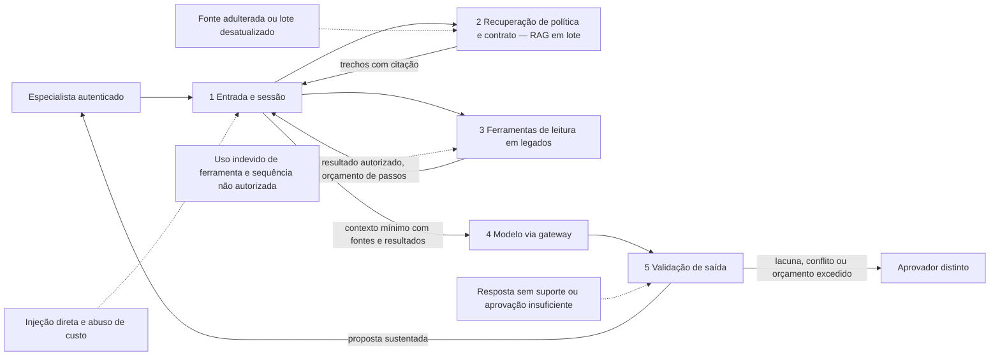

# Caso contínuo: Cooperativa Aurora — confiança e avaliação

**Caso contínuo — Cooperativa Aurora.** [← Módulo 4: Autonomia](../modulo-4-agentes/caso-aurora.md) · [Módulo 6: Operação →](../modulo-6-operacao/caso-aurora.md)

Ao chegar neste módulo, a Cooperativa Aurora já acumulou arquitetura suficiente para um modelo de ameaças real: RAG por ingestão em lote (Módulo 3) e um agente com ferramentas somente leitura, autorização por ferramenta e orçamento de passos (Módulo 4). O [Banco Lume](caso-lume.md), tratado em sua própria página, não tem trajetória de agente — a diferença de composição é o eixo deste módulo: a superfície de risco da Aurora é estruturalmente maior, e o registro de risco abaixo mostra exatamente onde.

## Modelo de ameaças em camadas

**Equivalente textual.** O fluxo da Aurora repete entrada, recuperação e saída do [Lume](caso-lume.md), mas acrescenta uma camada de ferramenta: o agente escolhe quais sistemas legados consultar, sob orçamento de passos e autorização por ferramenta. Essa camada extra é exatamente onde a Aurora acumula ameaças que o Lume não tem: uso indevido de ferramenta, sequência de chamadas fora do esperado e excesso de orçamento.

## Registro de risco

| Camada | Cenário | Controle principal |
|---|---|---|
| entrada | pedido fora do escopo ("aplique a melhor taxa", "resolva tudo") | autenticação, política de uso, nenhuma ferramenta de efeito |
| recuperação | política ou contrato desatualizado, adulterado ou conflitante | proveniência, vigência, filtro de autorização antes do conteúdo |
| **ferramenta** | sequência de consulta não enumerada, ferramenta errada, orçamento de passos excedido | catálogo mínimo, contrato por ferramenta, orçamento de passos, somente leitura |
| saída | proposta sem suporte, afirmação sem citação | vínculo afirmação–fonte, abstenção abaixo do limiar |
| aprovação humana | fila saturada, aprovação ritual | segregação proponente/aprovador, resumo de evidências e trajetória do agente |

A linha de ferramenta é o risco que a Aurora paga pela sua composição — risco que o [Banco Lume](caso-lume.md#registro-de-risco) não tem, por não ter agente. Nenhuma quantidade de guardrail de saída substitui orçamento de passos e autorização por chamada quando o modelo escolhe a ordem de consulta.

## Avaliação multidimensional

| Dimensão | Observação |
|---|---|
| factualidade e fundamentação | explicação e cálculo citam contrato, pagamento e política de campanha |
| segurança | nenhum campo sensível (renda, saldo, evento familiar) sem finalidade de renegociação atravessa a inferência; nenhuma chamada de ferramenta fora do catálogo autorizado |
| utilidade | especialista avança com proposta, revisão ou fluxo manual diante de indisponibilidade legada |
| latência | p95 soma latência de RAG em lote e de cada chamada de ferramenta — mede-se por etapa, não só ponta a ponta |
| custo | custo por proposta **mais** custo por passo de ferramenta — orçamento de passos é também controle de custo |

Ver [Fundamentação](../referencia/atributos-de-qualidade.md#fundamentacao-grounding), [Segurança](../referencia/atributos-de-qualidade.md#seguranca), [Confiabilidade](../referencia/atributos-de-qualidade.md#confiabilidade), [Explicabilidade](../referencia/atributos-de-qualidade.md#explicabilidade) e [Autonomia](../referencia/atributos-de-qualidade.md#autonomia) — este último atributo só é um direcionador ativo aqui, não no Lume.

## Guardrails em profundidade aplicados

A Aurora usa o padrão [Guardrails em profundidade](../referencia/catalogo-de-padroes.md#guardrails-em-profundidade) e a [Pirâmide de avaliação](../referencia/catalogo-de-padroes.md#piramide-de-avaliacao), com [Validação de saída em camadas](../referencia/catalogo-de-padroes.md#validacao-de-saida-em-camadas) na fronteira de resposta. A diferença para o Lume está na camada de ferramenta: a Aurora precisa de catálogo mínimo, contrato por ferramenta, identidade delegada e orçamento de passos — controles que não existem no desenho do Lume porque não haveria o que proteger ali.

## Fitness functions e gates de liberação

**Bloqueia promoção se (soma às condições equivalentes do Lume):**

- qualquer chamada de ferramenta ocorrer fora do catálogo autorizado ou sem identificador derivado da sessão;
- o orçamento de passos for excedido sem interrupção e escalonamento;
- a trajetória do agente não puder ser reconstruída (ferramenta chamada, parâmetro, resultado e ordem) no trace minimizado;
- alguma resposta usar dado fora da finalidade de renegociação sem decisão de autorização rastreável;
- a cobertura de suporte cair abaixo do limiar validado;
- o aprovador deixar de ser a última fronteira antes do registro oficial.

Esse gate adicional é o preço de ter uma camada de ferramenta: a Aurora só é promovível se sua trajetória de agente for tão auditável quanto seu rascunho.

## Execução local

1. Ambiente: reative o venv do curso (`source .venv/bin/activate`) e instale `deepeval` (`pip install deepeval`), como na [Oficina de ferramentas](oficina-de-ferramentas.md) deste módulo. Mantenha o Ollama local ativo com `llama3.2:3b`.
2. Baixe `docs/assets/labs/modulo-5/avaliar_confianca_lume_aurora.py` e `docs/assets/labs/modulo-5/casos_confianca_lume_aurora.json`.
3. Execute: `python avaliar_confianca_lume_aurora.py --caso aurora`.
4. **Resultado esperado.** Um `relatorio-confianca-aurora.json` com pontuação e justificativa por caso sintético, incluindo cenários de uso indevido de ferramenta e excesso de orçamento de passos que não existem no conjunto do [Lume](caso-lume.md).
5. **Limpeza.** Desative o venv e apague os relatórios gerados; não substitua os casos sintéticos por dados reais.

---

**Continua:** [Módulo 6 — operação](../modulo-6-operacao/caso-aurora.md)
