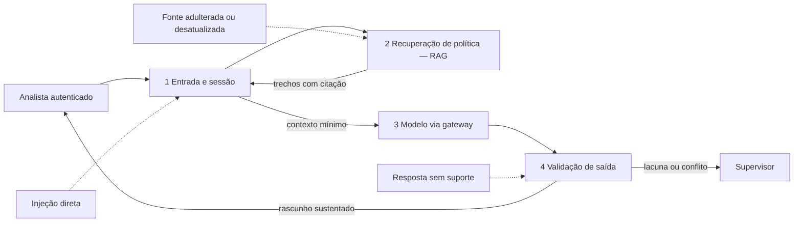

# Caso contínuo: Banco Lume — confiança e avaliação

**Caso contínuo — Banco Lume.** [← Módulo 4: Autonomia](../modulo-4-agentes/caso-lume.md) · [Módulo 6: Operação →](../modulo-6-operacao/caso-lume.md)

Ao chegar neste módulo, o Banco Lume já acumulou arquitetura suficiente para um modelo de ameaças real: workflow assistivo com RAG adotado no [Módulo 3](../modulo-3-rag/caso-lume.md) e permanência **sem agente** — a decisão do [Módulo 4](../modulo-4-agentes/caso-lume.md) foi manter o fluxo determinístico, porque a sequência de consulta continua enumerável. A [Cooperativa Aurora](caso-aurora.md), tratada em sua própria página, soma um agente com ferramentas ao RAG e por isso tem uma superfície de risco maior — a comparação completa está lá.

## Modelo de ameaças em camadas

**Equivalente textual.** O analista abre o caso por sessão autenticada; a recuperação devolve trechos de política com citação; o modelo recebe apenas contexto mínimo via gateway; a validação libera o rascunho ou encaminha ao supervisor. Não há camada de ferramenta nem trajetória de agente neste caso — a superfície de ameaça termina em entrada, recuperação, contexto e saída.

## Registro de risco

| Camada | Cenário | Controle principal |
|---|---|---|
| entrada | pedido fora do escopo ("aplique a melhor taxa", "resolva tudo") | autenticação, política de uso, nenhuma ferramenta de efeito |
| recuperação | política desatualizada, adulterada ou conflitante | proveniência, vigência, filtro de autorização antes do conteúdo |
| saída | rascunho sem suporte, afirmação sem citação | vínculo afirmação–fonte, abstenção abaixo do limiar |
| aprovação humana | fila saturada, aprovação ritual | segregação proponente/aprovador, resumo de evidências e divergências |

Não há camada de ferramenta no Lume — logo, nenhum risco de sequência de consulta não enumerada, ferramenta errada ou orçamento de passos excedido. Essa camada só existe no risco da [Cooperativa Aurora](caso-aurora.md#registro-de-risco), que paga por ela na composição que escolheu.

## Avaliação multidimensional

| Dimensão | Observação |
|---|---|
| factualidade e fundamentação | afirmação do rascunho de contestação cita política vigente |
| segurança | nenhum campo fora da finalidade de contestação atravessa a inferência |
| utilidade | analista avança com rascunho, revisão ou encaminhamento manual |
| latência | p95 compatível com o modo sombra do Módulo 2 |
| custo | custo por rascunho |

Ver [Fundamentação](../referencia/atributos-de-qualidade.md#fundamentacao-grounding), [Segurança](../referencia/atributos-de-qualidade.md#seguranca) e [Confiabilidade](../referencia/atributos-de-qualidade.md#confiabilidade). O atributo [Autonomia](../referencia/atributos-de-qualidade.md#autonomia) não é um direcionador ativo aqui — não há agente no Lume.

## Guardrails em profundidade aplicados

O Lume usa o padrão [Guardrails em profundidade](../referencia/catalogo-de-padroes.md#guardrails-em-profundidade) e a [Pirâmide de avaliação](../referencia/catalogo-de-padroes.md#piramide-de-avaliacao), com [Validação de saída em camadas](../referencia/catalogo-de-padroes.md#validacao-de-saida-em-camadas) na fronteira de resposta. Não há camada de ferramenta a proteger — diferente da Aurora, que precisa de catálogo mínimo, contrato por ferramenta, identidade delegada e orçamento de passos.

## Fitness functions e gates de liberação

**Bloqueia promoção se:**

- alguma resposta usar dado fora da finalidade de contestação sem decisão de autorização rastreável;
- a cobertura de suporte (afirmação com citação de política vigente) cair abaixo do limiar validado no modo sombra do Módulo 2;
- o supervisor deixar de ser a última fronteira antes do registro oficial.

## Execução local

1. Ambiente: reative o venv do curso (`source .venv/bin/activate`) e instale `deepeval` (`pip install deepeval`), como na [Oficina de ferramentas](oficina-de-ferramentas.md) deste módulo. Mantenha o Ollama local ativo com `llama3.2:3b`.
2. Baixe `docs/assets/labs/modulo-5/avaliar_confianca_lume_aurora.py` e `docs/assets/labs/modulo-5/casos_confianca_lume_aurora.json`.
3. Execute: `python avaliar_confianca_lume_aurora.py --caso lume`.
4. **Resultado esperado.** Um `relatorio-confianca-lume.json` com pontuação e justificativa por caso sintético.
5. **Limpeza.** Desative o venv e apague os relatórios gerados; não substitua os casos sintéticos por dados reais.

---

**Continua:** [Módulo 6 — operação](../modulo-6-operacao/caso-lume.md)
