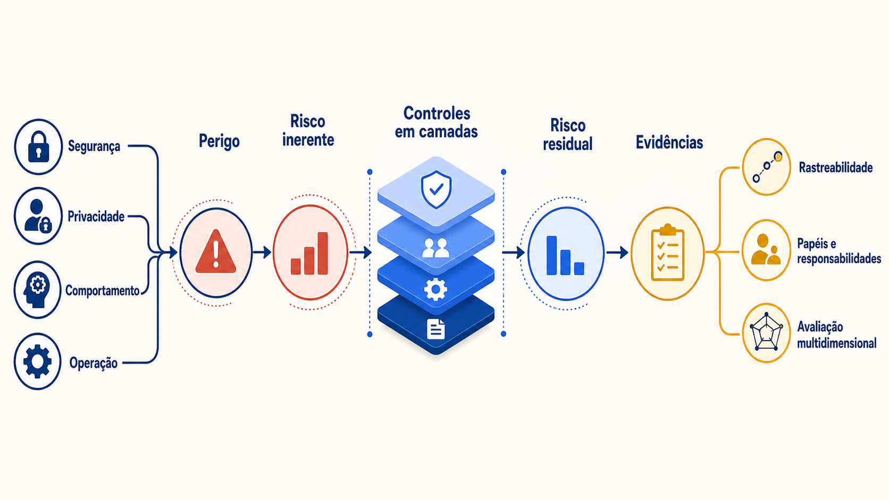

# Conceitos: confiança como propriedade do sistema

*Figura — Confiança combina riscos, controles, responsabilidades e evidências.*

## Confiança é uma relação, não uma característica absoluta

**Confiança sistêmica** é a expectativa justificada de que uma solução, em um contexto definido, produzirá resultados aceitáveis, limitará danos previsíveis e permitirá detectar, explicar e corrigir desvios. Ela depende da composição entre modelo, dados, recuperação, prompts, código, ferramentas, identidade, políticas, interfaces, pessoas, fornecedores e operação. Um modelo pode sugerir títulos, mas não decidir elegibilidade.

“Justificada” exige evidência. Demonstrações escolhidas pela equipe, ausência de incidentes conhecidos ou reputação do fornecedor são sinais fracos. Evidências melhores incluem cenários de risco, testes reproduzíveis, conjunto de referência representativo, resultados por dimensão, revisão independente, traces minimizados, incidentes, limites de uso e decisão formal sobre risco residual. Ainda assim, evidência reduz incerteza; não prova ausência de falhas futuras.

O [AI Risk Management Framework 1.0 do NIST](https://doi.org/10.6028/NIST.AI.100-1) organiza a gestão de risco em Govern, Map, Measure e Manage; seu [perfil de IA generativa](https://doi.org/10.6028/NIST.AI.600-1) aplica essa visão aos riscos generativos. Ambos orientam raciocínio, não certificam sistemas; limiares pertencem ao contexto organizacional.

## Quatro famílias de risco que se reforçam

**Risco técnico** nasce de propriedades ou falhas da solução: resposta falsa, recuperação inadequada, injeção de prompt, permissão incorreta, indisponibilidade, modelo alterado, filtro contornado ou trace incompleto. A causa pode estar longe do efeito. Uma configuração de indexação pode trazer a política errada; um documento malicioso pode induzir uma chamada; um fallback pode remover a fundamentação.

**Risco operacional** envolve processo, pessoas e capacidade de sustentar o controle: alertas sem responsável, fila de aprovação saturada, conjunto de testes desatualizado, credencial não rotacionada, incidente sem procedimento, mudança urgente fora do pipeline ou fornecedor indisponível. Um desenho seguro no papel deixa de ser confiável se a organização não consegue operá-lo.

**Risco legal** envolve obrigações aplicáveis a dados, relações de trabalho, propriedade intelectual, discriminação, contratos, registros e prestação de contas. A arquitetura não interpreta sozinha a lei. Ela deve permitir que especialistas traduzam obrigações em finalidade, base autorizativa, acesso, retenção, contestação, evidência e restrição de uso. Um filtro de dados pessoais não torna automaticamente o tratamento lícito.

**Risco reputacional** é a perda de confiança de empregados, clientes, parceiros ou sociedade. Pode decorrer de uma falha técnica, mas também de expectativa mal administrada: interface que aparenta autoridade, resposta sem fonte, automação opaca ou comunicação tardia de incidente. Reputação não é apenas “imagem”; afeta adoção, cooperação e legitimidade do serviço.

As famílias não formam silos. Um vazamento técnico pode gerar investigação legal, interrupção operacional e dano reputacional. Por isso o registro de risco deve relacionar causa, ativo, parte afetada, cenário, probabilidade, impacto, controles, proprietário e risco residual.

## Do perigo ao risco residual

Um **ativo** é algo que precisa ser protegido ou preservado: dado pessoal, segredo, integridade de uma política, identidade, orçamento, disponibilidade, decisão humana ou confiança do empregado. Uma **ameaça** é uma causa potencial de incidente; uma **vulnerabilidade** é a condição explorável; um **evento** é a materialização; um **impacto** é a consequência para pessoas e organização.

O **risco inerente** é avaliado antes dos controles. O **risco residual** permanece depois que controles e condições operacionais são considerados. Controles podem reduzir probabilidade, limitar impacto, aumentar detecção ou facilitar recuperação. Nenhum número elimina a necessidade de justificar premissas. “Baixo” precisa dizer para quem, em qual período e sob qual exposição.

> **Risco arquitetural:** Aceitar risco residual é decisão de negócio e governança, não preferência do desenvolvedor. O proprietário precisa ter autoridade, compreender incerteza, registrar prazo e definir gatilhos de revisão. Risco acima do apetite requer reduzir escopo, acrescentar controle, transferir parte do risco, suspender ou não lançar. A aceitação expira quando mudam modelo, fontes, ferramentas, público, finalidade, ameaça ou obrigação.

## Rastreabilidade sem vigilância indiscriminada

**Rastreabilidade** é a capacidade de reconstruir a cadeia relevante: solicitação e identidade autorizada; versões de prompt, modelo, política, índice e ferramentas; documentos recuperados e suas permissões; decisões determinísticas; aprovações; saída entregue; latência, custo e incidentes. Ela sustenta depuração, avaliação, contestação e responsabilização.

Rastrear não significa guardar tudo. Prompts completos, documentos e respostas podem conter dados pessoais ou segredos. Prefira identificadores, hashes, categorias, decisões, métricas e amostras controladas; masque campos; segregue telemetria; limite acesso; defina retenção e descarte verificável. Quando conteúdo completo for necessário para investigação, trate-o como exceção autorizada. Uma trilha que vaza o que deveria proteger é uma nova vulnerabilidade.

Rastreabilidade também não equivale a explicação causal do modelo. O sistema pode registrar evidências apresentadas, passos observáveis e regras acionadas. Texto gerado como “raciocínio” não prova o mecanismo interno nem deve ser usado como justificativa suficiente para uma decisão sensível.

**Langfuse** e **Phoenix** observam traços; **Guardrails AI** valida entradas ou saídas. Risco, regras de domínio e bloqueios continuam no sistema.

## Responsabilidade compartilhada, papéis identificáveis

**Responsabilidade compartilhada** descreve dependências entre participantes; não permite que todos sejam genericamente responsáveis e ninguém responda. Uma matriz mínima diferencia:

| Papel | Responsabilidade principal | Não pode presumir |
|---|---|---|
| fornecedor de modelo ou serviço | documentar interface, mudanças, compromissos e controles contratados | que o cliente usará o serviço em finalidade adequada |
| plataforma de IA | identidade, gateway, versões, telemetria, limites e integrações comuns | que um controle comum conhece toda regra do domínio |
| equipe de produto | contexto de uso, experiência, testes ponta a ponta e fallback | que desempenho de benchmark representa seus usuários |
| segurança e privacidade | ameaças, requisitos, revisão, incidentes e tratamento de dados | que revisão pontual mantém o sistema seguro após mudanças |
| dono do processo | política, autoridade, impacto, escalonamento e risco residual | que a equipe técnica pode aceitar risco em seu nome |
| operação | saúde, alertas, resposta e evidências | que toda resposta plausível é correta |
| usuário e aprovador | usar dentro da finalidade e revisar com informação suficiente | que a interface ou o modelo substituem responsabilidade institucional |

Contratos com fornecedores definem disponibilidade, uso de dados, localização, subprocessadores, notificação, portabilidade e encerramento. Porém contrato não impede tecnicamente uma injeção nem valida a política de RH. Controles técnicos, operacionais e contratuais se complementam.

## Qualidade tem várias dimensões

Uma resposta “boa” precisa ser decomposta:

- **factualidade:** afirmações correspondem aos fatos verificáveis;
- **relevância:** resposta aborda a intenção e evita material dispersivo;
- **fundamentação:** afirmações importantes são sustentadas pelas evidências autorizadas apresentadas;
- **segurança:** conteúdo e ações respeitam políticas e não expõem ativos;
- **utilidade:** o usuário consegue avançar, inclusive quando a resposta correta é recusar ou escalar;
- **latência:** o tempo atende ao cenário e não induz repetição ou abandono;
- **custo:** consumo por resposta e por tarefa concluída cabe no orçamento.

As dimensões não são substituíveis. Alta relevância não compensa vazamento; baixa latência não compensa política desatualizada. Defina **critérios de bloqueio** para eventos intoleráveis e **metas** para dimensões negociáveis. Meça também por fatias — público, idioma, tipo de pergunta, nível de acesso e rota de fallback — porque a média mascara grupos frágeis.

A avaliação fornece evidência sobre uma distribuição de casos observados. Ela não garante comportamento para toda entrada possível. Essa limitação conduz ao próximo capítulo: controles em profundidade e decisões de governança que permanecem ativos quando o teste não antecipou o caso.

## Ferramentas no mercado

Condições e alternativas estão no [Guia de ferramentas](../referencia/guia-de-ferramentas.md).

| Ferramenta | Quando ajuda | Pré-requisito | Limite arquitetural |
|---|---|---|---|
| Langfuse | Registrar traços e avaliações. | Telemetria, retenção e acesso. | Não substitui controles de domínio. |
| Phoenix | Investigar traços. | Instrumentação e dados minimizados. | Não prova segurança fora da amostra. |
| Guardrails AI | Validar formatos. | Esquemas, critérios e rota de falha. | Não substitui autorização ou revisão. |

Continue em [Padrões e decisões](padroes-e-decisoes.md).
