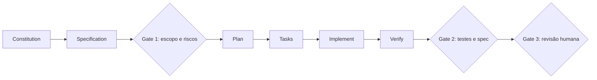
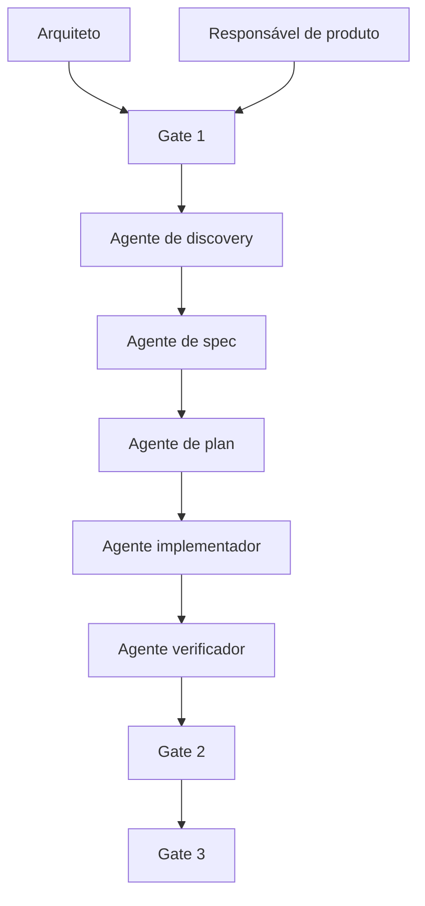
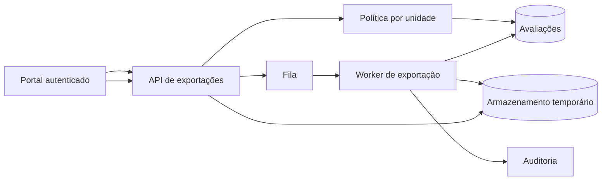

# Exemplo arquitetural: da intenção à evidência

Uma demanda de uma frase — “adicione um botão para exportar as avaliações em CSV” — percorrida inteira, de constitution a feedback de produção, com os três portões humanos no lugar em que cada um decide algo.

## Pipeline SDD com gates humanos



*Figura — Pipeline SDD: a specification governa implementação e verificação.*

**Equivalente textual 3.** Constitution e specification antecedem plan e tasks. O Gate 1 valida escopo e riscos; Verify produz evidências; o Gate 2 compara testes e spec; o Gate 3 aprova a revisão humana antes da liberação.



*Figura — Squad híbrida: 2 papéis humanos, 5 agentes de IA e 3 gates.*

**Equivalente textual 4.** O arquiteto e o responsável de produto definem o primeiro gate. Cinco agentes atuam em discovery, spec, plan, implementação e verificação. Os gates 2 e 3 retêm validação de evidência e revisão humana.

## Exemplo completo — exportação auditável de avaliações

Considere uma plataforma educacional que precisa permitir a coordenadores exportar avaliações de sua própria unidade. O pedido inicial chega assim:

> “Adicione um botão para exportar as avaliações em CSV.”

Um agente poderia localizar a tela, criar um endpoint e gerar o arquivo. O resultado demonstraria atividade, não correção. O pedido não informa quais avaliações, quem pode exportar, quais colunas são sensíveis, qual volume existe, quanto tempo o arquivo permanece disponível nem como auditar. A seguir, percorremos a feature `027-exportacao-avaliacoes` como transformação de intenção em evidência.

### Constitution aplicável

O projeto possui cinco princípios:

1. autorização é verificada no servidor para cada recurso;
2. dados pessoais não entram em logs ou arquivos além do necessário;
3. comportamento novo começa por teste observável;
4. processamento superior a dois segundos é assíncrono;
5. toda dependência nova exige ADR e alternativa considerada.

Esses princípios já restringem soluções. Gerar o CSV inteiro no navegador violaria autorização e exposição de dados. Manter a requisição aberta por dezenas de segundos violaria o princípio assíncrono. Adicionar uma biblioteca sem necessidade exigiria justificativa.

### Specify: o contrato de produto

Depois de entrevista com PO e coordenação, a spec registra:

```markdown
# Feature 027 — Exportação auditável de avaliações

## Problema
Coordenadores precisam analisar avaliações fora da plataforma, mas hoje
solicitam extrações manuais à equipe de dados.

## História P1
Como coordenadora de uma unidade,
quero exportar avaliações filtradas por período,
para analisar resultados sem receber dados de outras unidades.

## Requisitos funcionais
FR-01 — O sistema deve aceitar período inicial e final.
FR-02 — O sistema deve limitar registros à unidade autorizada.
FR-03 — O sistema deve produzir CSV UTF-8 com cabeçalho estável.
FR-04 — O sistema deve informar estado pendente, concluído, falho ou expirado.
FR-05 — O sistema deve permitir download por 24 horas.
FR-06 — O sistema deve registrar solicitante, filtros, contagem e política.

## Atributos de qualidade
NFR-01 — 95% das exportações de até 50 mil linhas concluem em 30 segundos.
NFR-02 — Nenhum arquivo contém nome, e-mail ou documento do estudante.
NFR-03 — Falha do worker não duplica arquivos ou eventos de auditoria.

## Fora de escopo
Agendamento recorrente, envio por e-mail e formatos XLSX/PDF.
```

O fora de escopo evita que o agente “melhore” a feature com envio automático. A lista de colunas permitidas é uma regra positiva; “não incluir dados sensíveis” seria insuficiente porque exige que cada implementador adivinhe o que é sensível.

### Clarify: incertezas que alteram arquitetura

O agente identifica perguntas:

1. Coordenador pode gerenciar mais de uma unidade?
2. O período máximo é ilimitado?
3. O arquivo precisa refletir correções ocorridas após a solicitação?
4. O download pode ser compartilhado?
5. Auditoria precisa guardar conteúdo ou somente metadados?

As respostas aprovadas são:

- a autorização fornece conjunto de unidades e a solicitação escolhe uma;
- período máximo de 12 meses;
- exportação usa snapshot lógico do momento da solicitação;
- link não é compartilhável e exige nova autenticação;
- auditoria guarda metadados, hash e contagem, nunca conteúdo.

Uma hipótese permanece: 50 mil linhas cabem no limite de 30 segundos com a infraestrutura atual. Ela vira experimento do plano, não fato inventado.

### Gate 1 — intenção

O PO revisa versão `spec-v3` e confirma:

- regras representam o processo;
- critérios cobrem caminho feliz, negação, expiração e falha;
- colunas e fora de escopo estão corretos;
- hipótese de desempenho está visível;
- prioridade P1 justifica a entrega.

O gate registra aprovador, commit e data. Alterar colunas ou autorização depois invalida o aceite; correção apenas gramatical não.

### Plan: arquitetura e decisões

O arquiteto e o agente de planejamento produzem:



*Figura — Arquitetura da feature 027, com autorização antes de criar ou baixar exportações.*

**Equivalente textual 5.** O portal envia solicitação autenticada à API. A política limita a unidade. A API persiste o pedido e publica trabalho na fila. O worker lê avaliações autorizadas, gera arquivo temporário e registra metadados. Download volta pela API, que revalida identidade e expiração antes de emitir acesso curto ao objeto.

Decisões:

- processamento assíncrono por fila existente;
- tabela `export_request` guarda filtros, política, status e objeto;
- worker recebe `request_id`, não filtros livres;
- CSV é escrito em fluxo para limitar memória;
- armazenamento aplica expiração de 24 horas;
- download exige autenticação e unidade ainda autorizada;
- chave de idempotência combina solicitante e token de requisição;
- falha pode retomar somente a partir de estado conhecido.

O experimento executa consulta e serialização com 50 mil linhas sintéticas. Critério: p95 local inferior a 20 segundos para preservar margem operacional. Resultado de 12 segundos sustenta o plano; não prova SLO de produção, que permanece monitorado.

### Contratos e seams

A seam principal é a API pública:

```text
POST /exports
input: unit_id, start_date, end_date, idempotency_key
output: request_id, status=pending
errors: forbidden, invalid_period, rate_limited

GET /exports/{request_id}
output: pending | completed(download_expires_at) | failed | expired

POST /exports/{request_id}/download
output: redirect temporário ou stream autorizado
errors: forbidden, not_ready, expired
```

Eventos internos:

```text
ExportRequested(request_id)
ExportCompleted(request_id, row_count, content_hash, object_version)
ExportFailed(request_id, reason_code)
```

Os testes observam API, evento e arquivo resultante; não afirmam que o worker chama funções privadas numa ordem específica.

### Gate 2 — arquitetura

O arquiteto aprova:

- diagrama e fronteiras de confiança;
- contratos e erros;
- modelo de estado;
- ADR de processamento assíncrono;
- política de dados e expiração;
- seams de teste;
- experimento de desempenho;
- estratégia de migração sem indisponibilidade.

A tabela nova pode ser adicionada antes de o código usá-la. Isso permite implantação *expand–contract*: expandir schema, publicar aplicação, depois remover qualquer flag temporária.

### Tasks: fatias verticais

O plano vira seis tarefas:

| ID | Fatia | Evidência independente | Bloqueio |
|---|---|---|---|
| T1 | criar solicitação autorizada | POST retorna pending; unidade indevida retorna forbidden | nenhum |
| T2 | gerar CSV de uma unidade | worker produz cabeçalho/linhas permitidas | T1 |
| T3 | consultar e baixar | estado concluído e download reautorizado | T2 |
| T4 | expirar | após 24 h, arquivo indisponível e estado expired | T3 |
| T5 | idempotência e falha | repetição retorna mesmo request; retry não duplica evento | T1/T2 |
| T6 | telemetria e SLO | métricas de fila, duração, linhas e falhas | T2 |

T4 e T5 podem avançar em paralelo depois de contratos estabilizados, desde que não editem a mesma máquina de estados sem coordenação. O grafo deixa essa dependência explícita.

### Implement: uma fatia em red–green–refactor

Para T1, o teste nasce antes:

```python
def test_coordinator_cannot_export_another_unit(client, coordinator):
    response = client.post(
        "/exports",
        user=coordinator.with_units("sul"),
        json={"unit_id": "norte", "start_date": "2026-01-01",
              "end_date": "2026-01-31", "idempotency_key": "exp-17"},
    )
    assert response.status_code == 403
    assert export_repository.count() == 0
```

O teste falha porque o endpoint não existe. O implementador adiciona a menor trajetória que autentica, valida período, avalia unidade e persiste somente se permitido. Depois roda teste e regressão. A refatoração extrai política apenas se melhora a seam; não cria framework genérico de autorização “para o futuro”.

Durante T2, o agente descobre que a consulta atual retorna nome do estudante, embora a spec permita apenas identificador pseudonimizado e notas agregadas. Ele não simplesmente remove a coluna no serializador: atualiza a consulta para não carregar o dado desnecessário e registra a decisão de minimização. Se o requisito fosse ambíguo, pausaria para clarificação.

### Verify: quatro perspectivas

**Spec.** Cada FR e NFR possui tarefa e evidência. Agendamento e e-mail não aparecem no diff. O relatório aponta que NFR-01 ainda depende de observação em produção.

**Standards.** A revisão encontra um serviço chamado `ExportManager`; o domínio usa “solicitação de exportação”. O nome é corrigido. Nenhuma dependência nova foi introduzida.

**Segurança.** Casos negativos confirmam outra unidade, link expirado, revogação posterior e tentativa de adivinhar `request_id`. Logs contêm identificadores controlados, não conteúdo.

**Operação.** Dashboards recebem fila, duração, volume, falhas e expiração. O runbook descreve worker parado, armazenamento indisponível e backlog.

### Gate 3 — entrega

O pull request apresenta:

- link para `spec-v3`, plano e ADR;
- tarefas concluídas;
- matriz requisito → teste;
- resultados da suíte;
- relatório de segurança;
- resultado do experimento;
- risco residual do SLO;
- plano de rollback.

O PO confirma comportamento e fora de escopo. O arquiteto confirma decisões, segurança e operação. Só então o merge é autorizado.

### Feedback de produção

Na primeira semana, p95 é 42 segundos para 50 mil linhas. Isso não é tratado apenas como “otimização”. A produção contradiz NFR-01. O time atualiza evidência, investiga consulta e fila, cria tarefa de melhoria e mantém o requisito. Se o negócio aceitar 45 segundos, a spec muda por decisão explícita; o código não redefine silenciosamente a expectativa.

Esse fechamento demonstra a principal diferença: SDD não termina quando gera código. Ele mantém um circuito entre intenção, arquitetura, implementação e realidade operacional.
