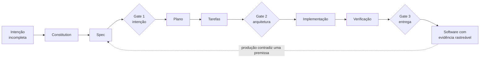

# Desenvolvimento guiado por especificação

> **Pergunta-guia:** Como uma intenção humana atravessa um sistema de agentes até virar software verificável?

*Figura — O fluxo não termina no código: produção que contradiz uma premissa volta para a especificação, não para um remendo silencioso.*

Um agente que escreve software tem ferramentas com efeito durável: lê arquivos, edita código, executa comandos, cria branches e propõe commits. Uma alteração pode compilar e ainda violar uma regra de negócio, enfraquecer segurança ou resolver um problema diferente do que motivou o trabalho. A pergunta arquitetural é a mesma do Módulo 4, aplicada ao artefato mais sensível que existe numa organização de software: qual liberdade o modelo recebe, qual contrato orienta suas escolhas e que evidência autoriza o próximo passo.

**Tempo estimado de leitura:** 60–90 minutos, sem contar a oficina e os exercícios.

## O que você aprenderá

Ao final, você deverá conseguir:

1. distinguir *vibe coding*, assistência de codificação e desenvolvimento guiado por especificação pelo artefato que governa a mudança;
2. tratar a especificação como artefato vivo e versionado, não como documentação retrospectiva;
3. escrever uma constitution pequena e verificável, com princípios que rejeitam alguma coisa;
4. percorrer o fluxo de oito etapas, da intenção à evidência, sabendo o que cada uma reduz de incerteza;
5. separar fato, hipótese, desconhecido e fora de escopo antes de planejar;
6. formular critérios de aceite antes das tarefas e fatiar o trabalho verticalmente;
7. escolher *seams* duráveis e testar pelas interfaces públicas;
8. posicionar os três gates humanos e dizer o que cada um pode bloquear;
9. conduzir revisão em dois eixos, aderência à spec e padrões de engenharia;
10. reconhecer quando o método vira cerimônia e reduzir a profundidade sem perder controle.

## Continuidade com o Módulo 4

O caso mais concreto de autonomia com ferramentas é o agente que constrói software. Ele lê o repositório, propõe um plano, altera arquivos, executa testes e interpreta resultados. Portanto, concentra em pequena escala quase todos os problemas do módulo anterior: delegação, contratos, estado, memória, efeitos colaterais, observabilidade, revisão humana e recuperação de falhas. **Specification-Driven Development (SDD)** não entra como tópico lateral. Ele funciona como a espinha dorsal aplicada para estudar como uma intenção humana atravessa um sistema de agentes até se tornar software verificável.

O **Spec Kit** conduz o percurso comum: `constitution → specify → clarify → plan → tasks → analyze → implement → verify`. A sequência não transforma comandos em método infalível. Ela torna explícitas perguntas que o “prompt e torça” costuma esconder: quais princípios são inegociáveis? O que deve acontecer para o usuário? Quais ambiguidades permanecem? Que arquitetura suporta os atributos de qualidade? Como fatiar trabalho que possa ser integrado e validado? Que evidência demonstra aderência à intenção e aos padrões do repositório?

A especificação será tratada como artefato vivo e versionado. Ela descreve comportamento observável, critérios de aceite, limites, riscos e questões em aberto. O plano técnico traduz essa intenção para componentes, contratos e decisões. As tarefas formam fatias verticais pequenas, e não uma lista de camadas desconectadas. A implementação começa por testes nas interfaces públicas. A revisão ocorre em dois eixos: **aderência à spec** e **qualidade segundo os padrões de engenharia**. Três gates humanos preservam responsabilidade antes do plano, antes da execução e antes da integração.

Este módulo pratica um fio condutor comum sem reduzir SDD ao Spec Kit. O fluxo de Matt Pocock — `grill-with-docs → to-spec → to-tickets → implement → code-review` — ajuda a aprofundar clarificação, fatiamento vertical, módulos profundos e revisão em duas passagens. Kiro, BMAD, Tessl e outros materiais aparecem no apêndice como variações comparáveis. A turma pratica um fio condutor comum e, ao mesmo tempo, aprende a separar os princípios duráveis da sintaxe de uma ferramenta.

O percurso produz evidências concretas:

| Parte do módulo | Pergunta de SDD | Evidência produzida |
|---|---|---|
| [Vibe coding, assistência e SDD](modos-de-trabalho.md#do-agente-que-age-ao-agente-que-constroi-software) | por que a spec precisa governar agentes de codificação? | vocabulário, fluxo completo e ledger epistemológico |
| [Decisões e limites do SDD](decisoes.md#padrao-desenvolvimento-guiado-por-especificacao) | como preservar intenção e qualidade durante a transformação? | critérios, fatias verticais, seams, gates e ADRs |
| [Exemplo arquitetural](exemplo-arquitetural.md#pipeline-sdd-com-gates-humanos) | como os artefatos se conectam numa mudança real? | constitution, spec, plano, contratos, tarefas, testes e revisão |
| [Oficina](oficina-de-ferramentas.md#extensao-mini-fluxo-spec-kit) | como operar o ciclo com segurança? | mini-iniciativa executada com Spec Kit |
| [Exercícios](exercicios.md) | como criticar e adaptar o método? | análise de consistência e proposta completa |
| [Síntese](sintese-e-referencias.md#sintese-do-fio-sdd) | o que permanece quando a ferramenta muda? | checklists, limites e apêndice comparativo |

Ao terminar, você não deverá apenas repetir etapas. Deverá saber calibrar profundidade ao risco, interromper o agente quando a evidência é insuficiente, reconhecer uma spec ornamental e explicar por que aprovação humana não compensa critérios vagos. A pessoa arquiteta preserva a responsabilidade pela intenção, pelos atributos de qualidade e pelos gates; o agente amplia capacidade de exploração e execução dentro desses limites.

## Mapa do módulo

| Etapa | Página | Foco |
|---|---|---|
| 1 | [Abertura](index.md) | contrato de aprendizagem do módulo |
| 2 | [Vibe coding, assistência e SDD](modos-de-trabalho.md) | três modos de trabalho, spec viva e constitution |
| 3 | [O fluxo SDD](fluxo.md) | oito etapas, três gates humanos e oito artefatos |
| 4 | [Decisões e limites do SDD](decisoes.md) | as oito decisões do fluxo, dois ADRs e quando o método falha |
| 5 | [Exemplo arquitetural](exemplo-arquitetural.md) | a feature 027 percorrida de constitution a produção |
| 6 | [Estudo de caso](estudo-de-caso.md) | profundidade proporcional numa base legada |
| 7 | [Oficina de ferramentas](oficina-de-ferramentas.md) | mini-iniciativa executada com Spec Kit |
| 8 | [Exercícios](exercicios.md) | artefatos, consistência, comparação de fluxos e projeto |
| 9 | [Síntese e referências](sintese-e-referencias.md) | checklists, limites honestos e apêndice comparativo |

Os casos contínuos seguem em [Banco Lume](caso-lume.md) e [Cooperativa Aurora](caso-aurora.md).

**Próxima página:** [Vibe coding, assistência e SDD](modos-de-trabalho.md).
