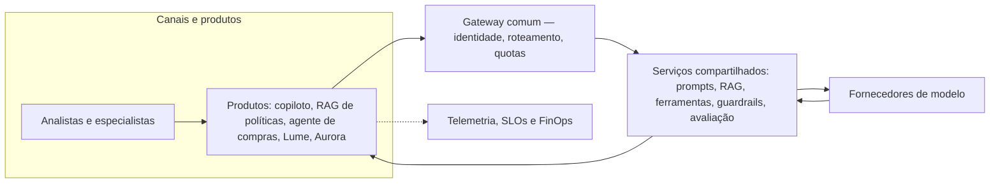

# Caso contínuo: Cooperativa Aurora — operação

**Caso contínuo — Cooperativa Aurora.** [← Módulo 5: Confiança e avaliação](../modulo-5-confianca/caso-aurora.md)

Ao chegar neste módulo, a Cooperativa Aurora já tem arquitetura decidida: evoluiu para um copiloto com [RAG](../modulo-3-rag/caso-aurora.md) e um [agente de ferramentas somente leitura](../modulo-4-agentes/caso-aurora.md) sobre sistemas legados, com [modelo de ameaças e avaliação](../modulo-5-confianca/caso-aurora.md) próprios. Este módulo trata a Aurora como **mais um produto** na mesma plataforma corporativa descrita no [exemplo arquitetural](exemplo-arquitetural.md) — que já hospeda copiloto de atendimento, RAG de políticas, agente de compras e o [Banco Lume](caso-lume.md), tratado em sua própria página. A Aurora entra pelo mesmo gateway, identidade e telemetria, mas preserva jornada, ferramentas, avaliação e risco residual próprios, exatamente como o princípio do módulo estabelece: a plataforma não vira um "chat corporativo" único.



**Equivalente textual.** Lume e Aurora entram como mais dois nós em "Produtos", ao lado dos três já existentes. Todos atravessam o mesmo gateway e os mesmos serviços compartilhados; cada produto mantém sua própria fonte de dados, prompt e avaliação, e emite telemetria para o mesmo plano de observação, SLOs e FinOps da plataforma.

## Cooperativa Aurora na plataforma

**Versionamento e manifesto.** O manifesto da Aurora versiona prompt do copiloto, índice de políticas de campanha (RAG) e, adicionalmente, o catálogo de contratos de ferramenta do agente — cada ferramenta com sua própria versão de contrato e política de autorização, seguindo o [serviço compartilhado de ferramentas](padroes-e-decisoes.md#servicos-compartilhados-com-fronteiras-explicitas).

**Canary e rollback.** Por ter agente, o canary da Aurora segue a regra mais estrita do módulo: nenhuma escrita ocorre durante o candidato (a restrição de gravação já vale para produção, não só para canary); apenas leitura às ferramentas é liberada à coorte piloto. Critério de parada adicional específico da Aurora: qualquer trajetória de ferramenta fora do orçamento de passos aprovado interrompe a exposição, mesmo sem impacto percebido pelo cliente. Rollback restaura prompt, índice e catálogo de contratos juntos.

**Showback e chargeback.** O custo da Aurora inclui chamadas de ferramenta aos sistemas legados, mais caras e variáveis que consulta a índice — a plataforma recomenda iniciar chargeback para a Aurora antes do Lume, já que o custo por chamada de ferramenta é atribuível de forma mais direta que tokens de síntese.

**Fronteiras de propriedade.** Além do que cabe a qualquer produto, a Aurora exige contrato explícito entre plataforma e produto sobre o catálogo de ferramentas: a plataforma garante idempotência, identidade delegada e auditoria do executor; o produto Aurora garante que cada ferramenta é somente leitura e que o orçamento de passos é respeitado pelo orquestrador do produto.

### ADR — Aurora: escrita suspensa em canary, chargeback antecipado

**Status.** Proposta.

**Contexto.** A Aurora opera com agente de ferramentas somente leitura (Módulo 4) e superfície de risco maior que o Lume (Módulo 5); a integração à plataforma precisa herdar os mecanismos de degradação e contenção do módulo sem enfraquecer os controles já definidos.

**Direcionadores da decisão.** Segregação entre quem propõe e quem aprova (restrição confirmada no Módulo 2); orçamento de passos e autorização por ferramenta (Módulo 4); atribuição de custo mais precisa que o Lume, pela natureza da chamada a sistemas legados.

**Opções.**

1. **Canary com leitura liberada e escrita suspensa** — usa o padrão de [degradação por produto](padroes-e-decisoes.md#roteamento-fallback-e-degradacao) do módulo (`agente suspende escrita e mantém apenas consulta permitida`).
2. **Canary sem restrição adicional** — mais simples, mas contraria a própria decisão de autonomia limitada do Módulo 4.
3. **Sem canary, apenas homologação** — mais rápido, mas sem evidência incremental de trajetória real de ferramenta.

**Decisão.** Escrita permanece suspensa durante todo o canary (nenhuma alteração real em sistemas legados); leitura é liberada à coorte; chargeback do custo de chamada de ferramenta começa já no piloto, por ser atribuível por chamada.

**Consequências.** Contenção alta de risco durante a validação; custo de manter, por mais tempo, o fluxo manual para o efeito final (aprovação e registro) mesmo com o agente já operando.

**Evidências.** O registro de risco do Módulo 5 já identifica a superfície de agente como maior que a do Lume; suspender escrita em canary reduz esse risco sem impedir a validação da parte que efetivamente muda (leitura e proposta).

**Gatilhos de revisão.** Reavaliar liberação de escrita em canary somente após N ciclos sem violação de orçamento de passos e com aprovação de Segurança e do dono do processo de crédito.

## Mini-execução: telemetria

**Pré-requisitos.** Ambiente do Módulo 6 já preparado (`python3 -m venv .venv`, dependências do gateway do Módulo 2 ativo em `localhost:4000`).

**Instalação.**

```bash
pip install opentelemetry-api opentelemetry-sdk
```

**Execução.**

```bash
python docs/assets/labs/modulo-6/telemetria_lume_aurora.py --caso aurora
```

**Resultado esperado.** Três spans (`entrada`, `modelo`, `saida`), um `TRACE_ID`, a duração em milissegundos e a resposta sintética — com o atributo `boreal.produto` marcando `aurora`, comparável ao trace do [caso Lume](caso-lume.md) no mesmo painel de observação.

**Limpeza.** Encerre o gateway local do Módulo 2 e desative o venv (`deactivate`); não reaproveite as respostas sintéticas como evidência real.

## Continuidade: do Módulo 1 ao 6

A Cooperativa Aurora atravessou o curso guiada por evidência, não por preferência por complexidade: separou as quatro decisões desde o [Módulo 1](../modulo-1-fundamentos/caso-aurora.md) a partir de evidências próprias — corpus de campanhas maior, sistemas legados em lote —, ganhou arquitetura no [Módulo 2](../modulo-2-desenho-conceitual/caso-aurora.md), evoluiu para RAG híbrido em lote no [Módulo 3](../modulo-3-rag/caso-aurora.md) e chegou a um agente de ferramentas somente leitura no [Módulo 4](../modulo-4-agentes/caso-aurora.md), com superfície de risco e avaliação correspondentemente maiores no [Módulo 5](../modulo-5-confianca/caso-aurora.md). Neste módulo, ela se torna produto de uma plataforma sem perder a responsabilidade que lhe é própria. O [Banco Lume](caso-lume.md) seguiu o mesmo método a partir de evidências diferentes e **permaneceu sem agente** — comparar as duas trajetórias, lado a lado, é o argumento central do caso: a lição não é "toda solução generativa termina em agente e RAG", é que cada decisão — conhecimento, efeito, autonomia, operação — precisa da sua própria evidência antes de ser tomada.
