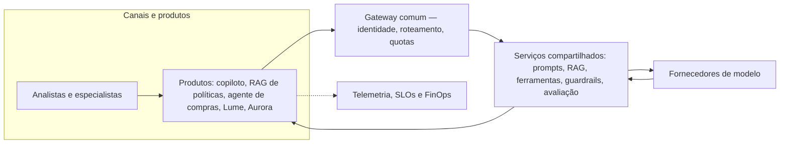

# Caso contínuo: Banco Lume e Cooperativa Aurora — dois produtos da plataforma

Ao chegar neste módulo, os dois casos já têm arquitetura decidida: o [Banco Lume](../modulo-4-agentes/caso-lume-aurora.md) permanece um workflow assistivo com [RAG](../modulo-3-rag/caso-lume-aurora.md) de políticas de contestação, sem agente; a [Cooperativa Aurora](../modulo-4-agentes/caso-lume-aurora.md) evoluiu para um copiloto com RAG e um agente de ferramentas somente leitura sobre sistemas legados, com [modelo de ameaças e avaliação](../modulo-5-confianca/caso-lume-aurora.md) próprios. Este módulo trata os dois como **mais dois produtos** na mesma plataforma corporativa descrita no [exemplo arquitetural](exemplo-arquitetural.md) — que já hospeda copiloto de atendimento, RAG de políticas e agente de compras. Lume e Aurora entram pelo mesmo gateway, identidade e telemetria, mas preservam jornada, fontes, ferramentas, avaliação e risco residual próprios, exatamente como o princípio do módulo estabelece: a plataforma não vira um "chat corporativo" único.



**Equivalente textual.** Lume e Aurora entram como mais dois nós em "Produtos", ao lado dos três já existentes. Todos atravessam o mesmo gateway e os mesmos serviços compartilhados; cada produto mantém sua própria fonte de dados, prompt e avaliação, e emite telemetria para o mesmo plano de observação, SLOs e FinOps da plataforma.

## Banco Lume na plataforma

**Versionamento e manifesto.** O manifesto do Lume versiona, juntos: prompt de síntese de contestação, índice de políticas de contestação (RAG) e regras de validação de suporte. Uma mudança em qualquer um dos três exige novo manifesto e nova avaliação — não é permitido trocar o índice sem revalidar o prompt que o consome.

**Canary e rollback.** O canary do Lume expõe o candidato a uma agência ou fração de analistas, sem ações irreversíveis (o produto já não executa efeito algum, apenas rascunho). Critério de parada: cobertura de evidência abaixo do limiar ou aumento de devolução. Rollback restaura o manifesto anterior — prompt, índice e regras de validação juntos, evitando a incompatibilidade descrita em [Padrões e decisões](padroes-e-decisoes.md#roteamento-fallback-e-degradacao) quando apenas o prompt é revertido.

**Showback.** Custo do Lume é atribuído por chamada de síntese e por consulta ao índice de políticas, reportado à área de contestações — sem chargeback neste incremento, pela mesma razão de maturidade de atribuição já registrada no exemplo arquitetural do módulo.

**Fronteiras de propriedade.** A plataforma possui gateway, catálogo de modelos, schema de telemetria e caminho de promoção. O produto Lume possui prompt de síntese, mapeamento de categoria de contestação para política, corpus do índice e SLO percebido pelo analista. Segurança e Privacidade possuem o modelo de ameaças específico do Lume (Módulo 5); o dono do processo de contestações aceita o risco residual.

### ADR — Lume: canary por agência, sem chargeback

**Status.** Proposta.

**Contexto.** O Lume já opera como workflow assistivo com RAG (Módulos 2–5); falta integrá-lo à plataforma comum sem reabrir decisões de arquitetura já tomadas.

**Direcionadores da decisão.** Nenhuma ação irreversível no candidato (o produto não executa efeito); atribuição de custo por área, não por indivíduo; reconstrução de qualquer decisão crítica (restrição já confirmada no Módulo 2).

**Opções.**
1. **Canary por tenant/agência** — usa o [padrão de canary](padroes-e-decisoes.md#portoes-antes-da-exposicao) da plataforma, coorte pequena e reversível.
2. **Rollout completo direto** — mais rápido, mas sem evidência incremental de cobertura antes da exposição total.
3. **Shadow traffic** — mede sem afetar analistas, mas atrasa o aprendizado real sobre correção de especialistas.

**Decisão.** Adotar canary por agência voluntária, com critérios de parada por cobertura de evidência e taxa de devolução, e showback (não chargeback) do custo à área de contestações.

**Consequências.** Exposição controlada e reversível; custo de manter uma agência piloto por mais tempo até a ampliação.

**Evidências.** O modo sombra do Módulo 2 já validou redução de tempo sem piorar cobertura; o canary estende essa evidência à operação real com o gateway comum.

**Gatilhos de revisão.** Reavaliar chargeback se a atribuição de custo por chamada ficar confiável por duas revisões consecutivas; reavaliar rollout completo se três ciclos de canary não apontarem regressão.

## Cooperativa Aurora na plataforma

**Versionamento e manifesto.** O manifesto da Aurora versiona prompt do copiloto, índice de políticas de campanha (RAG) e, adicionalmente, o catálogo de contratos de ferramenta do agente — cada ferramenta com sua própria versão de contrato e política de autorização, seguindo o [serviço compartilhado de ferramentas](padroes-e-decisoes.md#servicos-compartilhados-com-fronteiras-explicitas).

**Canary e rollback.** Por ter agente, o canary da Aurora segue a regra mais estrita do módulo: nenhuma escrita ocorre durante o candidato (a restrição de gravação já vale para produção, não só para canary); apenas leitura às ferramentas é liberada à coorte piloto. Critério de parada adicional específico da Aurora: qualquer trajetória de ferramenta fora do orçamento de passos aprovado interrompe a exposição, mesmo sem impacto percebido pelo cliente. Rollback restaura prompt, índice e catálogo de contratos juntos.

**Showback e chargeback.** O custo da Aurora inclui chamadas de ferramenta aos sistemas legados, mais caras e variáveis que consulta a índice — a plataforma recomenda iniciar chargeback para a Aurora antes do Lume, já que o custo por chamada de ferramenta é atribuível de forma mais direta que tokens de síntese.

**Fronteiras de propriedade.** Além do que cabe a qualquer produto, a Aurora exige contrato explícito entre plataforma e produto sobre o catálogo de ferramentas: a plataforma garante idempotência, identidade delegada e auditoria do executor; o produto Aurora garante que cada ferramenta é somente leitura e que o orçamento de passos é respeitado pelo orquestrador do produto.

### ADR — Aurora: escrita suspensa em canary, chargeback antecipado

**Status.** Proposta.

**Contexto.** A Aurora opera com agente de ferramentas somente leitura (Módulo 4) e superfície de risco maior que o Lume (Módulo 5); a integração à plataforma precisa herdar os mecanismos de degradação e contenção do módulo sem enfraquecer os controles já definidos.

**Direcionadores da decisão.** Segregação entre quem propõe e quem aprova (restrição confirmada no Módulo 2); orçamento de passos e autorização por ferramenta (Módulo 4); atribuição de custo mais precisa que o Lume, pela natureza da chamada a sistemas legados.

**Opções.**
1. **Canary com leitura liberada e escrita suspensa** — usa o padrão de [degradação por produto](padroes-e-decisoes.md#roteamento-fallback-e-degradacao) do módulo (`agente suspende escrita e mantém apenas consulta permitida`).
2. **Canary sem restrição adicional** — mais simples, mas contraria a própria decisão de autonomia limitada do Módulo 4.
3. **Sem canary, apenas homologação** — mais rápido, mas sem evidência incremental de trajetória real de ferramenta.

**Decisão.** Escrita permanece suspensa durante todo o canary (nenhuma alteração real em sistemas legados); leitura é liberada à coorte; chargeback do custo de chamada de ferramenta começa já no piloto, por ser atribuível por chamada.

**Consequências.** Contenção alta de risco durante a validação; custo de manter, por mais tempo, o fluxo manual para o efeito final (aprovação e registro) mesmo com o agente já operando.

**Evidências.** O registro de risco do Módulo 5 já identifica a superfície de agente como maior que a do Lume; suspender escrita em canary reduz esse risco sem impedir a validação da parte que efetivamente muda (leitura e proposta).

**Gatilhos de revisão.** Reavaliar liberação de escrita em canary somente após N ciclos sem violação de orçamento de passos e com aprovação de Segurança e do dono do processo de crédito.

## Mini-execução: telemetria dos dois casos

**Pré-requisitos.** Ambiente do Módulo 6 já preparado (`python3 -m venv .venv`, dependências do gateway do Módulo 2 ativo em `localhost:4000`).

**Instalação.**

```bash
pip install opentelemetry-api opentelemetry-sdk
```

**Execução.**

```bash
python docs/assets/labs/modulo-6/telemetria_lume_aurora.py --caso lume
python docs/assets/labs/modulo-6/telemetria_lume_aurora.py --caso aurora
```

**Resultado esperado.** Três spans por execução (`entrada`, `modelo`, `saida`), um `TRACE_ID`, a duração em milissegundos e a resposta sintética — com o atributo `boreal.produto` marcando `lume` ou `aurora`, permitindo comparar as duas trajetórias no mesmo painel de observação.

**Limpeza.** Encerre o gateway local do Módulo 2 e desative o venv (`deactivate`); não reaproveite as respostas sintéticas como evidência real.

## Continuidade: do Módulo 1 ao 6

O Banco Lume e a Cooperativa Aurora atravessaram o curso por caminhos diferentes, guiados por evidência, não por preferência por complexidade: o Lume separou as quatro decisões desde o Módulo 1, ganhou arquitetura no Módulo 2, evoluiu para RAG no Módulo 3 quando a evidência justificou e **permaneceu deliberadamente sem agente** no Módulo 4. A Aurora seguiu o mesmo método a partir de evidências próprias — corpus de campanhas maior, sistemas legados em lote — e chegou a um agente de ferramentas somente leitura no Módulo 4, com superfície de risco e avaliação correspondentemente maiores no Módulo 5. Neste módulo, os dois se tornam produtos de uma mesma plataforma sem perder a responsabilidade que é própria de cada um. A lição que os dois casos deixam não é "toda solução generativa termina em agente e RAG": é que cada decisão — conhecimento, efeito, autonomia, operação — precisa da sua própria evidência antes de ser tomada.
