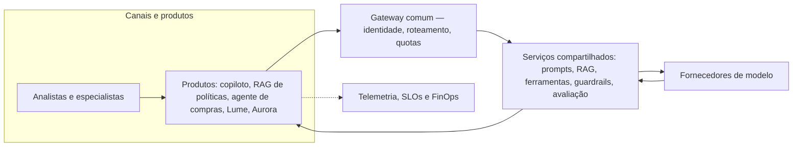

# Caso contínuo: Banco Lume — operação

**Caso contínuo — Banco Lume.** [← Módulo 5: Confiança e avaliação](../modulo-5-confianca/caso-lume.md)

Ao chegar neste módulo, o Banco Lume já tem arquitetura decidida: permanece um workflow assistivo com [RAG](../modulo-3-rag/caso-lume.md) de políticas de contestação, sem agente — decisão confirmada no [Módulo 4](../modulo-4-agentes/caso-lume.md) e avaliada no [Módulo 5](../modulo-5-confianca/caso-lume.md). Este módulo trata o Lume como **mais um produto** na mesma plataforma corporativa descrita no [exemplo arquitetural](exemplo-arquitetural.md) — que já hospeda copiloto de atendimento, RAG de políticas, agente de compras e a [Cooperativa Aurora](caso-aurora.md), tratada em sua própria página. O Lume entra pelo mesmo gateway, identidade e telemetria, mas preserva jornada, fontes e avaliação próprios.



**Equivalente textual.** Lume e Aurora entram como mais dois nós em "Produtos", ao lado dos três já existentes. Todos atravessam o mesmo gateway e os mesmos serviços compartilhados; cada produto mantém sua própria fonte de dados, prompt e avaliação, e emite telemetria para o mesmo plano de observação, SLOs e FinOps da plataforma.

## Banco Lume na plataforma

**Versionamento e manifesto.** O manifesto do Lume versiona, juntos: prompt de síntese de contestação, índice de políticas de contestação (RAG) e regras de validação de suporte. Uma mudança em qualquer um dos três exige novo manifesto e nova avaliação — não é permitido trocar o índice sem revalidar o prompt que o consome.

**Canary e rollback.** O canary do Lume expõe o candidato a uma agência ou fração de analistas, sem ações irreversíveis (o produto já não executa efeito algum, apenas rascunho). Critério de parada: cobertura de evidência abaixo do limiar ou aumento de devolução. Rollback restaura o manifesto anterior — prompt, índice e regras de validação juntos, evitando a incompatibilidade descrita em [Padrões e decisões](padroes-e-decisoes.md#roteamento-fallback-e-degradacao) quando apenas o prompt é revertido.

**Showback.** Custo do Lume é atribuído por chamada de síntese e por consulta ao índice de políticas, reportado à área de contestações — sem chargeback neste incremento, pela mesma razão de maturidade de atribuição já registrada no exemplo arquitetural do módulo.

**Fronteiras de propriedade.** A plataforma possui gateway, catálogo de modelos, schema de telemetria e caminho de promoção. O produto Lume possui prompt de síntese, mapeamento de categoria de contestação para política, corpus do índice e SLO percebido pelo analista. Segurança e Privacidade possuem o modelo de ameaças específico do Lume (Módulo 5); o dono do processo de contestações aceita o risco residual.

### ADR — Lume: canary por agência, sem chargeback

**Status.** Proposta.

**Contexto.** O Lume já opera como workflow assistivo com RAG (Módulos 2–5); falta integrá-lo à plataforma comum sem reabrir decisões de arquitetura já tomadas.

**Direcionadores da decisão.** Nenhuma ação irreversível no candidato (o produto não executa efeito); atribuição de custo por área, não por indivíduo; reconstrução de qualquer decisão crítica (restrição já confirmada no Módulo 2).

**Opções.**

1. **Canary por tenant/agência** — usa o [padrão de canary](padroes-e-decisoes.md#portoes-antes-da-exposicao) da plataforma, coorte pequena e reversível.
2. **Rollout completo direto** — mais rápido, mas sem evidência incremental de cobertura antes da exposição total.
3. **Shadow traffic** — mede sem afetar analistas, mas atrasa o aprendizado real sobre correção de especialistas.

**Decisão.** Adotar canary por agência voluntária, com critérios de parada por cobertura de evidência e taxa de devolução, e showback (não chargeback) do custo à área de contestações.

**Consequências.** Exposição controlada e reversível; custo de manter uma agência piloto por mais tempo até a ampliação.

**Evidências.** O modo sombra do Módulo 2 já validou redução de tempo sem piorar cobertura; o canary estende essa evidência à operação real com o gateway comum.

**Gatilhos de revisão.** Reavaliar chargeback se a atribuição de custo por chamada ficar confiável por duas revisões consecutivas; reavaliar rollout completo se três ciclos de canary não apontarem regressão.

## Mini-execução: telemetria

**Objetivo.** Comparar, no mesmo painel de observação, o trace de uma execução do Lume e da Aurora: observar como o span `conhecimento` minimiza a consulta ao índice de políticas — registra apenas `boreal.etapa`, não o texto da pergunta — e relacionar a duração de cada produto às decisões de showback e chargeback já tomadas para cada um. Consulte [trace: reconstruir a composição](conceitos.md#trace-reconstruir-a-composicao), [logs com preservação de privacidade](conceitos.md#logs-com-preservacao-de-privacidade), [catálogo, identidade, tenancy e política](padroes-e-decisoes.md#catalogo-identidade-tenancy-e-politica) e [modelo operacional da plataforma](padroes-e-decisoes.md#modelo-operacional-da-plataforma).

**Pré-requisitos.** Ambiente do Módulo 6 já preparado (`python3 -m venv .venv`, dependências do gateway do Módulo 2 ativo em `localhost:4000`).

**Instalação.**

```bash
pip install opentelemetry-api opentelemetry-sdk
```

**Execução.**

```bash
python docs/assets/labs/modulo-6/telemetria_lume_aurora.py --caso lume
```

**Resultado esperado.** Três spans (`entrada`, `modelo`, `saida`), um `TRACE_ID`, a duração em milissegundos e a resposta sintética — com o atributo `boreal.produto` marcando `lume`, comparável ao trace do [caso Aurora](caso-aurora.md) no mesmo painel de observação.

**Perguntas exploratórias.**

- O span `conhecimento` registra apenas `boreal.etapa` (`consulta_indice_politicas_contestacao`), não a pergunta enviada ao índice. Por que esse texto não deveria virar atributo do span, à luz da minimização descrita em [Logs com preservação de privacidade](conceitos.md#logs-com-preservacao-de-privacidade)?
- O trace tem `TRACE_ID`, mas não tem `release_id`, manifesto ou identificador de candidato em canary. Que atributo faltaria para religar esta execução a uma promoção específica do Lume, conforme [Trace: reconstruir a composição](conceitos.md#trace-reconstruir-a-composicao)?
- Execute o script para `--caso lume` e `--caso aurora` e compare `DURACAO_MS`. A Aurora soma, na operação real, chamada de ferramenta a sistemas legados além da consulta ao índice; o Lume soma apenas a consulta. Essa diferença de composição sustenta, isoladamente, a decisão de manter [showback no Lume e antecipar chargeback na Aurora](padroes-e-decisoes.md#modelo-operacional-da-plataforma)? O que a duração de uma execução sintética não prova sobre custo atribuível?

**Evidência a entregar.** Execute o script para os dois casos e preencha:

| Execução | Produto | `boreal.etapa` (span `conhecimento`) | `TRACE_ID` | `DURACAO_MS` | Decisão de custo associada |
|---|---|---|---|---:|---|
| 1 | lume | `consulta_indice_politicas_contestacao` |  |  | Showback, sem chargeback |
| 2 | aurora | `consulta_indice_politicas_campanha_e_ferramenta_leitura` |  |  | Showback e chargeback antecipado |

Conclua em até três linhas se a diferença de duração observada basta, isoladamente, para justificar a decisão de custo de cada produto, ou que evidência adicional (amostra, contexto operacional) seria necessária.

**Limpeza.** Encerre o gateway local do Módulo 2 e desative o venv (`deactivate`); não reaproveite as respostas sintéticas como evidência real.

## Continuidade: do Módulo 1 ao 6

O Banco Lume atravessou o curso guiado por evidência, não por preferência por complexidade: separou as quatro decisões desde o [Módulo 1](../modulo-1-fundamentos/caso-lume.md), ganhou arquitetura no [Módulo 2](../modulo-2-desenho-conceitual/caso-lume.md), evoluiu para RAG no [Módulo 3](../modulo-3-rag/caso-lume.md) quando a evidência justificou e **permaneceu deliberadamente sem agente** no [Módulo 4](../modulo-4-agentes/caso-lume.md). Neste módulo, ele se torna produto de uma plataforma sem perder a responsabilidade que lhe é própria. A [Cooperativa Aurora](caso-aurora.md) seguiu o mesmo método a partir de evidências diferentes e chegou a um agente — comparar as duas trajetórias, lado a lado, é o argumento central do caso: cada decisão precisa da sua própria evidência antes de ser tomada, não de uma preferência por "mais IA".
