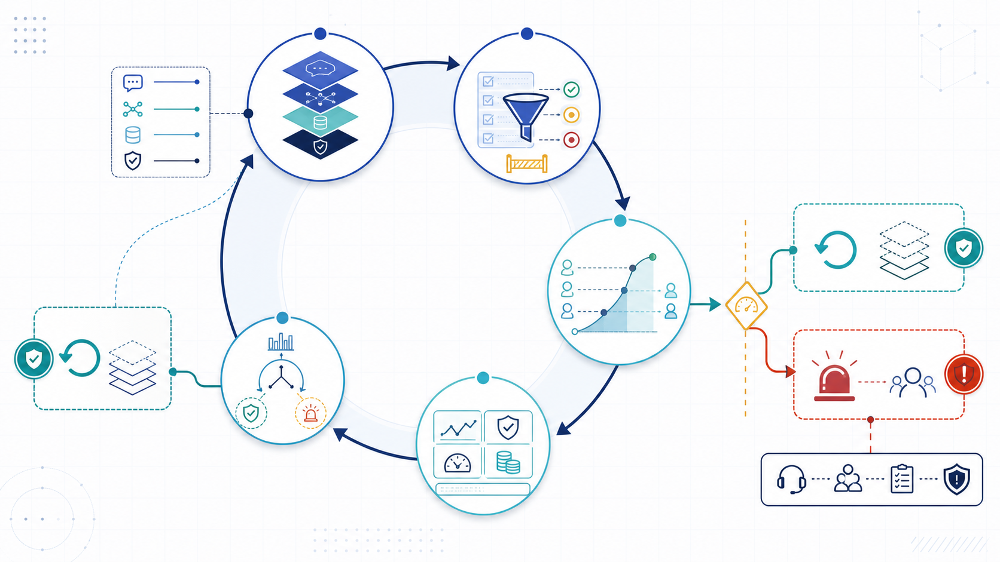
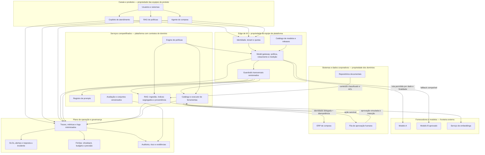
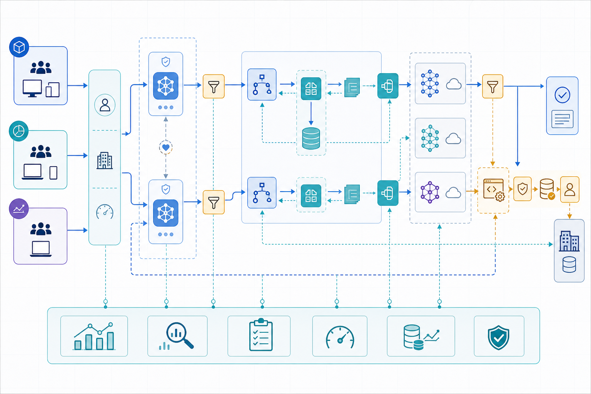
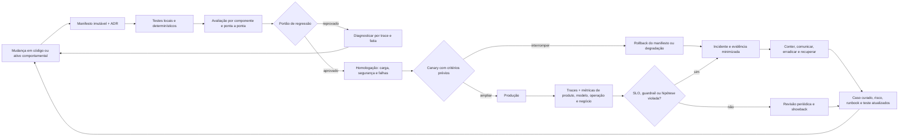

# Exemplo arquitetural: plataforma corporativa operável

## Contexto e decisões

Uma organização opera três produtos: copiloto de atendimento, RAG de políticas e agente de compras com aprovação. Eles compartilham provedores, identidade, telemetria e controles transversais, mas mantêm jornadas, fontes, ferramentas, avaliações e risco residual próprios. A plataforma oferece um caminho preferencial; não transforma produtos diferentes em um único “chat corporativo”.

Os atributos prioritários são: nenhuma ação sem autoridade; nenhum cruzamento de tenant; respostas de política fundamentadas; p95 de 8 segundos para consulta; recuperação controlada diante de falha de fornecedor; custo atribuível por produto; e reconstrução de qualquer decisão crítica. Essas medidas determinam fronteiras e modos de falha.

*Figura planejada — Ciclo LLMOps: a mudança de qualquer ativo comportamental percorre avaliação, liberação controlada, observação e aprendizagem. A seta de retorno não autoriza copiar dados de produção sem tratamento.*

## Arquitetura completa da plataforma

**Equivalente textual — arquitetura completa da plataforma.** Usuários entram por três produtos. Cada produto envia identidade e tenant ao edge; o gateway consulta catálogo e política, aplica quotas, escolhe apenas um modelo permitido e passa por guardrails. Prompts, RAG e ferramentas são serviços compartilhados com contratos versionados. O RAG ingere documentos com classificação e ACL em índices segregados. O executor revalida política e identidade delegada antes do ERP; ações sensíveis passam por aprovação vinculada à intenção. Todos os componentes emitem telemetria minimizada para SLOs, incidentes, FinOps e auditoria. O avaliador fornece evidência, mas não participa sozinho da autorização.

*Figura planejada — Plataforma corporativa: o plano comum concentra controles transversais; produtos e domínios preservam responsabilidade pelo contexto, dados, efeitos e resultados.*

### Fronteiras de propriedade

A **equipe de plataforma** possui gateway, disponibilidade dos serviços comuns, schemas de telemetria, catálogo, integração técnica de identidade, quotas e caminho de promoção. As **equipes de produto** possuem experiência, prompts de domínio, fontes selecionadas, testes ponta a ponta, feedback e SLO percebido. **Segurança e privacidade** possuem requisitos, modelo de ameaças, revisão de exceções e coordenação de incidentes de sua competência. **Operação** possui alertas, plantão, runbooks e coordenação de confiabilidade. O **dono do processo** define política de negócio, aprova efeitos e aceita risco residual. Domínios de dados respondem por classificação, vigência e ACL; fornecedor responde somente pelo serviço contratado.

Responsabilidade conjunta aparece em contratos operacionais. A plataforma pode detectar que a recuperação falhou; o produto decide se busca sem geração é útil; o domínio confirma qual fonte é oficial. “Plataforma responsável por IA” não substitui esses donos.

### Contenção de falhas

- Uma falha do Modelo A abre circuit breaker apenas para a rota afetada. O gateway usa Modelo B somente onde catálogo, região, classe de dados e avaliação permitem; demais rotas degradam.
- Um índice corrompido é isolado por tenant e snapshot. O RAG de políticas interrompe geração fundamentada, enquanto copiloto e agente preservam serviços não dependentes daquele índice.
- A indisponibilidade do executor desabilita escrita; consulta e rascunho continuam. A fila não transforma timeout em sucesso e reconcilia chaves idempotentes antes de retry.
- Uma regressão de guardrail bloqueia as classes protegidas. Não há bypass automático para aumentar disponibilidade.
- Quotas por produto impedem que um experimento consuma capacidade do agente crítico. Uma reserva operacional mantém contenção e resposta a incidente.
- Telemetria de conteúdo fica segregada; comprometimento do painel agregado não concede acesso a prompts completos.

## Ciclo de entrega e observação

**Equivalente textual — ciclo de entrega e observação.** Uma alteração gera manifesto e ADR; testes e avaliação alimentam um portão. Reprovação volta ao diagnóstico. Aprovação segue para homologação e canary. Critério de interrupção aciona rollback ou degradação e, quando aplicável, incidente. Produção emite métricas nos quatro planos. Violação de SLO, guardrail ou hipótese aciona contenção; operação normal passa por revisão. Incidentes e observações são curados em casos de teste, riscos e runbooks antes de voltar ao ciclo.

O feedback não conecta log bruto diretamente ao dataset. Há seleção autorizada, desidentificação, revisão de ataque e versionamento. Também não existe promoção automática a partir de uma nota única: o dono apropriado decide exceções e consequências.

## Fluxos operacionais essenciais

**Liberação normal.** A equipe de produto altera prompt e recuperação, cria manifesto, executa avaliação e obtém revisão quando o trade-off muda. A plataforma promove o mesmo artefato. Canary recebe 5% de um tenant voluntário, sem ações irreversíveis. Após volume e janela mínimos, amplia por etapas.

**Falha de fornecedor.** O gateway detecta timeout, abre circuito e consulta catálogo. Rotas públicas podem usar Modelo B; dados restritos degradam para busca com fonte; o agente preserva rascunho, mas suspende ação. Operação comunica capacidade reduzida e acompanha backlog.

**Incidente de autorização.** Um alerta liga resposta a documento de outro tenant. A plataforma desabilita o índice e preserva evidência; privacidade delimita exposição; produto informa o dono do processo; domínio corrige ACL; avaliação ganha teste negativo. Só um canary segregado reabre a rota.

## Decisões registradas

ADR-061 escolhe gateway comum com extensões tipadas, aceitando dependência operacional para ganhar identidade, custo e política consistentes. ADR-062 escolhe índices separados para dados restritos e filtro obrigatório para públicos, aceitando maior custo de armazenamento. ADR-063 adota dois modelos apenas para rotas onde equivalência foi avaliada; demais rotas degradam. ADR-064 começa com showback e orçamento, deixando chargeback condicionado à qualidade da atribuição. Cada ADR possui gatilho de revisão mensurável.

Examine a transformação organizacional no [Estudo de caso](estudo-de-caso.md).
