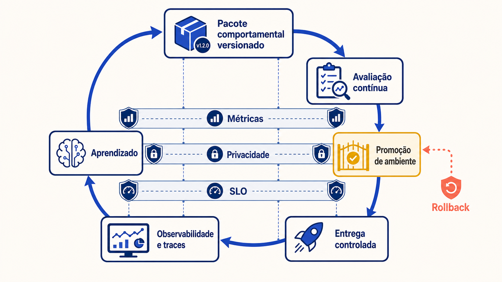

# Operação, LLMOps e plataformas corporativas

*Figura — Operar IA requer evidência contínua.*

## Pergunta orientadora

> **Como manter qualidade e controle quando modelos, prompts, dados e ferramentas mudam continuamente?**

Uma solução generativa não termina quando o primeiro deployment funciona. O modelo oferecido como serviço pode mudar; o prompt evolui; documentos vencem; índices são reconstruídos; ferramentas ganham novas operações; políticas de segurança são revistas; usuários descobrem usos não previstos. Cada mudança altera o comportamento observado, inclusive quando o código da aplicação permanece igual. Operar é governar essa dinâmica com evidências, limites e capacidade de recuperação.

**LLMOps** é o conjunto de práticas técnicas e organizacionais que torna o ciclo de vida de sistemas com modelos de linguagem controlável: registrar ativos comportamentais, reproduzir configurações, avaliar continuamente, promover mudanças por ambientes, observar execuções, responder a incidentes e aprender com produção. O termo é útil, mas não representa uma norma universal nem um produto específico. Neste módulo, ele amplia DevOps, SRE e MLOps para uma arquitetura em que prompts, contexto, recuperação, ferramentas, guardrails e modelos participam do comportamento.

**Tempo estimado de leitura:** 60–90 minutos.

## O que você aprenderá

Ao final, você deverá conseguir:

1. separar ambientes e versionar o pacote completo que determina comportamento;
2. distinguir repetição bit a bit de reprodução suficiente para comparação;
3. conectar avaliação contínua a uma entrega gradual, reversível e auditável;
4. instrumentar traces de prompt, contexto, recuperação, ferramenta e resposta sem criar um repositório indiscriminado de dados sensíveis;
5. relacionar métricas de produto, modelo, operação e negócio;
6. formular indicadores e SLOs que representem serviço útil, não apenas disponibilidade HTTP;
7. desenhar portões de regressão, canary, roteamento, fallback, rollback e degradação segura;
8. estruturar resposta a incidente para efeitos probabilísticos e dependências externas;
9. avaliar gateways, serviços compartilhados, catálogo de modelos, identidade, tenancy e política;
10. decidir entre portabilidade, estratégia multimodelo, reuso e acoplamento consciente;
11. distribuir responsabilidades, cotas, showback e chargeback entre plataforma e produtos;
12. integrar os seis módulos em uma arquitetura pronta para evoluir em produção.
13. priorizar características operacionais, declarar tensões, atribuir responsáveis e definir fitness functions para promoção e recuperação.
14. operar laços desassistidos com condição de parada versionada, orçamento com dono, isolamento e desligamento ensaiado.

## Continuidade com o curso

O [Módulo 1](../modulo-1-fundamentos/index.md) mostrou que a resposta é probabilística, mas o sistema precisa de fronteiras determinísticas. O [Módulo 2](../modulo-2-desenho-conceitual/index.md) ligou contexto, atributos de qualidade e ADRs. O [Módulo 3](../modulo-3-rag/index.md) separou ingestão de consulta e fez da evidência um componente operacional. O [Módulo 4](../modulo-4-agentes/index.md) distinguiu geração, decisão e efeito corporativo, e nomeou o [arnês](../modulo-4-agentes/arnes.md) e a [escada de loops](../modulo-4-agentes/loops.md#quatro-niveis-de-loop). O [Módulo 5](../modulo-5-sdd/index.md) mostrou o fluxo guiado por especificação como o arnês de um agente que escreve software. O [Módulo 6](../modulo-6-confianca/index.md) tratou guardrails, avaliação e risco residual.

Agora essas decisões passam a viver no tempo. Um portão de regressão operacionaliza a avaliação; um trace carrega versões e decisões de guardrail; um rollback restaura um pacote comportamental, não só um binário; uma plataforma oferece controles comuns sem assumir regras de domínio. A escala organizacional será julgada pela capacidade de preservar essas propriedades quando dezenas de equipes e fornecedores compartilham infraestrutura.

## Quatro compromissos operacionais

- Mudança de modelo, prompt, corpus, política, avaliador ou ferramenta recebe evidência e rota de retorno proporcionais ao risco.
- Observabilidade sustenta decisões com metadados minimizados; conteúdo completo é exceção autorizada.
- Fallback e degradação preservam autorização, qualidade mínima e aprovação.
- Plataforma é produto interno: oferece contratos comuns sem absorver a responsabilidade do domínio.
- Laço sem condição de parada objetiva, orçamento e desligamento não entra em operação, qualquer que seja o modelo.

## Mapa do módulo

| Etapa | Página | Foco |
|---|---|---|
| 1 | [Abertura](index.md) | contrato operacional e continuidade do curso |
| 2 | [Versionamento e promoção](pacote-e-promocao.md) | ativo comportamental, ambientes, reprodutibilidade e portões |
| 3 | [Observabilidade e métricas](observabilidade.md) | trace, quatro planos de métricas, logs minimizados e SLO |
| 4 | [Entrega e recuperação](entrega-e-recuperacao.md) | entrega controlada, roteamento, fallback, rollback e incidente |
| 5 | [Operação de loops](lacos-desassistidos.md) | o verificador como gargalo e os quatro portões de um laço |
| 6 | [Playback do laço](playback-do-laco.md) | quatro execuções reais reproduzidas iteração a iteração, sem executar nada |
| 7 | [Plataforma corporativa](plataforma-corporativa.md) | gateway, serviços comuns, catálogo, tenancy e modelo operacional |
| 8 | [Exemplo arquitetural](exemplo-arquitetural.md) | ciclo LLMOps e plataforma corporativa |
| 9 | [Estudo de caso](estudo-de-caso.md) | integração dos protótipos e decisões operacionais |
| 10 | [Oficina de ferramentas](oficina-de-ferramentas.md) | sinais operacionais, quotas, recuperação e um laço objetivado |
| 11 | [Exercícios](exercicios.md) | manifesto, trace, rollout, plataforma e capstone |
| 12 | [Síntese e referências](sintese-e-referencias.md) | prontidão, autoavaliação e fontes |

Siga para [Versionamento e promoção](pacote-e-promocao.md), onde o ciclo operacional é construído antes das escolhas de plataforma. A [Oficina de ferramentas](oficina-de-ferramentas.md) transforma sinais sintéticos em decisões de operação sem exigir acesso a uma plataforma.
