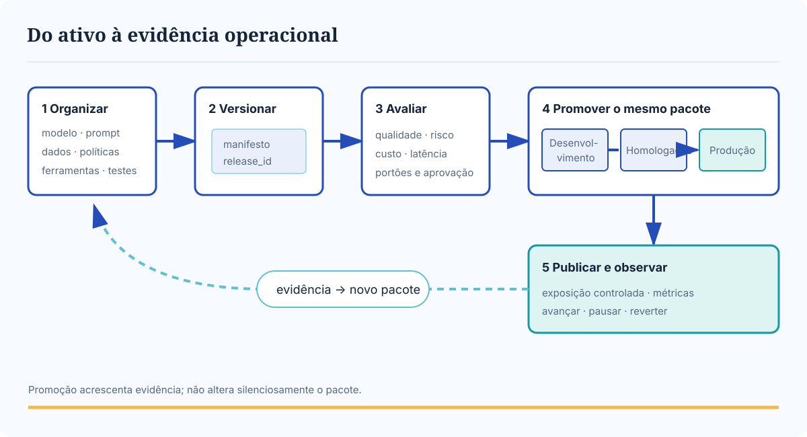
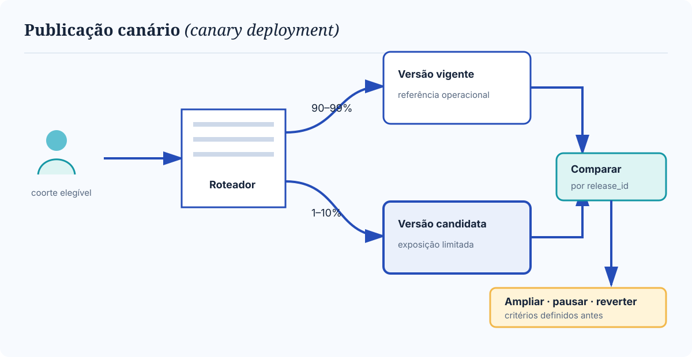
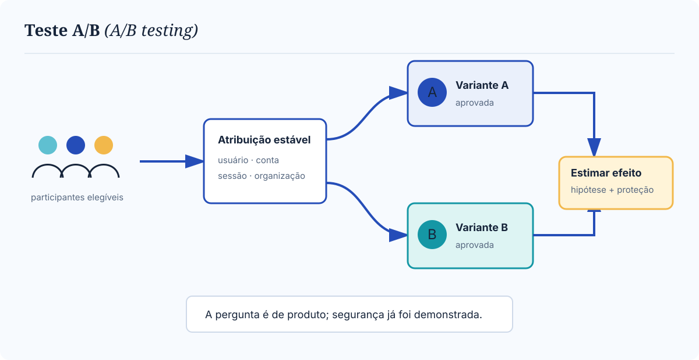
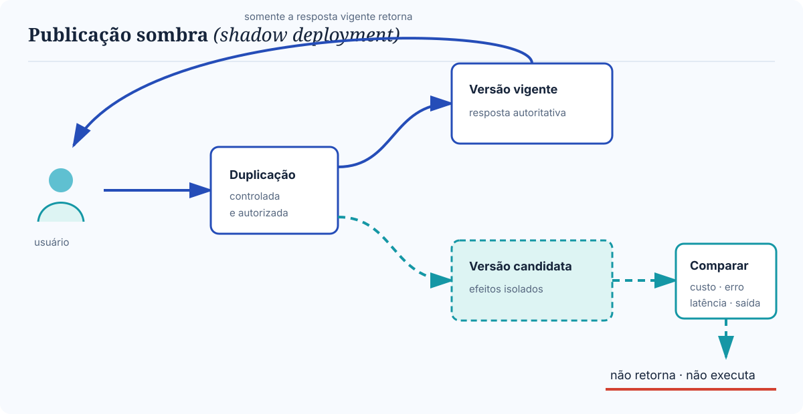

# Versionamento e promoção

Publicar uma solução de IA generativa não significa apenas implantar uma nova versão do código. Significa promover, como uma unidade, todos os artefatos que determinam o comportamento observável do sistema. Se o código chega à produção com uma instrução, um índice ou uma política diferente daquela avaliada, a evidência obtida antes da publicação deixa de representar o que os usuários receberão.

Esta página trata de duas perguntas operacionais:

- **o que deve ser versionado e promovido junto?**;
- **como expor uma versão candidata sem transformar produção em laboratório?**

## O objeto operado é um pacote comportamental

Chamaremos de **ativo comportamental** qualquer artefato cuja alteração possa mudar resposta, decisão, custo, latência, acesso ou efeito. Uma liberação deve declarar, no mínimo:

- **modelo:** fornecedor, família, revisão, região, modalidade e parâmetros de inferência;
- **instrução:** instrução de sistema (*system prompt*), exemplos, modelos de texto (*templates*), idioma e estratégia de montagem de contexto;
- **conhecimento:** corpus, regras de ingestão, permissões, versão do modelo de vetorização (*embedding model*), estratégia de recuperação e instantâneo do índice;
- **proteção:** políticas, filtros, validadores, limites, classificadores e barreiras de proteção (*guardrails*);
- **ação:** esquemas, versões e permissões de ferramentas, além do código de orquestração;
- **estado:** memória, políticas de retenção e compatibilidade entre versões;
- **evidência:** conjuntos de referência, avaliadores, métricas, limiares e resultados;
- **execução:** dependências, configuração de infraestrutura, identidade, cotas e sinalizadores de funcionalidade (*feature flags*).

Essa lista corresponde à [superfície comportamental](../modulo-1-fundamentos/superficie-comportamental.md#de-onde-emerge-o-comportamento) do Módulo 1 e ao [arnês (*harness*)](../modulo-4-agentes/arnes.md) do Módulo 4, agora observados pela lente da operação. A unidade promovida é um **pacote comportamental**: um conjunto imutável ou identificável de ativos acompanhado por um manifesto.

### O manifesto da liberação

O **manifesto da liberação** (*release manifest*) responde “o que exatamente está em execução?” sem depender da memória da equipe. Ele registra:

1. **identidade:** identificador da liberação, data, finalidade, produto e proprietário;
2. **composição:** versão ou resumo criptográfico (*hash*) de cada ativo comportamental;
3. **compatibilidade:** combinações permitidas entre modelo, instrução, índice, ferramenta e política;
4. **evidência:** avaliações executadas, resultados por fatia e limitações conhecidas;
5. **decisão:** portões atravessados, exceções, aprovadores e prazo de validade;
6. **recuperação:** pacote anterior compatível, procedimento de reversão e autoridade para acioná-lo.

“Versão 2 do assistente” não basta se o identificador não permite descobrir qual índice, modelo e política estavam ativos. Resumos criptográficos verificam integridade, mas não substituem metadados compreensíveis. Quando o provedor não oferece uma revisão fixável, o manifesto deve registrar identificador, região, data, parâmetros e resultados de testes sentinela. A variação externa torna-se risco explícito, não detalhe invisível.

## Ambientes e promoção

O ciclo de operações de modelos de linguagem (*LLMOps*) organiza os ativos antes de expô-los. O mesmo pacote atravessa ambientes; configurações sensíveis e credenciais são fornecidas por cada ambiente, sem serem incorporadas ao pacote.

<figure class="architecture-figure">
  
  <figcaption class="figure-caption">Figura 1 — Ciclo LLMOps da organização dos ativos à publicação entre ambientes. Cada promoção conserva a identidade do pacote e acrescenta evidência.</figcaption>
</figure>

O fluxo impõe responsabilidades distintas:

1. **Organizar:** reunir ativos relacionados, declarar dependências e eliminar alterações manuais não rastreadas.
2. **Versionar:** gerar o manifesto, fixar identificadores e armazenar o pacote em registro imutável.
3. **Avaliar:** executar verificações determinísticas e probabilísticas contra critérios versionados.
4. **Promover:** mover a mesma identidade de pacote entre ambientes, anexando aprovações e evidências.
5. **Publicar:** controlar a exposição em produção por coorte, tráfego ou execução paralela.
6. **Observar:** atribuir resultados à liberação, comparar métricas e acionar avanço, pausa ou reversão.
7. **Aprender:** transformar dados autorizados em hipóteses e novos conjuntos de avaliação; qualquer mudança inicia outro pacote.

### Desenvolvimento

O ambiente de **desenvolvimento** favorece velocidade e diagnóstico. Ele deve:

- usar dados sintéticos, anonimizados ou minimizados;
- empregar credenciais sem efeito real e ferramentas simuladas quando houver escrita;
- permitir modelos mais econômicos, desde que a diferença seja declarada;
- reproduzir contratos essenciais, como esquemas, autorização e limites;
- registrar avaliações rápidas que impeçam a promoção de pacotes obviamente inválidos.

### Homologação

A **homologação** aproxima produção sem fingir equivalência perfeita. Ela deve reproduzir topologia, identidade, políticas, cotas e dependências relevantes, além de executar:

- conjunto de referência e avaliação por fatias;
- testes adversariais e de autorização;
- ensaios de carga, custo e latência;
- simulações de falha, degradação e reversão;
- verificação de telemetria, alertas e procedimentos operacionais (*runbooks*).

Dados reais só entram com finalidade, minimização, retenção e acesso aprovados. Homologação reduz diferenças conhecidas e torna as restantes visíveis; não prova que produção se comportará de forma idêntica.

### Produção

A **produção** atende usuários e produz efeitos reais. Por isso, exige:

- acesso mínimo e separação de identidades, segredos, índices e cotas;
- objetivos de nível de serviço (*service level objectives*, SLOs), alertas e responsáveis;
- rastreamento (*tracing*) com `release_id` e metadados suficientes para atribuição;
- limites de custo, latência, chamadas de ferramenta e volume;
- publicação gradual, critérios de interrupção e caminho de reversão testado.

A promoção deve usar o mesmo manifesto em todos os ambientes. Uma “correção rápida” de instrução no console do fornecedor cria divergência impossível de reproduzir. Exceções emergenciais precisam ser registradas, limitadas no tempo e reconciliadas com a fonte versionada.

## Reprodutibilidade sem promessa impossível

**Reprodutibilidade** significa reconstruir configuração, entradas, decisões observáveis e condições suficientes para comparar comportamento. Ela não promete texto idêntico: amostragem, paralelismo, hardware e mudanças invisíveis do provedor introduzem variação.

Um registro mínimo por execução liga:

- identificador da liberação (`release_id`), modelo, revisão e parâmetros;
- instrução, política e versão dos validadores;
- instantâneo de recuperação e contratos de ferramenta;
- identidade autorizada pseudonimizada e decisões de roteamento;
- tempos, consumo, resultado, bloqueios e efeitos solicitados;
- versão dos avaliadores aplicados posteriormente.

Quando houver semente (*seed*) e inferência determinística, elas devem ser registradas. Quando não houver, a equipe executa repetições e compara distribuições, critérios e intervalos. A reprodução também respeita os limites originais de uso de dados: não autoriza reprocessamento para outra finalidade.

A reprodução de trajetórias com ferramentas precisa evitar a repetição de efeitos. Operações de escrita são substituídas por simuladores, ambientes descartáveis ou respostas capturadas. Dados que não podem ser retidos são representados por evidência mínima, nunca copiados integralmente por conveniência.

## Portões antes da exposição

Um **portão de regressão** (*regression gate*) compara o pacote candidato com uma referência versionada antes da publicação. O portão combina:

- **correção determinística:** esquemas, autorização, citações, orçamentos e invariantes de ferramenta;
- **qualidade probabilística:** repetições, fatias, intervalos e comparação com a versão vigente;
- **segurança:** casos adversariais, vazamento, uso indevido e violações de política;
- **operação:** carga, latência, disponibilidade, custo e comportamento sob falha;
- **governança:** finalidade, risco residual, exceções, aprovador e validade da decisão.

O resultado não deve ser apenas “passou” ou “falhou”. Uma decisão robusta combina:

1. **limiar absoluto**, que protege o mínimo aceitável;
2. **limite de não regressão**, que impede piora relevante;
3. **orçamento de risco**, que restringe eventos raros, mas graves;
4. **revisão explícita**, que trata trocas conscientes, como maior latência em favor de mais segurança.

Instabilidade de teste (*flakiness*) não justifica ignorar o portão. A equipe separa variação esperada do modelo de instabilidade da infraestrutura, estima a incerteza e corrige o mecanismo de medição.

## Modelos de publicação controlada

Os três modelos abaixo respondem a perguntas diferentes. Eles podem aparecer em sequência — primeiro sombra, depois canário e, apenas quando houver hipótese de produto, A/B —, mas não são etapas obrigatórias de toda liberação.

### Publicação canário (*canary deployment*)

A **publicação canário** expõe o pacote candidato a uma fração delimitada do tráfego, dos usuários, dos clientes organizacionais (*tenants*) ou dos casos de uso. O restante continua na versão vigente. Seu objetivo é verificar se uma versão já aprovada permanece segura e operável sob condições reais.

<figure class="architecture-figure">
  
  <figcaption class="figure-caption">Figura 2 — Publicação canário: exposição pequena, atribuível e reversível antes da ampliação.</figcaption>
</figure>

Antes de iniciar, a equipe define:

- **coorte elegível:** quem pode receber a versão e por que essa amostra representa o risco;
- **proteções:** exclusão de pessoas vulneráveis e suspensão de efeitos irreversíveis quando necessário;
- **janela mínima:** duração e volume suficientes para evitar decisão por ruído;
- **métricas:** qualidade, segurança, erro, latência, custo e indicadores do produto;
- **critérios:** limiares de avanço, manutenção, pausa e reversão;
- **autoridade:** quem pode interromper imediatamente e quem aprova a ampliação;
- **recuperação:** pacote de retorno completo e compatível, já ensaiado.

O roteamento precisa ser estável: uma pessoa ou sessão não deve alternar arbitrariamente entre versões quando isso comprometer contexto. Todo rastro deve carregar o identificador da variante. Atingir um critério de parada sempre interrompe a exposição, mas só abre incidente quando houver impacto, violação de barreira crítica ou severidade definida. Uma hipótese de qualidade rejeitada segue para diagnóstico normal.

Use publicação canário quando o risco depende de condições reais que homologação não reproduz bem. Não a use para descobrir se o candidato atende aos requisitos mínimos: essa pergunta pertence aos portões anteriores.

### Teste A/B (*A/B testing*)

O **teste A/B** distribui participantes elegíveis entre duas variantes aceitáveis para estimar o efeito de uma mudança sobre uma hipótese de produto. A pergunta não é “B é seguro?”, mas “B melhora o resultado definido em relação a A?”.

<figure class="architecture-figure">
  
  <figcaption class="figure-caption">Figura 3 — Teste A/B: duas variantes aceitáveis, grupos comparáveis e uma hipótese mensurável.</figcaption>
</figure>

Um experimento válido requer:

1. **hipótese prévia:** por exemplo, “B aumenta a resolução no primeiro contato sem reduzir correção factual”;
2. **unidade de atribuição:** usuário, conta, sessão ou cliente organizacional, escolhida para evitar contaminação;
3. **alocação estável:** cada unidade permanece na variante designada durante a janela relevante;
4. **métrica primária:** uma medida principal e critérios de proteção (*guardrail metrics*) contra ganhos enganosos;
5. **tamanho e duração:** amostra e janela definidos antes da leitura dos resultados;
6. **análise por fatias:** verificação de efeitos adversos escondidos na média;
7. **regra de decisão:** adotar, rejeitar ou continuar coletando evidência.

Não se deve usar teste A/B para expor uma variante possivelmente insegura, contornar avaliação ou “ver se alguém reclama”. Ambas as variantes atravessam os mesmos portões técnicos e éticos. Também é preciso controlar mudanças simultâneas: alterar modelo, interface, preço e população ao mesmo tempo impede atribuir o efeito observado.

### Publicação sombra (*shadow deployment*)

Na **publicação sombra**, uma cópia autorizada da entrada real alimenta a versão candidata em paralelo, mas sua saída não chega ao usuário nem produz efeitos. A versão vigente continua sendo o único caminho de resposta.

<figure class="architecture-figure">
  
  <figcaption class="figure-caption">Figura 4 — Publicação sombra: execução paralela sem resposta ou efeito do candidato sobre o usuário.</figcaption>
</figure>

Esse modelo permite medir:

- compatibilidade com a distribuição real de entradas;
- latência, consumo de unidades de processamento (*tokens*), custo e taxa de erro;
- divergência entre respostas, classificações e chamadas propostas;
- comportamento por idioma, produto, tipo de solicitação ou outra fatia autorizada;
- capacidade da telemetria e dos comparadores antes de uma exposição real.

“Invisível para o usuário” não significa “sem risco”. A publicação sombra ainda processa dados e consome recursos. Por isso:

- apenas entradas com finalidade e base de tratamento compatíveis podem ser duplicadas;
- conteúdo deve ser minimizado ou mascarado quando possível;
- ferramentas de escrita devem ser desabilitadas, simuladas ou isoladas;
- saídas do candidato não devem alimentar memória, recuperação ou decisões de negócio;
- retenção, acesso, custo e capacidade precisam de limites próprios.

A sombra não mede adequadamente reação humana, satisfação ou efeito de uma recomendação, pois o usuário nunca vê a saída candidata. Ela é indicada para compatibilidade e operação; não substitui canário nem teste A/B quando a pergunta depende de interação real.

### Como escolher

| Pergunta principal | Modelo indicado | O usuário recebe o candidato? | Pré-condição decisiva | Resultado esperado |
|---|---|---:|---|---|
| O candidato opera com segurança sob tráfego real? | Publicação canário (*canary deployment*) | Sim, uma coorte limitada | candidato aprovado e reversão pronta | ampliar, manter, pausar ou reverter |
| Qual variante aceitável melhora uma hipótese de produto? | Teste A/B (*A/B testing*) | Sim, conforme atribuição | duas variantes aprovadas e grupos comparáveis | estimar efeito e decidir pela hipótese |
| Como o candidato se comporta com entradas reais sem afetar usuários? | Publicação sombra (*shadow deployment*) | Não | duplicação autorizada e efeitos isolados | medir compatibilidade, custo e divergência |

{ .comparison-table }

A escolha começa pela pergunta e pelo risco, não pela ferramenta disponível. Se mais de um modelo for combinado, cada transição deve registrar nova evidência no manifesto da liberação. Nenhum deles elimina portões, observabilidade, critérios de parada ou reversão do pacote completo.
