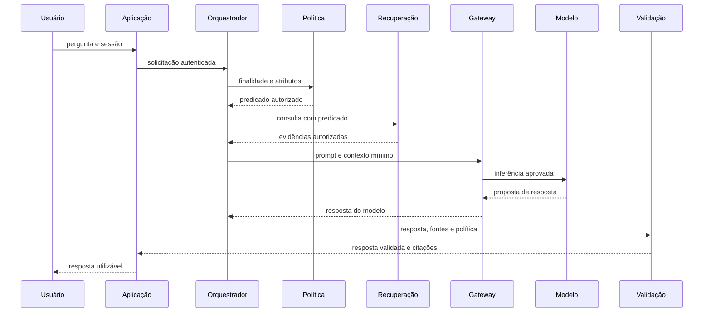

# Diagramas e Ferramentas Práticas Implementation Plan

> **For agentic workers:** REQUIRED SUB-SKILL: Use superpowers:subagent-driven-development (recommended) or superpowers:executing-plans to implement this plan task-by-task. Steps use checkbox (`- [ ]`) syntax for tracking.

**Goal:** Tornar o exemplo arquitetural do Módulo 1 visualmente correto e transformar os exemplos e oficinas de ferramentas em experiências concretas e reproduzíveis.

**Architecture:** Uma imagem didática gerada substitui o fluxograma de componentes, enquanto Mermaid representa a ordem temporal por meio de `sequenceDiagram`. O Guia de ferramentas permanece a fonte compartilhada de condições de acesso; cada módulo adiciona exemplos no conceito e uma receita local sem cartão na oficina.

**Tech Stack:** Markdown, Mermaid, imagem PNG gerada por `image_gen`, MkDocs Material, Python `unittest` e `scripts/validate_content.py`.

## Global Constraints

- O diagrama de componentes é uma imagem didática em português, sem marcas ou logotipos, com texto alternativo e equivalente textual.
- O diagrama de sequência usa Mermaid `sequenceDiagram` e mostra autenticação, recuperação autorizada, inferência, validação e resposta.
- Todo exemplo de ferramenta é uma categoria, não uma recomendação de fornecedor.
- Cada receita obrigatória tem instalação/configuração, entrada sintética, resultado esperado, limpeza e rota sem cartão, sem chave e sem dados reais.
- Serviços institucionais e comerciais são opcionais e não acrescentam pontos.
- URLs e pré-requisitos são verificados em documentação oficial e registrados em `docs/referencia/fontes.yml`.
- A verificação final obrigatória é `python -m unittest discover -s tests -v`, `python scripts/validate_content.py --all` e `mkdocs build --strict`.

---

## Estrutura de arquivos

| Arquivo | Responsabilidade |
|---|---|
| `docs/assets/images/m01-componentes-dependencias.png` | Ilustração gerada do diagrama de componentes. |
| `docs/assets/images/prompts.md` | Prompt, legenda e texto alternativo da imagem gerada. |
| `docs/modulo-1-fundamentos/exemplo-arquitetural.md` | Imagem de componentes, equivalente textual e sequência Mermaid. |
| `docs/modulo-{1..6}-*/conceitos.md` | Exemplos inseridos e seção `Ferramentas no mercado`. |
| `docs/modulo-{1..6}-*/oficina-de-ferramentas.md` | Receita principal executável e plano de contingência. |
| `docs/referencia/guia-de-ferramentas.md` | Pré-requisitos e links de referência consolidados. |
| `docs/referencia/fontes.yml` | Registro das fontes oficiais novas. |
| `tests/test_module_one.py` | Contrato dos dois diagramas distintos. |
| `tests/test_applied_literacy.py` | Contrato de receitas concretas por oficina. |

## Task 1: Definir testes para os diagramas e receitas concretas

**Files:**
- Modify: `tests/test_module_one.py`
- Modify: `tests/test_applied_literacy.py`

**Interfaces:**
- Consumes: páginas do Módulo 1, oficinas e o padrão de fontes do repositório.
- Produces: guardrails editoriais para imagens, Mermaid de sequência, ferramentas nomeadas e receitas executáveis.

- [ ] **Step 1: Escrever o teste de diagramas distintos**

Substituir o teste que extrai o primeiro Mermaid por verificações explícitas:

```python
def test_component_image_and_sequence_diagram_have_distinct_jobs(self):
    text = (MODULE / "exemplo-arquitetural.md").read_text(encoding="utf-8")
    self.assertIn("m01-componentes-dependencias.png", text)
    self.assertIn("Equivalente textual — componentes", text)
    sequence = re.search(r"```mermaid\n(.*?)```", text, re.DOTALL)
    self.assertIsNotNone(sequence)
    for term in ("sequenceDiagram", "participant U as Usuário", "participant A as Aplicação", "participant O as Orquestrador", "participant R as Recuperação", "participant G as Gateway", "participant M as Modelo", "Validação"):
        self.assertIn(term, sequence.group(1))
```

- [ ] **Step 2: Escrever o teste de ferramentas e receitas**

Adicionar em `AppliedLiteracyTest`:

```python
def test_concepts_and_workshops_name_tools_and_reproducible_steps(self):
    expected_tools = {
        "modulo-1-fundamentos": ("Ollama", "LM Studio"),
        "modulo-2-desenho-conceitual": ("LiteLLM", "OpenAI SDK"),
        "modulo-3-rag": ("LangChain", "Chroma"),
        "modulo-4-agentes": ("n8n", "LangGraph"),
        "modulo-5-confianca": ("Langfuse", "Phoenix"),
        "modulo-6-operacao": ("LiteLLM Proxy", "OpenTelemetry"),
    }
    for slug, tools in expected_tools.items():
        concepts = (DOCS / slug / "conceitos.md").read_text(encoding="utf-8")
        workshop = (DOCS / slug / OFFICE).read_text(encoding="utf-8")
        self.assertIn("## Ferramentas no mercado", concepts)
        for tool in tools:
            self.assertIn(tool, concepts)
        for heading in ("## Receita principal", "## Pré-requisitos", "## Resultado esperado", "## Limpeza e contingência"):
            self.assertIn(heading, workshop)
        self.assertRegex(workshop, r"(?m)^```(?:bash|yaml|json)$")
```

- [ ] **Step 3: Executar para confirmar as falhas**

Run: `python -m unittest tests.test_module_one tests.test_applied_literacy -v`  
Expected: FAIL por imagem, Mermaid de sequência, seções e receitas ainda ausentes.

- [ ] **Step 4: Fazer o commit do contrato**

```bash
git add tests/test_module_one.py tests/test_applied_literacy.py
git commit -m "test: define practical diagram and tool contracts"
```

## Task 2: Criar os diagramas corretos do Módulo 1

**Files:**
- Create: `docs/assets/images/m01-componentes-dependencias.png`
- Modify: `docs/assets/images/prompts.md`
- Modify: `docs/modulo-1-fundamentos/exemplo-arquitetural.md`

**Interfaces:**
- Consumes: contrato de Task 1 e a imagem já existente como referência de linguagem visual.
- Produces: ilustração de componentes acessível e sequência Mermaid renderizável.

- [ ] **Step 1: Gerar a ilustração de componentes em português**

Usar `image_gen` com este briefing: ilustração didática horizontal, fundo claro, estilo editorial acadêmico; componentes rotulados em português: `Canal do usuário`, `Aplicação e API`, `Orquestrador de contexto`, `Conhecimento autorizado`, `Gateway de modelos`, `Ferramentas corporativas`, `Infraestrutura e operação`; uma faixa inferior transversal `Segurança · Governança · Avaliação · Observabilidade`; setas sólidas entre canal→aplicação→orquestrador, orquestrador↔conhecimento, orquestrador→gateway, orquestrador↔ferramentas; nenhum logotipo, marca ou texto em inglês; tipografia legível e contraste alto.

- [ ] **Step 2: Adicionar o ativo e o manifesto de imagem**

Salvar o PNG em `docs/assets/images/m01-componentes-dependencias.png`. Em `docs/assets/images/prompts.md`, adicionar seção com: nome do arquivo, propósito, prompt usado, elementos, texto alternativo e legenda `Figura 3 — Componentes e dependências de uma solução generativa fundamentada.`

- [ ] **Step 3: Reestruturar a página arquitetural**

Substituir `## Fluxo de componentes` por `## Componentes e dependências`, inserir a imagem e o equivalente textual. Substituir o bloco Mermaid `flowchart` por `## Sequência de uma consulta fundamentada` e este esqueleto:



Explicar, após o diagrama, que ingestão/indexação pertence ao caminho offline e não é chamada síncrona da consulta.

- [ ] **Step 4: Rodar testes e build do módulo**

Run: `python -m unittest tests.test_module_one -v && mkdocs build --strict`  
Expected: PASS.

- [ ] **Step 5: Fazer o commit dos diagramas**

```bash
git add docs/assets/images/m01-componentes-dependencias.png docs/assets/images/prompts.md docs/modulo-1-fundamentos/exemplo-arquitetural.md
git commit -m "feat: redesign module one architecture diagrams"
```

## Task 3: Aterrar conceitos em ferramentas concretas

**Files:**
- Modify: `docs/modulo-1-fundamentos/conceitos.md`
- Modify: `docs/modulo-2-desenho-conceitual/conceitos.md`
- Modify: `docs/modulo-3-rag/conceitos.md`
- Modify: `docs/modulo-4-agentes/conceitos.md`
- Modify: `docs/modulo-5-confianca/conceitos.md`
- Modify: `docs/modulo-6-operacao/conceitos.md`
- Modify: `docs/referencia/guia-de-ferramentas.md`
- Modify: `docs/referencia/fontes.yml`

**Interfaces:**
- Consumes: as categorias e links da guia, contrato de Task 1.
- Produces: exemplos no texto e uma seção final consistente por módulo.

- [ ] **Step 1: Pesquisar e registrar fontes oficiais**

Para cada ferramenta ainda ausente da guia, abrir somente a documentação oficial e registrar em `fontes.yml`: LM Studio, Docker Model Runner, LlamaIndex, Chroma, Qdrant, LangGraph, AutoGen, Phoenix e Guardrails AI. Cada entrada usa `accessed: 2026-07-16`, tipo `vendor-documentation` e módulos correspondentes.

- [ ] **Step 2: Inserir exemplos no ponto conceitual correto**

Adicionar frases curtas que separem ferramenta de conceito: Ollama/LM Studio para execução local; LiteLLM/OpenAI SDK para adaptador; LangChain/LlamaIndex/Chroma/Qdrant para recuperação; n8n/LangGraph/AutoGen para fluxo e agentes; Langfuse/Phoenix/Guardrails AI para observação e confiança; LiteLLM Proxy/OpenTelemetry para gateway/operação.

- [ ] **Step 3: Acrescentar seis caixas finais**

Ao fim de cada `conceitos.md`, adicionar `## Ferramentas no mercado` com tabela de quatro colunas: `Ferramenta`, `Quando ajuda`, `Pré-requisito`, `Limite arquitetural`. Incluir dois exemplos esperados pelo teste e linkar o Guia de ferramentas; não prometer plano gratuito nem sugerir que uma ferramenta resolve controles de domínio.

- [ ] **Step 4: Rodar os testes de conteúdo**

Run: `python -m unittest tests.test_applied_literacy tests.test_module_one tests.test_module_two tests.test_module_three tests.test_module_four tests.test_module_five tests.test_module_six -v`  
Expected: PASS.

- [ ] **Step 5: Fazer o commit dos conceitos aterrados**

```bash
git add docs/modulo-*-*/conceitos.md docs/referencia/guia-de-ferramentas.md docs/referencia/fontes.yml
git commit -m "docs: ground concepts in concrete genai tools"
```

## Task 4: Transformar oficinas em receitas reproduzíveis

**Files:**
- Modify: `docs/modulo-1-fundamentos/oficina-de-ferramentas.md`
- Modify: `docs/modulo-2-desenho-conceitual/oficina-de-ferramentas.md`
- Modify: `docs/modulo-3-rag/oficina-de-ferramentas.md`
- Modify: `docs/modulo-4-agentes/oficina-de-ferramentas.md`
- Modify: `docs/modulo-5-confianca/oficina-de-ferramentas.md`
- Modify: `docs/modulo-6-operacao/oficina-de-ferramentas.md`
- Modify: `docs/referencia/guia-de-ferramentas.md`

**Interfaces:**
- Consumes: fontes oficiais, nomes das ferramentas e contrato de receita da Task 1.
- Produces: comandos locais copiados pelo aluno e planos de contingência explícitos.

- [ ] **Step 1: Inserir estrutura comum nas seis oficinas**

Após `## Roteiros equivalentes de acesso`, inserir os cabeçalhos exigidos pelo teste: `## Receita principal`, `## Pré-requisitos`, `## Resultado esperado`, `## Limpeza e contingência`. Manter a atividade guiada, a evidência e segurança/custo já existentes.

- [ ] **Step 2: Escrever receitas locais específicas**

Usar blocos de comando reproduzíveis, sempre precedidos por aviso de versões e recursos:

```bash
# Módulo 1 — modelo local
ollama pull llama3.2:3b
ollama run llama3.2:3b
```

```bash
# Módulo 3 — ambiente Python local
python -m venv .venv
source .venv/bin/activate
python -m pip install langchain langchain-chroma chromadb
```

Para M2, usar fixture de resposta do LiteLLM/OpenAI SDK sem chave; para M4, `npx n8n` com workflow sintético; para M5, a rota manual de trace Phoenix/Langfuse auto-hospedado; para M6, LiteLLM Proxy apontado a Ollama. Cada receita declara o arquivo/entrada sintética, resultado observável, interrupção/remoção e um plano de contingência de inspeção sem execução local.

- [ ] **Step 3: Atualizar o guia com comandos e requisitos compartilhados**

Acrescentar uma coluna `Comando ou início local` à matriz do Guia de ferramentas, usando somente comandos consistentes com as oficinas, e uma nota de compatibilidade para macOS, Windows e Linux quando o comando exigir adaptação.

- [ ] **Step 4: Rodar contrato de oficinas e validação editorial**

Run: `python -m unittest tests.test_applied_literacy -v && python scripts/validate_content.py --all`  
Expected: PASS.

- [ ] **Step 5: Fazer o commit das receitas**

```bash
git add docs/modulo-*-*/oficina-de-ferramentas.md docs/referencia/guia-de-ferramentas.md
git commit -m "docs: add executable no-card tool workshops"
```

## Task 5: Verificar a entrega completa

**Files:**
- Modify only if uma das verificações apontar erro em arquivo de conteúdo, fonte, teste ou configuração.

**Interfaces:**
- Consumes: entregas das Tasks 1–4.
- Produces: site construído e documentação validada.

- [ ] **Step 1: Rodar suíte completa**

Run: `python -m unittest discover -s tests -v`  
Expected: PASS.

- [ ] **Step 2: Rodar validador e build estrito**

Run: `python scripts/validate_content.py --all && mkdocs build --strict`  
Expected: validação sem erros e `Documentation built`.

- [ ] **Step 3: Inspecionar a página gerada**

Abrir `site/modulo-1-fundamentos/exemplo-arquitetural/index.html`; confirmar que a imagem é exibida, o texto alternativo aparece no HTML e o Mermaid contém uma sequência com oito participantes.

- [ ] **Step 4: Fazer commit apenas se houver correções**

```bash
git add docs tests scripts mkdocs.yml
git commit -m "test: verify practical diagrams and workshops"
```

Executar somente se os passos 1–3 exigirem mudanças; não criar commit vazio.

## Revisão do plano

- Cobertura: Task 2 atende aos dois diagramas; Task 3, aos exemplos concretos; Task 4, às receitas práticas; Task 5 cobre a validação final.
- Equidade: Tasks 3 e 4 preservam as rotas sem cartão e documentam contingência sem execução local.
- Consistência: os nomes testados na Task 1 aparecem nos conceitos da Task 3; os comandos da Task 4 são consolidados no guia.
